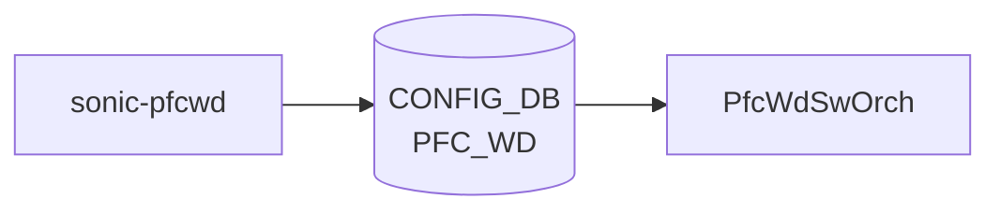

# sonic-pfcwd YANG

## 概要

- module: `sonic-pfcwd`
- namespace: `http://github.com/sonic-net/sonic-pfcwd`
- revision: `2021-07-01`
- import: `sonic-port`
- top container: `sonic-pfcwd`

SONIC PFC Watchdog parameters[^1]

<!-- yang-mermaid -->
### データフロー (自動生成)



!!! note "凡例"
    YANG モジュールから CONFIG_DB テーブル経由で subscribe する daemon/orch までを `docs/reference/config-db-orch-map.md` から機械生成したミニ図。詳細・例外は本ページ本文を参照。
<!-- /yang-mermaid -->

## ツリー

```
module: sonic-pfcwd
  +--rw sonic-pfcwd
     +--rw PFC_WD
        +--rw PFC_WD_LIST* [ifname]
           +--rw ifname              union
           +--rw action?             enumeration
           +--rw detection_time?     uint32
           +--rw restoration_time?   uint32
           +--rw pfc_stat_history?   string
           +--rw POLL_INTERVAL?      uint32
```

## leaf 一覧

| leaf | パス | 型 | 必須 | デフォルト | enum / 範囲 / leafref | 説明 |
|------|------|----|------|-----------|----------------------|------|
| `ifname` | `sonic-pfcwd/PFC_WD/PFC_WD_LIST/ifname` | `union` | yes |  | union(leafref, string) | Port name or GLOBAL for system-wide PFC Watchdog defaults. |
| `action` | `sonic-pfcwd/PFC_WD/PFC_WD_LIST/action` | `enumeration` |  |  | drop, forward, alert | PFC watchdog action when entering storm state. |
| `detection_time` | `sonic-pfcwd/PFC_WD/PFC_WD_LIST/detection_time` | `uint32` |  |  | range 100..5000 | Detection interval for pause storm in msec. |
| `restoration_time` | `sonic-pfcwd/PFC_WD/PFC_WD_LIST/restoration_time` | `uint32` |  |  | range 100..60000 | Time delay before resuming normal PFC operation in msec. |
| `pfc_stat_history` | `sonic-pfcwd/PFC_WD/PFC_WD_LIST/pfc_stat_history` | `string` |  |  | pattern `enable|disable` | Toggle for PFC Historical Statistics estimation. |
| `POLL_INTERVAL` | `sonic-pfcwd/PFC_WD/PFC_WD_LIST/POLL_INTERVAL` | `uint32` |  |  | range 100..1000 | PFC watchdog global polling interval in msec. |

## leafref / 依存

- なし（このモジュール内で直接 leafref を持つ leaf はない）

## augment / deviation

- なし

## 関連 CONFIG_DB / CLI

- CONFIG_DB: `PFC_WD`
- CLI: `pfcwd`

<!-- ref-triangle:start -->

## 関連リファレンス

- CONFIG_DB: [`PFC_WD`](../config-db/pfc-wd.md)
- CLI: `pfcwd`

<!-- ref-triangle:end -->

## 引用元

[^1]: `sonic-net/sonic-buildimage` `src/sonic-yang-models/yang-models/sonic-pfcwd.yang` @ `9ea932ec2e18f35e58268ec2e4456b1d4afd65cd`


<!-- topics-back-ref -->
## 関連 Topics

- [Topics: QoS / Buffer / PFC / Watermark](../../topics/08-qos-buffer/index.md)

<!-- /topics-back-ref -->
