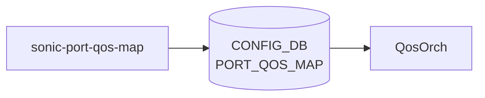

# sonic-port-qos-map YANG

## 概要

- module: `sonic-port-qos-map`
- namespace: `http://github.com/sonic-net/sonic-port-qos-map`
- revision: `2019-05-15`
- import: `sonic-port`, `sonic-tc-priority-group-map`, `sonic-tc-queue-map`, `sonic-pfc-priority-queue-map`, `sonic-pfc-priority-priority-group-map`, `sonic-dscp-tc-map`, `sonic-dot1p-tc-map`, `sonic-scheduler`, `sonic-tc-dscp-map`
- top container: `sonic-port-qos-map`

Binds [QoS](../../reference/glossary.md#term-qos) maps and scheduler profiles to specific ports or globally.[^1]

<!-- yang-mermaid -->
### データフロー (自動生成)



!!! note "凡例"
    YANG モジュールから CONFIG_DB テーブル経由で subscribe する daemon/orch までを `docs/reference/config-db-orch-map.md` から機械生成したミニ図。詳細・例外は本ページ本文を参照。
<!-- /yang-mermaid -->

## 関連ページ

<!-- yang-xref -->

本 YANG モジュールに対応する CONFIG_DB / CLI / HLD / Topics への相互リンク。`inject_yang_xref.py` により自動生成されます。

### 対応 CONFIG_DB

- [`PORT_QOS_MAP`](../config-db/port-qos-map.md)

### 関連 CLI

- [`config qos`](../cli/config-qos.md)

### 関連 HLD

- [sonic-dscp-tc-map YANG](../../reference/yang/sonic-dscp-tc-map.md)
- [sonic-tc-queue-map YANG](../../reference/yang/sonic-tc-queue-map.md)

<!-- /yang-xref -->

## ツリー

```text
module: sonic-port-qos-map
  +--rw sonic-port-qos-map
     +--rw PORT_QOS_MAP
        +--rw PORT_QOS_MAP_LIST* [ifname]
           +--rw ifname              union
           +--rw tc_to_pg_map?       -> /tpgm:sonic-tc-priority-group-map/TC_TO_PRIORITY_GROUP_MAP/TC_TO_PRIORITY_GROUP_MAP_LIST/name
           +--rw tc_to_queue_map?    -> /tqm:sonic-tc-queue-map/TC_TO_QUEUE_MAP/TC_TO_QUEUE_MAP_LIST/name
           +--rw pfc_enable?         string
           +--rw pfcwd_sw_enable?    string
           +--rw pfc_to_queue_map?   -> /ppqm:sonic-pfc-priority-queue-map/MAP_PFC_PRIORITY_TO_QUEUE/MAP_PFC_PRIORITY_TO_QUEUE_LIST/name
           +--rw pfc_to_pg_map?      -> /pppgm:sonic-pfc-priority-priority-group-map/PFC_PRIORITY_TO_PRIORITY_GROUP_MAP/PFC_PRIORITY_TO_PRIORITY_GROUP_MAP_LIST/name
           +--rw dscp_to_tc_map?     -> /dtm:sonic-dscp-tc-map/DSCP_TO_TC_MAP/DSCP_TO_TC_MAP_LIST/name
           +--rw tc_to_dscp_map?     -> /tdm:sonic-tc-dscp-map/TC_TO_DSCP_MAP/TC_TO_DSCP_MAP_LIST/name
           +--rw dot1p_to_tc_map?    -> /dot1ptm:sonic-dot1p-tc-map/DOT1P_TO_TC_MAP/DOT1P_TO_TC_MAP_LIST/name
           +--rw scheduler?          -> /sch:sonic-scheduler/SCHEDULER/SCHEDULER_LIST/name
```

## container / list 一覧

| 種別 | パス | key | 説明 |
|------|------|-----|------|
| `container` | `sonic-port-qos-map` |  |  |
| `container` | `sonic-port-qos-map/PORT_QOS_MAP` |  | Configures [QoS](../../reference/glossary.md#term-qos) map bindings, [PFC](../../reference/glossary.md#term-pfc) settings, and scheduler for ports. |
| `list` | `sonic-port-qos-map/PORT_QOS_MAP/PORT_QOS_MAP_LIST` | `ifname` | [QoS](../../reference/glossary.md#term-qos) map binding for a port or the global default. |

## leaf 一覧

| leaf | パス | 型 | 必須 | デフォルト | enum / 範囲 / leafref | 説明 |
|------|------|----|------|-----------|----------------------|------|
| `ifname` | `sonic-port-qos-map/PORT_QOS_MAP/PORT_QOS_MAP_LIST/ifname` | `union` | yes |  | union(string: pattern `global`, leafref: /prt:sonic-port/prt:PORT/prt:PORT_LIST/prt:name) | Reference of port or global on which QOS MAPS to be configured. |
| `tc_to_pg_map` | `sonic-port-qos-map/PORT_QOS_MAP/PORT_QOS_MAP_LIST/tc_to_pg_map` | `leafref` |  |  | /tpgm:sonic-tc-priority-group-map/tpgm:TC_TO_PRIORITY_GROUP_MAP/tpgm:TC_TO_PRIORITY_GROUP_MAP_LIST/tpgm:name | Reference to a traffic class to priority group map. |
| `tc_to_queue_map` | `sonic-port-qos-map/PORT_QOS_MAP/PORT_QOS_MAP_LIST/tc_to_queue_map` | `leafref` |  |  | /tqm:sonic-tc-queue-map/tqm:TC_TO_QUEUE_MAP/tqm:TC_TO_QUEUE_MAP_LIST/tqm:name | Reference to a traffic class to egress queue map. |
| `pfc_enable` | `sonic-port-qos-map/PORT_QOS_MAP/PORT_QOS_MAP_LIST/pfc_enable` | `string` |  |  | pattern `([0-7](,[0-7])*)?` | Specify the queue(s) on which [PFC](../../reference/glossary.md#term-pfc) is enabled. Empty string is allowed to disable [PFC](../../reference/glossary.md#term-pfc) on all queues. |
| `pfcwd_sw_enable` | `sonic-port-qos-map/PORT_QOS_MAP/PORT_QOS_MAP_LIST/pfcwd_sw_enable` | `string` |  |  | pattern `([0-7](,[0-7])*)?` | Specify the queue(s) on which software pfc watchdog are enabled. Empty string is allowed to disable watchdog on all queues. |
| `pfc_to_queue_map` | `sonic-port-qos-map/PORT_QOS_MAP/PORT_QOS_MAP_LIST/pfc_to_queue_map` | `leafref` |  |  | /ppqm:sonic-pfc-priority-queue-map/ppqm:MAP_PFC_PRIORITY_TO_QUEUE/ppqm:MAP_PFC_PRIORITY_TO_QUEUE_LIST/ppqm:name | Reference to a PFC priority to egress queue map. |
| `pfc_to_pg_map` | `sonic-port-qos-map/PORT_QOS_MAP/PORT_QOS_MAP_LIST/pfc_to_pg_map` | `leafref` |  |  | /pppgm:sonic-pfc-priority-priority-group-map/pppgm:PFC_PRIORITY_TO_PRIORITY_GROUP_MAP/pppgm:PFC_PRIORITY_TO_PRIORITY_GROUP_MAP_LIST/pppgm:name | Reference to a PFC priority to priority group map. |
| `dscp_to_tc_map` | `sonic-port-qos-map/PORT_QOS_MAP/PORT_QOS_MAP_LIST/dscp_to_tc_map` | `leafref` |  |  | /dtm:sonic-dscp-tc-map/dtm:DSCP_TO_TC_MAP/dtm:DSCP_TO_TC_MAP_LIST/dtm:name | Reference to a DSCP to traffic class map. |
| `tc_to_dscp_map` | `sonic-port-qos-map/PORT_QOS_MAP/PORT_QOS_MAP_LIST/tc_to_dscp_map` | `leafref` |  |  | /tdm:sonic-tc-dscp-map/tdm:TC_TO_DSCP_MAP/tdm:TC_TO_DSCP_MAP_LIST/tdm:name | Reference to a traffic class to DSCP remarking map. |
| `dot1p_to_tc_map` | `sonic-port-qos-map/PORT_QOS_MAP/PORT_QOS_MAP_LIST/dot1p_to_tc_map` | `leafref` |  |  | /dot1ptm:sonic-dot1p-tc-map/dot1ptm:DOT1P_TO_TC_MAP/dot1ptm:DOT1P_TO_TC_MAP_LIST/dot1ptm:name | Reference to a DOT1P to traffic class map. |
| `scheduler` | `sonic-port-qos-map/PORT_QOS_MAP/PORT_QOS_MAP_LIST/scheduler` | `leafref` |  |  | /sch:sonic-scheduler/sch:SCHEDULER/sch:SCHEDULER_LIST/sch:name | [Scheduler](../../reference/glossary.md#term-scheduler) for port. |

## leafref / 依存

- `sonic-port-qos-map/PORT_QOS_MAP/PORT_QOS_MAP_LIST/tc_to_pg_map` → `/tpgm:sonic-tc-priority-group-map/tpgm:TC_TO_PRIORITY_GROUP_MAP/tpgm:TC_TO_PRIORITY_GROUP_MAP_LIST/tpgm:name`
- `sonic-port-qos-map/PORT_QOS_MAP/PORT_QOS_MAP_LIST/tc_to_queue_map` → `/tqm:sonic-tc-queue-map/tqm:TC_TO_QUEUE_MAP/tqm:TC_TO_QUEUE_MAP_LIST/tqm:name`
- `sonic-port-qos-map/PORT_QOS_MAP/PORT_QOS_MAP_LIST/pfc_to_queue_map` → `/ppqm:sonic-pfc-priority-queue-map/ppqm:MAP_PFC_PRIORITY_TO_QUEUE/ppqm:MAP_PFC_PRIORITY_TO_QUEUE_LIST/ppqm:name`
- `sonic-port-qos-map/PORT_QOS_MAP/PORT_QOS_MAP_LIST/pfc_to_pg_map` → `/pppgm:sonic-pfc-priority-priority-group-map/pppgm:PFC_PRIORITY_TO_PRIORITY_GROUP_MAP/pppgm:PFC_PRIORITY_TO_PRIORITY_GROUP_MAP_LIST/pppgm:name`
- `sonic-port-qos-map/PORT_QOS_MAP/PORT_QOS_MAP_LIST/dscp_to_tc_map` → `/dtm:sonic-dscp-tc-map/dtm:DSCP_TO_TC_MAP/dtm:DSCP_TO_TC_MAP_LIST/dtm:name`
- `sonic-port-qos-map/PORT_QOS_MAP/PORT_QOS_MAP_LIST/tc_to_dscp_map` → `/tdm:sonic-tc-dscp-map/tdm:TC_TO_DSCP_MAP/tdm:TC_TO_DSCP_MAP_LIST/tdm:name`
- `sonic-port-qos-map/PORT_QOS_MAP/PORT_QOS_MAP_LIST/dot1p_to_tc_map` → `/dot1ptm:sonic-dot1p-tc-map/dot1ptm:DOT1P_TO_TC_MAP/dot1ptm:DOT1P_TO_TC_MAP_LIST/dot1ptm:name`
- `sonic-port-qos-map/PORT_QOS_MAP/PORT_QOS_MAP_LIST/scheduler` → `/sch:sonic-scheduler/sch:SCHEDULER/sch:SCHEDULER_LIST/sch:name`

## augment / deviation

- なし

## 関連 CONFIG_DB / CLI

- [CONFIG_DB](../../reference/glossary.md#term-config_db): `PORT_QOS_MAP`
- CLI: `config qos`

<!-- yang-sibling -->
### 関連 YANG モジュール

意味的に関連する SONiC YANG モジュール (slug prefix / curated group / frontmatter `related.yang` から自動抽出):

- [`sonic-port`](sonic-port.md)
- [`sonic-tc-priority-group-map`](sonic-tc-priority-group-map.md)
- [`sonic-tc-queue-map`](sonic-tc-queue-map.md)
- [`sonic-pfc-priority-queue-map`](sonic-pfc-priority-queue-map.md)
- [`sonic-pfc-priority-priority-group-map`](sonic-pfc-priority-priority-group-map.md)
<!-- /yang-sibling -->

<!-- ref-triangle:start -->

## 関連リファレンス

- [CONFIG_DB](../../reference/glossary.md#term-config_db): [`PORT_QOS_MAP`](../config-db/port-qos-map.md)
- CLI: [`config qos`](../cli/config-qos.md)

<!-- ref-triangle:end -->

## 引用元

[^1]: `sonic-net/sonic-buildimage` `src/sonic-yang-models/yang-models/sonic-port-qos-map.yang` @ `9ea932ec2e18f35e58268ec2e4456b1d4afd65cd`

<!-- topics-back-ref -->
## 関連 Topics

- [Topics: QoS / Buffer / PFC / Watermark](../../topics/08-qos-buffer/index.md)

<!-- /topics-back-ref -->

<!-- glossary-links-injected: f3f3fc42e967 -->
