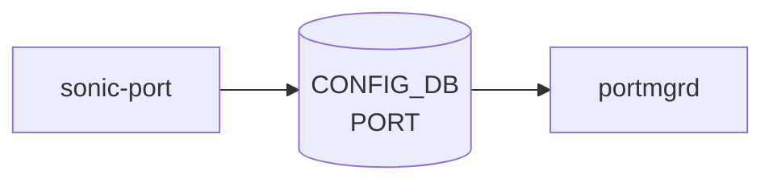

# sonic-port YANG

## 概要

- module: `sonic-port`
- namespace: `http://github.com/sonic-net/sonic-port`
- revision: `2019-07-01`
- import: `sonic-types`, `sonic-device_metadata`, `sonic-macsec`
- top container: `sonic-port`

PORT yang Module for [SONiC](../../reference/glossary.md#term-sonic) OS[^1]

<!-- yang-mermaid -->
### データフロー (自動生成)



!!! note "凡例"
    YANG モジュールから CONFIG_DB テーブル経由で subscribe する daemon/orch までを `docs/reference/config-db-orch-map.md` から機械生成したミニ図。詳細・例外は本ページ本文を参照。
<!-- /yang-mermaid -->

## 関連ページ

<!-- yang-xref -->

本 YANG モジュールに対応する CONFIG_DB / CLI / HLD / Topics への相互リンク。`inject_yang_xref.py` により自動生成されます。

### 対応 CONFIG_DB

- [`PORT`](../config-db/port.md)

### 関連 CLI

- [`config interface`](../cli/config-interface.md)
- [`show interfaces`](../cli/show-interfaces.md)

### 関連 HLD

- [sfputil read-eeprom / write-eeprom（page+offset 単位の生 EEPROM 読み書き）](../../platform/sfputil-add-the-ability-to-read-write-any-byte-from-eerpom-both-by-page-and-offset.md)
- [sonic-loopback-interface YANG](../../reference/yang/sonic-loopback-interface.md)
- [運用](../../topics/14-platform-port-optics/operations.md)

### 関連 Topics

- [Platform / Port / Optics / PHY](../../topics/14-platform-port-optics/index.md)

<!-- /yang-xref -->

## ツリー

```text
module: sonic-port
  +--rw sonic-port
     +--rw PORT
        +--rw PORT_LIST* [name]
           +--rw name                   string
           +--rw core_id?               string
           +--rw core_port_id?          string
           +--rw num_voq?               string
           +--rw alias?                 string
           +--rw lanes                  string
           +--rw mode?                  stypes:switchport_mode
           +--rw description?           string
           +--rw speed                  uint32
           +--rw dhcp_rate_limit?       uint32
           +--rw link_training?         string
           +--rw autoneg?               string
           +--rw adv_speeds*            union
           +--rw interface_type?        stypes:interface_type
           +--rw adv_interface_types*   union
           +--rw mtu?                   uint16
           +--rw subport?               uint8
           +--rw index?                 uint16
           +--rw asic_port_name?        string
           +--rw role?                  string
           +--rw admin_status?          stypes:admin_status
           +--rw fec?                   string
           +--rw dom_polling?           stypes:admin_mode
           +--rw pfc_asym?              string
           +--rw tpid?                  stypes:tpid_type
           +--rw mux_cable?             boolean
           +--rw macsec?                -> /macsec:sonic-macsec/MACSEC_PROFILE/MACSEC_PROFILE_LIST/name
           +--rw tx_power?              decimal64
           +--rw laser_freq?            int32
           +--rw fast_linkup?           boolean
```

## leaf 一覧

| leaf | パス | 型 | 必須 | デフォルト | enum / 範囲 / leafref | 説明 |
|------|------|----|------|-----------|----------------------|------|
| `name` | `sonic-port/PORT/PORT_LIST/name` | `string` | yes |  | length 1..128 | Physical port name (e.g., Ethernet0). |
| `core_id` | `sonic-port/PORT/PORT_LIST/core_id` | `string` |  |  | length 1..16 | The [ASIC](../../reference/glossary.md#term-asic) core where the port belongs to. |
| `core_port_id` | `sonic-port/PORT/PORT_LIST/core_port_id` | `string` |  |  | length 1..16 | The [ASIC](../../reference/glossary.md#term-asic) core port for this port. |
| `num_voq` | `sonic-port/PORT/PORT_LIST/num_voq` | `string` |  |  | length 1..16 | The number of virtual output queue supported on this port. |
| `alias` | `sonic-port/PORT/PORT_LIST/alias` | `string` |  |  | length 1..128 | Vendor-specific port alias or front-panel label. |
| `lanes` | `sonic-port/PORT/PORT_LIST/lanes` | `string` | yes |  | length 1..128 | Number of hardware lanes for the port. This is mandatory for all devices except for chassis devices |
| `mode` | `sonic-port/PORT/PORT_LIST/mode` | `stypes:switchport_mode` |  |  |  | SwitchPort Modes possible values are routed\|access\|trunk. Default value  for mode is routed |
| `description` | `sonic-port/PORT/PORT_LIST/description` | `string` |  |  | length 0..255 | User-defined description for the port. |
| `speed` | `sonic-port/PORT/PORT_LIST/speed` | `uint32` | yes |  | range 1..1600000 | Port speed in Mbps. |
| `dhcp_rate_limit` | `sonic-port/PORT/PORT_LIST/dhcp_rate_limit` | `uint32` |  | 300 |  | DHCP DOS Mitigation Rate with default value 300 |
| `link_training` | `sonic-port/PORT/PORT_LIST/link_training` | `string` |  |  | pattern `on|off` | Port link training mode |
| `autoneg` | `sonic-port/PORT/PORT_LIST/autoneg` | `string` |  |  | pattern `on|off` | Port auto negotiation mode |
| `adv_speeds` | `sonic-port/PORT/PORT_LIST/adv_speeds` | `union` |  |  | union(uint32, string) | Port advertised speeds, valid value could be a list of interger or all |
| `interface_type` | `sonic-port/PORT/PORT_LIST/interface_type` | `stypes:interface_type` |  |  |  | Port interface type |
| `adv_interface_types` | `sonic-port/PORT/PORT_LIST/adv_interface_types` | `union` |  |  | union(stypes:interface_type, string) | Port advertised interface type, valid value could be a list of stypes:interface_type or all |
| `mtu` | `sonic-port/PORT/PORT_LIST/mtu` | `uint16` |  |  | range 68..9216 | Maximum transmission unit size in bytes. |
| `subport` | `sonic-port/PORT/PORT_LIST/subport` | `uint8` |  |  | range 0..8 | Logical subport(s) for physical port breakout |
| `index` | `sonic-port/PORT/PORT_LIST/index` | `uint16` |  |  |  | Front-panel port index. |
| `asic_port_name` | `sonic-port/PORT/PORT_LIST/asic_port_name` | `string` |  |  |  | port name in asic and asic name, e.g Eth0-ASIC1 |
| `role` | `sonic-port/PORT/PORT_LIST/role` | `string` |  | Ext | pattern `Ext|Int|Inb|Rec|Dpc` | Internal port or External port for multi-asic or [SmartSwitch](../../reference/glossary.md#term-smartswitch) platform |
| `admin_status` | `sonic-port/PORT/PORT_LIST/admin_status` | `stypes:admin_status` |  | down |  | Administrative up or down state of the port. |
| `fec` | `sonic-port/PORT/PORT_LIST/fec` | `string` |  |  | pattern `rs|fc|none|auto` | Forward error correction mode for the port. |
| `dom_polling` | `sonic-port/PORT/PORT_LIST/dom_polling` | `stypes:admin_mode` |  |  |  | Enable or disable digital optical monitoring polling. |
| `pfc_asym` | `sonic-port/PORT/PORT_LIST/pfc_asym` | `string` |  |  | pattern `on|off` | Asymmetric priority flow control mode. |
| `tpid` | `sonic-port/PORT/PORT_LIST/tpid` | `stypes:tpid_type` |  |  |  | This leaf describes the possible TPID value that can be configured       					to the specified port if the HW supports TPID configuration. The possible       					values are 0x8100, 0x9100, 0x9200,... |
| `mux_cable` | `sonic-port/PORT/PORT_LIST/mux_cable` | `boolean` |  |  |  | Whether the port is connected to a mux cable for dual-ToR deployments. |
| `macsec` | `sonic-port/PORT/PORT_LIST/macsec` | `leafref` |  |  | /macsec:sonic-macsec/macsec:MACSEC_PROFILE/macsec:MACSEC_PROFILE_LIST/macsec:name | [MACsec](../../reference/glossary.md#term-macsec) profile name applied to the port. |
| `tx_power` | `sonic-port/PORT/PORT_LIST/tx_power` | `decimal64` |  |  |  | Target output power(dBm) for the 400G ZR transceiver |
| `laser_freq` | `sonic-port/PORT/PORT_LIST/laser_freq` | `int32` |  |  |  | Target laser frequency(GHz) for the 400G ZR transceiver |
| `fast_linkup` | `sonic-port/PORT/PORT_LIST/fast_linkup` | `boolean` |  | false |  | Enable or disable fast link-up on the port |

## leafref / 依存

- `sonic-port/PORT/PORT_LIST/macsec` → `/macsec:sonic-macsec/macsec:MACSEC_PROFILE/macsec:MACSEC_PROFILE_LIST/macsec:name`

## augment / deviation

- なし

## 関連 CONFIG_DB / CLI

- [CONFIG_DB](../../reference/glossary.md#term-config_db): `PORT`
- CLI: `config interface`
- CLI: `show interfaces`

<!-- yang-sibling -->
### 関連 YANG モジュール

意味的に関連する SONiC YANG モジュール (slug prefix / curated group / frontmatter `related.yang` から自動抽出):

- [`sonic-portchannel`](sonic-portchannel.md)
- [`sonic-interface`](sonic-interface.md)
- [`sonic-vlan`](sonic-vlan.md)
- [`sonic-breakout_cfg`](sonic-breakout_cfg.md)
- [`sonic-fabric-port`](sonic-fabric-port.md)
<!-- /yang-sibling -->

<!-- ref-triangle:start -->

## 関連リファレンス

- [CONFIG_DB](../../reference/glossary.md#term-config_db): [`PORT`](../config-db/port.md)
- CLI: [`config interface`](../cli/config-interface.md) / [`show interfaces`](../cli/show-interfaces.md)

<!-- ref-triangle:end -->

<!-- ops-hint -->
## 運用ヒント

### 典型的なデプロイ位置

- 物理 port 設定 (admin_status, speed, mtu, autoneg, fec)。`PORT|<port>` を [portmgrd](../../reference/glossary.md#term-portmgrd) が processing。

### よくある落とし穴

- `speed` と `breakout` mode の不整合で [SAI](../../reference/glossary.md#term-sai) が port 作成失敗。breakout 変更直後は xcvrd の安定化を待つ。

### 関連する config / show コマンド

```bash
sonic-db-cli CONFIG_DB keys 'PORT|*'
show interfaces status
```
<!-- /ops-hint -->

## 引用元

[^1]: `sonic-net/sonic-buildimage` `src/sonic-yang-models/yang-models/sonic-port.yang` @ `9ea932ec2e18f35e58268ec2e4456b1d4afd65cd`

<!-- topics-back-ref -->
## 関連 Topics

- [Topics: Platform / Port / Optics / PHY](../../topics/14-platform-port-optics/index.md)

<!-- /topics-back-ref -->

<!-- glossary-links-injected: 02acfb62978e -->
