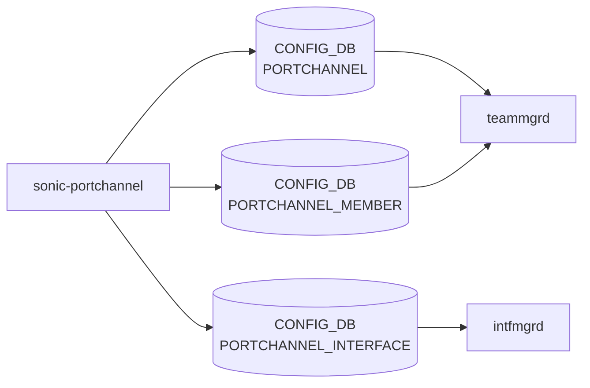

# sonic-portchannel YANG

## 概要

- module: `sonic-portchannel`
- namespace: `http://github.com/sonic-net/sonic-portchannel`
- revision: `2021-06-13`
- import: `sonic-types`, `ietf-yang-types`, `sonic-port`, `sonic-vrf`
- top container: `sonic-portchannel`

Link Aggregation Group ([LAG](../../reference/glossary.md#term-lag)/[PortChannel](../../reference/glossary.md#term-portchannel)) configuration using [LACP](../../reference/glossary.md#term-lacp)[^1]

<!-- yang-mermaid -->
### データフロー (自動生成)



!!! note "凡例"
    YANG モジュールから CONFIG_DB テーブル経由で subscribe する daemon/orch までを `docs/reference/config-db-orch-map.md` から機械生成したミニ図。詳細・例外は本ページ本文を参照。
<!-- /yang-mermaid -->

## 関連ページ

<!-- yang-xref -->

本 YANG モジュールに対応する CONFIG_DB / CLI / HLD / Topics への相互リンク。`inject_yang_xref.py` により自動生成されます。

### 対応 CONFIG_DB

- [`PORTCHANNEL`](../config-db/portchannel.md)
- [`PORTCHANNEL_INTERFACE`](../config-db/portchannel-interface.md)
- [`PORTCHANNEL_MEMBER`](../config-db/portchannel-member.md)

### 関連 CLI

- [`config portchannel`](../cli/config-portchannel.md)

<!-- /yang-xref -->

## ツリー

```text
module: sonic-portchannel
  +--rw sonic-portchannel
     +--rw PORTCHANNEL
     |  +--rw PORTCHANNEL_LIST* [name]
     |     +--rw name            string
     |     +--rw min_links?      uint16
     |     +--rw mode?           stypes:switchport_mode
     |     +--rw description?    string
     |     +--rw mtu?            uint16
     |     +--rw admin_status    stypes:admin_status
     |     +--rw lacp_key?       union
     |     +--rw tpid?           stypes:tpid_type
     |     +--rw fallback?       stypes:boolean_type
     |     +--rw fast_rate?      stypes:boolean_type
     +--rw PORTCHANNEL_MEMBER
     |  +--rw PORTCHANNEL_MEMBER_LIST* [name port]
     |     +--rw name    -> /sonic-portchannel/PORTCHANNEL/PORTCHANNEL_LIST/name
     |     +--rw port    -> /port:sonic-port/PORT/PORT_LIST/name
     +--rw PORTCHANNEL_INTERFACE
        +--rw PORTCHANNEL_INTERFACE_LIST* [name]
        |  +--rw name                        -> /sonic-portchannel/PORTCHANNEL/PORTCHANNEL_LIST/name
        |  +--rw vrf_name?                   -> /vrf:sonic-vrf/VRF/VRF_LIST/name
        |  +--rw loopback_action?            stypes:loopback_action
        |  +--rw nat_zone?                   uint8
        |  +--rw mpls?                       enumeration
        |  +--rw ipv6_use_link_local_only?   stypes:mode-status
        |  +--rw mac_addr?                   yang:mac-address
        +--rw PORTCHANNEL_INTERFACE_IPPREFIX_LIST* [name ip_prefix]
           +--rw name         -> /sonic-portchannel/PORTCHANNEL/PORTCHANNEL_LIST/name
           +--rw ip_prefix    stypes:sonic-ip-prefix
```

## leaf 一覧

| leaf | パス | 型 | 必須 | デフォルト | enum / 範囲 / leafref | 説明 |
|------|------|----|------|-----------|----------------------|------|
| `name` | `sonic-portchannel/PORTCHANNEL/PORTCHANNEL_LIST/name` | `string` | yes |  | pattern `PortChannel[0-9]{1,4}` | [PortChannel](../../reference/glossary.md#term-portchannel) interface name (e.g. PortChannel0001) |
| `min_links` | `sonic-portchannel/PORTCHANNEL/PORTCHANNEL_LIST/min_links` | `uint16` |  |  | range 1..1024 | Minimum number of active member links required for the [PortChannel](../../reference/glossary.md#term-portchannel) to be operationally up |
| `mode` | `sonic-portchannel/PORTCHANNEL/PORTCHANNEL_LIST/mode` | `stypes:switchport_mode` |  |  |  | PortChannel SwitchPort Mode possible values are routed\|access\|trunk. Default value for mode is routed. |
| `description` | `sonic-portchannel/PORTCHANNEL/PORTCHANNEL_LIST/description` | `string` |  |  | length 1..255 | User-defined description for the PortChannel interface |
| `mtu` | `sonic-portchannel/PORTCHANNEL/PORTCHANNEL_LIST/mtu` | `uint16` |  |  | range 1..9216 | Maximum transmission unit size in bytes |
| `admin_status` | `sonic-portchannel/PORTCHANNEL/PORTCHANNEL_LIST/admin_status` | `stypes:admin_status` | yes |  |  | Administrative state of the PortChannel interface |
| `lacp_key` | `sonic-portchannel/PORTCHANNEL/PORTCHANNEL_LIST/lacp_key` | `union` |  |  | union(string, uint16) | [LACP](../../reference/glossary.md#term-lacp) aggregation key; 'auto' derives it from the PortChannel name, or specify a value from 1 to 65535 |
| `tpid` | `sonic-portchannel/PORTCHANNEL/PORTCHANNEL_LIST/tpid` | `stypes:tpid_type` |  |  |  | This leaf describes the possible TPID value that can be configured to the specified portchannel if the HW supports TPID configuration. The possible values are 0x8100, 0x9100, 0x9200, 0x88a8, and 0x... |
| `fallback` | `sonic-portchannel/PORTCHANNEL/PORTCHANNEL_LIST/fallback` | `stypes:boolean_type` |  |  |  | Enable [LACP](../../reference/glossary.md#term-lacp) fallback feature |
| `fast_rate` | `sonic-portchannel/PORTCHANNEL/PORTCHANNEL_LIST/fast_rate` | `stypes:boolean_type` |  |  |  | Enable LACP fast rate |
| `name` | `sonic-portchannel/PORTCHANNEL_MEMBER/PORTCHANNEL_MEMBER_LIST/name` | `leafref` | yes |  | /lag:sonic-portchannel/lag:PORTCHANNEL/lag:PORTCHANNEL_LIST/lag:name | Reference to the parent PortChannel interface |
| `port` | `sonic-portchannel/PORTCHANNEL_MEMBER/PORTCHANNEL_MEMBER_LIST/port` | `leafref` | yes |  | /port:sonic-port/port:PORT/port:PORT_LIST/port:name | Reference to the physical port that is a member of this PortChannel |
| `name` | `sonic-portchannel/PORTCHANNEL_INTERFACE/PORTCHANNEL_INTERFACE_LIST/name` | `leafref` | yes |  | /lag:sonic-portchannel/lag:PORTCHANNEL/lag:PORTCHANNEL_LIST/lag:name | Reference to the PortChannel interface |
| `vrf_name` | `sonic-portchannel/PORTCHANNEL_INTERFACE/PORTCHANNEL_INTERFACE_LIST/vrf_name` | `leafref` |  |  | /vrf:sonic-vrf/vrf:[VRF](../../reference/glossary.md#term-vrf)/vrf:VRF_LIST/vrf:name | [VRF](../../reference/glossary.md#term-vrf) instance to which this PortChannel interface is bound |
| `loopback_action` | `sonic-portchannel/PORTCHANNEL_INTERFACE/PORTCHANNEL_INTERFACE_LIST/loopback_action` | `stypes:loopback_action` |  |  |  | Packet action when a packet ingress and gets routed on the same IP interface |
| `nat_zone` | `sonic-portchannel/PORTCHANNEL_INTERFACE/PORTCHANNEL_INTERFACE_LIST/nat_zone` | `uint8` |  | 0 | range 0..3 | [NAT](../../reference/glossary.md#term-nat) Zone for the portchannel interface |
| `mpls` | `sonic-portchannel/PORTCHANNEL_INTERFACE/PORTCHANNEL_INTERFACE_LIST/mpls` | `enumeration` |  |  | enable, disable | Enable/disable [MPLS](../../reference/glossary.md#term-mpls) routing for the portchannel interface |
| `ipv6_use_link_local_only` | `sonic-portchannel/PORTCHANNEL_INTERFACE/PORTCHANNEL_INTERFACE_LIST/ipv6_use_link_local_only` | `stypes:mode-status` |  | disable |  | Enable/Disable IPv6 link local address on portchannel interface |
| `mac_addr` | `sonic-portchannel/PORTCHANNEL_INTERFACE/PORTCHANNEL_INTERFACE_LIST/mac_addr` | `yang:mac-address` |  |  |  | Assign administrator-provided MAC address to Interface |
| `name` | `sonic-portchannel/PORTCHANNEL_INTERFACE/PORTCHANNEL_INTERFACE_IPPREFIX_LIST/name` | `leafref` | yes |  | /lag:sonic-portchannel/lag:PORTCHANNEL/lag:PORTCHANNEL_LIST/lag:name | Reference to the PortChannel interface |
| `ip_prefix` | `sonic-portchannel/PORTCHANNEL_INTERFACE/PORTCHANNEL_INTERFACE_IPPREFIX_LIST/ip_prefix` | `stypes:sonic-ip-prefix` | yes |  |  | IPv4 or IPv6 address with prefix length assigned to the PortChannel interface |

## leafref / 依存

- `sonic-portchannel/PORTCHANNEL_MEMBER/PORTCHANNEL_MEMBER_LIST/name` → `/lag:sonic-portchannel/lag:PORTCHANNEL/lag:PORTCHANNEL_LIST/lag:name`
- `sonic-portchannel/PORTCHANNEL_MEMBER/PORTCHANNEL_MEMBER_LIST/port` → `/port:sonic-port/port:PORT/port:PORT_LIST/port:name`
- `sonic-portchannel/PORTCHANNEL_INTERFACE/PORTCHANNEL_INTERFACE_LIST/name` → `/lag:sonic-portchannel/lag:PORTCHANNEL/lag:PORTCHANNEL_LIST/lag:name`
- `sonic-portchannel/PORTCHANNEL_INTERFACE/PORTCHANNEL_INTERFACE_LIST/vrf_name` → `/vrf:sonic-vrf/vrf:VRF/vrf:VRF_LIST/vrf:name`
- `sonic-portchannel/PORTCHANNEL_INTERFACE/PORTCHANNEL_INTERFACE_IPPREFIX_LIST/name` → `/lag:sonic-portchannel/lag:PORTCHANNEL/lag:PORTCHANNEL_LIST/lag:name`

## augment / deviation

- なし

## 関連 CONFIG_DB / CLI

- [CONFIG_DB](../../reference/glossary.md#term-config_db): `PORTCHANNEL`
- [CONFIG_DB](../../reference/glossary.md#term-config_db): `PORTCHANNEL_INTERFACE`
- [CONFIG_DB](../../reference/glossary.md#term-config_db): `PORTCHANNEL_MEMBER`
- CLI: `config portchannel`

<!-- yang-sibling -->
### 関連 YANG モジュール

意味的に関連する SONiC YANG モジュール (slug prefix / curated group / frontmatter `related.yang` から自動抽出):

- [`sonic-port`](sonic-port.md)
- [`sonic-breakout_cfg`](sonic-breakout_cfg.md)
- [`sonic-fabric-port`](sonic-fabric-port.md)
- [`sonic-interface`](sonic-interface.md)
- [`sonic-loopback-interface`](sonic-loopback-interface.md)
<!-- /yang-sibling -->

<!-- ref-triangle:start -->

## 関連リファレンス

- CONFIG_DB: [`PORTCHANNEL`](../config-db/portchannel.md) / [`PORTCHANNEL_INTERFACE`](../config-db/portchannel-interface.md) / [`PORTCHANNEL_MEMBER`](../config-db/portchannel-member.md)
- CLI: [`config portchannel`](../cli/config-portchannel.md)

<!-- ref-triangle:end -->

<!-- ops-hint -->
## 運用ヒント

### 典型的なデプロイ位置

- [LAG](../../reference/glossary.md#term-lag) (port-channel) 設定。`PORTCHANNEL` / `PORTCHANNEL_MEMBER` を teammgrd が [teamd](../../reference/glossary.md#term-teamd-teamsyncd-teammgrd) に反映。

### よくある落とし穴

- `min_links` を member 数より大きく設定すると [LAG](../../reference/glossary.md#term-lag) が常に down 扱いになる。CLI からの値入力ミスで頻発。

### 関連する config / show コマンド

```bash
sonic-db-cli CONFIG_DB keys 'PORTCHANNEL*'
show interfaces portchannel
```
<!-- /ops-hint -->

## 引用元

[^1]: `sonic-net/sonic-buildimage` `src/sonic-yang-models/yang-models/sonic-portchannel.yang` @ `9ea932ec2e18f35e58268ec2e4456b1d4afd65cd`


<!-- topics-back-ref -->
## 関連 Topics

- [Topics: L2 / VLAN / LAG / MC-LAG](../../topics/06-l2-vlan-lag/index.md)

<!-- /topics-back-ref -->

<!-- glossary-links-injected: 26ca9e81c971 -->
