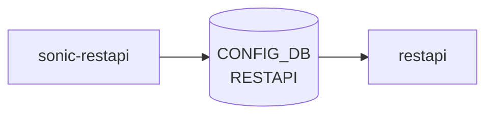

# sonic-restapi YANG

## 概要

- module: `sonic-restapi`
- namespace: `http://github.com/sonic-net/sonic-restapi`
- revision: `2022-10-05`
- import: なし
- top container: `sonic-restapi`

RESTAPI [YANG](../../reference/glossary.md#term-yang) Module for [SONiC](../../reference/glossary.md#term-sonic) OS[^1]。REST API サーバの TLS 証明書 (certs) と connection 設定 (config) を持つ。

<!-- yang-mermaid -->
### データフロー (自動生成)



!!! note "凡例"
    YANG モジュールから CONFIG_DB テーブル経由で subscribe する daemon/orch までを `docs/reference/config-db-orch-map.md` から機械生成したミニ図。詳細・例外は本ページ本文を参照。
<!-- /yang-mermaid -->

## 関連ページ

<!-- yang-xref -->

本 YANG モジュールに対応する CONFIG_DB / CLI / HLD / Topics への相互リンク。`inject_yang_xref.py` により自動生成されます。

### 対応 CONFIG_DB

- [`RESTAPI`](../config-db/restapi.md)

<!-- /yang-xref -->

## ツリー

```text
module: sonic-restapi
  +--rw sonic-restapi
     +--rw RESTAPI
        +--rw certs
        |  +--rw ca_crt?             string
        |  +--rw server_crt?         string
        |  +--rw client_crt_cname?   string
        |  +--rw server_key?         string
        +--rw config
           +--rw client_auth?      boolean
           +--rw log_level?        string
           +--rw allow_insecure?   boolean
```

## leaf 一覧

| leaf | パス | 型 | 必須 | デフォルト | enum / 範囲 / leafref | 説明 |
|------|------|----|------|-----------|----------------------|------|
| `ca_crt` | `sonic-restapi/RESTAPI/certs/ca_crt` | `string` |  |  |  | Local path for ca_crt |
| `server_crt` | `sonic-restapi/RESTAPI/certs/server_crt` | `string` |  |  |  | Local path for server_crt |
| `client_crt_cname` | `sonic-restapi/RESTAPI/certs/client_crt_cname` | `string` |  |  |  | Client cert common name |
| `server_key` | `sonic-restapi/RESTAPI/certs/server_key` | `string` |  |  |  | Local path for server_key |
| `client_auth` | `sonic-restapi/RESTAPI/config/client_auth` | `boolean` |  | true |  | Enable client authentication |
| `log_level` | `sonic-restapi/RESTAPI/config/log_level` | `string` |  | trace |  | container log level for restapi |
| `allow_insecure` | `sonic-restapi/RESTAPI/config/allow_insecure` | `boolean` |  | false |  | Allow insecure connection |

## leafref / 依存

- なし

## augment / deviation

- なし

## 関連 CONFIG_DB / CLI

- [CONFIG_DB](../../reference/glossary.md#term-config_db): `RESTAPI`
- CLI: なし（[config_db.json](../../reference/glossary.md#term-config_db.json) で直接設定）

<!-- yang-sibling -->
### 関連 YANG モジュール

意味的に関連する SONiC YANG モジュール (slug prefix / curated group / frontmatter `related.yang` から自動抽出):

- [`sonic-banner`](sonic-banner.md)
- [`sonic-device_metadata`](sonic-device_metadata.md)
- [`sonic-feature`](sonic-feature.md)
- [`sonic-fips`](sonic-fips.md)
- [`sonic-kdump`](sonic-kdump.md)
<!-- /yang-sibling -->

<!-- ref-triangle:start -->

## 関連リファレンス

- [CONFIG_DB](../../reference/glossary.md#term-config_db): [`RESTAPI`](../config-db/restapi.md)

<!-- ref-triangle:end -->

## 引用元

[^1]: `sonic-net/sonic-buildimage` `src/sonic-yang-models/yang-models/sonic-restapi.yang` @ `9ea932ec2e18f35e58268ec2e4456b1d4afd65cd`

<!-- glossary-links-injected: 8ba32e5aa69d -->
