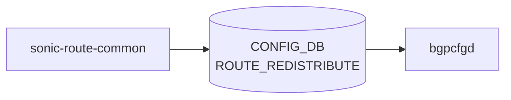

# sonic-route-common YANG

## 概要

- module: `sonic-route-common`
- namespace: `http://github.com/sonic-net/sonic-route-common`
- revision: `2021-02-26`
- import: `sonic-vrf`, `sonic-route-map`
- top container: `sonic-route-common`

SONIC ROUTE common [YANG](../../reference/glossary.md#term-yang)[^1]

<!-- yang-mermaid -->
### データフロー (自動生成)



!!! note "凡例"
    YANG モジュールから CONFIG_DB テーブル経由で subscribe する daemon/orch までを `docs/reference/config-db-orch-map.md` から機械生成したミニ図。`ROUTE_REDISTRIBUTE` は FRR の `redistribute` ステートメントを `bgpcfgd` 経由で投入する。詳細・例外は本ページ本文を参照。
<!-- /yang-mermaid -->

## 関連ページ

<!-- yang-xref -->

本 YANG モジュールに対応する CONFIG_DB / CLI / HLD / Topics への相互リンク。`inject_yang_xref.py` により自動生成されます。

### 関連 HLD

- [sonic-static-route YANG](../../reference/yang/sonic-static-route.md)
- [sonic-vrf YANG](../../reference/yang/sonic-vrf.md)

<!-- /yang-xref -->

## ツリー

```text
module: sonic-route-common
  +--rw sonic-route-common
     +--rw ROUTE_REDISTRIBUTE
        +--rw ROUTE_REDISTRIBUTE_LIST* [vrf_name src_protocol dst_protocol addr_family]
           +--rw vrf_name        union
           +--rw src_protocol    string
           +--rw dst_protocol    string
           +--rw addr_family     string
           +--rw route_map*      -> /rmap:sonic-route-map/ROUTE_MAP_SET/ROUTE_MAP_SET_LIST/name
           +--rw metric?         uint32
```

## leaf 一覧

| leaf | パス | 型 | 必須 | デフォルト | enum / 範囲 / leafref | 説明 |
|------|------|----|------|-----------|----------------------|------|
| `vrf_name` | `sonic-route-common/ROUTE_REDISTRIBUTE/ROUTE_REDISTRIBUTE_LIST/vrf_name` | `union` | yes |  | union(string, leafref) | [VRF](../../reference/glossary.md#term-vrf) name |
| `src_protocol` | `sonic-route-common/ROUTE_REDISTRIBUTE/ROUTE_REDISTRIBUTE_LIST/src_protocol` | `string` | yes |  |  | IP protocols such as connected, ospf and static |
| `dst_protocol` | `sonic-route-common/ROUTE_REDISTRIBUTE/ROUTE_REDISTRIBUTE_LIST/dst_protocol` | `string` | yes |  |  | IP protocol such as bgp |
| `addr_family` | `sonic-route-common/ROUTE_REDISTRIBUTE/ROUTE_REDISTRIBUTE_LIST/addr_family` | `string` | yes |  |  | Address family ipv4/ipv6 |
| `route_map` | `sonic-route-common/ROUTE_REDISTRIBUTE/ROUTE_REDISTRIBUTE_LIST/route_map` | `leafref` |  |  | /rmap:sonic-route-map/rmap:ROUTE_MAP_SET/rmap:ROUTE_MAP_SET_LIST/rmap:name | Router filter to apply while redistributing the routes from another protocol. |
| `metric` | `sonic-route-common/ROUTE_REDISTRIBUTE/ROUTE_REDISTRIBUTE_LIST/metric` | `uint32` |  |  |  | Metric for redistributed routes |

## leafref / 依存

- `sonic-route-common/ROUTE_REDISTRIBUTE/ROUTE_REDISTRIBUTE_LIST/route_map` → `/rmap:sonic-route-map/rmap:ROUTE_MAP_SET/rmap:ROUTE_MAP_SET_LIST/rmap:name`

## augment / deviation

- なし

## 関連 CONFIG_DB / CLI

- 関連 CLI / [CONFIG_DB](../../reference/glossary.md#term-config_db) は本ページからは未リンク（[CONFIG_DB](../../reference/glossary.md#term-config_db) のテーブル名は本モジュールの top-level container と一致するのが通例）

<!-- yang-sibling -->
### 関連 YANG モジュール

意味的に関連する SONiC YANG モジュール (slug prefix / curated group / frontmatter `related.yang` から自動抽出):

- [`sonic-route-map`](sonic-route-map.md)
- [`sonic-vrf`](sonic-vrf.md)
- [`sonic-static-route`](sonic-static-route.md)
- [`sonic-bgp-aggregate-address`](sonic-bgp-aggregate-address.md)
- [`sonic-bgp-bbr`](sonic-bgp-bbr.md)
<!-- /yang-sibling -->

<!-- ref-triangle:start -->

## 関連リファレンス

- (関連リンクなし)

<!-- ref-triangle:end -->

## 引用元

[^1]: `sonic-net/sonic-buildimage` `src/sonic-yang-models/yang-models/sonic-route-common.yang` @ `9ea932ec2e18f35e58268ec2e4456b1d4afd65cd`


<!-- topics-back-ref -->
## 関連 Topics

- [Topics: SRv6 / MPLS / Path Tracing](../../topics/17-srv6-mpls/index.md)

<!-- /topics-back-ref -->

<!-- glossary-links-injected: 896d391185a9 -->
