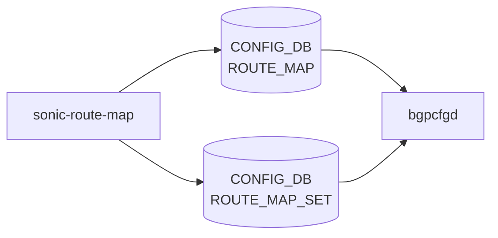

# sonic-route-map YANG

## 概要

- module: `sonic-route-map`
- namespace: `http://github.com/sonic-net/sonic-route-map`
- revision: `2021-02-26`
- import: `ietf-inet-types`, `sonic-port`, `sonic-portchannel`, `sonic-routing-policy-sets`, `sonic-vrf`, `sonic-loopback-interface`
- top container: `sonic-route-map`

SONIC Route map [YANG](../../reference/glossary.md#term-yang)[^1]

<!-- yang-mermaid -->
### データフロー (自動生成)



!!! note "凡例"
    YANG モジュールから CONFIG_DB テーブル経由で subscribe する daemon/orch までを `docs/reference/config-db-orch-map.md` から機械生成したミニ図。詳細・例外は本ページ本文を参照。
<!-- /yang-mermaid -->

## 関連ページ

<!-- yang-xref -->

本 YANG モジュールに対応する CONFIG_DB / CLI / HLD / Topics への相互リンク。`inject_yang_xref.py` により自動生成されます。

### 対応 CONFIG_DB

- [`ROUTE_MAP`](../config-db/route-map.md)
- [`ROUTE_MAP_SET`](../config-db/route-map-set.md)

### 関連 HLD

- [sonic-bgp-aggregate-address YANG](../../reference/yang/sonic-bgp-aggregate-address.md)
- [sonic-route-common YANG](../../reference/yang/sonic-route-common.md)
- [sonic-static-route YANG](../../reference/yang/sonic-static-route.md)

<!-- /yang-xref -->

## ツリー

```text
module: sonic-route-map
  +--rw sonic-route-map
     +--rw ROUTE_MAP_SET
     |  +--rw ROUTE_MAP_SET_LIST* [name]
     |     +--rw name    string
     +--rw ROUTE_MAP
        +--rw ROUTE_MAP_LIST* [name stmt_name]
           +--rw name                               string
           +--rw stmt_name                          uint16
           +--rw route_operation?                   rpolsets:routing-policy-action-type
           +--rw match_interface?                   route-map-intf
           +--rw match_prefix_set?                  -> /rpolsets:sonic-routing-policy-sets/PREFIX_SET/PREFIX_SET_LIST/name
           +--rw match_ipv6_prefix_set?             -> /rpolsets:sonic-routing-policy-sets/PREFIX_SET/PREFIX_SET_LIST/name
           +--rw match_protocol?                    string
           +--rw match_next_hop_set?                -> /rpolsets:sonic-routing-policy-sets/PREFIX_SET/PREFIX_SET_LIST/name
           +--rw match_src_vrf?                     union
           +--rw match_neighbor*                    union
           +--rw match_tag*                         uint32
           +--rw match_med?                         uint32
           +--rw match_origin?                      string
           +--rw match_local_pref?                  uint32
           +--rw match_community?                   -> /rpolsets:sonic-routing-policy-sets/COMMUNITY_SET/COMMUNITY_SET_LIST/name
           +--rw match_ext_community?               -> /rpolsets:sonic-routing-policy-sets/EXTENDED_COMMUNITY_SET/EXTENDED_COMMUNITY_SET_LIST/name
           +--rw match_as_path?                     -> /rpolsets:sonic-routing-policy-sets/AS_PATH_SET/AS_PATH_SET_LIST/name
           +--rw call_route_map?                    -> ../../../ROUTE_MAP_SET/ROUTE_MAP_SET_LIST/name
           +--rw set_origin?                        string
           +--rw set_local_pref?                    uint32
           +--rw set_med?                           uint32
           +--rw set_metric_action?                 metric-action-type
           +--rw set_metric?                        uint32
           +--rw set_next_hop?                      string
           +--rw set_ipv6_next_hop_global?          string
           +--rw set_ipv6_next_hop_prefer_global?   boolean
           +--rw set_repeat_asn?                    uint8
           +--rw set_asn?                           uint32
           +--rw set_asn_list?                      string
           +--rw set_community_inline*              string
           +--rw set_community_ref?                 -> /rpolsets:sonic-routing-policy-sets/COMMUNITY_SET/COMMUNITY_SET_LIST/name
           +--rw set_ext_community_inline*          string
           +--rw set_ext_community_ref?             -> /rpolsets:sonic-routing-policy-sets/EXTENDED_COMMUNITY_SET/EXTENDED_COMMUNITY_SET_LIST/name
           +--rw set_tag?                           uint32
```

## leaf 一覧

| leaf | パス | 型 | 必須 | デフォルト | enum / 範囲 / leafref | 説明 |
|------|------|----|------|-----------|----------------------|------|
| `name` | `sonic-route-map/ROUTE_MAP_SET/ROUTE_MAP_SET_LIST/name` | `string` | yes |  |  | Route map name |
| `name` | `sonic-route-map/ROUTE_MAP/ROUTE_MAP_LIST/name` | `string` | yes |  |  | Route map name |
| `stmt_name` | `sonic-route-map/ROUTE_MAP/ROUTE_MAP_LIST/stmt_name` | `uint16` | yes |  | range 1..65535 | Statement name, this helps to provide multiple statements under a particular route-map |
| `route_operation` | `sonic-route-map/ROUTE_MAP/ROUTE_MAP_LIST/route_operation` | `rpolsets:routing-policy-action-type` |  |  |  | permit/deny operation |
| `match_interface` | `sonic-route-map/ROUTE_MAP/ROUTE_MAP_LIST/match_interface` | `route-map-intf` |  |  |  | Match based on interface |
| `match_prefix_set` | `sonic-route-map/ROUTE_MAP/ROUTE_MAP_LIST/match_prefix_set` | `leafref` |  |  | /rpolsets:sonic-routing-policy-sets/rpolsets:PREFIX_SET/rpolsets:PREFIX_SET_LIST/rpolsets:name | Match a prefix list name that contains IPv4 prefixes. |
| `match_ipv6_prefix_set` | `sonic-route-map/ROUTE_MAP/ROUTE_MAP_LIST/match_ipv6_prefix_set` | `leafref` |  |  | /rpolsets:sonic-routing-policy-sets/rpolsets:PREFIX_SET/rpolsets:PREFIX_SET_LIST/rpolsets:name | Match a prefix list name that contains IPv6 prefixes. |
| `match_protocol` | `sonic-route-map/ROUTE_MAP/ROUTE_MAP_LIST/match_protocol` | `string` |  |  |  | Match based on IP protocols bgp, connected, ospf, ospf3 and static |
| `match_next_hop_set` | `sonic-route-map/ROUTE_MAP/ROUTE_MAP_LIST/match_next_hop_set` | `leafref` |  |  | /rpolsets:sonic-routing-policy-sets/rpolsets:PREFIX_SET/rpolsets:PREFIX_SET_LIST/rpolsets:name | Match based on nexthop |
| `match_src_vrf` | `sonic-route-map/ROUTE_MAP/ROUTE_MAP_LIST/match_src_vrf` | `union` |  |  | union(string, leafref) | Match based on source [VRF](../../reference/glossary.md#term-vrf) |
| `match_neighbor` | `sonic-route-map/ROUTE_MAP/ROUTE_MAP_LIST/match_neighbor` | `union` |  |  | union(inet:ip-address, leafref, leafref, string) | IP addresse or interface for match operation. |
| `match_tag` | `sonic-route-map/ROUTE_MAP/ROUTE_MAP_LIST/match_tag` | `uint32` |  |  |  | Value of the tag match member |
| `match_med` | `sonic-route-map/ROUTE_MAP/ROUTE_MAP_LIST/match_med` | `uint32` |  |  |  | Match based on MED value |
| `match_origin` | `sonic-route-map/ROUTE_MAP/ROUTE_MAP_LIST/match_origin` | `string` |  |  |  | Match based on [BGP](../../reference/glossary.md#term-bgp) route origin egp, igp and incomplete |
| `match_local_pref` | `sonic-route-map/ROUTE_MAP/ROUTE_MAP_LIST/match_local_pref` | `uint32` |  |  |  | Match based on [BGP](../../reference/glossary.md#term-bgp) local preference value |
| `match_community` | `sonic-route-map/ROUTE_MAP/ROUTE_MAP_LIST/match_community` | `leafref` |  |  | /rpolsets:sonic-routing-policy-sets/rpolsets:COMMUNITY_SET/rpolsets:COMMUNITY_SET_LIST/rpolsets:name | Match based on community value |
| `match_ext_community` | `sonic-route-map/ROUTE_MAP/ROUTE_MAP_LIST/match_ext_community` | `leafref` |  |  | /rpolsets:sonic-routing-policy-sets/rpolsets:EXTENDED_COMMUNITY_SET/rpolsets:EXTENDED_COMMUNITY_SET_LIST/rpolsets:name | Match based on extended community value |
| `match_as_path` | `sonic-route-map/ROUTE_MAP/ROUTE_MAP_LIST/match_as_path` | `leafref` |  |  | /rpolsets:sonic-routing-policy-sets/rpolsets:AS_PATH_SET/rpolsets:AS_PATH_SET_LIST/rpolsets:name | Match based on [BGP](../../reference/glossary.md#term-bgp) AS-PATH |
| `call_route_map` | `sonic-route-map/ROUTE_MAP/ROUTE_MAP_LIST/call_route_map` | `leafref` |  |  | ../../../ROUTE_MAP_SET/ROUTE_MAP_SET_LIST/name | Invoke another route-map |
| `set_origin` | `sonic-route-map/ROUTE_MAP/ROUTE_MAP_LIST/set_origin` | `string` |  |  |  | Set BGP origin value |
| `set_local_pref` | `sonic-route-map/ROUTE_MAP/ROUTE_MAP_LIST/set_local_pref` | `uint32` |  |  |  | Set BGP local preference value |
| `set_med` | `sonic-route-map/ROUTE_MAP/ROUTE_MAP_LIST/set_med` | `uint32` |  |  |  | Set BGP MED value |
| `set_metric_action` | `sonic-route-map/ROUTE_MAP/ROUTE_MAP_LIST/set_metric_action` | `metric-action-type` |  |  |  | Set metric action |
| `set_metric` | `sonic-route-map/ROUTE_MAP/ROUTE_MAP_LIST/set_metric` | `uint32` |  |  |  | Set metric value |
| `set_next_hop` | `sonic-route-map/ROUTE_MAP/ROUTE_MAP_LIST/set_next_hop` | `string` |  |  |  | Set IP nexthop |
| `set_ipv6_next_hop_global` | `sonic-route-map/ROUTE_MAP/ROUTE_MAP_LIST/set_ipv6_next_hop_global` | `string` |  |  |  | Set IPv6 global next hop |
| `set_ipv6_next_hop_prefer_global` | `sonic-route-map/ROUTE_MAP/ROUTE_MAP_LIST/set_ipv6_next_hop_prefer_global` | `boolean` |  |  |  | Set to prefer IPv6 nexthop global address |
| `set_repeat_asn` | `sonic-route-map/ROUTE_MAP/ROUTE_MAP_LIST/set_repeat_asn` | `uint8` |  |  |  | Indicates number of times the ASN value to be repeated |
| `set_asn` | `sonic-route-map/ROUTE_MAP/ROUTE_MAP_LIST/set_asn` | `uint32` |  |  |  | Set ASN value |
| `set_asn_list` | `sonic-route-map/ROUTE_MAP/ROUTE_MAP_LIST/set_asn_list` | `string` |  |  |  | Set list of ASN values |
| `set_community_inline` | `sonic-route-map/ROUTE_MAP/ROUTE_MAP_LIST/set_community_inline` | `string` |  |  |  | Set community string |
| `set_community_ref` | `sonic-route-map/ROUTE_MAP/ROUTE_MAP_LIST/set_community_ref` | `leafref` |  |  | /rpolsets:sonic-routing-policy-sets/rpolsets:COMMUNITY_SET/rpolsets:COMMUNITY_SET_LIST/rpolsets:name | Refer community from community list |
| `set_ext_community_inline` | `sonic-route-map/ROUTE_MAP/ROUTE_MAP_LIST/set_ext_community_inline` | `string` |  |  |  | Set extended community string |
| `set_ext_community_ref` | `sonic-route-map/ROUTE_MAP/ROUTE_MAP_LIST/set_ext_community_ref` | `leafref` |  |  | /rpolsets:sonic-routing-policy-sets/rpolsets:EXTENDED_COMMUNITY_SET/rpolsets:EXTENDED_COMMUNITY_SET_LIST/rpolsets:name | Refer extended community from extended community list |
| `set_tag` | `sonic-route-map/ROUTE_MAP/ROUTE_MAP_LIST/set_tag` | `uint32` |  |  |  | Value of the tag set member |

## leafref / 依存

- `sonic-route-map/ROUTE_MAP/ROUTE_MAP_LIST/match_prefix_set` → `/rpolsets:sonic-routing-policy-sets/rpolsets:PREFIX_SET/rpolsets:PREFIX_SET_LIST/rpolsets:name`
- `sonic-route-map/ROUTE_MAP/ROUTE_MAP_LIST/match_ipv6_prefix_set` → `/rpolsets:sonic-routing-policy-sets/rpolsets:PREFIX_SET/rpolsets:PREFIX_SET_LIST/rpolsets:name`
- `sonic-route-map/ROUTE_MAP/ROUTE_MAP_LIST/match_next_hop_set` → `/rpolsets:sonic-routing-policy-sets/rpolsets:PREFIX_SET/rpolsets:PREFIX_SET_LIST/rpolsets:name`
- `sonic-route-map/ROUTE_MAP/ROUTE_MAP_LIST/match_community` → `/rpolsets:sonic-routing-policy-sets/rpolsets:COMMUNITY_SET/rpolsets:COMMUNITY_SET_LIST/rpolsets:name`
- `sonic-route-map/ROUTE_MAP/ROUTE_MAP_LIST/match_ext_community` → `/rpolsets:sonic-routing-policy-sets/rpolsets:EXTENDED_COMMUNITY_SET/rpolsets:EXTENDED_COMMUNITY_SET_LIST/rpolsets:name`
- `sonic-route-map/ROUTE_MAP/ROUTE_MAP_LIST/match_as_path` → `/rpolsets:sonic-routing-policy-sets/rpolsets:AS_PATH_SET/rpolsets:AS_PATH_SET_LIST/rpolsets:name`
- `sonic-route-map/ROUTE_MAP/ROUTE_MAP_LIST/call_route_map` → `../../../ROUTE_MAP_SET/ROUTE_MAP_SET_LIST/name`
- `sonic-route-map/ROUTE_MAP/ROUTE_MAP_LIST/set_community_ref` → `/rpolsets:sonic-routing-policy-sets/rpolsets:COMMUNITY_SET/rpolsets:COMMUNITY_SET_LIST/rpolsets:name`
- `sonic-route-map/ROUTE_MAP/ROUTE_MAP_LIST/set_ext_community_ref` → `/rpolsets:sonic-routing-policy-sets/rpolsets:EXTENDED_COMMUNITY_SET/rpolsets:EXTENDED_COMMUNITY_SET_LIST/rpolsets:name`

## augment / deviation

- なし

## 関連 CONFIG_DB / CLI

- [CONFIG_DB](../../reference/glossary.md#term-config_db): `ROUTE_MAP`
- [CONFIG_DB](../../reference/glossary.md#term-config_db): `ROUTE_MAP_SET`

<!-- yang-sibling -->
### 関連 YANG モジュール

意味的に関連する SONiC YANG モジュール (slug prefix / curated group / frontmatter `related.yang` から自動抽出):

- [`sonic-bgp-aggregate-address`](sonic-bgp-aggregate-address.md)
- [`sonic-bgp-bbr`](sonic-bgp-bbr.md)
- [`sonic-bgp-device-global`](sonic-bgp-device-global.md)
- [`sonic-bgp-global`](sonic-bgp-global.md)
- [`sonic-bgp-monitor`](sonic-bgp-monitor.md)
<!-- /yang-sibling -->

<!-- ref-triangle:start -->

## 関連リファレンス

- [CONFIG_DB](../../reference/glossary.md#term-config_db): [`ROUTE_MAP`](../config-db/route-map.md) / [`ROUTE_MAP_SET`](../config-db/route-map.md)

<!-- ref-triangle:end -->

## 引用元

[^1]: `sonic-net/sonic-buildimage` `src/sonic-yang-models/yang-models/sonic-route-map.yang` @ `9ea932ec2e18f35e58268ec2e4456b1d4afd65cd`

<!-- glossary-links-injected: 26ca9e81c971 -->
