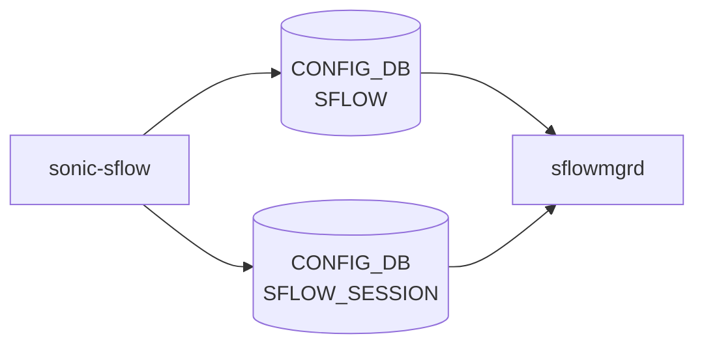

# sonic-sflow YANG

## 概要

- module: `sonic-sflow`
- namespace: `http://github.com/sonic-net/sonic-sflow`
- revision: `2023-04-11` (前: `2021-04-26`)
- import: `ietf-inet-types`, `sonic-types`, `sonic-port`, `sonic-portchannel`, `sonic-mgmt_port`, `sonic-mgmt_vrf`
- top container: `sonic-sflow`

SFLOW yang Module for SONiC OS. sFlow サンプリングコレクタとセッションを定義する。[^1]

<!-- yang-mermaid -->
### データフロー (自動生成)



!!! note "凡例"
    YANG モジュールから CONFIG_DB テーブル経由で subscribe する daemon/orch までを `docs/reference/config-db-orch-map.md` から機械生成したミニ図。詳細・例外は本ページ本文を参照。
<!-- /yang-mermaid -->

## 関連ページ

<!-- yang-xref -->

本 YANG モジュールに対応する CONFIG_DB / CLI / HLD / Topics への相互リンク。`inject_yang_xref.py` により自動生成されます。

### 対応 CONFIG_DB

- [`SFLOW`](../config-db/sflow.md)
- [`SFLOW_COLLECTOR`](../config-db/sflow-collector.md)
- [`SFLOW_SESSION`](../config-db/sflow-session.md)

### 関連 CLI

- [`config sflow`](../cli/config-sflow.md)

<!-- /yang-xref -->

## typedef

- `sample_direction`: `rx`, `tx`, `both`

## ツリー

```text
module: sonic-sflow
  +--rw sonic-sflow
     +--rw SFLOW_COLLECTOR
     |  +--rw SFLOW_COLLECTOR_LIST* [name]   (max-elements 2)
     |     +--rw name             string
     |     +--rw collector_ip     inet:ip-address
     |     +--rw collector_port?  inet:port-number
     |     +--rw collector_vrf?   string
     +--rw SFLOW_SESSION
     |  +--rw SFLOW_SESSION_LIST* [port]
     |     +--rw port              union
     |     +--rw admin_state?      stypes:admin_status
     |     +--rw sample_rate?      uint32
     |     +--rw sample_direction? sample_direction
     +--rw SFLOW
        +--rw global
           +--rw admin_state?       stypes:admin_status
           +--rw polling_interval?  uint16
           +--rw agent_id?          union
           +--rw sample_direction?  sample_direction
```

## leaf 一覧

| leaf | パス | 型 | 必須 | デフォルト | enum / 範囲 / leafref | 説明 |
|------|------|----|------|-----------|----------------------|------|
| `name` | `sonic-sflow/SFLOW_COLLECTOR/SFLOW_COLLECTOR_LIST/name` | `string` | yes |  | length 1..64 | Name of the Sflow collector. |
| `collector_ip` | `sonic-sflow/SFLOW_COLLECTOR/SFLOW_COLLECTOR_LIST/collector_ip` | `inet:ip-address` | yes |  |  | IPv4/IPv6 address of the Sflow collector. |
| `collector_port` | `sonic-sflow/SFLOW_COLLECTOR/SFLOW_COLLECTOR_LIST/collector_port` | `inet:port-number` |  | `6343` |  | Destination L4 port of the Sflow collector. |
| `collector_vrf` | `sonic-sflow/SFLOW_COLLECTOR/SFLOW_COLLECTOR_LIST/collector_vrf` | `string` |  |  | pattern `mgmt\|default`, `must` で mgmt 利用時は MGMT_VRF 有効が必要 | Collector VRF (default or mgmt). |
| `port` | `sonic-sflow/SFLOW_SESSION/SFLOW_SESSION_LIST/port` | `union` | yes |  | leafref(PORT) または `all` | Sets sflow session table attributes for either all interfaces or a specific Ethernet interface. |
| `admin_state` | `sonic-sflow/SFLOW_SESSION/SFLOW_SESSION_LIST/admin_state` | `stypes:admin_status` |  | `up` |  | Per port sflow admin state. |
| `sample_rate` | `sonic-sflow/SFLOW_SESSION/SFLOW_SESSION_LIST/sample_rate` | `uint32` |  |  | range 256..8388608, `must ../port != 'all'` | Packet sampling rate (1/N packets). |
| `sample_direction` | `sonic-sflow/SFLOW_SESSION/SFLOW_SESSION_LIST/sample_direction` | `sample_direction` |  | `rx` | `rx`, `tx`, `both` | sflow sample direction. |
| `admin_state` | `sonic-sflow/SFLOW/global/admin_state` | `stypes:admin_status` |  | `down` |  | Global sflow admin state. |
| `polling_interval` | `sonic-sflow/SFLOW/global/polling_interval` | `uint16` |  | `20` | range `0\|5..300` | Counter polling interval in seconds (0 disables). |
| `agent_id` | `sonic-sflow/SFLOW/global/agent_id` | `union` |  |  | leafref(PORT, PORTCHANNEL, MGMT_PORT) または `Vlan<id>` | Interface whose IP address is used as the sFlow agent ID. |
| `sample_direction` | `sonic-sflow/SFLOW/global/sample_direction` | `sample_direction` |  | `rx` | `rx`, `tx`, `both` | Global sflow sample direction. |

## leafref / 依存

- `SFLOW_SESSION_LIST/port` → `/port:sonic-port/port:PORT/port:PORT_LIST/port:name`
- `SFLOW/global/agent_id` → `sonic-port` / `sonic-portchannel` / `sonic-mgmt_port` 各 LIST/name
- `SFLOW_COLLECTOR_LIST` は最大 2 要素

## augment / deviation

- なし

## 関連 CONFIG_DB / CLI

- [CONFIG_DB](../../reference/glossary.md#term-config_db): `SFLOW|global`, `SFLOW_COLLECTOR|<name>`, `SFLOW_SESSION|<port>`
- CLI: `config sflow`

<!-- yang-sibling -->
### 関連 YANG モジュール

意味的に関連する SONiC YANG モジュール (slug prefix / curated group / frontmatter `related.yang` から自動抽出):

- [`sonic-port`](sonic-port.md)
- [`sonic-portchannel`](sonic-portchannel.md)
- [`sonic-mgmt_port`](sonic-mgmt_port.md)
- [`sonic-mgmt_vrf`](sonic-mgmt_vrf.md)
- [`sonic-bgp-monitor`](sonic-bgp-monitor.md)
<!-- /yang-sibling -->

<!-- ref-triangle:start -->

## 関連リファレンス

- [CONFIG_DB](../../reference/glossary.md#term-config_db): [`SFLOW`](../config-db/sflow.md) / [`SFLOW_COLLECTOR`](../config-db/sflow.md) / [`SFLOW_SESSION`](../config-db/sflow.md)
- CLI: [`config sflow`](../cli/config-sflow.md)

<!-- ref-triangle:end -->

<!-- ops-hint -->
## 運用ヒント

### 典型的なデプロイ位置

- sFlow agent / collector 設定。`SFLOW` / `SFLOW_COLLECTOR` / `SFLOW_SESSION` を hsflowd 経由で agent に流す。

### よくある落とし穴

- `agent_id` leafref に loopback を指定する構成では、loopback IP が後付けされるタイミングで sflow agent が起動失敗する。

### 関連する config / show コマンド

```bash
sonic-db-cli CONFIG_DB keys 'SFLOW*'
show sflow
```
<!-- /ops-hint -->

## 引用元

[^1]: `sonic-net/sonic-buildimage` `src/sonic-yang-models/yang-models/sonic-sflow.yang` @ `9ea932ec2e18f35e58268ec2e4456b1d4afd65cd`

<!-- glossary-links-injected: 20dbc11976b6 -->
