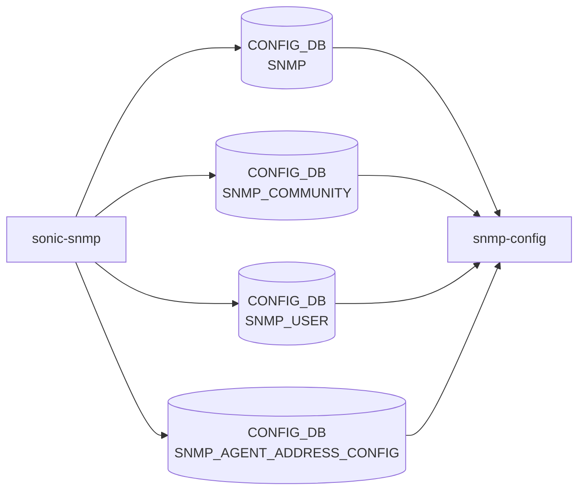

# sonic-snmp YANG

## 概要

- module: `sonic-snmp`
- namespace: `http://github.com/sonic-net/sonic-snmp`
- revision: `2022-05-13`
- import: `ietf-inet-types`
- top container: `sonic-snmp`

Simple Network Management Protocol ([SNMP](../../reference/glossary.md#term-snmp)) agent configuration [YANG](../../reference/glossary.md#term-yang) module for [SONiC](../../reference/glossary.md#term-sonic) OS.[^1]

<!-- yang-mermaid -->
### データフロー (自動生成)



!!! note "凡例"
    YANG モジュールから CONFIG_DB テーブル経由で subscribe する daemon/orch までを `docs/reference/config-db-orch-map.md` から機械生成したミニ図。詳細・例外は本ページ本文を参照。
<!-- /yang-mermaid -->

## 関連ページ

<!-- yang-xref -->

本 YANG モジュールに対応する CONFIG_DB / CLI / HLD / Topics への相互リンク。`inject_yang_xref.py` により自動生成されます。

### 対応 CONFIG_DB

- [`SNMP`](../config-db/snmp.md)
- [`SNMP_AGENT_ADDRESS_CONFIG`](../config-db/snmp-agent-address-config.md)

### 関連 CLI

- [`config snmp`](../cli/config-snmp.md)

<!-- /yang-xref -->

## ツリー

```text
module: sonic-snmp
  +--rw sonic-snmp
     +--rw SNMP
     |  +--rw CONTACT
     |  |  +--rw Contact?    string
     |  +--rw LOCATION
     |     +--rw Location?   string
     +--rw SNMP_COMMUNITY
     |  +--rw SNMP_COMMUNITY_LIST* [name]
     |     +--rw name    string
     |     +--rw TYPE?   enumeration
     +--rw SNMP_USER
     |  +--rw SNMP_USER_LIST* [name]
     |     +--rw name                            string
     |     +--rw SNMP_USER_TYPE                  enumeration
     |     +--rw SNMP_USER_PERMISSION            enumeration
     |     +--rw SNMP_USER_AUTH_TYPE?            string
     |     +--rw SNMP_USER_AUTH_PASSWORD?        string
     |     +--rw SNMP_USER_ENCRYPTION_TYPE?      string
     |     +--rw SNMP_USER_ENCRYPTION_PASSWORD   string
     +--rw SNMP_AGENT_ADDRESS_CONFIG
        +--rw SNMP_AGENT_ADDRESS_CONFIG_LIST* [agent_ip port vrf_name]
           +--rw agent_ip    inet:ip-address
           +--rw port        union
           +--rw vrf_name    union
```

## leaf 一覧

| leaf | パス | 型 | 必須 | デフォルト | enum / 範囲 / leafref | 説明 |
|------|------|----|------|-----------|----------------------|------|
| `Contact` | `sonic-snmp/SNMP/CONTACT/Contact` | `string` |  |  | length 1..255 | [SNMP](../../reference/glossary.md#term-snmp) System Contact. |
| `Location` | `sonic-snmp/SNMP/LOCATION/Location` | `string` |  |  | length 1..255 | [SNMP](../../reference/glossary.md#term-snmp) System Location. |
| `name` | `sonic-snmp/SNMP_COMMUNITY/SNMP_COMMUNITY_LIST/name` | `string` | yes |  | length 4..32 | Community name (SNMPv1/v2c). |
| `TYPE` | `sonic-snmp/SNMP_COMMUNITY/SNMP_COMMUNITY_LIST/TYPE` | `enumeration` |  |  | `RO`, `RW` | Type of community, read-only or read-write. |
| `name` | `sonic-snmp/SNMP_USER/SNMP_USER_LIST/name` | `string` | yes |  | length 4..32 | Name defining the SNMP User. |
| `SNMP_USER_TYPE` | `sonic-snmp/SNMP_USER/SNMP_USER_LIST/SNMP_USER_TYPE` | `enumeration` | yes |  | `noAuthNoPriv`, `AuthNoPriv`, `Priv` | Authentication and encryption method used for the user. |
| `SNMP_USER_PERMISSION` | `sonic-snmp/SNMP_USER/SNMP_USER_LIST/SNMP_USER_PERMISSION` | `enumeration` | yes |  | `RO`, `RW` | User permission. |
| `SNMP_USER_AUTH_TYPE` | `sonic-snmp/SNMP_USER/SNMP_USER_LIST/SNMP_USER_AUTH_TYPE` | `string` |  | `""` | `SHA`, `MD5`, `HMAC-SHA-2`, または `''` (noAuthNoPriv 時) | Authentication type. `must` で USER_TYPE と整合性確認。 |
| `SNMP_USER_AUTH_PASSWORD` | `sonic-snmp/SNMP_USER/SNMP_USER_LIST/SNMP_USER_AUTH_PASSWORD` | `string` |  |  | length 0..64, `must` で AuthNoPriv/Priv のとき 8 文字以上 | Authentication password for the user. |
| `SNMP_USER_ENCRYPTION_TYPE` | `sonic-snmp/SNMP_USER/SNMP_USER_LIST/SNMP_USER_ENCRYPTION_TYPE` | `string` |  | `""` | `DES`, `AES`, または `''` | Encryption type for the user. |
| `SNMP_USER_ENCRYPTION_PASSWORD` | `sonic-snmp/SNMP_USER/SNMP_USER_LIST/SNMP_USER_ENCRYPTION_PASSWORD` | `string` | yes |  | length 0..64, `must` で Priv のとき 8 文字以上 | Encryption password for the user. |
| `agent_ip` | `sonic-snmp/SNMP_AGENT_ADDRESS_CONFIG/SNMP_AGENT_ADDRESS_CONFIG_LIST/agent_ip` | `inet:ip-address` | yes |  |  | SNMP agent listening IP. |
| `port` | `sonic-snmp/SNMP_AGENT_ADDRESS_CONFIG/SNMP_AGENT_ADDRESS_CONFIG_LIST/port` | `union` | yes |  | inet:port-number または空文字列 | SNMP agent listening port number. |
| `vrf_name` | `sonic-snmp/SNMP_AGENT_ADDRESS_CONFIG/SNMP_AGENT_ADDRESS_CONFIG_LIST/vrf_name` | `union` | yes |  | `mgmt`, `Vrf<name>`, または空 | [VRF](../../reference/glossary.md#term-vrf) name. |

## leafref / 依存

- なし
- unique 制約: `SNMP_AGENT_ADDRESS_CONFIG_LIST` の `(agent_ip, port)` ペアは unique

## augment / deviation

- なし

## 関連 CONFIG_DB / CLI

- [CONFIG_DB](../../reference/glossary.md#term-config_db): `SNMP|CONTACT/LOCATION`, `SNMP_COMMUNITY|<name>`, `SNMP_USER|<name>`, `SNMP_AGENT_ADDRESS_CONFIG|<agent_ip>|<port>|<vrf_name>`
- CLI: `config snmp` 系（agentaddress / community / user）

<!-- yang-sibling -->
### 関連 YANG モジュール

意味的に関連する SONiC YANG モジュール (slug prefix / curated group / frontmatter `related.yang` から自動抽出):

- [`sonic-system-aaa`](sonic-system-aaa.md)
- [`sonic-mgmt_vrf`](sonic-mgmt_vrf.md)
- [`sonic-banner`](sonic-banner.md)
- [`sonic-device_metadata`](sonic-device_metadata.md)
- [`sonic-feature`](sonic-feature.md)
<!-- /yang-sibling -->

<!-- ref-triangle:start -->

## 関連リファレンス

- [CONFIG_DB](../../reference/glossary.md#term-config_db): [`SNMP`](../config-db/snmp.md) / [`SNMP_COMMUNITY`](../config-db/snmp.md) / [`SNMP_USER`](../config-db/snmp.md) / [`SNMP_AGENT_ADDRESS_CONFIG`](../config-db/snmp-agent-address-config.md)
- CLI: [`config snmp`](../cli/config-snmp.md)

<!-- ref-triangle:end -->

## 引用元

[^1]: `sonic-net/sonic-buildimage` `src/sonic-yang-models/yang-models/sonic-snmp.yang` @ `9ea932ec2e18f35e58268ec2e4456b1d4afd65cd`

<!-- glossary-links-injected: 8ba32e5aa69d -->
