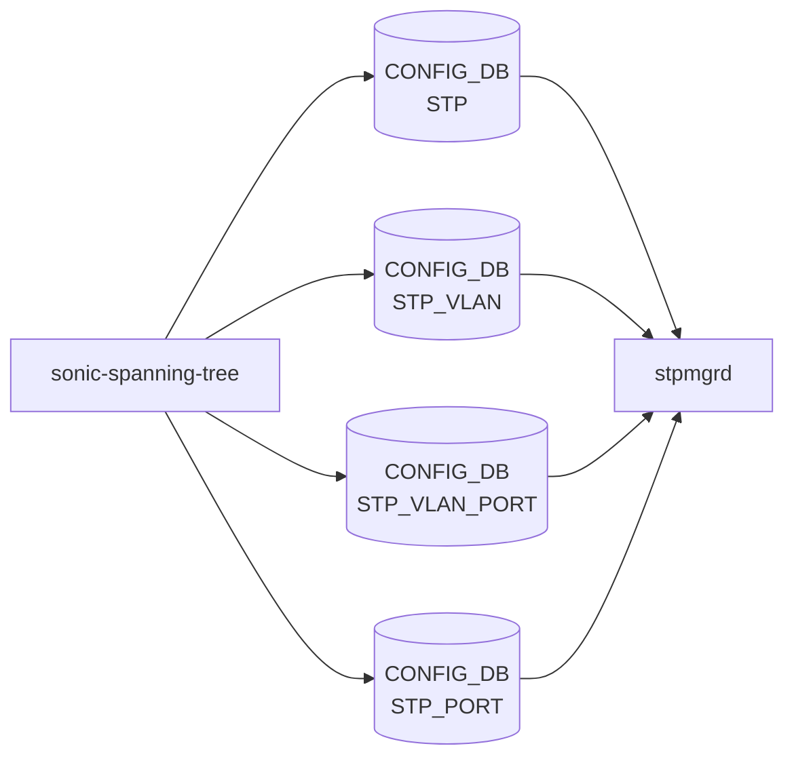

# sonic-spanning-tree YANG

## 概要

- module: `sonic-spanning-tree`
- namespace: `http://github.com/sonic-net/sonic-stp`
- yang-version: `1.1`
- prefix: `stp`
- revision: `2025-03-15`
- import: なし (yang ソース上の `import sonic-extension` はコメントアウト済み[^1])
- top container: `sonic-spanning-tree`

PVST / MSTP のグローバル・[VLAN](../../reference/glossary.md#term-vlan) 別・ポート別・MST instance/port 別の設定を保持する[^1]。`mode` enum は `pvst` / `mst` の 2 値のみで、RSTP やラピッド PVST 専用の enum 値は存在しない[^1]。

<!-- yang-mermaid -->
### データフロー (自動生成)



!!! note "凡例"
    YANG モジュールから CONFIG_DB テーブル経由で subscribe する daemon/orch までを `docs/reference/config-db-orch-map.md` から機械生成したミニ図。詳細・例外は本ページ本文を参照。
<!-- /yang-mermaid -->

## 関連ページ

<!-- yang-xref -->

本 YANG モジュールに対応する CONFIG_DB / CLI / HLD / Topics への相互リンク。`inject_yang_xref.py` により自動生成されます。

### 対応 CONFIG_DB

- [`STP`](../config-db/stp.md)
- [`STP_VLAN`](../config-db/stp-vlan.md)
- [`STP_VLAN_PORT`](../config-db/stp-vlan.md)
- [`STP_PORT`](../config-db/stp-port.md)
- [`STP_MST`](../config-db/stp-mst.md)
- [`STP_MST_INST`](../config-db/stp-mst.md)
- [`STP_MST_PORT`](../config-db/stp-mst.md)

<!-- /yang-xref -->

## ツリー

```text
module: sonic-spanning-tree
  +--rw sonic-spanning-tree
     +--rw STP
     |  +--rw STP_LIST* [keyleaf]
     |     +--rw keyleaf              enumeration
     |     +--rw mode                 enumeration
     |     +--rw rootguard_timeout?   uint16
     |     +--rw forward_delay?       uint8
     |     +--rw hello_time?          uint8
     |     +--rw max_age?             uint8
     |     +--rw priority?            uint16
     +--rw STP_VLAN
     |  +--rw STP_VLAN_LIST* [name]
     |     +--rw name             string
     |     +--rw vlanid?          uint16
     |     +--rw enabled          boolean
     |     +--rw forward_delay?   uint8
     |     +--rw hello_time?      uint8
     |     +--rw max_age?         uint8
     |     +--rw priority?        uint16
     +--rw STP_VLAN_PORT
     |  +--rw STP_VLAN_PORT_LIST* [vlan-name ifname]
     |     +--rw vlan-name    -> ../../../STP_VLAN/STP_VLAN_LIST/name
     |     +--rw ifname       -> ../../../STP_PORT/STP_PORT_LIST/ifname
     |     +--rw path_cost?   uint64
     |     +--rw priority?    uint8
     +--rw STP_PORT
     |  +--rw STP_PORT_LIST* [ifname]
     |     +--rw ifname                   string
     |     +--rw enabled                  boolean
     |     +--rw root_guard?              boolean
     |     +--rw bpdu_guard?              boolean
     |     +--rw bpdu_guard_do_disable?   boolean
     |     +--rw uplink_fast?             boolean
     |     +--rw portfast?                boolean
     |     +--rw path_cost?               uint64
     |     +--rw priority?                uint8
     |     +--rw edge_port?               boolean
     |     +--rw link_type?               enumeration
     +--rw STP_MST
     |  +--rw STP_MST_LIST* [keyleaf]
     |     +--rw keyleaf          enumeration
     |     +--rw name?            string
     |     +--rw revision?        uint32
     |     +--rw max_hops?        uint8
     |     +--rw max_age?         uint8
     |     +--rw hello_time?      uint8
     |     +--rw forward_delay?   uint8
     |     +--rw hold_count?      uint8
     +--rw STP_MST_INST
     |  +--rw STP_MST_INST_LIST* [instance]
     |     +--rw instance           uint16
     |     +--rw vlan*              string
     |     +--rw bridge_priority?   uint16
     +--rw STP_MST_PORT
        +--rw STP_MST_PORT_LIST* [inst_id ifname]
           +--rw inst_id      -> ../../../STP_MST_INST/STP_MST_INST_LIST/instance
           +--rw ifname       -> ../../../STP_PORT/STP_PORT_LIST/ifname
           +--rw path_cost?   uint64
           +--rw priority?    uint8
```

## leaf 一覧

| leaf | パス | 型 | 必須 | デフォルト | enum / 範囲 / leafref | 説明 |
|------|------|----|------|-----------|----------------------|------|
| `keyleaf` | `sonic-spanning-tree/STP/STP_LIST/keyleaf` | `enumeration` | yes |  | GLOBAL | Singleton key for STP global container |
| `mode` | `sonic-spanning-tree/STP/STP_LIST/mode` | `enumeration` | yes |  | pvst, mst | Spanning tree protocol mode |
| `rootguard_timeout` | `sonic-spanning-tree/STP/STP_LIST/rootguard_timeout` | `uint16` |  | 30 | range 5..600 (must `mode = 'pvst'`) | Root guard recovery timeout (seconds) |
| `forward_delay` | `sonic-spanning-tree/STP/STP_LIST/forward_delay` | `uint8` |  | 15 | range 4..30 | Global forward delay |
| `hello_time` | `sonic-spanning-tree/STP/STP_LIST/hello_time` | `uint8` |  | 2 | range 1..10 | Global hello time |
| `max_age` | `sonic-spanning-tree/STP/STP_LIST/max_age` | `uint8` |  | 20 | range 6..40 | Global max age |
| `priority` | `sonic-spanning-tree/STP/STP_LIST/priority` | `uint16` |  | 32768 | range 0..61440 (step 4096) | Bridge priority |
| `name` | `sonic-spanning-tree/STP_VLAN/STP_VLAN_LIST/name` | `string` | yes |  | "Vlan&lt;id&gt;" | [VLAN](../../reference/glossary.md#term-vlan) identifier in format 'Vlan<id>' |
| `vlanid` | `sonic-spanning-tree/STP_VLAN/STP_VLAN_LIST/vlanid` | `uint16` |  |  | range 1..4095 | [VLAN](../../reference/glossary.md#term-vlan) ID |
| `enabled` | `sonic-spanning-tree/STP_VLAN/STP_VLAN_LIST/enabled` | `boolean` | yes |  |  | Spanning tree enabled on VLAN |
| `forward_delay` | `sonic-spanning-tree/STP_VLAN/STP_VLAN_LIST/forward_delay` | `uint8` |  | 15 | range 4..30 | Per-VLAN forward delay (seconds) |
| `hello_time` | `sonic-spanning-tree/STP_VLAN/STP_VLAN_LIST/hello_time` | `uint8` |  | 2 | range 1..10 | Per-VLAN hello time (seconds) |
| `max_age` | `sonic-spanning-tree/STP_VLAN/STP_VLAN_LIST/max_age` | `uint8` |  | 20 | range 6..40 | Per-VLAN max age (seconds) |
| `priority` | `sonic-spanning-tree/STP_VLAN/STP_VLAN_LIST/priority` | `uint16` |  | 32768 | range 0..61440 | Per-VLAN bridge priority |
| `vlan-name` | `sonic-spanning-tree/STP_VLAN_PORT/STP_VLAN_PORT_LIST/vlan-name` | `leafref` | yes |  | ../../../STP_VLAN/STP_VLAN_LIST/name | Reference to VLAN |
| `ifname` | `sonic-spanning-tree/STP_VLAN_PORT/STP_VLAN_PORT_LIST/ifname` | `leafref` | yes |  | ../../../STP_PORT/STP_PORT_LIST/ifname | Reference to Ethernet interface or [PortChannel](../../reference/glossary.md#term-portchannel) |
| `path_cost` | `sonic-spanning-tree/STP_VLAN_PORT/STP_VLAN_PORT_LIST/path_cost` | `uint64` |  | 200 | range 1..200000000 | Path cost per VLAN per port |
| `priority` | `sonic-spanning-tree/STP_VLAN_PORT/STP_VLAN_PORT_LIST/priority` | `uint8` |  | 128 | range 0..240 | Port priority per VLAN |
| `ifname` | `sonic-spanning-tree/STP_PORT/STP_PORT_LIST/ifname` | `string` | yes |  | Ethernet/[PortChannel](../../reference/glossary.md#term-portchannel) 名 (yang 上は plain `string`、leafref ではない[^1]) | Reference to Ethernet interface or [PortChannel](../../reference/glossary.md#term-portchannel) |
| `enabled` | `sonic-spanning-tree/STP_PORT/STP_PORT_LIST/enabled` | `boolean` | yes |  |  | Spanning tree enabled on interface |
| `root_guard` | `sonic-spanning-tree/STP_PORT/STP_PORT_LIST/root_guard` | `boolean` |  | false |  | Root guard on port |
| `bpdu_guard` | `sonic-spanning-tree/STP_PORT/STP_PORT_LIST/bpdu_guard` | `boolean` |  | false |  | BPDU guard on port |
| `bpdu_guard_do_disable` | `sonic-spanning-tree/STP_PORT/STP_PORT_LIST/bpdu_guard_do_disable` | `boolean` |  | false |  | Disable port when BPDU is received |
| `uplink_fast` | `sonic-spanning-tree/STP_PORT/STP_PORT_LIST/uplink_fast` | `boolean` |  | false |  | Uplink-fast on port |
| `portfast` | `sonic-spanning-tree/STP_PORT/STP_PORT_LIST/portfast` | `boolean` |  | false | must `mode='pvst'` を満たすときのみ true 可 | Portfast (PVST only) |
| `path_cost` | `sonic-spanning-tree/STP_PORT/STP_PORT_LIST/path_cost` | `uint64` |  | 200 | range 1..200000000 | Port path cost |
| `priority` | `sonic-spanning-tree/STP_PORT/STP_PORT_LIST/priority` | `uint8` |  | 128 | range 0..240 | Port priority |
| `edge_port` | `sonic-spanning-tree/STP_PORT/STP_PORT_LIST/edge_port` | `boolean` |  | false | must `mode='mst'` を満たすときのみ true 可 | Edge port designation (MST only) |
| `link_type` | `sonic-spanning-tree/STP_PORT/STP_PORT_LIST/link_type` | `enumeration` |  |  | auto, shared, point-to-point (must `mode='mst'`) | Port link type (MST only) |
| `keyleaf` | `sonic-spanning-tree/STP_MST/STP_MST_LIST/keyleaf` | `enumeration` | yes |  | GLOBAL | Singleton key for MST global container |
| `name` | `sonic-spanning-tree/STP_MST/STP_MST_LIST/name` | `string` |  |  | must `mode='mst'` | MST region name |
| `revision` | `sonic-spanning-tree/STP_MST/STP_MST_LIST/revision` | `uint32` |  |  | must `mode='mst'` | MST revision number |
| `max_hops` | `sonic-spanning-tree/STP_MST/STP_MST_LIST/max_hops` | `uint8` |  | 20 | must `mode='mst'` | MST max hops |
| `max_age` | `sonic-spanning-tree/STP_MST/STP_MST_LIST/max_age` | `uint8` |  | 20 | must `mode='mst'` | MST max age (seconds) |
| `hello_time` | `sonic-spanning-tree/STP_MST/STP_MST_LIST/hello_time` | `uint8` |  | 2 | must `mode='mst'` | MST hello time (seconds) |
| `forward_delay` | `sonic-spanning-tree/STP_MST/STP_MST_LIST/forward_delay` | `uint8` |  | 15 | must `mode='mst'` | MST forward delay (seconds) |
| `hold_count` | `sonic-spanning-tree/STP_MST/STP_MST_LIST/hold_count` | `uint8` |  |  | must `mode='mst'` | MST hold count |
| `instance` | `sonic-spanning-tree/STP_MST_INST/STP_MST_INST_LIST/instance` | `uint16` | yes |  |  | MST instance identifier |
| `vlan` | `sonic-spanning-tree/STP_MST_INST/STP_MST_INST_LIST/vlan` | `leaf-list string` |  |  |  | VLAN list assigned to MST instance |
| `bridge_priority` | `sonic-spanning-tree/STP_MST_INST/STP_MST_INST_LIST/bridge_priority` | `uint16` |  | 32768 | range 0..61440 | Bridge priority per MST instance |
| `inst_id` | `sonic-spanning-tree/STP_MST_PORT/STP_MST_PORT_LIST/inst_id` | `leafref` | yes |  | ../../../STP_MST_INST/STP_MST_INST_LIST/instance | Reference to MST instance |
| `ifname` | `sonic-spanning-tree/STP_MST_PORT/STP_MST_PORT_LIST/ifname` | `leafref` | yes |  | ../../../STP_PORT/STP_PORT_LIST/ifname | Reference to Ethernet interface or PortChannel |
| `path_cost` | `sonic-spanning-tree/STP_MST_PORT/STP_MST_PORT_LIST/path_cost` | `uint64` |  | 200 | range 1..200000000 | Path cost per MST instance per port |
| `priority` | `sonic-spanning-tree/STP_MST_PORT/STP_MST_PORT_LIST/priority` | `uint8` |  | 128 | range 0..240 | Port priority per MST instance |

## leafref / 依存

- `sonic-spanning-tree/STP_VLAN_PORT/STP_VLAN_PORT_LIST/vlan-name` → `../../../STP_VLAN/STP_VLAN_LIST/name`[^1]
- `sonic-spanning-tree/STP_VLAN_PORT/STP_VLAN_PORT_LIST/ifname` → `../../../STP_PORT/STP_PORT_LIST/ifname`[^1]
- `sonic-spanning-tree/STP_MST_PORT/STP_MST_PORT_LIST/inst_id` → `../../../STP_MST_INST/STP_MST_INST_LIST/instance`[^1]
- `sonic-spanning-tree/STP_MST_PORT/STP_MST_PORT_LIST/ifname` → `../../../STP_PORT/STP_PORT_LIST/ifname`[^1]

なお `STP_PORT_LIST` の key である `ifname` 自体は `type string` であり、`sonic-port` / `sonic-portchannel` への leafref 制約は yang 上には存在しない[^1]。実在性チェックは stpmgrd 側に委ねられている。

## augment / deviation

- なし

## 関連 CONFIG_DB / CLI

- [CONFIG_DB](../../reference/glossary.md#term-config_db): `STP`, `STP_VLAN`, `STP_VLAN_PORT`, `STP_PORT`, `STP_MST`, `STP_MST_INST`, `STP_MST_PORT`
- CLI: `config spanning-tree`, `show spanning_tree`

<!-- yang-sibling -->
### 関連 YANG モジュール

意味的に関連する SONiC YANG モジュール (slug prefix / curated group / frontmatter `related.yang` から自動抽出):

- [`sonic-vlan`](sonic-vlan.md)
- [`sonic-port`](sonic-port.md)
- [`sonic-portchannel`](sonic-portchannel.md)
- [`sonic-mclag`](sonic-mclag.md)
- [`sonic-storm-control`](sonic-storm-control.md)
<!-- /yang-sibling -->

<!-- ref-triangle:start -->

## 関連リファレンス

- [CONFIG_DB](../../reference/glossary.md#term-config_db): `STP` / `STP_VLAN` / `STP_VLAN_PORT` / `STP_PORT` / `STP_MST` / `STP_MST_INST` / `STP_MST_PORT`
- CLI: `config spanning-tree` / `show spanning_tree`

<!-- ref-triangle:end -->

<!-- ops-hint -->
## 運用ヒント

### 典型的なデプロイ位置

- STP / RSTP / PVST 設定。`STP` / `STP_PORT` / `STP_VLAN*` を stpmgrd が処理。

### よくある落とし穴

- `mode` (`pvst` ↔ `mst`) を runtime で切替えるとポート単位設定が一部リセットされる。事前にバックアップ推奨。

### 関連する config / show コマンド

```bash
sonic-db-cli CONFIG_DB hgetall 'STP|GLOBAL'
show spanning_tree
```
<!-- /ops-hint -->

## 引用元

[^1]: `sonic-net/sonic-buildimage` `src/sonic-yang-models/yang-models/sonic-spanning-tree.yang` @ `9ea932ec2e18f35e58268ec2e4456b1d4afd65cd`

<!-- glossary-links-injected: 03b498f482eb -->
