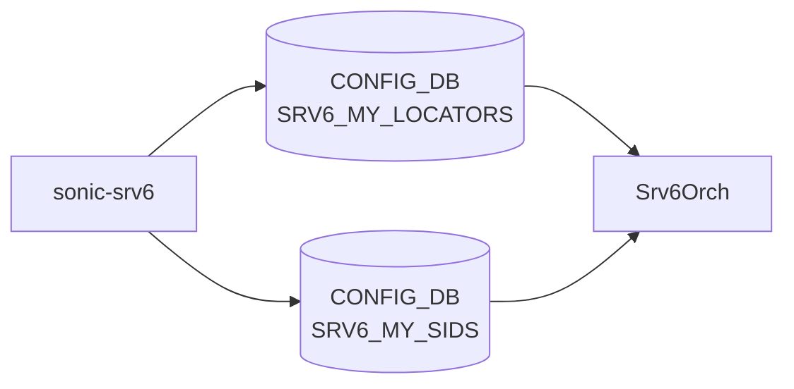

# sonic-srv6 YANG

## 概要

- module: `sonic-srv6`
- namespace: `http://github.com/sonic-net/sonic-srv6`
- revision: `2024-12-05`
- import: `ietf-inet-types`, `sonic-vrf`
- top container: `sonic-srv6`

Segment Routing over IPv6 ([SRv6](../../reference/glossary.md#term-srv6)) configuration for SONiC.[^1]

<!-- yang-mermaid -->
### データフロー (自動生成)



!!! note "凡例"
    YANG モジュールから CONFIG_DB テーブル経由で subscribe する daemon/orch までを `docs/reference/config-db-orch-map.md` から機械生成したミニ図。詳細・例外は本ページ本文を参照。
<!-- /yang-mermaid -->

## 関連ページ

<!-- yang-xref -->

本 YANG モジュールに対応する CONFIG_DB / CLI / HLD / Topics への相互リンク。`inject_yang_xref.py` により自動生成されます。

### 対応 CONFIG_DB

- [`SRV6_MY_LOCATORS`](../config-db/srv6-my-locators.md)
- [`SRV6_MY_SIDS`](../config-db/srv6-my-sids.md)

<!-- /yang-xref -->

## ツリー

```text
module: sonic-srv6
  +--rw sonic-srv6
     +--rw SRV6_MY_LOCATORS
     |  +--rw SRV6_MY_LOCATORS_LIST* [locator_name]
     |     +--rw locator_name    string
     |     +--rw prefix          inet:ipv6-address
     |     +--rw block_len?      uint8
     |     +--rw node_len?       uint8
     |     +--rw func_len?       uint8
     |     +--rw arg_len?        uint8
     |     +--rw vrf?            union
     +--rw SRV6_MY_SIDS
        +--rw SRV6_MY_SIDS_LIST* [locator ip_prefix]
           +--rw ip_prefix         inet:ipv6-prefix
           +--rw locator           -> /srv6:sonic-srv6/SRV6_MY_LOCATORS/SRV6_MY_LOCATORS_LIST/locator_name
           +--rw action?           enumeration
           +--rw decap_vrf?        union
           +--rw decap_dscp_mode?  enumeration
```

## leaf 一覧

| leaf | パス | 型 | 必須 | デフォルト | enum / 範囲 / leafref | 説明 |
|------|------|----|------|-----------|----------------------|------|
| `locator_name` | `sonic-srv6/SRV6_MY_LOCATORS/SRV6_MY_LOCATORS_LIST/locator_name` | `string` | yes |  |  | [SRv6](../../reference/glossary.md#term-srv6) locator name. |
| `prefix` | `sonic-srv6/SRV6_MY_LOCATORS/SRV6_MY_LOCATORS_LIST/prefix` | `inet:ipv6-address` | yes |  |  | IPv6 address prefix for this locator. |
| `block_len` | `sonic-srv6/SRV6_MY_LOCATORS/SRV6_MY_LOCATORS_LIST/block_len` | `uint8` |  | `32` | range 1..128 | Length in bits of the [SRv6](../../reference/glossary.md#term-srv6) locator block portion. |
| `node_len` | `sonic-srv6/SRV6_MY_LOCATORS/SRV6_MY_LOCATORS_LIST/node_len` | `uint8` |  | `16` | range 1..128 | Length in bits of the SRv6 locator node portion. |
| `func_len` | `sonic-srv6/SRV6_MY_LOCATORS/SRV6_MY_LOCATORS_LIST/func_len` | `uint8` |  | `16` | range 0..128 | Length in bits of the SRv6 SID function portion. |
| `arg_len` | `sonic-srv6/SRV6_MY_LOCATORS/SRV6_MY_LOCATORS_LIST/arg_len` | `uint8` |  | `0` | range 0..128 | Length in bits of the SRv6 SID argument portion. |
| `vrf` | `sonic-srv6/SRV6_MY_LOCATORS/SRV6_MY_LOCATORS_LIST/vrf` | `union` |  | `default` | leafref([VRF](../../reference/glossary.md#term-vrf)) or `default` | [VRF](../../reference/glossary.md#term-vrf) name. |
| `ip_prefix` | `sonic-srv6/SRV6_MY_SIDS/SRV6_MY_SIDS_LIST/ip_prefix` | `inet:ipv6-prefix` | yes |  |  | IPv6 prefix representing this SID. |
| `locator` | `sonic-srv6/SRV6_MY_SIDS/SRV6_MY_SIDS_LIST/locator` | `leafref` | yes |  | /srv6:sonic-srv6/srv6:SRV6_MY_LOCATORS/srv6:SRV6_MY_LOCATORS_LIST/srv6:locator_name | Reference to the parent SRv6 locator. |
| `action` | `sonic-srv6/SRV6_MY_SIDS/SRV6_MY_SIDS_LIST/action` | `enumeration` |  |  | `uN`, `uDT46` | SRv6 endpoint behavior (uN for prefix SID, uDT46 for decap with [VRF](../../reference/glossary.md#term-vrf) lookup). |
| `decap_vrf` | `sonic-srv6/SRV6_MY_SIDS/SRV6_MY_SIDS_LIST/decap_vrf` | `union` |  | `default` | leafref(VRF) or `default` | VRF name used for decapsulation. |
| `decap_dscp_mode` | `sonic-srv6/SRV6_MY_SIDS/SRV6_MY_SIDS_LIST/decap_dscp_mode` | `enumeration` |  |  | `uniform`, `pipe` | [DSCP](../../reference/glossary.md#term-dscp) handling mode for decapsulated packets. |

## must 制約

- `SRV6_MY_LOCATORS_LIST`: `block_len + node_len + func_len + arg_len <= 128`

## leafref / 依存

- `SRV6_MY_LOCATORS_LIST/vrf` → `/vrf:sonic-vrf/vrf:VRF/vrf:VRF_LIST/vrf:name`
- `SRV6_MY_SIDS_LIST/locator` → `/srv6:sonic-srv6/srv6:SRV6_MY_LOCATORS/srv6:SRV6_MY_LOCATORS_LIST/srv6:locator_name`
- `SRV6_MY_SIDS_LIST/decap_vrf` → `/vrf:sonic-vrf/vrf:VRF/vrf:VRF_LIST/vrf:name`

## augment / deviation

- なし

## 関連 CONFIG_DB / CLI

- [CONFIG_DB](../../reference/glossary.md#term-config_db): `SRV6_MY_LOCATORS`, `SRV6_MY_SIDS`

<!-- yang-sibling -->
### 関連 YANG モジュール

意味的に関連する SONiC YANG モジュール (slug prefix / curated group / frontmatter `related.yang` から自動抽出):

- [`sonic-vrf`](sonic-vrf.md)
- [`sonic-mux-cable`](sonic-mux-cable.md)
- [`sonic-nvgre-tunnel`](sonic-nvgre-tunnel.md)
- [`sonic-tunnel`](sonic-tunnel.md)
- [`sonic-vnet`](sonic-vnet.md)
<!-- /yang-sibling -->

<!-- ref-triangle:start -->

## 関連リファレンス

- [CONFIG_DB](../../reference/glossary.md#term-config_db): `SRV6_MY_LOCATORS` / `SRV6_MY_SIDS`

<!-- ref-triangle:end -->

## 引用元

[^1]: `sonic-net/sonic-buildimage` `src/sonic-yang-models/yang-models/sonic-srv6.yang` @ `9ea932ec2e18f35e58268ec2e4456b1d4afd65cd`

<!-- glossary-links-injected: e1fd4940b990 -->
