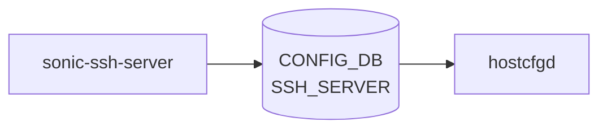

# sonic-ssh-server YANG

## 概要

- module: `sonic-ssh-server`
- namespace: `http://github.com/sonic-net/sonic-ssh-server`
- revision: `2023-06-07` (前: `2022-08-29`)
- import: なし
- top container: `sonic-ssh-server`

SSH server daemon configuration [YANG](../../reference/glossary.md#term-yang) module for [SONiC](../../reference/glossary.md#term-sonic) OS.[^1]

<!-- yang-mermaid -->
### データフロー (自動生成)



!!! note "凡例"
    YANG モジュールから CONFIG_DB テーブル経由で subscribe する daemon/orch までを `docs/reference/config-db-orch-map.md` から機械生成したミニ図。詳細・例外は本ページ本文を参照。
<!-- /yang-mermaid -->

## 関連ページ

<!-- yang-xref -->

本 YANG モジュールに対応する CONFIG_DB / CLI / HLD / Topics への相互リンク。`inject_yang_xref.py` により自動生成されます。

### 対応 CONFIG_DB

- [`SSH_SERVER`](../config-db/ssh-server.md)

### 関連 CLI

- [`config ssh`](../cli/config-ssh.md)

### 関連 HLD

- [sonic-banner YANG](../../reference/yang/sonic-banner.md)
- [sonic-fips YANG](../../reference/yang/sonic-fips.md)
- [sonic-passwh YANG](../../reference/yang/sonic-passw-hardening.md)

<!-- /yang-xref -->

## ツリー

```text
module: sonic-ssh-server
  +--rw sonic-ssh-server
     +--rw SSH_SERVER
        +--rw POLICIES
           +--rw authentication_retries?    uint32
           +--rw login_timeout?             uint32
           +--rw ports?                     string
           +--rw inactivity_timeout?        uint32
           +--rw max_sessions?              uint32
           +--rw permit_root_login?         enumeration
           +--rw password_authentication?   boolean
           +--rw ciphers*                   enumeration
           +--rw kex_algorithms*            enumeration
           +--rw macs*                      enumeration
```

## leaf 一覧

| leaf | パス | 型 | 必須 | デフォルト | enum / 範囲 / leafref | 説明 |
|------|------|----|------|-----------|----------------------|------|
| `authentication_retries` | `sonic-ssh-server/SSH_SERVER/POLICIES/authentication_retries` | `uint32` |  | `6` | range 1..100 | Maximum number of authentication attempts per SSH connection. |
| `login_timeout` | `sonic-ssh-server/SSH_SERVER/POLICIES/login_timeout` | `uint32` |  | `120` | range 1..600 | Maximum time in seconds allowed for successful SSH authentication. |
| `ports` | `sonic-ssh-server/SSH_SERVER/POLICIES/ports` | `string` |  | `22` | カンマ区切りの 1..65536 範囲ポート番号 | Comma-separated list of TCP port numbers the SSH daemon listens on. |
| `inactivity_timeout` | `sonic-ssh-server/SSH_SERVER/POLICIES/inactivity_timeout` | `uint32` |  | `15` | range 0..35000 | SSH session inactivity timeout in minutes; 0 disables the timeout. |
| `max_sessions` | `sonic-ssh-server/SSH_SERVER/POLICIES/max_sessions` | `uint32` |  | `0` | range 0..100 | Maximum number of concurrent SSH sessions; 0 means unlimited. |
| `permit_root_login` | `sonic-ssh-server/SSH_SERVER/POLICIES/permit_root_login` | `enumeration` |  |  | `yes`, `prohibit-password`, `forced-commands-only`, `no` | Specifies whether root can log in using ssh. |
| `password_authentication` | `sonic-ssh-server/SSH_SERVER/POLICIES/password_authentication` | `boolean` |  | `true` |  | Specifies whether password authentication is enabled. |
| `ciphers` | `sonic-ssh-server/SSH_SERVER/POLICIES/ciphers` | `enumeration (leaf-list)` |  |  | `3des-cbc`, `aes128-cbc`, `aes192-cbc`, `aes256-cbc`, `aes128-ctr`, `aes192-ctr`, `aes256-ctr`, `aes128-gcm@openssh.com`, `aes256-gcm@openssh.com`, `chacha20-poly1305@openssh.com` | Specifies the ciphers allowed. |
| `kex_algorithms` | `sonic-ssh-server/SSH_SERVER/POLICIES/kex_algorithms` | `enumeration (leaf-list)` |  |  | `diffie-hellman-group1-sha1`, `diffie-hellman-group14-sha1`, `diffie-hellman-group14-sha256`, `diffie-hellman-group16-sha512`, `diffie-hellman-group18-sha512`, `diffie-hellman-group-exchange-sha1`, `diffie-hellman-group-exchange-sha256`, `ecdh-sha2-nistp256`, `ecdh-sha2-nistp384`, `ecdh-sha2-nistp521`, `curve25519-sha256`, `curve25519-sha256@libssh.org`, `sntrup761x25519-sha512`, `sntrup761x25519-sha512@openssh.com` | Specifies the available Key Exchange algorithms. |
| `macs` | `sonic-ssh-server/SSH_SERVER/POLICIES/macs` | `enumeration (leaf-list)` |  |  | `hmac-sha1`, `hmac-sha1-96`, `hmac-sha2-256`, `hmac-sha2-512`, `hmac-md5`, `hmac-md5-96`, `umac-64@openssh.com`, `umac-128@openssh.com`, `hmac-sha1-etm@openssh.com`, `hmac-sha1-96-etm@openssh.com`, `hmac-sha2-256-etm@openssh.com`, `hmac-sha2-512-etm@openssh.com`, `hmac-md5-etm@openssh.com`, `hmac-md5-96-etm@openssh.com`, `umac-64-etm@openssh.com`, `umac-128-etm@openssh.com` | Specifies the available MAC (message authentication code) algorithms. |

## leafref / 依存

- なし

## augment / deviation

- なし

## 関連 CONFIG_DB / CLI

- [CONFIG_DB](../../reference/glossary.md#term-config_db): `SSH_SERVER|POLICIES`
- CLI: `config ssh`

<!-- yang-sibling -->
### 関連 YANG モジュール

意味的に関連する SONiC YANG モジュール (slug prefix / curated group / frontmatter `related.yang` から自動抽出):

- [`sonic-system-aaa`](sonic-system-aaa.md)
- [`sonic-banner`](sonic-banner.md)
- [`sonic-device_metadata`](sonic-device_metadata.md)
- [`sonic-feature`](sonic-feature.md)
- [`sonic-fips`](sonic-fips.md)
<!-- /yang-sibling -->

<!-- ref-triangle:start -->

## 関連リファレンス

- [CONFIG_DB](../../reference/glossary.md#term-config_db): `SSH_SERVER`
- CLI: [`config ssh`](../cli/config-ssh.md)

<!-- ref-triangle:end -->

## 引用元

[^1]: `sonic-net/sonic-buildimage` `src/sonic-yang-models/yang-models/sonic-ssh-server.yang` @ `9ea932ec2e18f35e58268ec2e4456b1d4afd65cd`

<!-- glossary-links-injected: 8ba32e5aa69d -->
