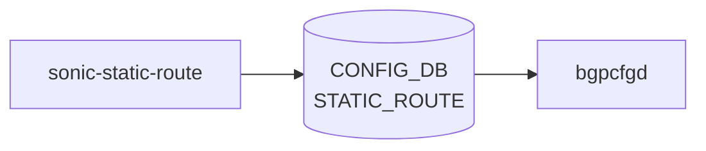

# sonic-static-route YANG

## 概要

- module: `sonic-static-route`
- namespace: `http://github.com/sonic-net/sonic-static-route`
- revision: `2022-03-17`
- import: `ietf-inet-types`
- top container: `sonic-static-route`

STATIC ROUTE yang Module for [SONiC](../../reference/glossary.md#term-sonic) OS[^1]

<!-- yang-mermaid -->
### データフロー (自動生成)



!!! note "凡例"
    YANG モジュールから CONFIG_DB テーブル経由で subscribe する daemon/orch までを `docs/reference/config-db-orch-map.md` から機械生成したミニ図。詳細・例外は本ページ本文を参照。
<!-- /yang-mermaid -->

## 関連ページ

<!-- yang-xref -->

本 YANG モジュールに対応する CONFIG_DB / CLI / HLD / Topics への相互リンク。`inject_yang_xref.py` により自動生成されます。

### 対応 CONFIG_DB

- [`STATIC_ROUTE`](../config-db/static-route.md)

### 関連 CLI

- [`config route`](../cli/config-route.md)

### 関連 HLD

- [sonic-route-common YANG](../../reference/yang/sonic-route-common.md)

<!-- /yang-xref -->

## ツリー

```text
module: sonic-static-route
  +--rw sonic-static-route
     +--rw STATIC_ROUTE
        +--rw STATIC_ROUTE_TEMPLATE_LIST* [prefix]
        |  +--rw prefix       inet:ip-prefix
        |  +--rw nexthop?     string
        |  +--rw ifname?      string
        |  +--rw advertise?   string
        |  +--rw bfd?         string
        +--rw STATIC_ROUTE_LIST* [vrf_name prefix]
           +--rw vrf_name       union
           +--rw prefix         inet:ip-prefix
           +--rw nexthop?       string
           +--rw ifname?        string
           +--rw advertise?     string
           +--rw distance?      string
           +--rw nexthop-vrf?   string
           +--rw blackhole?     string
```

## container / list 一覧

| 種別 | パス | key | 説明 |
|------|------|-----|------|
| `container` | `sonic-static-route` |  |  |
| `container` | `sonic-static-route/STATIC_ROUTE` |  | Static route entries for deterministic IP forwarding. |
| `list` | `sonic-static-route/STATIC_ROUTE/STATIC_ROUTE_TEMPLATE_LIST` | `prefix` |  |
| `list` | `sonic-static-route/STATIC_ROUTE/STATIC_ROUTE_LIST` | `vrf_name prefix` |  |

## leaf 一覧

| leaf | パス | 型 | 必須 | デフォルト | enum / 範囲 / leafref | 説明 |
|------|------|----|------|-----------|----------------------|------|
| `prefix` | `sonic-static-route/STATIC_ROUTE/STATIC_ROUTE_TEMPLATE_LIST/prefix` | `inet:ip-prefix` | yes |  |  | prefix is the destination IP address, as key |
| `nexthop` | `sonic-static-route/STATIC_ROUTE/STATIC_ROUTE_TEMPLATE_LIST/nexthop` | `string` |  |  |  | The next-hop that is to be used for the static route as IP address. When interface needs to be specified, use 0.0.0.0 as leaf value |
| `ifname` | `sonic-static-route/STATIC_ROUTE/STATIC_ROUTE_TEMPLATE_LIST/ifname` | `string` |  |  |  | When interface is specified, forwarding happens through it |
| `advertise` | `sonic-static-route/STATIC_ROUTE/STATIC_ROUTE_TEMPLATE_LIST/advertise` | `string` |  | false | pattern `((true\|false),)*(true\|false)` | Advertise this static route to [BGP](../../reference/glossary.md#term-bgp), comma-separated per nexthop. |
| `bfd` | `sonic-static-route/STATIC_ROUTE/STATIC_ROUTE_TEMPLATE_LIST/bfd` | `string` |  | false | pattern `((true\|false),)*(true\|false)` | Enable [BFD](../../reference/glossary.md#term-bfd) monitoring for each nexthop, comma-separated per nexthop. |
| `vrf_name` | `sonic-static-route/STATIC_ROUTE/STATIC_ROUTE_LIST/vrf_name` | `union` | yes |  | union(string: pattern `default`, string: pattern `mgmt`, string: pattern `Vrf[a-zA-Z0-9_-]+`) | Virtual Routing Instance name as key |
| `prefix` | `sonic-static-route/STATIC_ROUTE/STATIC_ROUTE_LIST/prefix` | `inet:ip-prefix` | yes |  |  | prefix is the destination IP address, as key |
| `nexthop` | `sonic-static-route/STATIC_ROUTE/STATIC_ROUTE_LIST/nexthop` | `string` |  |  |  | The next-hop that is to be used for the static route as IP address. When interface needs to be specified, use 0.0.0.0 as leaf value |
| `ifname` | `sonic-static-route/STATIC_ROUTE/STATIC_ROUTE_LIST/ifname` | `string` |  |  |  | When interface is specified, forwarding happens through it |
| `advertise` | `sonic-static-route/STATIC_ROUTE/STATIC_ROUTE_LIST/advertise` | `string` |  | false | pattern `((true\|false),)*(true\|false)` | Advertise this static route to [BGP](../../reference/glossary.md#term-bgp), comma-separated per nexthop. |
| `distance` | `sonic-static-route/STATIC_ROUTE/STATIC_ROUTE_LIST/distance` | `string` |  | 0 | pattern `((25[0-5]\|2[0-4][0-9]\|[0-1]?[0-9][0-9]?),)*(25[0-5]\|2[0-4][0-9]\|[0-1]?[0-9][0-9]?)` | Administrative Distance (preference) of the entry. The preference defines the order of selection when multiple sources (protocols, static, etc.) contribute to the same prefix en... |
| `nexthop-vrf` | `sonic-static-route/STATIC_ROUTE/STATIC_ROUTE_LIST/nexthop-vrf` | `string` |  |  | pattern `((((Vrf[a-zA-Z0-9_-]+)\|(default)\|(mgmt)),)*((Vrf[a-zA-Z0-9_-]+)\|(default)\|(mgmt)))?` | [VRF](../../reference/glossary.md#term-vrf) name of the nexthop. This is for vrf leaking |
| `blackhole` | `sonic-static-route/STATIC_ROUTE/STATIC_ROUTE_LIST/blackhole` | `string` |  | false | pattern `((true\|false),)*(true\|false)` | blackhole refers to a route that, if matched, discards the message silently. |

## leafref / 依存

- なし

## augment / deviation

- なし

## 関連 CONFIG_DB / CLI

- [CONFIG_DB](../../reference/glossary.md#term-config_db): `STATIC_ROUTE`
- CLI: `config route`

<!-- yang-sibling -->
### 関連 YANG モジュール

意味的に関連する SONiC YANG モジュール (slug prefix / curated group / frontmatter `related.yang` から自動抽出):

- [`sonic-route-common`](sonic-route-common.md)
- [`sonic-route-map`](sonic-route-map.md)
- [`sonic-vrf`](sonic-vrf.md)
- [`sonic-bgp-global`](sonic-bgp-global.md)
- [`sonic-interface`](sonic-interface.md)
<!-- /yang-sibling -->

<!-- ref-triangle:start -->

## 関連リファレンス

- [CONFIG_DB](../../reference/glossary.md#term-config_db): [`STATIC_ROUTE`](../config-db/static-route.md)
- CLI: [`config route`](../cli/config-route.md)

<!-- ref-triangle:end -->

## 引用元

[^1]: `sonic-net/sonic-buildimage` `src/sonic-yang-models/yang-models/sonic-static-route.yang` @ `9ea932ec2e18f35e58268ec2e4456b1d4afd65cd`

<!-- glossary-links-injected: 8ba32e5aa69d -->
