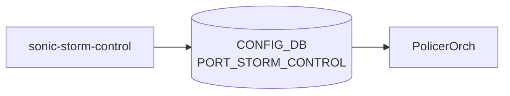

# sonic-storm-control YANG

## 概要

- module: `sonic-storm-control`
- namespace: `http://github.com/sonic-net/sonic-storm-control`
- revision: `2021-12-13`
- import: `sonic-port`
- top container: `sonic-storm-control`

ポート単位の BUM (Broadcast / Unknown unicast / Multicast) ストーム制御レート上限を保持する[^1]。

<!-- yang-mermaid -->
### データフロー (自動生成)



!!! note "凡例"
    YANG モジュールから CONFIG_DB テーブル経由で subscribe する daemon/orch までを `docs/reference/config-db-orch-map.md` から機械生成したミニ図。詳細・例外は本ページ本文を参照。
<!-- /yang-mermaid -->

## 関連ページ

<!-- yang-xref -->

本 YANG モジュールに対応する CONFIG_DB / CLI / HLD / Topics への相互リンク。`inject_yang_xref.py` により自動生成されます。

### 対応 CONFIG_DB

- [`PORT_STORM_CONTROL`](../config-db/port-storm-control.md)

### 関連 CLI

- [`show storm-control`](../cli/show-storm-control.md)

### 関連 HLD

- [POLICER テーブル](../../reference/config-db/policer.md)

<!-- /yang-xref -->

## ツリー

```text
module: sonic-storm-control
  +--rw sonic-storm-control
     +--rw PORT_STORM_CONTROL
        +--rw PORT_STORM_CONTROL_LIST* [ifname storm_type]
           +--rw ifname        -> /prt:sonic-port/PORT/PORT_LIST/name
           +--rw storm_type    enumeration
           +--rw kbps?         uint64
```

## leaf 一覧

| leaf | パス | 型 | 必須 | デフォルト | enum / 範囲 / leafref | 説明 |
|------|------|----|------|-----------|----------------------|------|
| `ifname` | `sonic-storm-control/PORT_STORM_CONTROL/PORT_STORM_CONTROL_LIST/ifname` | `leafref` | yes |  | /prt:sonic-port/prt:PORT/prt:PORT_LIST/prt:name | Physical port on which storm control is applied |
| `storm_type` | `sonic-storm-control/PORT_STORM_CONTROL/PORT_STORM_CONTROL_LIST/storm_type` | `enumeration` | yes |  | broadcast, unknown-unicast, unknown-multicast | Type of BUM traffic to rate-limit |
| `kbps` | `sonic-storm-control/PORT_STORM_CONTROL/PORT_STORM_CONTROL_LIST/kbps` | `uint64` |  |  | `0..100000000` | Rate limit in kilobits per second |

## leafref / 依存

- `sonic-storm-control/PORT_STORM_CONTROL/PORT_STORM_CONTROL_LIST/ifname` → `/prt:sonic-port/prt:PORT/prt:PORT_LIST/prt:name`

## augment / deviation

- なし

## 関連 CONFIG_DB / CLI

- [CONFIG_DB](../../reference/glossary.md#term-config_db): `PORT_STORM_CONTROL`
- CLI: `config interface storm-control`, `show storm-control`

<!-- yang-sibling -->
### 関連 YANG モジュール

意味的に関連する SONiC YANG モジュール (slug prefix / curated group / frontmatter `related.yang` から自動抽出):

- [`sonic-port`](sonic-port.md)
- [`sonic-mclag`](sonic-mclag.md)
- [`sonic-portchannel`](sonic-portchannel.md)
- [`sonic-spanning-tree`](sonic-spanning-tree.md)
- [`sonic-vlan`](sonic-vlan.md)
<!-- /yang-sibling -->

<!-- ref-triangle:start -->

## 関連リファレンス

- [CONFIG_DB](../../reference/glossary.md#term-config_db): [`PORT_STORM_CONTROL`](../config-db/port-storm-control.md)
- CLI: [`config interface storm-control`](../cli/config-interface.md) / [`show storm-control`](../cli/show-storm-control.md)

<!-- ref-triangle:end -->

## 引用元

[^1]: `sonic-net/sonic-buildimage` `src/sonic-yang-models/yang-models/sonic-storm-control.yang` @ `9ea932ec2e18f35e58268ec2e4456b1d4afd65cd`

<!-- glossary-links-injected: 20dbc11976b6 -->
