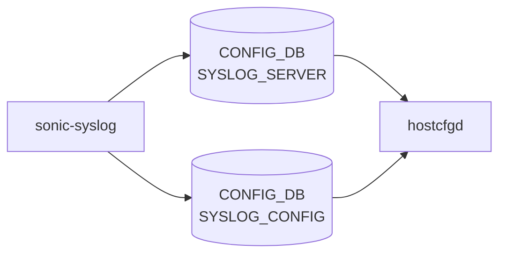

# sonic-syslog YANG

## 概要

- module: `sonic-syslog`
- namespace: `http://github.com/sonic-net/sonic-system-syslog`
- revision: `2022-04-18`
- import: `ietf-inet-types`, `sonic-mgmt_vrf`, `sonic-vrf`, `sonic-feature`
- top container: `sonic-syslog`

Remote syslog server and logging configuration [YANG](../../reference/glossary.md#term-yang) module for [SONiC](../../reference/glossary.md#term-sonic) OS.[^1]

<!-- yang-mermaid -->
### データフロー (自動生成)



!!! note "凡例"
    YANG モジュールから CONFIG_DB テーブル経由で subscribe する daemon/orch までを `docs/reference/config-db-orch-map.md` から機械生成したミニ図。詳細・例外は本ページ本文を参照。
<!-- /yang-mermaid -->

## 関連ページ

<!-- yang-xref -->

本 YANG モジュールに対応する CONFIG_DB / CLI / HLD / Topics への相互リンク。`inject_yang_xref.py` により自動生成されます。

### 対応 CONFIG_DB

- [`SYSLOG_SERVER`](../config-db/syslog-server.md)
- [`SYSLOG_CONFIG`](../config-db/syslog-config.md)

### 関連 CLI

- [`config syslog`](../cli/config-syslog.md)

### 関連 HLD

- [SONiC Logging & System Dumps（要件レベル仕様）](../../system/sonic-logging-system-dumps-arch-spec.md)

<!-- /yang-xref -->

## ツリー

```text
module: sonic-syslog
  +--rw sonic-syslog
     +--rw SYSLOG_SERVER
     |  +--rw SYSLOG_SERVER_LIST* [server_address]
     |     +--rw server_address    inet:host
     |     +--rw source?           inet:ip-address
     |     +--rw port?             inet:port-number
     |     +--rw vrf?              union
     |     +--rw filter?           syslog-filter-type
     |     +--rw filter_regex?     string
     |     +--rw protocol?         rsyslog-protocol
     |     +--rw severity?         rsyslog-severity
     +--rw SYSLOG_CONFIG
     |  +--rw GLOBAL
     |     +--rw rate_limit_interval?   syslog-rate-limit-interval
     |     +--rw rate_limit_burst?      syslog-rate-limit-burst
     |     +--rw format?                log-format
     |     +--rw welf_firewall_name?    string
     |     +--rw severity?              rsyslog-severity
     +--rw SYSLOG_CONFIG_FEATURE
        +--rw SYSLOG_CONFIG_FEATURE_LIST* [service]
           +--rw service                -> /feature:sonic-feature/FEATURE/FEATURE_LIST/name
           +--rw rate_limit_interval?   syslog-rate-limit-interval
           +--rw rate_limit_burst?      syslog-rate-limit-burst
```

## leaf 一覧

| leaf | パス | 型 | 必須 | デフォルト | enum / 範囲 / leafref | 説明 |
|------|------|----|------|-----------|----------------------|------|
| `server_address` | `sonic-syslog/SYSLOG_SERVER/SYSLOG_SERVER_LIST/server_address` | `inet:host` | yes |  |  | [Syslog](../../reference/glossary.md#term-syslog) server IP address |
| `source` | `sonic-syslog/SYSLOG_SERVER/SYSLOG_SERVER_LIST/source` | `inet:ip-address` |  |  |  | [Syslog](../../reference/glossary.md#term-syslog) source IP address |
| `port` | `sonic-syslog/SYSLOG_SERVER/SYSLOG_SERVER_LIST/port` | `inet:port-number` |  |  |  | [Syslog](../../reference/glossary.md#term-syslog) server UDP port |
| `vrf` | `sonic-syslog/SYSLOG_SERVER/SYSLOG_SERVER_LIST/vrf` | `union` |  |  | union(leafref, vrf-device) | Syslog [VRF](../../reference/glossary.md#term-vrf) device |
| `filter` | `sonic-syslog/SYSLOG_SERVER/SYSLOG_SERVER_LIST/filter` | `syslog-filter-type` |  |  |  | Syslog filter type |
| `filter_regex` | `sonic-syslog/SYSLOG_SERVER/SYSLOG_SERVER_LIST/filter_regex` | `string` |  |  | pattern `[^\n\r]+` | Filter regex |
| `protocol` | `sonic-syslog/SYSLOG_SERVER/SYSLOG_SERVER_LIST/protocol` | `rsyslog-protocol` |  |  |  | The protocol to send logs to remote server |
| `severity` | `sonic-syslog/SYSLOG_SERVER/SYSLOG_SERVER_LIST/severity` | `rsyslog-severity` |  |  |  | Limit the severity to send logs to remote server |
| `rate_limit_interval` | `sonic-syslog/SYSLOG_CONFIG/GLOBAL/rate_limit_interval` | `syslog-rate-limit-interval` |  |  |  | Rate limiting interval in seconds for syslog messages. |
| `rate_limit_burst` | `sonic-syslog/SYSLOG_CONFIG/GLOBAL/rate_limit_burst` | `syslog-rate-limit-burst` |  |  |  | Maximum burst of syslog messages allowed per rate limit interval. |
| `format` | `sonic-syslog/SYSLOG_CONFIG/GLOBAL/format` | `log-format` |  | standard |  | Log format |
| `welf_firewall_name` | `sonic-syslog/SYSLOG_CONFIG/GLOBAL/welf_firewall_name` | `string` |  |  |  | WELF format Firewall name |
| `severity` | `sonic-syslog/SYSLOG_CONFIG/GLOBAL/severity` | `rsyslog-severity` |  | notice |  | Minimum severity level for local syslog messages. |
| `service` | `sonic-syslog/SYSLOG_CONFIG_FEATURE/SYSLOG_CONFIG_FEATURE_LIST/service` | `leafref` | yes |  | /feature:sonic-feature/feature:FEATURE/feature:FEATURE_LIST/feature:name | Service name |
| `rate_limit_interval` | `sonic-syslog/SYSLOG_CONFIG_FEATURE/SYSLOG_CONFIG_FEATURE_LIST/rate_limit_interval` | `syslog-rate-limit-interval` |  |  |  | Per-service rate limiting interval in seconds. |
| `rate_limit_burst` | `sonic-syslog/SYSLOG_CONFIG_FEATURE/SYSLOG_CONFIG_FEATURE_LIST/rate_limit_burst` | `syslog-rate-limit-burst` |  |  |  | Per-service maximum burst of syslog messages per interval. |

## leafref / 依存

- `sonic-syslog/SYSLOG_CONFIG_FEATURE/SYSLOG_CONFIG_FEATURE_LIST/service` → `/feature:sonic-feature/feature:FEATURE/feature:FEATURE_LIST/feature:name`

## augment / deviation

- なし

## 関連 CONFIG_DB / CLI

- [CONFIG_DB](../../reference/glossary.md#term-config_db): `SYSLOG_SERVER`
- [CONFIG_DB](../../reference/glossary.md#term-config_db): `SYSLOG_CONFIG`
- CLI: `config syslog`

<!-- yang-sibling -->
### 関連 YANG モジュール

意味的に関連する SONiC YANG モジュール (slug prefix / curated group / frontmatter `related.yang` から自動抽出):

- [`sonic-banner`](sonic-banner.md)
- [`sonic-device_metadata`](sonic-device_metadata.md)
- [`sonic-feature`](sonic-feature.md)
- [`sonic-fips`](sonic-fips.md)
- [`sonic-kdump`](sonic-kdump.md)
<!-- /yang-sibling -->

<!-- ref-triangle:start -->

## 関連リファレンス

- [CONFIG_DB](../../reference/glossary.md#term-config_db): [`SYSLOG_SERVER`](../config-db/syslog-server.md) / [`SYSLOG_CONFIG`](../config-db/syslog-config.md)
- CLI: [`config syslog`](../cli/config-syslog.md)

<!-- ref-triangle:end -->

<!-- ops-hint -->
## 運用ヒント

### 典型的なデプロイ位置

- syslog (rsyslog) リモートサーバ設定。`SYSLOG_SERVER|<host>` を [hostcfgd](../../reference/glossary.md#term-hostcfgd) が `/etc/rsyslog.d/` に反映。

### よくある落とし穴

- `vrf` leaf で `mgmt` 指定したのに mgmt-vrf 未有効だと rsyslog 起動失敗。両方の整合が必要。

### 関連する config / show コマンド

```bash
sonic-db-cli CONFIG_DB keys 'SYSLOG_SERVER|*'
show syslog
```
<!-- /ops-hint -->

## 引用元

[^1]: `sonic-net/sonic-buildimage` `src/sonic-yang-models/yang-models/sonic-syslog.yang` @ `9ea932ec2e18f35e58268ec2e4456b1d4afd65cd`


<!-- topics-back-ref -->
## 関連 Topics

- [Topics: Telemetry / SNMP / Observability](../../topics/09-telemetry-snmp/index.md)

<!-- /topics-back-ref -->

<!-- glossary-links-injected: 8ba32e5aa69d -->
