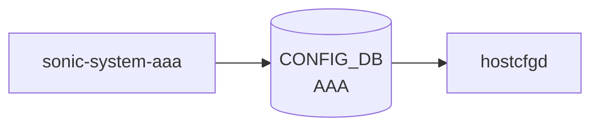

# sonic-system-aaa YANG

## 概要

- module: `sonic-system-aaa`
- namespace: `http://github.com/sonic-net/sonic-system-aaa`
- revision: `2021-10-12`
- import: `sonic-types`, `sonic-system-tacacs`
- top container: `sonic-system-aaa`

Authentication, Authorization, and Accounting ([AAA](../../reference/glossary.md#term-aaa)) [YANG](../../reference/glossary.md#term-yang) module for [SONiC](../../reference/glossary.md#term-sonic) OS.[^1]

<!-- yang-mermaid -->
### データフロー (自動生成)



!!! note "凡例"
    YANG モジュールから CONFIG_DB テーブル経由で subscribe する daemon/orch までを `docs/reference/config-db-orch-map.md` から機械生成したミニ図。詳細・例外は本ページ本文を参照。
<!-- /yang-mermaid -->

## 関連ページ

<!-- yang-xref -->

本 YANG モジュールに対応する CONFIG_DB / CLI / HLD / Topics への相互リンク。`inject_yang_xref.py` により自動生成されます。

### 対応 CONFIG_DB

- [`AAA`](../config-db/aaa.md)

### 関連 CLI

- [`config aaa`](../cli/config-aaa.md)

### 関連 HLD

- [AAA Improvements（PAM / NSS / D-Bus / RBAC 多重ロール）](../../management/aaa-improvements.md)
- [sonic-banner YANG](../../reference/yang/sonic-banner.md)
- [sonic-fips YANG](../../reference/yang/sonic-fips.md)
- [sonic-ntp YANG](../../reference/yang/sonic-ntp.md)
- [sonic-passwh YANG](../../reference/yang/sonic-passw-hardening.md)
- [sonic-snmp YANG](../../reference/yang/sonic-snmp.md)
- [sonic-ssh-server YANG](../../reference/yang/sonic-ssh-server.md)
- [発展トピック](../../topics/15-security-aaa/advanced.md)

<!-- /yang-xref -->

## ツリー

```text
module: sonic-system-aaa
  +--rw sonic-system-aaa
     +--rw AAA
        +--rw AAA_LIST* [type]
           +--rw type           enumeration
           +--rw login?         string
           +--rw failthrough?   stypes:boolean_type
           +--rw fallback?      stypes:boolean_type
           +--rw debug?         stypes:boolean_type
           +--rw trace?         stypes:boolean_type
```

## leaf 一覧

| leaf | パス | 型 | 必須 | デフォルト | enum / 範囲 / leafref | 説明 |
|------|------|----|------|-----------|----------------------|------|
| `type` | `sonic-system-aaa/AAA/AAA_LIST/type` | `enumeration` | yes |  | authentication, authorization, accounting | [AAA](../../reference/glossary.md#term-aaa) function type: authentication, authorization, or accounting. |
| `login` | `sonic-system-aaa/AAA/AAA_LIST/login` | `string` |  | local | pattern `((ldap|tacacs\+|local|radius|default),)*(ldap|tacacs\+|lo...` | Ordered list of authentication methods to attempt (radius, tacacs+, ldap, local, or default). |
| `failthrough` | `sonic-system-aaa/AAA/AAA_LIST/failthrough` | `stypes:boolean_type` |  | False |  | When true, authentication continues to the next method in the list upon failure. |
| `fallback` | `sonic-system-aaa/AAA/AAA_LIST/fallback` | `stypes:boolean_type` |  | False |  | When true, falls back to local authentication if all remote methods fail. |
| `debug` | `sonic-system-aaa/AAA/AAA_LIST/debug` | `stypes:boolean_type` |  | False |  | Enable or disable verbose [AAA](../../reference/glossary.md#term-aaa) debug logging. |
| `trace` | `sonic-system-aaa/AAA/AAA_LIST/trace` | `stypes:boolean_type` |  | False |  | Enable or disable AAA protocol packet tracing. |

## leafref / 依存

- なし（このモジュール内で直接 leafref を持つ leaf はない）

## augment / deviation

- なし

## 関連 CONFIG_DB / CLI

- [CONFIG_DB](../../reference/glossary.md#term-config_db): `AAA`
- CLI: `config aaa`

!!! note "TACPLUS / RADIUS について"
    `TACPLUS` / `TACPLUS_SERVER` テーブルは [`sonic-system-tacacs`](sonic-system-tacacs.md) が、`RADIUS` / `RADIUS_SERVER` テーブルは [`sonic-system-radius`](sonic-system-radius.md) が定義する。`sonic-system-aaa` 内の TACPLUS への参照は `must` 制約のクロスリファレンスであり、このモジュールはテーブル定義を持たない。

<!-- yang-sibling -->
### 関連 YANG モジュール

意味的に関連する SONiC YANG モジュール (slug prefix / curated group / frontmatter `related.yang` から自動抽出):

- [`sonic-system-radius`](sonic-system-radius.md)
- [`sonic-system-tacacs`](sonic-system-tacacs.md)
- [`sonic-system-ldap`](sonic-system-ldap.md)
- [`sonic-banner`](sonic-banner.md)
- [`sonic-device_metadata`](sonic-device_metadata.md)
<!-- /yang-sibling -->

<!-- ref-triangle:start -->

## 関連リファレンス

- CONFIG_DB: [`AAA`](../config-db/aaa.md)
- CLI: [`config aaa`](../cli/config-aaa.md)

<!-- ref-triangle:end -->

## 引用元

[^1]: `sonic-net/sonic-buildimage` `src/sonic-yang-models/yang-models/sonic-system-aaa.yang` @ `9ea932ec2e18f35e58268ec2e4456b1d4afd65cd`


<!-- topics-back-ref -->
## 関連 Topics

- [Topics: Security / AAA / FIPS / Hardening](../../topics/15-security-aaa/index.md)

<!-- /topics-back-ref -->

<!-- glossary-links-injected: 8ba32e5aa69d -->
