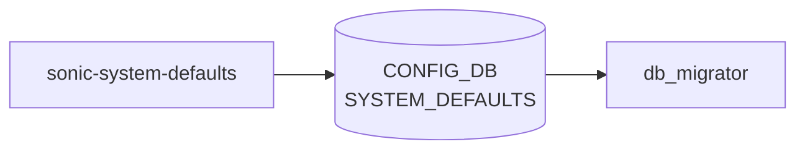

# sonic-system-defaults YANG

## 概要

- module: `sonic-system-defaults`
- namespace: `http://github.com/Azure/system-defaults`
- revision: なし（ソース YANG に revision ステートメント未定義）
- import: `sonic-types`
- top container: `sonic-system-defaults`

System-wide default feature settings [YANG](../../reference/glossary.md#term-yang) module for [SONiC](../../reference/glossary.md#term-sonic) OS[^1]。プラットフォーム/イメージレベルでオプション機能のデフォルト admin 状態を表す `SYSTEM_DEFAULTS` テーブルを保持する。

<!-- yang-mermaid -->
### データフロー (自動生成)



!!! note "凡例"
    YANG モジュールから CONFIG_DB テーブル経由で subscribe する daemon/orch までを `docs/reference/config-db-orch-map.md` から機械生成したミニ図。詳細・例外は本ページ本文を参照。
<!-- /yang-mermaid -->

## 関連ページ

<!-- yang-xref -->

本 YANG モジュールに対応する CONFIG_DB / CLI / HLD / Topics への相互リンク。`inject_yang_xref.py` により自動生成されます。

### 対応 CONFIG_DB

- [`SYSTEM_DEFAULTS`](../config-db/system-defaults.md)

### 関連 HLD

- [JSON Change Application（apply-change / table 単位 alphabetical 適用）](../../architecture/json-change-application.md)
- [reset-factory（keep-basic / keep-all-config / only-config）](../../architecture/reset-factory-design.md)
- [Generic Config Update / Rollback（GCU・JSON Patch・checkpoint）](../../architecture/sonic-generic-configuration-update-and-rollback.md)
- [CONFIG_DB の永続化が失敗する](../../reference/runbooks/config-db-persistence-failure.md)
- [config save 後に予期しない diff が出る](../../reference/runbooks/config-save-diff-unexpected.md)
- [CONFIG_DB save / load が反映されない](../../reference/runbooks/config-save-load.md)
- [config-setup サービス（first-boot config 生成 / 版間 migration）](../../system/sonic-configuration-setup-service.md)

### 関連 YANG

- [sonic-dns YANG](../../reference/yang/sonic-dns.md)
- [sonic-feature YANG](../../reference/yang/sonic-feature.md)

<!-- /yang-xref -->

## ツリー

```text
module: sonic-system-defaults
  +--rw sonic-system-defaults
     +--rw SYSTEM_DEFAULTS
        +--rw SYSTEM_DEFAULTS_LIST* [name]
           +--rw name      string
           +--rw status?   stypes:admin_mode
```

## leaf 一覧

| leaf | パス | 型 | 必須 | デフォルト | enum / 範囲 / leafref | 説明 |
|------|------|----|------|-----------|----------------------|------|
| `name` | `sonic-system-defaults/SYSTEM_DEFAULTS/SYSTEM_DEFAULTS_LIST/name` | `string` | yes |  |  | Name of the system feature |
| `status` | `sonic-system-defaults/SYSTEM_DEFAULTS/SYSTEM_DEFAULTS_LIST/status` | `stypes:admin_mode` |  |  | enabled, disabled | Default administrative state of the feature |

## leafref / 依存

- なし

## augment / deviation

- なし

## 関連 CONFIG_DB / CLI

- [CONFIG_DB](../../reference/glossary.md#term-config_db): `SYSTEM_DEFAULTS`
- CLI: なし（init_cfg / image 由来の不変設定として参照）

<!-- yang-sibling -->
### 関連 YANG モジュール

意味的に関連する SONiC YANG モジュール (slug prefix / curated group / frontmatter `related.yang` から自動抽出):

- [`sonic-banner`](sonic-banner.md)
- [`sonic-device_metadata`](sonic-device_metadata.md)
- [`sonic-feature`](sonic-feature.md)
- [`sonic-fips`](sonic-fips.md)
- [`sonic-kdump`](sonic-kdump.md)
<!-- /yang-sibling -->

<!-- ref-triangle:start -->

## 関連リファレンス

- [CONFIG_DB](../../reference/glossary.md#term-config_db): [`SYSTEM_DEFAULTS`](../config-db/system-defaults.md)

<!-- ref-triangle:end -->

## 引用元

[^1]: `sonic-net/sonic-buildimage` `src/sonic-yang-models/yang-models/sonic-system-defaults.yang` @ `9ea932ec2e18f35e58268ec2e4456b1d4afd65cd`

<!-- glossary-links-injected: 8ba32e5aa69d -->
