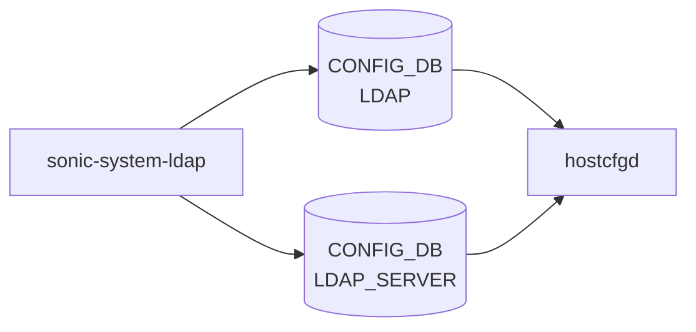

# sonic-system-ldap YANG

## 概要

- module: `sonic-system-ldap`
- namespace: `http://github.com/Azure/sonic-system-ldap`
- revision: `2023-10-01`
- import: `ietf-inet-types`
- top container: `sonic-system-ldap`

Lightweight Directory Access Protocol (LDAP) authentication YANG module for SONiC OS.[^1]

<!-- yang-mermaid -->
### データフロー (自動生成)



!!! note "凡例"
    YANG モジュールから CONFIG_DB テーブル経由で subscribe する daemon/orch までを `docs/reference/config-db-orch-map.md` から機械生成したミニ図。詳細・例外は本ページ本文を参照。
<!-- /yang-mermaid -->

## ツリー

```
module: sonic-system-ldap
  +--rw sonic-system-ldap
     +--rw LDAP_SERVER
     |  +--rw LDAP_SERVER_LIST* [hostname]   (max-elements 8)
     |     +--rw hostname    inet:host
     |     +--rw priority?   uint8
     +--rw LDAP
        +--rw global
           +--rw bind_dn?         string
           +--rw bind_password?   string
           +--rw bind_timeout?    uint16
           +--rw version?         uint16
           +--rw base_dn?         string
           +--rw port?            inet:port-number
           +--rw timeout?         uint16
```

## leaf 一覧

| leaf | パス | 型 | 必須 | デフォルト | enum / 範囲 / leafref | 説明 |
|------|------|----|------|-----------|----------------------|------|
| `hostname` | `sonic-system-ldap/LDAP_SERVER/LDAP_SERVER_LIST/hostname` | `inet:host` | yes |  |  | LDAP server's Domain name or IP address (IPv4 or IPv6). |
| `priority` | `sonic-system-ldap/LDAP_SERVER/LDAP_SERVER_LIST/priority` | `uint8` |  | `1` | range 1..8 | Server selection priority; higher values are tried first. |
| `bind_dn` | `sonic-system-ldap/LDAP/global/bind_dn` | `string` |  |  | length 1..65 | Distinguished name used to bind to the LDAP server. |
| `bind_password` | `sonic-system-ldap/LDAP/global/bind_password` | `string` |  |  | length 1..65, pattern `[^ #,]*` | Password used to authenticate the bind DN with the LDAP server. |
| `bind_timeout` | `sonic-system-ldap/LDAP/global/bind_timeout` | `uint16` |  | `5` | range 1..120 | Timeout in seconds for LDAP bind operations. |
| `version` | `sonic-system-ldap/LDAP/global/version` | `uint16` |  | `3` | range 1..3 | LDAP protocol version. |
| `base_dn` | `sonic-system-ldap/LDAP/global/base_dn` | `string` |  |  | length 1..65 | Base distinguished name for LDAP user searches. |
| `port` | `sonic-system-ldap/LDAP/global/port` | `inet:port-number` |  | `389` |  | TCP port to communicate with LDAP server. |
| `timeout` | `sonic-system-ldap/LDAP/global/timeout` | `uint16` |  |  | range 1..60 | Timeout in seconds for LDAP search and query operations. |

## leafref / 依存

- なし
- `LDAP_SERVER_LIST` は最大 8 要素

## augment / deviation

- なし

## 関連 CONFIG_DB / CLI

- CONFIG_DB: `LDAP|global`, `LDAP_SERVER|<hostname>`
- CLI: `config ldap`

<!-- ref-triangle:start -->

## 関連リファレンス

- CONFIG_DB: `LDAP` / [`LDAP_SERVER`](../config-db/ldap-server.md)
- CLI: `config ldap`

<!-- ref-triangle:end -->

## 引用元

[^1]: `sonic-net/sonic-buildimage` `src/sonic-yang-models/yang-models/sonic-system-ldap.yang` @ `9ea932ec2e18f35e58268ec2e4456b1d4afd65cd`
