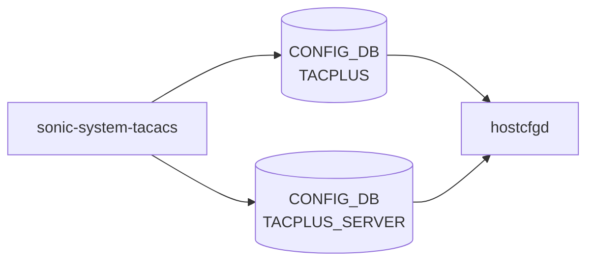

# sonic-system-tacacs YANG

## 概要

- module: `sonic-system-tacacs`
- namespace: `http://github.com/sonic-net/sonic-system-tacacs`
- revision: `2021-04-15`
- import: `ietf-inet-types`, `sonic-port`, `sonic-portchannel`, `sonic-loopback-interface`, `sonic-mgmt_port`
- top container: `sonic-system-tacacs`

Terminal Access Controller Access-Control System Plus (TACACS+) [YANG](../../reference/glossary.md#term-yang) module for [SONiC](../../reference/glossary.md#term-sonic) OS.[^1]

<!-- yang-mermaid -->
### データフロー (自動生成)



!!! note "凡例"
    YANG モジュールから CONFIG_DB テーブル経由で subscribe する daemon/orch までを `docs/reference/config-db-orch-map.md` から機械生成したミニ図。詳細・例外は本ページ本文を参照。
<!-- /yang-mermaid -->

## 関連ページ

<!-- yang-xref -->

本 YANG モジュールに対応する CONFIG_DB / CLI / HLD / Topics への相互リンク。`inject_yang_xref.py` により自動生成されます。

### 対応 CONFIG_DB

- [`TACPLUS_SERVER`](../config-db/tacplus-server.md)

### 関連 HLD

- [AAA Improvements（PAM / NSS / D-Bus / RBAC 多重ロール）](../../management/aaa-improvements.md)
- [sonic-system-aaa YANG](../../reference/yang/sonic-system-aaa.md)
- [発展トピック](../../topics/15-security-aaa/advanced.md)

<!-- /yang-xref -->

## typedef

- `auth_type_enumeration`: `pap`, `chap`, `mschap`, `login`
- `key_encrypt_type`: `boolean`（`true` = 暗号化済み鍵、`false` = 平文）

## ツリー

```text
module: sonic-system-tacacs
  +--rw sonic-system-tacacs
     +--rw TACPLUS_SERVER
     |  +--rw TACPLUS_SERVER_LIST* [ipaddress]   (max-elements 8)
     |     +--rw ipaddress     inet:host
     |     +--rw priority?     uint8
     |     +--rw tcp_port?     inet:port-number
     |     +--rw timeout?      uint16
     |     +--rw auth_type?    auth_type_enumeration
     |     +--rw key_encrypt?  key_encrypt_type
     |     +--rw passkey?      string
     |     +--rw vrf?          string
     +--rw TACPLUS
        +--rw global
           +--rw auth_type?    auth_type_enumeration
           +--rw timeout?      uint16
           +--rw key_encrypt?  key_encrypt_type
           +--rw passkey?      string
           +--rw src_intf?     union
```

## leaf 一覧

| leaf | パス | 型 | 必須 | デフォルト | enum / 範囲 / leafref | 説明 |
|------|------|----|------|-----------|----------------------|------|
| `ipaddress` | `sonic-system-tacacs/TACPLUS_SERVER/TACPLUS_SERVER_LIST/ipaddress` | `inet:host` | yes |  |  | TACACS+ server's Domain name or IP address (IPv4 or IPv6). |
| `priority` | `sonic-system-tacacs/TACPLUS_SERVER/TACPLUS_SERVER_LIST/priority` | `uint8` |  | `1` | range 1..64 | Server selection priority; higher values are tried first. |
| `tcp_port` | `sonic-system-tacacs/TACPLUS_SERVER/TACPLUS_SERVER_LIST/tcp_port` | `inet:port-number` |  | `49` |  | TCP port used to communicate with this TACACS+ server. |
| `timeout` | `sonic-system-tacacs/TACPLUS_SERVER/TACPLUS_SERVER_LIST/timeout` | `uint16` |  | `5` | range 1..60 | Per-server response timeout in seconds. |
| `auth_type` | `sonic-system-tacacs/TACPLUS_SERVER/TACPLUS_SERVER_LIST/auth_type` | `auth_type_enumeration` |  | `pap` | `pap`, `chap`, `mschap`, `login` | Per-server authentication protocol. |
| `key_encrypt` | `sonic-system-tacacs/TACPLUS_SERVER/TACPLUS_SERVER_LIST/key_encrypt` | `boolean` |  | `false` |  | Indicates whether the per-server passkey is stored encrypted. |
| `passkey` | `sonic-system-tacacs/TACPLUS_SERVER/TACPLUS_SERVER_LIST/passkey` | `string` |  |  | length 1..256, pattern `[^ #,]*` | Per-server shared secret overriding the global passkey. |
| `vrf` | `sonic-system-tacacs/TACPLUS_SERVER/TACPLUS_SERVER_LIST/vrf` | `string` |  |  | pattern `mgmt\|default` | [VRF](../../reference/glossary.md#term-vrf) used to reach this TACACS+ server. |
| `auth_type` | `sonic-system-tacacs/TACPLUS/global/auth_type` | `auth_type_enumeration` |  | `pap` | `pap`, `chap`, `mschap`, `login` | Default authentication protocol for TACACS+ communication. |
| `timeout` | `sonic-system-tacacs/TACPLUS/global/timeout` | `uint16` |  | `5` | range 1..60 | Default timeout in seconds for TACACS+ server responses. |
| `key_encrypt` | `sonic-system-tacacs/TACPLUS/global/key_encrypt` | `boolean` |  | `false` |  | Indicates whether the global passkey is stored encrypted. |
| `passkey` | `sonic-system-tacacs/TACPLUS/global/passkey` | `string` |  |  | length 1..256, pattern `[^ #,]*` | Default shared secret for authenticating TACACS+ server communication. |
| `src_intf` | `sonic-system-tacacs/TACPLUS/global/src_intf` | `union` |  |  | leafref(PORT, PORTCHANNEL, LOOPBACK_INTERFACE, MGMT_PORT) or `Vlan<id>` | Source interface whose IP address is used for outgoing TACACS+ packets. |

## leafref / 依存

- `TACPLUS/global/src_intf` → `sonic-port`, `sonic-portchannel`, `sonic-loopback-interface`, `sonic-mgmt_port` 各 LIST/name
- `TACPLUS_SERVER_LIST` は最大 8 要素

## augment / deviation

- なし

## 関連 CONFIG_DB / CLI

- [CONFIG_DB](../../reference/glossary.md#term-config_db): `TACPLUS|global`, `TACPLUS_SERVER|<ipaddress>`
- CLI: `config tacacs`

<!-- yang-sibling -->
### 関連 YANG モジュール

意味的に関連する SONiC YANG モジュール (slug prefix / curated group / frontmatter `related.yang` から自動抽出):

- [`sonic-port`](sonic-port.md)
- [`sonic-portchannel`](sonic-portchannel.md)
- [`sonic-loopback-interface`](sonic-loopback-interface.md)
- [`sonic-mgmt_port`](sonic-mgmt_port.md)
- [`sonic-system-aaa`](sonic-system-aaa.md)
<!-- /yang-sibling -->

<!-- ref-triangle:start -->

## 関連リファレンス

- [CONFIG_DB](../../reference/glossary.md#term-config_db): `TACPLUS` / [`TACPLUS_SERVER`](../config-db/tacplus-server.md)
- CLI: `config tacacs`

<!-- ref-triangle:end -->

## 引用元

[^1]: `sonic-net/sonic-buildimage` `src/sonic-yang-models/yang-models/sonic-system-tacacs.yang` @ `9ea932ec2e18f35e58268ec2e4456b1d4afd65cd`

<!-- glossary-links-injected: 8ba32e5aa69d -->
