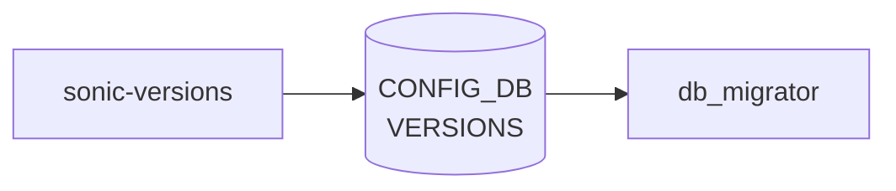

# sonic-versions YANG

## 概要

- module: `sonic-versions`
- namespace: `http://github.com/sonic-net/sonic-versions`
- revision: `2020-04-10`
- import: なし
- top container: `sonic-versions`

VERSIONS [YANG](../../reference/glossary.md#term-yang) Module for SONiC OS. [CONFIG_DB](../../reference/glossary.md#term-config_db) のスキーマバージョンを記録し、`db_migrator.py` がマイグレーションの判定に使う。[^1]

<!-- yang-mermaid -->
### データフロー (自動生成)



!!! note "凡例"
    YANG モジュールから CONFIG_DB テーブル経由で subscribe する daemon/orch までを `docs/reference/config-db-orch-map.md` から機械生成したミニ図。詳細・例外は本ページ本文を参照。
<!-- /yang-mermaid -->

## 関連ページ

<!-- yang-xref -->

本 [YANG](../../reference/glossary.md#term-yang) モジュールに対応する CONFIG_DB / CLI / [HLD](../../reference/glossary.md#term-hld) / Topics への相互リンク。`inject_yang_xref.py` により自動生成されます。

### 関連 HLD

- [設定 / 運用](../../topics/19-build-packaging/operations.md)

<!-- /yang-xref -->

## ツリー

```
module: sonic-versions
  +--rw sonic-versions
     +--rw VERSIONS
        +--rw DATABASE
           +--rw VERSION?   string
```

## leaf 一覧

| leaf | パス | 型 | 必須 | デフォルト | enum / 範囲 / leafref | 説明 |
|------|------|----|------|-----------|----------------------|------|
| `VERSION` | `sonic-versions/VERSIONS/DATABASE/VERSION` | `string` |  |  | length 1..255; pattern `version_(...)` (例: `version_4_0_5`) | Database schema version string. |

## leafref / 依存

- なし

## augment / deviation

- なし

## 関連 CONFIG_DB / CLI

- [CONFIG_DB](../../reference/glossary.md#term-config_db): `VERSIONS|DATABASE` キーで `VERSION` フィールドを保持

<!-- ref-triangle:start -->

## 関連リファレンス

- [CONFIG_DB](../../reference/glossary.md#term-config_db): `VERSIONS`

<!-- ref-triangle:end -->

## 引用元

[^1]: `sonic-net/sonic-buildimage` `src/sonic-yang-models/yang-models/sonic-versions.yang` @ `9ea932ec2e18f35e58268ec2e4456b1d4afd65cd`

<!-- glossary-links-injected: 26ca9e81c971 -->
