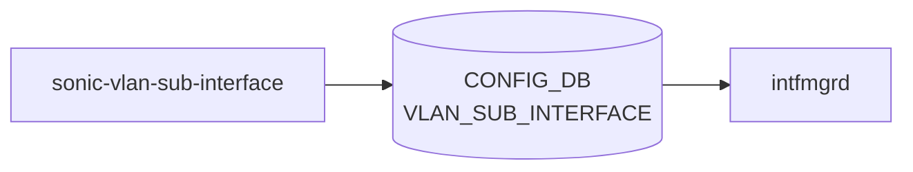

# sonic-vlan-sub-interface YANG

## 概要

- module: `sonic-vlan-sub-interface`
- namespace: `http://github.com/sonic-net/sonic-vlan-sub-interface`
- revision: `2025-03-06`
- import: `sonic-types`, `sonic-port`, `sonic-portchannel`, `sonic-vrf`, `sonic-vnet`
- top container: `sonic-vlan-sub-interface`

[VLAN](../../reference/glossary.md#term-vlan) sub-interface configuration for dot1q encapsulated sub-ports on physical or [PortChannel](../../reference/glossary.md#term-portchannel) interfaces[^1]

<!-- yang-mermaid -->
### データフロー (自動生成)



!!! note "凡例"
    YANG モジュールから CONFIG_DB テーブル経由で subscribe する daemon/orch までを `docs/reference/config-db-orch-map.md` から機械生成したミニ図。詳細・例外は本ページ本文を参照。
<!-- /yang-mermaid -->

## 関連ページ

<!-- yang-xref -->

本 YANG モジュールに対応する CONFIG_DB / CLI / HLD / Topics への相互リンク。`inject_yang_xref.py` により自動生成されます。

### 対応 CONFIG_DB

- [`VLAN_SUB_INTERFACE`](../config-db/vlan-sub-interface.md)

### 関連 YANG

- [sonic-loopback-interface YANG](../../reference/yang/sonic-loopback-interface.md)

<!-- /yang-xref -->

## ツリー

```text
module: sonic-vlan-sub-interface
  +--rw sonic-vlan-sub-interface
     +--rw VLAN_SUB_INTERFACE
        +--rw VLAN_SUB_INTERFACE_LIST* [name]
        |  +--rw name               string
        |  +--rw admin_status?      stypes:admin_status
        |  +--rw vrf_name?          -> /vrf:sonic-vrf/VRF/VRF_LIST/name
        |  +--rw vnet_name?         -> /svnet:sonic-vnet/VNET/VNET_LIST/name
        |  +--rw loopback_action?   stypes:loopback_action
        |  +--rw vlan?              uint16
        +--rw VLAN_SUB_INTERFACE_IPPREFIX_LIST* [name ip-prefix]
           +--rw name         -> ../../VLAN_SUB_INTERFACE_LIST/name
           +--rw ip-prefix    stypes:sonic-ip-prefix
```

## container / list 一覧

| 種別 | パス | key | 説明 |
|------|------|-----|------|
| `container` | `sonic-vlan-sub-interface` |  |  |
| `container` | `sonic-vlan-sub-interface/VLAN_SUB_INTERFACE` |  | [VLAN](../../reference/glossary.md#term-vlan) sub-interface configuration table for dot1q encapsulated sub-ports |
| `list` | `sonic-vlan-sub-interface/VLAN_SUB_INTERFACE/VLAN_SUB_INTERFACE_LIST` | `name` | Configuration entry for a [VLAN](../../reference/glossary.md#term-vlan) sub-interface including VLAN encapsulation and [VRF](../../reference/glossary.md#term-vrf) binding |
| `list` | `sonic-vlan-sub-interface/VLAN_SUB_INTERFACE/VLAN_SUB_INTERFACE_IPPREFIX_LIST` | `name ip-prefix` | IP address prefix assignment for a VLAN sub-interface |

## leaf 一覧

| leaf | パス | 型 | 必須 | デフォルト | enum / 範囲 / leafref | 説明 |
|------|------|----|------|-----------|----------------------|------|
| `name` | `sonic-vlan-sub-interface/VLAN_SUB_INTERFACE/VLAN_SUB_INTERFACE_LIST/name` | `string` | yes |  | pattern `(\w+)\.([1-9][0-9]{0,2}\|[1-3][0-9]{3}\|[4][0][0-8][0-9]\|[4][0][9][0-4])` | Sub-interface name in the format ParentInterface.VlanID (e.g. Ethernet0.100 or Eth0.100) |
| `admin_status` | `sonic-vlan-sub-interface/VLAN_SUB_INTERFACE/VLAN_SUB_INTERFACE_LIST/admin_status` | `stypes:admin_status` |  |  |  | Administrative state of the VLAN sub-interface |
| `vrf_name` | `sonic-vlan-sub-interface/VLAN_SUB_INTERFACE/VLAN_SUB_INTERFACE_LIST/vrf_name` | `leafref` |  |  | /vrf:sonic-vrf/vrf:[VRF](../../reference/glossary.md#term-vrf)/vrf:VRF_LIST/vrf:name | [VRF](../../reference/glossary.md#term-vrf) instance to which this sub-interface is bound |
| `vnet_name` | `sonic-vlan-sub-interface/VLAN_SUB_INTERFACE/VLAN_SUB_INTERFACE_LIST/vnet_name` | `leafref` |  |  | /svnet:sonic-vnet/svnet:[VNET](../../reference/glossary.md#term-vnet)/svnet:VNET_LIST/svnet:name | Reference to the name of a [VNET](../../reference/glossary.md#term-vnet) in sonic-vnet model |
| `loopback_action` | `sonic-vlan-sub-interface/VLAN_SUB_INTERFACE/VLAN_SUB_INTERFACE_LIST/loopback_action` | `stypes:loopback_action` |  |  |  | Packet action when a packet ingress and gets routed on the same IP interface |
| `vlan` | `sonic-vlan-sub-interface/VLAN_SUB_INTERFACE/VLAN_SUB_INTERFACE_LIST/vlan` | `uint16` |  |  | range `1..4094` | 802.1Q VLAN ID for encapsulation on this sub-interface |
| `name` | `sonic-vlan-sub-interface/VLAN_SUB_INTERFACE/VLAN_SUB_INTERFACE_IPPREFIX_LIST/name` | `leafref` | yes |  | ../../VLAN_SUB_INTERFACE_LIST/name | Reference to the parent VLAN sub-interface |
| `ip-prefix` | `sonic-vlan-sub-interface/VLAN_SUB_INTERFACE/VLAN_SUB_INTERFACE_IPPREFIX_LIST/ip-prefix` | `stypes:sonic-ip-prefix` | yes |  |  | IPv4 or IPv6 address with prefix length assigned to the sub-interface |

## leafref / 依存

- `sonic-vlan-sub-interface/VLAN_SUB_INTERFACE/VLAN_SUB_INTERFACE_LIST/vrf_name` → `/vrf:sonic-vrf/vrf:VRF/vrf:VRF_LIST/vrf:name`
- `sonic-vlan-sub-interface/VLAN_SUB_INTERFACE/VLAN_SUB_INTERFACE_LIST/vnet_name` → `/svnet:sonic-vnet/svnet:VNET/svnet:VNET_LIST/svnet:name`
- `sonic-vlan-sub-interface/VLAN_SUB_INTERFACE/VLAN_SUB_INTERFACE_IPPREFIX_LIST/name` → `../../VLAN_SUB_INTERFACE_LIST/name`

## augment / deviation

- なし

## 関連 CONFIG_DB / CLI

- [CONFIG_DB](../../reference/glossary.md#term-config_db): `VLAN_SUB_INTERFACE`
- CLI: `config subinterface`
- CLI: `show subinterfaces`

<!-- yang-sibling -->
### 関連 YANG モジュール

意味的に関連する SONiC YANG モジュール (slug prefix / curated group / frontmatter `related.yang` から自動抽出):

- [`sonic-port`](sonic-port.md)
- [`sonic-portchannel`](sonic-portchannel.md)
- [`sonic-vrf`](sonic-vrf.md)
- [`sonic-vnet`](sonic-vnet.md)
- [`sonic-breakout_cfg`](sonic-breakout_cfg.md)
<!-- /yang-sibling -->

<!-- ref-triangle:start -->

## 関連リファレンス

- [CONFIG_DB](../../reference/glossary.md#term-config_db): [`VLAN_SUB_INTERFACE`](../config-db/vlan-sub-interface.md)
- CLI: `config subinterface` / `show subinterfaces`

<!-- ref-triangle:end -->

## 引用元

[^1]: `sonic-net/sonic-buildimage` `src/sonic-yang-models/yang-models/sonic-vlan-sub-interface.yang` @ `9ea932ec2e18f35e58268ec2e4456b1d4afd65cd`

<!-- topics-back-ref -->
## 関連 Topics

- [Topics: L2 / VLAN / LAG / MC-LAG](../../topics/06-l2-vlan-lag/index.md)

<!-- /topics-back-ref -->

<!-- glossary-links-injected: 20dbc11976b6 -->
