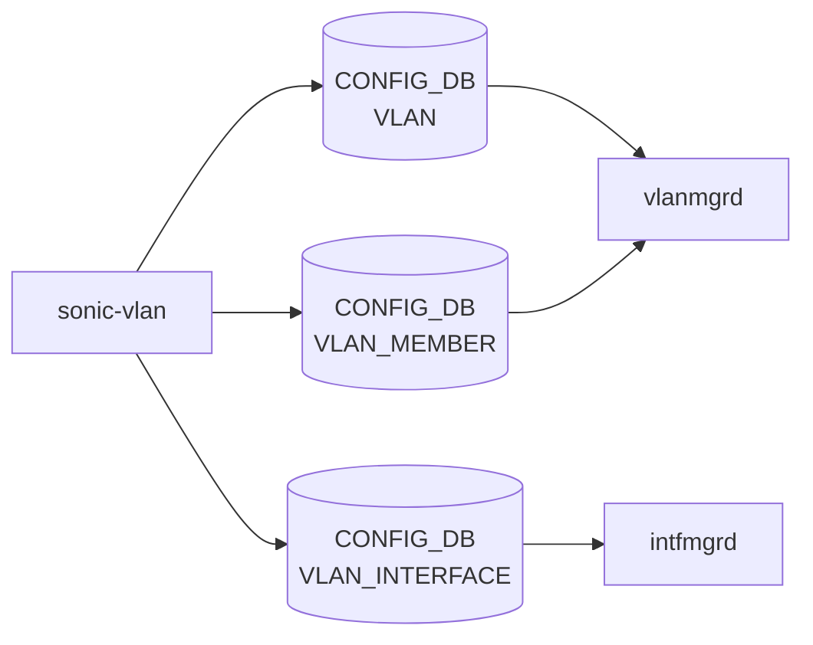

# sonic-vlan YANG

## 概要

- module: `sonic-vlan`
- namespace: `http://github.com/sonic-net/sonic-vlan`
- revision: `2025-03-06`
- import: `ietf-inet-types`, `ietf-yang-types`, `sonic-types`, `sonic-port`, `sonic-portchannel`, `sonic-vrf`, `sonic-mirror-session`, `sonic-interface`, `sonic-vnet`
- top container: `sonic-vlan`

[VLAN](../../reference/glossary.md#term-vlan) yang Module for [SONiC](../../reference/glossary.md#term-sonic) OS[^1]

<!-- yang-mermaid -->
### データフロー (自動生成)



!!! note "凡例"
    YANG モジュールから CONFIG_DB テーブル経由で subscribe する daemon/orch までを `docs/reference/config-db-orch-map.md` から機械生成したミニ図。詳細・例外は本ページ本文を参照。
<!-- /yang-mermaid -->

## 関連ページ

<!-- yang-xref -->

本 YANG モジュールに対応する CONFIG_DB / CLI / HLD / Topics への相互リンク。`inject_yang_xref.py` により自動生成されます。

### 対応 CONFIG_DB

- [`VLAN`](../config-db/vlan.md)
- [`VLAN_INTERFACE`](../config-db/vlan-interface.md)
- [`VLAN_MEMBER`](../config-db/vlan-member.md)

### 関連 CLI

- [`config vlan`](../cli/config-vlan.md)

### 関連 HLD

- [sonic-port YANG](../../reference/yang/sonic-port.md)

<!-- /yang-xref -->

## ツリー

```text
module: sonic-vlan
  +--rw sonic-vlan
     +--rw VLAN_INTERFACE
     |  +--rw VLAN_INTERFACE_LIST* [name]
     |  |  +--rw name                        -> /sonic-vlan/VLAN/VLAN_LIST/name
     |  |  +--rw vrf_name?                   -> /vrf:sonic-vrf/VRF/VRF_LIST/name
     |  |  +--rw vnet_name?                  -> /svnet:sonic-vnet/VNET/VNET_LIST/name
     |  |  +--rw nat_zone?                   uint8
     |  |  +--rw mpls?                       enumeration
     |  |  +--rw grat_arp?                   string
     |  |  +--rw proxy_arp?                  string
     |  |  +--rw ipv6_use_link_local_only?   stypes:mode-status
     |  |  +--rw mac_addr?                   yang:mac-address
     |  |  +--rw loopback_action?            stypes:loopback_action
     |  +--rw VLAN_INTERFACE_IPPREFIX_LIST* [name ip-prefix]
     |     +--rw name         -> /sonic-vlan/VLAN/VLAN_LIST/name
     |     +--rw ip-prefix    union
     |     +--rw scope?       enumeration
     |     +--rw family?      stypes:ip-family
     |     +--rw secondary?   boolean
     +--rw VLAN
     |  +--rw VLAN_LIST* [name]
     |     +--rw name              string
     |     +--rw vlanid?           uint16
     |     +--rw alias?            string
     |     +--rw description?      string
     |     +--rw dhcp_servers*     inet:ip-address
     |     +--rw dhcpv6_servers*   inet:ipv6-address
     |     +--rw mtu?              uint16
     |     +--rw admin_status?     stypes:admin_status
     |     +--rw mac?              yang:mac-address
     +--rw VLAN_MEMBER
        +--rw VLAN_MEMBER_LIST* [name port]
           +--rw name            -> /sonic-vlan/VLAN/VLAN_LIST/name
           +--rw port            union
           +--rw tagging_mode    stypes:vlan_tagging_mode
```

## leaf 一覧

| leaf | パス | 型 | 必須 | デフォルト | enum / 範囲 / leafref | 説明 |
|------|------|----|------|-----------|----------------------|------|
| `name` | `sonic-vlan/VLAN_INTERFACE/VLAN_INTERFACE_LIST/name` | `leafref` | yes |  | /vlan:sonic-vlan/vlan:[VLAN](../../reference/glossary.md#term-vlan)/vlan:VLAN_LIST/vlan:name | [VLAN](../../reference/glossary.md#term-vlan) interface name (e.g., Vlan100) |
| `vrf_name` | `sonic-vlan/VLAN_INTERFACE/VLAN_INTERFACE_LIST/vrf_name` | `leafref` |  |  | /vrf:sonic-vrf/vrf:[VRF](../../reference/glossary.md#term-vrf)/vrf:VRF_LIST/vrf:name | [VRF](../../reference/glossary.md#term-vrf) instance this VLAN interface belongs to |
| `vnet_name` | `sonic-vlan/VLAN_INTERFACE/VLAN_INTERFACE_LIST/vnet_name` | `leafref` |  |  | /svnet:sonic-vnet/svnet:[VNET](../../reference/glossary.md#term-vnet)/svnet:VNET_LIST/svnet:name | Reference to the name of a [VNET](../../reference/glossary.md#term-vnet) in sonic-vnet model |
| `nat_zone` | `sonic-vlan/VLAN_INTERFACE/VLAN_INTERFACE_LIST/nat_zone` | `uint8` |  | 0 | range 0..3 | [NAT](../../reference/glossary.md#term-nat) Zone for the vlan interface |
| `mpls` | `sonic-vlan/VLAN_INTERFACE/VLAN_INTERFACE_LIST/mpls` | `enumeration` |  |  | enable, disable | Enable/disable [MPLS](../../reference/glossary.md#term-mpls) routing for the vlan interface |
| `grat_arp` | `sonic-vlan/VLAN_INTERFACE/VLAN_INTERFACE_LIST/grat_arp` | `string` |  |  | pattern `enabled|disabled` | Enable or disable gratuitous [ARP](../../reference/glossary.md#term-arp) on the VLAN interface |
| `proxy_arp` | `sonic-vlan/VLAN_INTERFACE/VLAN_INTERFACE_LIST/proxy_arp` | `string` |  |  | pattern `enabled|disabled` | Enable or disable proxy [ARP](../../reference/glossary.md#term-arp) on the VLAN interface |
| `ipv6_use_link_local_only` | `sonic-vlan/VLAN_INTERFACE/VLAN_INTERFACE_LIST/ipv6_use_link_local_only` | `stypes:mode-status` |  | disable |  | Enable/Disable IPv6 link local address on vlan interface |
| `mac_addr` | `sonic-vlan/VLAN_INTERFACE/VLAN_INTERFACE_LIST/mac_addr` | `yang:mac-address` |  |  |  | Assign administrator-provided MAC address to Interface |
| `loopback_action` | `sonic-vlan/VLAN_INTERFACE/VLAN_INTERFACE_LIST/loopback_action` | `stypes:loopback_action` |  |  |  | Packet action when a packet ingress and gets routed on the same IP interface |
| `name` | `sonic-vlan/VLAN_INTERFACE/VLAN_INTERFACE_IPPREFIX_LIST/name` | `leafref` | yes |  | /vlan:sonic-vlan/vlan:VLAN/vlan:VLAN_LIST/vlan:name | VLAN interface name (e.g., Vlan100) |
| `ip-prefix` | `sonic-vlan/VLAN_INTERFACE/VLAN_INTERFACE_IPPREFIX_LIST/ip-prefix` | `union` | yes |  | union(stypes:sonic-ip4-prefix, stypes:sonic-ip6-prefix) | IP address and prefix length assigned to the VLAN interface |
| `scope` | `sonic-vlan/VLAN_INTERFACE/VLAN_INTERFACE_IPPREFIX_LIST/scope` | `enumeration` |  |  | global, local | Address scope, either global or link-local |
| `family` | `sonic-vlan/VLAN_INTERFACE/VLAN_INTERFACE_IPPREFIX_LIST/family` | `stypes:ip-family` |  |  |  | Address family (IPv4 or IPv6) |
| `secondary` | `sonic-vlan/VLAN_INTERFACE/VLAN_INTERFACE_IPPREFIX_LIST/secondary` | `boolean` |  |  |  | Optional field to specify if the prefix is secondary subnet |
| `name` | `sonic-vlan/VLAN/VLAN_LIST/name` | `string` | yes |  | pattern `Vlan(409[0-5]|40[0-8][0-9]|[1-3][0-9]{3}|[1-9][0-9]{2}|[1...` | VLAN name in the form VlanNNN (e.g., Vlan100) |
| `vlanid` | `sonic-vlan/VLAN/VLAN_LIST/vlanid` | `uint16` |  |  | range 2..4094 | IEEE 802.1Q VLAN identifier (2-4094) |
| `alias` | `sonic-vlan/VLAN/VLAN_LIST/alias` | `string` |  |  |  | User-defined alias for the VLAN |
| `description` | `sonic-vlan/VLAN/VLAN_LIST/description` | `string` |  |  | length 1..255 |  |
| `dhcp_servers` | `sonic-vlan/VLAN/VLAN_LIST/dhcp_servers` | `inet:ip-address` |  |  |  | Configure the dhcp v4 servers |
| `dhcpv6_servers` | `sonic-vlan/VLAN/VLAN_LIST/dhcpv6_servers` | `inet:ipv6-address` |  |  |  | Configure the dhcp v6 servers |
| `mtu` | `sonic-vlan/VLAN/VLAN_LIST/mtu` | `uint16` |  |  | range 1..9216 |  |
| `admin_status` | `sonic-vlan/VLAN/VLAN_LIST/admin_status` | `stypes:admin_status` |  |  |  |  |
| `mac` | `sonic-vlan/VLAN/VLAN_LIST/mac` | `yang:mac-address` |  |  |  |  |
| `name` | `sonic-vlan/VLAN_MEMBER/VLAN_MEMBER_LIST/name` | `leafref` | yes |  | /vlan:sonic-vlan/vlan:VLAN/vlan:VLAN_LIST/vlan:name | VLAN name this member belongs to |
| `port` | `sonic-vlan/VLAN_MEMBER/VLAN_MEMBER_LIST/port` | `union` | yes |  | union(leafref, leafref) | Physical port or port channel assigned to this VLAN |
| `tagging_mode` | `sonic-vlan/VLAN_MEMBER/VLAN_MEMBER_LIST/tagging_mode` | `stypes:vlan_tagging_mode` | yes |  |  | Whether frames on this port are IEEE 802.1Q tagged or untagged |

## leafref / 依存

- `sonic-vlan/VLAN_INTERFACE/VLAN_INTERFACE_LIST/name` → `/vlan:sonic-vlan/vlan:VLAN/vlan:VLAN_LIST/vlan:name`
- `sonic-vlan/VLAN_INTERFACE/VLAN_INTERFACE_LIST/vrf_name` → `/vrf:sonic-vrf/vrf:VRF/vrf:VRF_LIST/vrf:name`
- `sonic-vlan/VLAN_INTERFACE/VLAN_INTERFACE_LIST/vnet_name` → `/svnet:sonic-vnet/svnet:VNET/svnet:VNET_LIST/svnet:name`
- `sonic-vlan/VLAN_INTERFACE/VLAN_INTERFACE_IPPREFIX_LIST/name` → `/vlan:sonic-vlan/vlan:VLAN/vlan:VLAN_LIST/vlan:name`
- `sonic-vlan/VLAN_MEMBER/VLAN_MEMBER_LIST/name` → `/vlan:sonic-vlan/vlan:VLAN/vlan:VLAN_LIST/vlan:name`

## augment / deviation

- なし

## 関連 CONFIG_DB / CLI

- [CONFIG_DB](../../reference/glossary.md#term-config_db): `VLAN`
- [CONFIG_DB](../../reference/glossary.md#term-config_db): `VLAN_INTERFACE`
- [CONFIG_DB](../../reference/glossary.md#term-config_db): `VLAN_MEMBER`
- CLI: `config vlan`

<!-- yang-sibling -->
### 関連 YANG モジュール

意味的に関連する SONiC YANG モジュール (slug prefix / curated group / frontmatter `related.yang` から自動抽出):

- [`sonic-port`](sonic-port.md)
- [`sonic-portchannel`](sonic-portchannel.md)
- [`sonic-breakout_cfg`](sonic-breakout_cfg.md)
- [`sonic-fabric-port`](sonic-fabric-port.md)
- [`sonic-interface`](sonic-interface.md)
<!-- /yang-sibling -->

<!-- ref-triangle:start -->

## 関連リファレンス

- CONFIG_DB: [`VLAN`](../config-db/vlan.md) / [`VLAN_INTERFACE`](../config-db/vlan-interface.md) / [`VLAN_MEMBER`](../config-db/vlan-member.md)
- CLI: [`config vlan`](../cli/config-vlan.md)

<!-- ref-triangle:end -->

## 引用元

[^1]: `sonic-net/sonic-buildimage` `src/sonic-yang-models/yang-models/sonic-vlan.yang` @ `9ea932ec2e18f35e58268ec2e4456b1d4afd65cd`


<!-- topics-back-ref -->
## 関連 Topics

- [Topics: L2 / VLAN / LAG / MC-LAG](../../topics/06-l2-vlan-lag/index.md)

<!-- /topics-back-ref -->

<!-- glossary-links-injected: 8ba32e5aa69d -->
