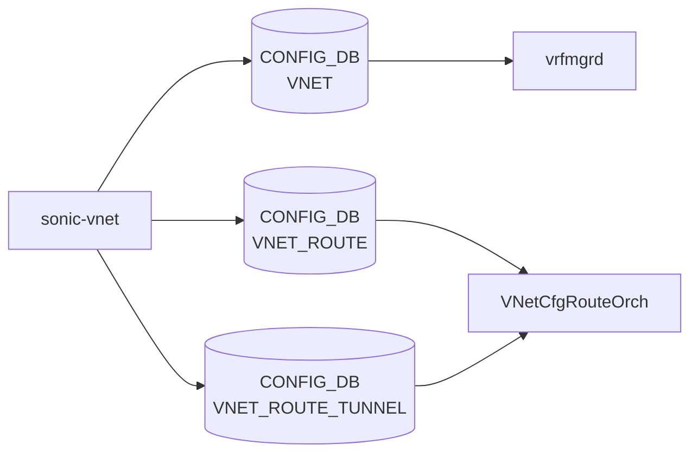

# sonic-vnet YANG

## 概要

- module: `sonic-vnet`
- namespace: `http://github.com/sonic-net/sonic-vnet`
- revision: `2023-04-25`
- import: `ietf-yang-types`, `ietf-inet-types`, `sonic-types`, `sonic-vxlan`
- top container: `sonic-vnet`

Virtual Network ([VNET](../../reference/glossary.md#term-vnet)) configuration for overlay networking using VxLAN tunnels[^1]

<!-- yang-mermaid -->
### データフロー (自動生成)



!!! note "凡例"
    YANG モジュールから CONFIG_DB テーブル経由で subscribe する daemon/orch までを `docs/reference/config-db-orch-map.md` から機械生成したミニ図。詳細・例外は本ページ本文を参照。
<!-- /yang-mermaid -->

## 関連ページ

<!-- yang-xref -->

本 YANG モジュールに対応する CONFIG_DB / CLI / HLD / Topics への相互リンク。`inject_yang_xref.py` により自動生成されます。

### 対応 CONFIG_DB

- [`VNET`](../config-db/vnet.md)
- [`VNET_ROUTE`](../config-db/vnet-route.md)

### 関連 CLI

- [`config vnet`](../cli/config-vnet.md)

<!-- /yang-xref -->

## ツリー

```text
module: sonic-vnet
  +--rw sonic-vnet
     +--rw VNET
     |  +--rw VNET_LIST* [name]
     |     +--rw name                string
     |     +--rw vxlan_tunnel        -> /svxlan:sonic-vxlan/VXLAN_TUNNEL/VXLAN_TUNNEL_LIST/name
     |     +--rw vni                 stypes:vnid_type
     |     +--rw peer_list?          string
     |     +--rw guid?               string
     |     +--rw scope?              string
     |     +--rw advertise_prefix?   boolean
     |     +--rw overlay_dmac?       yang:mac-address
     |     +--rw src_mac?            yang:mac-address
     +--rw VNET_ROUTE
     |  +--rw VNET_ROUTE_LIST* [vnet_name prefix]
     |     +--rw vnet_name    -> /sonic-vnet/VNET/VNET_LIST/name
     |     +--rw prefix       stypes:sonic-ip4-prefix
     |     +--rw nexthop      stypes:ipv4-address-list
     |     +--rw ifname       string
     +--rw VNET_ROUTE_TUNNEL
        +--rw VNET_ROUTE_TUNNEL_LIST* [vnet_name prefix]
           +--rw vnet_name                     -> /sonic-vnet/VNET/VNET_LIST/name
           +--rw prefix                        stypes:sonic-ip4-prefix
           +--rw endpoint                      stypes:ipv4-address-list
           +--rw mac_address?                  stypes:mac-address-list
           +--rw vni?                          stypes:vnid-list
           +--rw consistent_hashing_buckets?   uint16
           +--rw metric?                       uint8
```

## container / list 一覧

| 種別 | パス | key | 説明 |
|------|------|-----|------|
| `container` | `sonic-vnet` |  |  |
| `container` | `sonic-vnet/VNET` |  | Virtual Network configuration table for overlay networking |
| `list` | `sonic-vnet/VNET/VNET_LIST` | `name` | Configuration entry for a Virtual Network instance |
| `container` | `sonic-vnet/VNET_ROUTE` |  | Static routes within a virtual network |
| `list` | `sonic-vnet/VNET_ROUTE/VNET_ROUTE_LIST` | `vnet_name prefix` | Static route entry within a virtual network |
| `container` | `sonic-vnet/VNET_ROUTE_TUNNEL` |  | Tunnel-encapsulated routes within a virtual network |
| `list` | `sonic-vnet/VNET_ROUTE_TUNNEL/VNET_ROUTE_TUNNEL_LIST` | `vnet_name prefix` | Tunnel-encapsulated route entry for overlay traffic within a virtual network |

## leaf 一覧

| leaf | パス | 型 | 必須 | デフォルト | enum / 範囲 / leafref | 説明 |
|------|------|----|------|-----------|----------------------|------|
| `name` | `sonic-vnet/VNET/VNET_LIST/name` | `string` | yes |  | length `1..255` | Unique alphanumeric name identifying the virtual network |
| `vxlan_tunnel` | `sonic-vnet/VNET/VNET_LIST/vxlan_tunnel` | `leafref` | yes |  | /svxlan:sonic-vxlan/svxlan:VXLAN_TUNNEL/svxlan:VXLAN_TUNNEL_LIST/svxlan:name | A valid and active vxlan tunnel to be used with this vnet for traffic encapsulation. |
| `vni` | `sonic-vnet/VNET/VNET_LIST/vni` | `stypes:vnid_type` | yes |  |  | A valid and unique vni which will become part of the encapsulated traffic header. |
| `peer_list` | `sonic-vnet/VNET/VNET_LIST/peer_list` | `string` |  |  |  | Set of peers |
| `guid` | `sonic-vnet/VNET/VNET_LIST/guid` | `string` |  |  | length `1..255` | An optional guid. |
| `scope` | `sonic-vnet/VNET/VNET_LIST/scope` | `string` |  |  | pattern `default` | can only be default. |
| `advertise_prefix` | `sonic-vnet/VNET/VNET_LIST/advertise_prefix` | `boolean` |  |  |  | Flag to enable advertisement of route prefixes belonging to the Vnet. |
| `overlay_dmac` | `sonic-vnet/VNET/VNET_LIST/overlay_dmac` | `yang:mac-address` |  |  |  | Overlay Dest MAC address to be used by Vnet ping. |
| `src_mac` | `sonic-vnet/VNET/VNET_LIST/src_mac` | `yang:mac-address` |  |  |  | source mac address for the Vnet |
| `vnet_name` | `sonic-vnet/VNET_ROUTE/VNET_ROUTE_LIST/vnet_name` | `leafref` | yes |  | /svnet:sonic-vnet/svnet:[VNET](../../reference/glossary.md#term-vnet)/svnet:VNET_LIST/svnet:name | [VNET](../../reference/glossary.md#term-vnet) name |
| `prefix` | `sonic-vnet/VNET_ROUTE/VNET_ROUTE_LIST/prefix` | `stypes:sonic-ip4-prefix` | yes |  |  | IPv4 prefix in CIDR format |
| `nexthop` | `sonic-vnet/VNET_ROUTE/VNET_ROUTE_LIST/nexthop` | `stypes:ipv4-address-list` | yes |  |  | Nexthop IP addresses |
| `ifname` | `sonic-vnet/VNET_ROUTE/VNET_ROUTE_LIST/ifname` | `string` | yes |  |  | Interface names |
| `vnet_name` | `sonic-vnet/VNET_ROUTE_TUNNEL/VNET_ROUTE_TUNNEL_LIST/vnet_name` | `leafref` | yes |  | /svnet:sonic-vnet/svnet:VNET/svnet:VNET_LIST/svnet:name | VNET name |
| `prefix` | `sonic-vnet/VNET_ROUTE_TUNNEL/VNET_ROUTE_TUNNEL_LIST/prefix` | `stypes:sonic-ip4-prefix` | yes |  |  | IPv4 prefix in CIDR format |
| `endpoint` | `sonic-vnet/VNET_ROUTE_TUNNEL/VNET_ROUTE_TUNNEL_LIST/endpoint` | `stypes:ipv4-address-list` | yes |  |  | Endpoint/nexthop tunnel IPs |
| `mac_address` | `sonic-vnet/VNET_ROUTE_TUNNEL/VNET_ROUTE_TUNNEL_LIST/mac_address` | `stypes:mac-address-list` |  |  |  | Inner dest macs in encapsulated packet |
| `vni` | `sonic-vnet/VNET_ROUTE_TUNNEL/VNET_ROUTE_TUNNEL_LIST/vni` | `stypes:vnid-list` |  |  |  | Valid and active vni values in encapsulated packet |
| `consistent_hashing_buckets` | `sonic-vnet/VNET_ROUTE_TUNNEL/VNET_ROUTE_TUNNEL_LIST/consistent_hashing_buckets` | `uint16` |  |  |  | Number of consistent hashing buckets to use, if consistent hashing is desired |
| `metric` | `sonic-vnet/VNET_ROUTE_TUNNEL/VNET_ROUTE_TUNNEL_LIST/metric` | `uint8` |  |  |  | Value that can be set to categorize or determine the type of route. This value does not affect route behavior. |

## leafref / 依存

- `sonic-vnet/VNET/VNET_LIST/vxlan_tunnel` → `/svxlan:sonic-vxlan/svxlan:VXLAN_TUNNEL/svxlan:VXLAN_TUNNEL_LIST/svxlan:name`
- `sonic-vnet/VNET_ROUTE/VNET_ROUTE_LIST/vnet_name` → `/svnet:sonic-vnet/svnet:VNET/svnet:VNET_LIST/svnet:name`
- `sonic-vnet/VNET_ROUTE_TUNNEL/VNET_ROUTE_TUNNEL_LIST/vnet_name` → `/svnet:sonic-vnet/svnet:VNET/svnet:VNET_LIST/svnet:name`

## augment / deviation

- なし

## 関連 CONFIG_DB / CLI

- [CONFIG_DB](../../reference/glossary.md#term-config_db): `VNET`
- [CONFIG_DB](../../reference/glossary.md#term-config_db): `VNET_ROUTE`
- [CONFIG_DB](../../reference/glossary.md#term-config_db): `VNET_ROUTE_TUNNEL`
- CLI: `config vnet`

<!-- yang-sibling -->
### 関連 YANG モジュール

意味的に関連する SONiC YANG モジュール (slug prefix / curated group / frontmatter `related.yang` から自動抽出):

- [`sonic-vxlan`](sonic-vxlan.md)
- [`sonic-mux-cable`](sonic-mux-cable.md)
- [`sonic-nvgre-tunnel`](sonic-nvgre-tunnel.md)
- [`sonic-srv6`](sonic-srv6.md)
- [`sonic-tunnel`](sonic-tunnel.md)
<!-- /yang-sibling -->

<!-- ref-triangle:start -->

## 関連リファレンス

- CONFIG_DB: [`VNET`](../config-db/vnet.md) / [`VNET_ROUTE`](../config-db/vnet-route.md) / [`VNET_ROUTE_TUNNEL`](../config-db/vnet-route.md)
- CLI: [`config vnet`](../cli/config-vnet.md)

<!-- ref-triangle:end -->

## 引用元

[^1]: `sonic-net/sonic-buildimage` `src/sonic-yang-models/yang-models/sonic-vnet.yang` @ `9ea932ec2e18f35e58268ec2e4456b1d4afd65cd`

<!-- glossary-links-injected: 26ca9e81c971 -->
