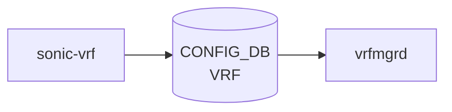

# sonic-vrf YANG

## 概要

- module: `sonic-vrf`
- namespace: `http://github.com/sonic-net/sonic-vrf`
- revision: `2021-03-30`
- import: `sonic-types`
- top container: `sonic-vrf`

Virtual Routing and Forwarding ([VRF](../../reference/glossary.md#term-vrf)) instance configuration for L3 traffic isolation[^1]

<!-- yang-mermaid -->
### データフロー (自動生成)



!!! note "凡例"
    YANG モジュールから CONFIG_DB テーブル経由で subscribe する daemon/orch までを `docs/reference/config-db-orch-map.md` から機械生成したミニ図。詳細・例外は本ページ本文を参照。
<!-- /yang-mermaid -->

## ツリー

```
module: sonic-vrf
  +--rw sonic-vrf
     +--rw VRF
        +--rw VRF_LIST* [name]
           +--rw name        stypes:interface_name
           +--rw fallback?   boolean
           +--rw vni?        uint32
```

## leaf 一覧

| leaf | パス | 型 | 必須 | デフォルト | enum / 範囲 / leafref | 説明 |
|------|------|----|------|-----------|----------------------|------|
| `name` | `sonic-vrf/VRF/VRF_LIST/name` | `stypes:interface_name` | yes |  | pattern `Vrf[a-zA-Z0-9_-]+` | VRF instance name (e.g. Vrf_blue) |
| `fallback` | `sonic-vrf/VRF/VRF_LIST/fallback` | `boolean` |  | false |  | Enable/disable fallback feature which is useful for specified VRF user to access internet through global/main route. |
| `vni` | `sonic-vrf/VRF/VRF_LIST/vni` | `uint32` |  | 0 | range 0..16777215 | VNI mapped to VRF |

## leafref / 依存

- なし（このモジュール内で直接 leafref を持つ leaf はない）

## augment / deviation

- なし

## 関連 CONFIG_DB / CLI

- [CONFIG_DB](../../reference/glossary.md#term-config_db): `VRF`
- CLI: `config vrf`

<!-- ref-triangle:start -->

## 関連リファレンス

- CONFIG_DB: [`VRF`](../config-db/vrf.md)
- CLI: [`config vrf`](../cli/config-vrf.md)

<!-- ref-triangle:end -->

## 引用元

[^1]: `sonic-net/sonic-buildimage` `src/sonic-yang-models/yang-models/sonic-vrf.yang` @ `9ea932ec2e18f35e58268ec2e4456b1d4afd65cd`

<!-- glossary-links-injected: 84c52960aadd -->
