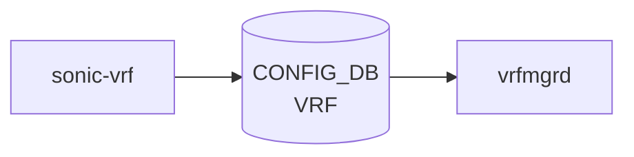

# sonic-vrf YANG

## 概要

- module: `sonic-vrf`
- namespace: `http://github.com/sonic-net/sonic-vrf`
- revision: `2021-03-30`
- import: `sonic-types`
- top container: `sonic-vrf`

Virtual Routing and Forwarding ([VRF](../../reference/glossary.md#term-vrf)) instance configuration for L3 traffic isolation[^1]

<!-- yang-mermaid -->
### データフロー (自動生成)



!!! note "凡例"
    YANG モジュールから CONFIG_DB テーブル経由で subscribe する daemon/orch までを `docs/reference/config-db-orch-map.md` から機械生成したミニ図。詳細・例外は本ページ本文を参照。
<!-- /yang-mermaid -->

## 関連ページ

<!-- yang-xref -->

本 YANG モジュールに対応する CONFIG_DB / CLI / HLD / Topics への相互リンク。`inject_yang_xref.py` により自動生成されます。

### 対応 CONFIG_DB

- [`VRF`](../config-db/vrf.md)

### 関連 CLI

- [`config vrf`](../cli/config-vrf.md)

### 関連 YANG

- [sonic-nat YANG](../../reference/yang/sonic-nat.md)
- [sonic-route-common YANG](../../reference/yang/sonic-route-common.md)
- [sonic-static-route YANG](../../reference/yang/sonic-static-route.md)

<!-- /yang-xref -->

## ツリー

```text
module: sonic-vrf
  +--rw sonic-vrf
     +--rw VRF
        +--rw VRF_LIST* [name]
           +--rw name        stypes:interface_name
           +--rw fallback?   boolean
           +--rw vni?        uint32
```

## container / list 一覧

| 種別 | パス | key | 説明 |
|------|------|-----|------|
| `container` | `sonic-vrf` |  |  |
| `container` | `sonic-vrf/VRF` |  | VRF instance configuration table |
| `list` | `sonic-vrf/VRF/VRF_LIST` | `name` | Configuration entry for a VRF instance |

## leaf 一覧

| leaf | パス | 型 | 必須 | デフォルト | enum / 範囲 / leafref | 説明 |
|------|------|----|------|-----------|----------------------|------|
| `name` | `sonic-vrf/VRF/VRF_LIST/name` | `stypes:interface_name` | yes |  | pattern `Vrf[a-zA-Z0-9_-]+` | [VRF](../../reference/glossary.md#term-vrf) instance name (e.g. Vrf_blue) |
| `fallback` | `sonic-vrf/VRF/VRF_LIST/fallback` | `boolean` |  | false |  | Enable/disable fallback feature which is useful for specified [VRF](../../reference/glossary.md#term-vrf) user to access internet through global/main route. |
| `vni` | `sonic-vrf/VRF/VRF_LIST/vni` | `uint32` |  | 0 | range 0..16777215 | VNI mapped to VRF |

## leafref / 依存

- なし（このモジュール内で直接 leafref を持つ leaf はない）

## augment / deviation

- なし

## 関連 CONFIG_DB / CLI

- [CONFIG_DB](../../reference/glossary.md#term-config_db): `VRF`
- CLI: `config vrf`

<!-- yang-sibling -->
### 関連 YANG モジュール

意味的に関連する SONiC YANG モジュール (slug prefix / curated group / frontmatter `related.yang` から自動抽出):

- [`sonic-mgmt_vrf`](sonic-mgmt_vrf.md)
- [`sonic-interface`](sonic-interface.md)
- [`sonic-route-common`](sonic-route-common.md)
- [`sonic-bgp-global`](sonic-bgp-global.md)
- [`sonic-loopback-interface`](sonic-loopback-interface.md)
<!-- /yang-sibling -->

<!-- ref-triangle:start -->

## 関連リファレンス

- [CONFIG_DB](../../reference/glossary.md#term-config_db): [`VRF`](../config-db/vrf.md)
- CLI: [`config vrf`](../cli/config-vrf.md)

<!-- ref-triangle:end -->

## 引用元

[^1]: `sonic-net/sonic-buildimage` `src/sonic-yang-models/yang-models/sonic-vrf.yang` @ `9ea932ec2e18f35e58268ec2e4456b1d4afd65cd`

<!-- glossary-links-injected: 20dbc11976b6 -->
