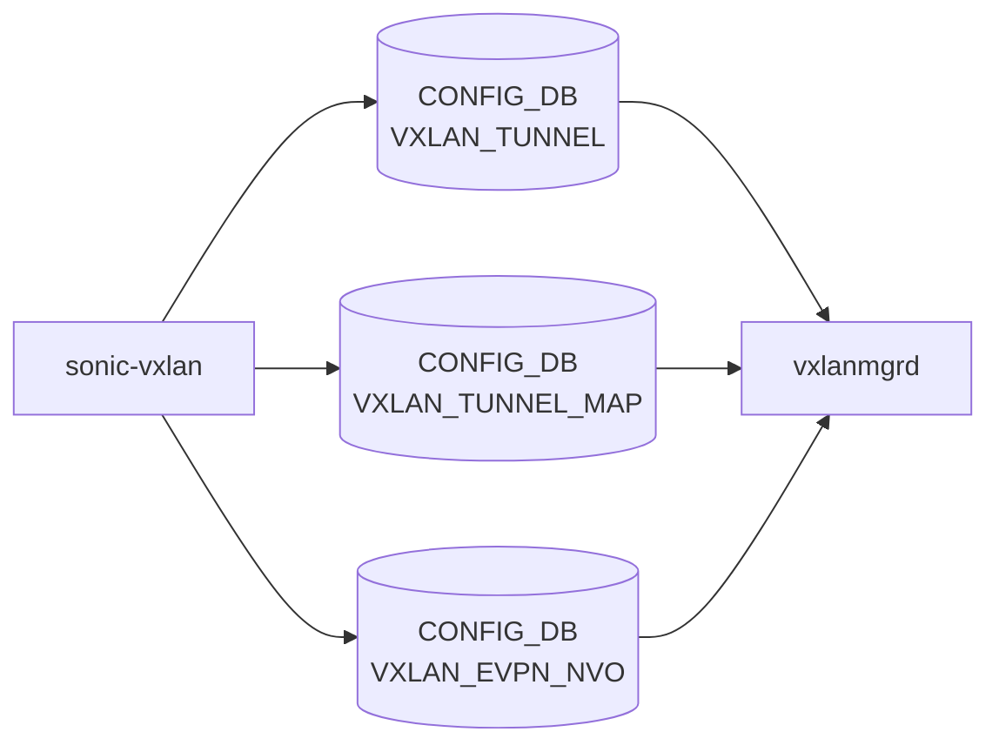

# sonic-vxlan YANG

## 概要

- module: `sonic-vxlan`
- namespace: `http://github.com/sonic-net/sonic-vxlan`
- revision: `2021-04-12`
- import: `ietf-inet-types`, `sonic-types`
- top container: `sonic-vxlan`

[VXLAN](../../reference/glossary.md#term-vxlan) tunnel and [EVPN](../../reference/glossary.md#term-evpn) NVO configuration for [SONiC](../../reference/glossary.md#term-sonic).[^1]

<!-- yang-mermaid -->
### データフロー (自動生成)



!!! note "凡例"
    YANG モジュールから CONFIG_DB テーブル経由で subscribe する daemon/orch までを `docs/reference/config-db-orch-map.md` から機械生成したミニ図。詳細・例外は本ページ本文を参照。
<!-- /yang-mermaid -->

## 関連ページ

<!-- yang-xref -->

本 YANG モジュールに対応する CONFIG_DB / CLI / HLD / Topics への相互リンク。`inject_yang_xref.py` により自動生成されます。

### 対応 CONFIG_DB

- [`VXLAN_TUNNEL`](../config-db/vxlan-tunnel.md)
- [`VXLAN_TUNNEL_MAP`](../config-db/vxlan-tunnel-map.md)
- [`VXLAN_EVPN_NVO`](../config-db/vxlan-evpn-nvo.md)

### 関連 CLI

- [`config vxlan`](../cli/config-vxlan.md)

### 関連 APPL_DB

- [TUNNEL_DECAP_TABLE (APPL_DB)](../../reference/config-db/tunnel-decap-table.md)

<!-- /yang-xref -->

## ツリー

```text
module: sonic-vxlan
  +--rw sonic-vxlan
     +--rw VXLAN_TUNNEL
     |  +--rw VXLAN_TUNNEL_LIST* [name]
     |     +--rw name        string
     |     +--rw src_ip?     inet:ip-address
     |     +--rw dst_ip?     inet:ip-address
     |     +--rw ttl_mode?   string
     +--rw VXLAN_TUNNEL_MAP
     |  +--rw VXLAN_TUNNEL_MAP_LIST* [name mapname]
     |     +--rw name       -> /sonic-vxlan/VXLAN_TUNNEL/VXLAN_TUNNEL_LIST/name
     |     +--rw mapname    string
     |     +--rw vlan       string
     |     +--rw vni        stypes:vnid_type
     +--rw VXLAN_EVPN_NVO
        +--rw VXLAN_EVPN_NVO_LIST* [name]
           +--rw name           string
           +--rw source_vtep    -> /sonic-vxlan/VXLAN_TUNNEL/VXLAN_TUNNEL_LIST/name
```

## leaf 一覧

| leaf | パス | 型 | 必須 | デフォルト | enum / 範囲 / leafref | 説明 |
|------|------|----|------|-----------|----------------------|------|
| `name` | `sonic-vxlan/VXLAN_TUNNEL/VXLAN_TUNNEL_LIST/name` | `string` | yes |  |  | [VXLAN](../../reference/glossary.md#term-vxlan) tunnel name. |
| `src_ip` | `sonic-vxlan/VXLAN_TUNNEL/VXLAN_TUNNEL_LIST/src_ip` | `inet:ip-address` |  |  |  | Source [VTEP](../../reference/glossary.md#term-vtep) IP address for tunnel origination. |
| `dst_ip` | `sonic-vxlan/VXLAN_TUNNEL/VXLAN_TUNNEL_LIST/dst_ip` | `inet:ip-address` |  |  |  | Destination [VTEP](../../reference/glossary.md#term-vtep) IP address for point-to-point tunnels. |
| `ttl_mode` | `sonic-vxlan/VXLAN_TUNNEL/VXLAN_TUNNEL_LIST/ttl_mode` | `string` |  |  | pattern `uniform|pipe` | Decap TTL mode |
| `name` | `sonic-vxlan/VXLAN_TUNNEL_MAP/VXLAN_TUNNEL_MAP_LIST/name` | `leafref` | yes |  | /svxlan:sonic-vxlan/svxlan:VXLAN_TUNNEL/svxlan:VXLAN_TUNNEL_LIST/svxlan:name | Reference to the parent [VXLAN](../../reference/glossary.md#term-vxlan) tunnel. |
| `mapname` | `sonic-vxlan/VXLAN_TUNNEL_MAP/VXLAN_TUNNEL_MAP_LIST/mapname` | `string` | yes |  |  | Name of the [VLAN](../../reference/glossary.md#term-vlan)-to-VNI mapping entry. |
| `vlan` | `sonic-vxlan/VXLAN_TUNNEL_MAP/VXLAN_TUNNEL_MAP_LIST/vlan` | `string` | yes |  | pattern `Vlan([0-9]{1,3}|[1-3][0-9]{3}|[4][0][0-8][0-9]|[4][0][9][...` | [VLAN](../../reference/glossary.md#term-vlan) associated with this mapping. |
| `vni` | `sonic-vxlan/VXLAN_TUNNEL_MAP/VXLAN_TUNNEL_MAP_LIST/vni` | `stypes:vnid_type` | yes |  |  | VXLAN Network Identifier mapped to the [VLAN](../../reference/glossary.md#term-vlan). |
| `name` | `sonic-vxlan/VXLAN_EVPN_NVO/VXLAN_EVPN_NVO_LIST/name` | `string` | yes |  |  | [EVPN](../../reference/glossary.md#term-evpn) NVO instance name. |
| `source_vtep` | `sonic-vxlan/VXLAN_EVPN_NVO/VXLAN_EVPN_NVO_LIST/source_vtep` | `leafref` | yes |  | /svxlan:sonic-vxlan/svxlan:VXLAN_TUNNEL/svxlan:VXLAN_TUNNEL_LIST/svxlan:name | Reference to the VXLAN tunnel used as the source [VTEP](../../reference/glossary.md#term-vtep). |

## leafref / 依存

- `sonic-vxlan/VXLAN_TUNNEL_MAP/VXLAN_TUNNEL_MAP_LIST/name` → `/svxlan:sonic-vxlan/svxlan:VXLAN_TUNNEL/svxlan:VXLAN_TUNNEL_LIST/svxlan:name`
- `sonic-vxlan/VXLAN_EVPN_NVO/VXLAN_EVPN_NVO_LIST/source_vtep` → `/svxlan:sonic-vxlan/svxlan:VXLAN_TUNNEL/svxlan:VXLAN_TUNNEL_LIST/svxlan:name`

## augment / deviation

- なし

## 関連 CONFIG_DB / CLI

- [CONFIG_DB](../../reference/glossary.md#term-config_db): `VXLAN_TUNNEL`
- [CONFIG_DB](../../reference/glossary.md#term-config_db): `VXLAN_TUNNEL_MAP`
- [CONFIG_DB](../../reference/glossary.md#term-config_db): `VXLAN_EVPN_NVO`
- CLI: `config vxlan`

<!-- yang-sibling -->
### 関連 YANG モジュール

意味的に関連する SONiC YANG モジュール (slug prefix / curated group / frontmatter `related.yang` から自動抽出):

- [`sonic-vlan`](sonic-vlan.md)
- [`sonic-vrf`](sonic-vrf.md)
- [`sonic-mux-cable`](sonic-mux-cable.md)
- [`sonic-nvgre-tunnel`](sonic-nvgre-tunnel.md)
- [`sonic-srv6`](sonic-srv6.md)
<!-- /yang-sibling -->

<!-- ref-triangle:start -->

## 関連リファレンス

- CONFIG_DB: [`VXLAN_TUNNEL`](../config-db/vxlan-tunnel.md) / [`VXLAN_TUNNEL_MAP`](../config-db/vxlan-tunnel-map.md) / [`VXLAN_EVPN_NVO`](../config-db/vxlan-evpn-nvo.md)
- CLI: [`config vxlan`](../cli/config-vxlan.md)

<!-- ref-triangle:end -->

## 引用元

[^1]: `sonic-net/sonic-buildimage` `src/sonic-yang-models/yang-models/sonic-vxlan.yang` @ `9ea932ec2e18f35e58268ec2e4456b1d4afd65cd`

<!-- glossary-links-injected: d8d5b6c68cde -->
