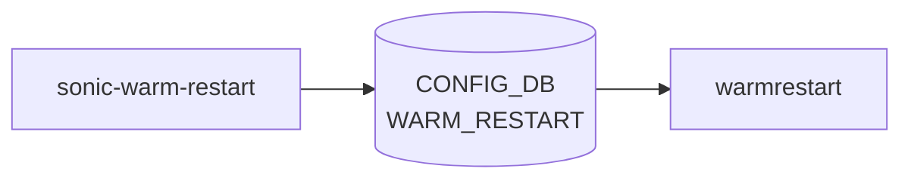

# sonic-warm-restart YANG

## 概要

- module: `sonic-warm-restart`
- namespace: `http://github.com/sonic-net/sonic-warm-restart`
- revision: `2021-05-24`
- import: なし
- top container: `sonic-warm-restart`

Warm restart configuration per module for hitless software upgrades[^1]。[BGP](../../reference/glossary.md#term-bgp) EOIU 信号と各 [syncd](../../reference/glossary.md#term-syncd) 系のタイマーをモジュール別に保持する。

<!-- yang-mermaid -->
### データフロー (自動生成)



!!! note "凡例"
    YANG モジュールから CONFIG_DB テーブル経由で subscribe する daemon/orch までを `docs/reference/config-db-orch-map.md` から機械生成したミニ図。詳細・例外は本ページ本文を参照。
<!-- /yang-mermaid -->

## 関連ページ

<!-- yang-xref -->

本 YANG モジュールに対応する CONFIG_DB / CLI / HLD / Topics への相互リンク。`inject_yang_xref.py` により自動生成されます。

### 対応 CONFIG_DB

- [`WARM_RESTART`](../config-db/warm-restart.md)

### 関連 CLI

- [`config warm_restart`](../cli/config-warm_restart.md)

### 関連 HLD

- [Smart Switch: DPU 独立アップグレード（gNOI 経路）](../../system/independent-dpu-upgrade.md)
- [Reboot-cause 履歴の STATE_DB / テレメトリ公開](../../system/reboot-cause-information-via-telemetry-agent.md)
- [reboot コマンドの blocking mode（reboot.conf / -b / -v）](../../system/reboot-support-blockingmode-in-sonic.md)
- [SmartSwitch reboot 順序（NPU → 各 DPU の gNOI HALT → PCI detach → 個別 reboot）](../../system/smart-switch-reboot-high-level-design.md)

<!-- /yang-xref -->

## ツリー

```text
module: sonic-warm-restart
  +--rw sonic-warm-restart
     +--rw WARM_RESTART
        +--rw WARM_RESTART_LIST* [module]
           +--rw module              module-name
           +--rw bgp_eoiu?           boolean
           +--rw bgp_timer?          uint16
           +--rw teamsyncd_timer?    uint16
           +--rw neighsyncd_timer?   uint16
```

## leaf 一覧

| leaf | パス | 型 | 必須 | デフォルト | enum / 範囲 / leafref | 説明 |
|------|------|----|------|-----------|----------------------|------|
| `module` | `sonic-warm-restart/WARM_RESTART/WARM_RESTART_LIST/module` | `module-name` | yes |  | system, bgp, [teamd](../../reference/glossary.md#term-teamd-teamsyncd-teammgrd), swss, [syncd](../../reference/glossary.md#term-syncd), natsyncd, etc. | Name of the module |
| `bgp_eoiu` | `sonic-warm-restart/WARM_RESTART/WARM_RESTART_LIST/bgp_eoiu` | `boolean` |  | false |  | [BGP](../../reference/glossary.md#term-bgp) End-of-Initial Update (EOIU) signal enable/disable |
| `bgp_timer` | `sonic-warm-restart/WARM_RESTART/WARM_RESTART_LIST/bgp_timer` | `uint16` |  |  | range 1..3600 | [BGP](../../reference/glossary.md#term-bgp) graceful restart timer (seconds) |
| `teamsyncd_timer` | `sonic-warm-restart/WARM_RESTART/WARM_RESTART_LIST/teamsyncd_timer` | `uint16` |  |  | range 1..3600 | teamsyncd warm restart timer (seconds) |
| `neighsyncd_timer` | `sonic-warm-restart/WARM_RESTART/WARM_RESTART_LIST/neighsyncd_timer` | `uint16` |  |  | range 1..9999 | [neighsyncd](../../reference/glossary.md#term-neighsyncd) warm restart timer (seconds) |

## leafref / 依存

- なし

## augment / deviation

- なし

## 関連 CONFIG_DB / CLI

- [CONFIG_DB](../../reference/glossary.md#term-config_db): `WARM_RESTART`
- CLI: `config warm_restart`

<!-- yang-sibling -->
### 関連 YANG モジュール

意味的に関連する SONiC YANG モジュール (slug prefix / curated group / frontmatter `related.yang` から自動抽出):

- [`sonic-feature`](sonic-feature.md)
- [`sonic-banner`](sonic-banner.md)
- [`sonic-device_metadata`](sonic-device_metadata.md)
- [`sonic-fips`](sonic-fips.md)
- [`sonic-kdump`](sonic-kdump.md)
<!-- /yang-sibling -->

<!-- ref-triangle:start -->

## 関連リファレンス

- [CONFIG_DB](../../reference/glossary.md#term-config_db): [`WARM_RESTART`](../config-db/warm-restart.md)
- CLI: [`config warm_restart`](../cli/config-warm_restart.md)

<!-- ref-triangle:end -->

## 引用元

[^1]: `sonic-net/sonic-buildimage` `src/sonic-yang-models/yang-models/sonic-warm-restart.yang` @ `9ea932ec2e18f35e58268ec2e4456b1d4afd65cd`

<!-- glossary-links-injected: 20dbc11976b6 -->
