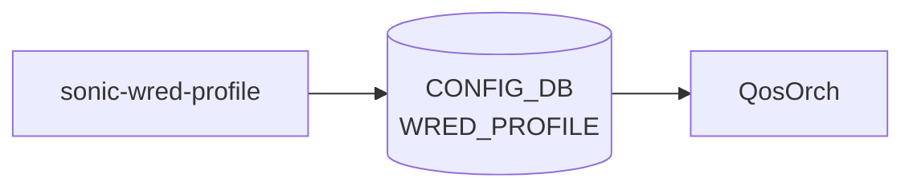

# sonic-wred-profile YANG

## 概要

- module: `sonic-wred-profile`
- namespace: `http://github.com/sonic-net/sonic-wred-profile`
- revision: `2021-04-01`
- import: なし
- top container: `sonic-wred-profile`

Weighted Random Early Detection ([WRED](../../reference/glossary.md#term-wred)) プロファイルを名前付きで保持する。色 (green/yellow/red) 毎の min/max 閾値、ドロップ確率、 [ECN](../../reference/glossary.md#term-ecn) 有効化、 [WRED](../../reference/glossary.md#term-wred) 有効化を保持する[^1]。

<!-- yang-mermaid -->
### データフロー (自動生成)



!!! note "凡例"
    YANG モジュールから CONFIG_DB テーブル経由で subscribe する daemon/orch までを `docs/reference/config-db-orch-map.md` から機械生成したミニ図。詳細・例外は本ページ本文を参照。
<!-- /yang-mermaid -->

## 関連ページ

<!-- yang-xref -->

本 YANG モジュールに対応する CONFIG_DB / CLI / HLD / Topics への相互リンク。`inject_yang_xref.py` により自動生成されます。

### 対応 CONFIG_DB

- [`WRED_PROFILE`](../config-db/wred-profile.md)

### 関連 CLI

- [`config qos`](../cli/config-qos.md)

<!-- /yang-xref -->

## ツリー

```text
module: sonic-wred-profile
  +--rw sonic-wred-profile
     +--rw WRED_PROFILE
        +--rw WRED_PROFILE_LIST* [name]
           +--rw name                       string
           +--rw yellow_min_threshold?      uint64
           +--rw green_min_threshold?       uint64
           +--rw red_min_threshold?         uint64
           +--rw yellow_max_threshold?      uint64
           +--rw green_max_threshold?       uint64
           +--rw red_max_threshold?         uint64
           +--rw ecn?                       enumeration
           +--rw wred_green_enable?         boolean
           +--rw wred_yellow_enable?        boolean
           +--rw wred_red_enable?           boolean
           +--rw yellow_drop_probability?   uint64
           +--rw green_drop_probability?    uint64
           +--rw red_drop_probability?      uint64
```

## leaf 一覧

| leaf | パス | 型 | 必須 | デフォルト | enum / 範囲 / leafref / 制約 | 説明 |
|------|------|----|------|-----------|----------------------|------|
| `name` | `sonic-wred-profile/WRED_PROFILE/WRED_PROFILE_LIST/name` | `string` | yes | — | pattern `[a-zA-Z0-9]{1}([-a-zA-Z0-9_]{0,31})`, length 1..32 | [WRED](../../reference/glossary.md#term-wred) profile name |
| `yellow_min_threshold` | `sonic-wred-profile/WRED_PROFILE/WRED_PROFILE_LIST/yellow_min_threshold` | `uint64` |  | — | units `bytes` | Queue depth (bytes) at which WRED begins dropping yellow packets |
| `green_min_threshold` | `sonic-wred-profile/WRED_PROFILE/WRED_PROFILE_LIST/green_min_threshold` | `uint64` |  | — | units `bytes` | Queue depth (bytes) at which WRED begins dropping green packets |
| `red_min_threshold` | `sonic-wred-profile/WRED_PROFILE/WRED_PROFILE_LIST/red_min_threshold` | `uint64` |  | — | units `bytes` | Queue depth (bytes) at which WRED begins dropping red packets |
| `yellow_max_threshold` | `sonic-wred-profile/WRED_PROFILE/WRED_PROFILE_LIST/yellow_max_threshold` | `uint64` |  | — | units `bytes`, must `current() >= ../yellow_min_threshold` | Queue depth (bytes) at which WRED drops all yellow packets |
| `green_max_threshold` | `sonic-wred-profile/WRED_PROFILE/WRED_PROFILE_LIST/green_max_threshold` | `uint64` |  | — | units `bytes`, must `current() >= ../green_min_threshold` | Queue depth (bytes) at which WRED drops all green packets |
| `red_max_threshold` | `sonic-wred-profile/WRED_PROFILE/WRED_PROFILE_LIST/red_max_threshold` | `uint64` |  | — | units `bytes`, must `current() >= ../red_min_threshold` | Queue depth (bytes) at which WRED drops all red packets |
| `ecn` | `sonic-wred-profile/WRED_PROFILE/WRED_PROFILE_LIST/ecn` | `enumeration` |  | `ecn_none` | ecn_none, ecn_green, ecn_yellow, ecn_red, ecn_green_yellow, ecn_green_red, ecn_yellow_red, ecn_all | [ECN](../../reference/glossary.md#term-ecn) marking mode |
| `wred_green_enable` | `sonic-wred-profile/WRED_PROFILE/WRED_PROFILE_LIST/wred_green_enable` | `boolean` |  | `false` |  | Enable WRED for green traffic |
| `wred_yellow_enable` | `sonic-wred-profile/WRED_PROFILE/WRED_PROFILE_LIST/wred_yellow_enable` | `boolean` |  | `false` |  | Enable WRED for yellow traffic |
| `wred_red_enable` | `sonic-wred-profile/WRED_PROFILE/WRED_PROFILE_LIST/wred_red_enable` | `boolean` |  | `false` |  | Enable WRED for red traffic |
| `yellow_drop_probability` | `sonic-wred-profile/WRED_PROFILE/WRED_PROFILE_LIST/yellow_drop_probability` | `uint64` |  | `100` | range 0..100, units `percent` | Max drop probability between min/max thresholds (yellow) |
| `green_drop_probability` | `sonic-wred-profile/WRED_PROFILE/WRED_PROFILE_LIST/green_drop_probability` | `uint64` |  | `100` | range 0..100, units `percent` | Max drop probability between min/max thresholds (green) |
| `red_drop_probability` | `sonic-wred-profile/WRED_PROFILE/WRED_PROFILE_LIST/red_drop_probability` | `uint64` |  | `100` | range 0..100, units `percent` | Max drop probability between min/max thresholds (red) |

!!! note "制約 (must / pattern)"
    - `name` は英数字始まり 1〜32 文字 (`[a-zA-Z0-9]{1}([-a-zA-Z0-9_]{0,31})`)。違反時 `wred-profile-name-invalid-length` を返す[^1]。
    - `{color}_max_threshold` は同色の `{color}_min_threshold` 以上でなければならない (`must` 制約、3 色それぞれ独立に評価)[^1]。
    - `{color}_drop_probability` の単位は percent。未設定時は `100` (= 閾値間で常にドロップ) として扱われる[^1]。

## leafref / 依存

- なし（`WRED_PROFILE` の名前は `QUEUE` テーブル側の `wred_profile` から leafref で参照される）

## augment / deviation

- なし

## 関連 CONFIG_DB / CLI

- [CONFIG_DB](../../reference/glossary.md#term-config_db): `WRED_PROFILE`
- CLI: `config qos`, `show qos`

<!-- yang-sibling -->
### 関連 YANG モジュール

意味的に関連する SONiC YANG モジュール (slug prefix / curated group / frontmatter `related.yang` から自動抽出):

- [`sonic-queue`](sonic-queue.md)
- [`sonic-port-qos-map`](sonic-port-qos-map.md)
- [`sonic-buffer-pg`](sonic-buffer-pg.md)
- [`sonic-buffer-pool`](sonic-buffer-pool.md)
- [`sonic-buffer-profile`](sonic-buffer-profile.md)
<!-- /yang-sibling -->

<!-- ref-triangle:start -->

## 関連リファレンス

- [CONFIG_DB](../../reference/glossary.md#term-config_db): [`WRED_PROFILE`](../config-db/wred-profile.md)
- CLI: [`config qos`](../cli/config-qos.md) / `show qos`

<!-- ref-triangle:end -->

## 引用元

[^1]: `sonic-net/sonic-buildimage` `src/sonic-yang-models/yang-models/sonic-wred-profile.yang` @ `9ea932ec2e18f35e58268ec2e4456b1d4afd65cd`

<!-- glossary-links-injected: 27618ff2c697 -->
