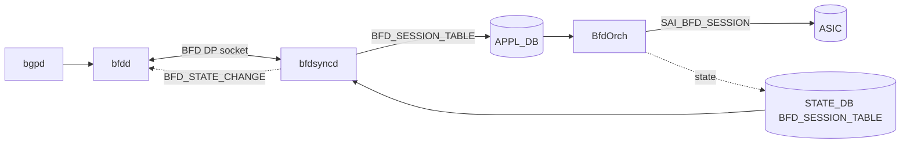

<!-- topics-tip -->
!!! tip "Topics で読み物として読む"
    この HLD は実装詳細を含みます。機能の概念・設定・運用を読み物として読みたい場合は [Topics 02 章: BGP と FRR 制御プレーン](../topics/02-bgp/index.md) を参照。
<!-- /topics-tip -->

!!! danger "裏取りステータス: Discrepancy-found"
    HLD で導入予定の `bfdsyncd` プロセスは現行 master の `sonic-buildimage/dockers/docker-fpm-frr/` に未取り込み（grep ヒット 0）。`FEATURE.bgp.bfd_hw_offload` フラグも supervisord テンプレートに見当たらない。`sonic-swss/orchagent/bfdorch.cpp` L420-466 では `SAI_BFD_SESSION_ATTR_LOCAL_DISCRIMINATOR` / `REMOTE_DISCRIMINATOR` / `MIN_TX` / `MIN_RX` / `MULTIPLIER` の **設定 (set)** は実装済みだが、HLD が要求する `SAI_BFD_SESSION_ATTR_REMOTE_MIN_TX` / `REMOTE_MIN_RX` / `REMOTE_MULTIPLIER` の **取得 (get) → STATE_DB 反映** ロジックは未取り込み（grep ヒット 0）。本ページは HLD 仕様としての参考情報に留まる（verified at: 2026-05-09）。

# BGP セッション向け BFD ハードウェアオフロード（bfdsyncd 経路）

## 概要

[FRR](../reference/glossary.md#term-frr)/bfdd の **[BFD](../reference/glossary.md#term-bfd) dataplane (DP) インターフェース** を経由して、[BGP](../reference/glossary.md#term-bgp) が要求した BFD セッションを [SONiC](../reference/glossary.md#term-sonic) の `BfdOrch` 経由でハードウェアオフロードする仕組み。SW BFD と比較して高速な障害検出と多数セッション収容を狙う[^1]。

新規コンポーネント `bfdsyncd` が bgp コンテナ内で動作し、`bfdd` の DP socket と [Redis](../reference/glossary.md#term-redis) (`APPL_DB` / `STATE_DB`) の両側を仲介する。



## 動作仕様

### bfdsyncd の責務

`bfdsyncd` は次の 3 種類の DP メッセージを処理する[^1]：

- `DP_ADD_SESSION`: bfdd からのセッション生成要求 → [APPL_DB](../reference/glossary.md#term-appl_db) の `BFD_SESSION_TABLE` に書き込み、BfdOrch にトリガ。
- `DP_DELETE_SESSION`: 削除要求 → APPL_DB から削除。
- `BFD_STATE_CHANGE`: BfdOrch からの状態変化（[STATE_DB](../reference/glossary.md#term-state_db) 経由）を bfdd に返送。bfdd は BGP に通知し、Down で BGP を IDLE に戻す。

`ECHO_REQUEST` / `ECHO_REPLY` / `DP_REQUEST_SESSION_COUNTERS` / `BFD_SESSION_COUNTERS` は **未サポート**[^1]。

### Local Discriminator のマッピング

`bfdd` と `BfdOrch` は独立に local discriminator を採番する。`bfdd` は乱数（≥ `0x10000`）、`BfdOrch` は 1 から連番。`bfdsyncd` は両者のキー対応表を保持し、状態通知時に正しい bfdd 側 ID へ翻訳する[^1]。

### `show bfd peers` のためのリモート情報

FRR の `show bfd peers` は remote discriminator / multiplier / RX/TX 間隔を表示する。これらは bfdd 側にしか無いが、HW offload では [SAI](../reference/glossary.md#term-sai) 側に取りに行く必要がある。[HLD](../reference/glossary.md#term-hld) は次の SAI 属性が将来追加されることを期待している（現状 SDK サポート任意）[^1]：

- `SAI_BFD_SESSION_ATTR_REMOTE_DISCRIMINATOR`
- `SAI_BFD_SESSION_ATTR_REMOTE_MULTIPLIER`
- `SAI_BFD_SESSION_ATTR_REMOTE_MIN_RX`
- `SAI_BFD_SESSION_ATTR_REMOTE_MIN_TX`

未対応 SDK でも BfdOrch がクラッシュしないこと、未取得時は `bfdsyncd` が `0` を bfdd に返すことが要件として明記されている。

### IPv6 link-local 対応

BGP unnumbered 経由の BFD では link-local アドレスを使うが、link-local はルーティング不能なので `bfdorch` は **inject-down モード（L2 直書き）** で BFD パケットを送る必要がある。これには送信元 MAC（`/sys/class/net/<ifname>/address`）と宛先 MAC（neighbor table から取得）が必要だが、`bfddp_session` 構造体には MAC を載せるフィールドが無い。**MAC 取得方法は HLD のスコープ外** で、実装側で工夫する必要があると明記されている[^1]。

<!-- evidence:
source: sonic-net/SONiC/doc/bfd/BFD HW Offload for BGP session HLD.md#L419-L439 (sha: 49bab5b5ff0e924f1ea52b3d9db0dfa4191a7c06)
excerpt: |
  When bgp use link local address to peer with remote system, it needs to specify interface index (and interface name) when create the bfd session. 
  ...
  How to get source mac address and destination mac address for IPv6 link local address is outside of the scope of this HLD, the implementation need to find a way to get these information.
reasoning: link-local シナリオでの inject-down モード要件と、MAC 取得が HLD スコープ外であることの根拠。
-->

<!-- evidence-rendered:start -->
??? note "📋 検証エビデンス: sonic-net/SONiC/doc/bfd/BFD HW Offload for BGP session HLD.md#L419-L439 (sha: 49bab5b5ff0e924f1ea52b3d9db0dfa4191a7c06)"

    **出典**:

    `sonic-net/SONiC/doc/bfd/BFD HW Offload for BGP session HLD.md#L419-L439 (sha: 49bab5b5ff0e924f1ea52b3d9db0dfa4191a7c06)`

    **抜粋**:

    ```text
    When bgp use link local address to peer with remote system, it needs to specify interface index (and interface name) when create the bfd session. 
    ...
    How to get source mac address and destination mac address for IPv6 link local address is outside of the scope of this HLD, the implementation need to find a way to get these information.
    ```

    **判断根拠**: link-local シナリオでの inject-down モード要件と、MAC 取得が HLD スコープ外であることの根拠。

<!-- evidence-rendered:end -->

### デフォルト値とスケール

| Attribute | Value |
|-----------|-------|
| Default Tx interval | 300 ms |
| Default Rx interval | 300 ms |
| Default detect multiplier | 3 |
| Total HW BFD sessions（他機能と共有） | 4000 |

## 設定

### 関連する CONFIG_DB

| Table | Key | フィールド | 説明 |
|-------|-----|-----------|------|
| `FEATURE` | `bgp` | `bfd_hw_offload` | `"true"` で `bfdsyncd` と `bfdd --dplaneaddr` を起動する supervisord テンプレートが選ばれる |

`BFD_SESSION_TABLE` (APPL_DB) と `BFD_SESSION_TABLE` (STATE_DB) は本機能用に bfdsyncd / BfdOrch が使うが、ユーザは直接編集しない。

### 関連する CLI

新規 SONiC CLI は **無い**。既存の `show bfd summary` および FRR の `vtysh -c 'show bfd peer'` で確認する[^1]。

### 関連する YANG

HLD に [YANG](../reference/glossary.md#term-yang) 追加の記述なし。

### 設定例

```bash
# Feature 有効化
sonic-db-cli CONFIG_DB HSET 'FEATURE|bgp' bfd_hw_offload true
systemctl restart bgp

# FRR 側で BGP neighbor に bfd を有効化
vtysh -c "
configure terminal
router bgp 65001
 neighbor 10.200.200.201 remote-as external
 neighbor 10.200.200.201 bfd
"

# 確認
show bfd summary
```

## 制限事項

- `show bfd peers counters` は HW カウンタ取得不可のため 0 が返る[^1]。
- ECHO モードは未サポート。
- Warm restart は本フェーズで非対応（`1.4 Warm Restart requirements` で明記）[^1]。
- bfdd と BfdOrch の二重採番のため、bfdsyncd の翻訳テーブルが壊れると状態通知がミスマッチする可能性がある。
- IPv6 link-local 用の MAC 取得実装が HLD スコープ外。

## 干渉する機能

- **BfdOrch ([sonic-swss](../reference/glossary.md#term-sonic-swss))**: 既存の BfdOrch（`sonic-swss/orchagent/bfdorch.cpp`）をそのまま使う。HW offload 全般の HLD は別途 `BFD HW Offload HLD.md` を参照。
- **BGP unnumbered / IPv6 link-local**: 上記の inject-down モード対応が必要。
- **frr/bfdd の SW BFD**: `FEATURE.bgp.bfd_hw_offload` を未設定にすると bfdd が単独で起動して SW BFD として動く。両モード共存は HLD では想定外。
- **Control plane BFD**: 全 BFD を HW にするか SW にするかは bfdd 起動時のフラグで決まる（部分オフロードは想定されていない）[^1]。

## トラブルシューティング

- BFD が UP にならない場合：`docker exec bgp ps -ef` で `bfdsyncd` と `bfdd --dplaneaddr` の両方が起動しているかを確認する。
- セッションは UP だが `show bfd peer` の remote 値がすべて 0 → SDK が remote 系 SAI 属性を未対応の可能性。BfdOrch のログに get_attribute エラーが出ていないか確認。
- IPv6 link-local 経由で BGP/BFD が上がらない → 実装が neighbor table から宛先 MAC を取れているかを `ip -6 neigh` で確認する。

<!-- diff-admonition -->
!!! diff "HLD と実装の差分"
    2026-05-09 時点の現行 master を裏取り。HLD と実装には次の乖離がある:

    ### 1. `bfdsyncd` プロセスは未取り込み

    - **HLD 記述**: BGP docker に `bfdsyncd` を新規追加し、bfdd の DP socket と APPL_DB `BFD_SESSION_TABLE` の翻訳役を担う。
    - **実装位置**: `sonic-buildimage/dockers/docker-fpm-frr/` 配下に `bfdsyncd` 関連ファイル無し（grep ヒット 0）。`sonic-frr` にも `bfdsyncd` バイナリ／パッチは未取り込み。
    - **差分の中身**: BGP container の supervisord 設定にも `bfdsyncd` プログラムエントリは存在しない。HLD の図 (FRR-bfdd → bfdsyncd → APPL_DB) における中間プロセスがそもそも起動しない。
    - **読者への影響**: 現行 master では bfdd の BFD dataplane interface 経路は SW BFD としてのみ動作する。FRR からの `neighbor X bfd` 指定はあくまで FRR の SW BFD として動き、SAI HW BFD には自動連携しない。HW BFD を使うには CLI / staticroute 経由で直接 `BFD_SESSION_TABLE` を書く外部ツールが必要。
    - **回避策**:
      - BGP セッションの HW BFD 化は現状自動化されていないため、staticroute 用の HW BFD（[BFD HW Offload HLD ベース](../routing/index.md) を参照）の経路を流用するか、外部スクリプトで bfdd の出力をパースして APPL_DB に書く。
      - SW BFD で要件を満たせるなら FRR bfdd のみで運用（HW BFD と性能は劣るが機能としては動く）。

    ### 2. `FEATURE.bgp.bfd_hw_offload` フラグも supervisord テンプレートに未取り込み

    - **HLD 記述**: `FEATURE|bgp` の `bfd_hw_offload` フラグで bfdsyncd / `bfdd --dplaneaddr` を起動する supervisord テンプレートを差し替える。
    - **実装位置**: BGP docker の `supervisord.conf.j2` / `bgpcfgd` / `sonic-buildimage/dockers/docker-fpm-frr/` に `bfd_hw_offload` の参照無し。
    - **差分の中身**: 条件分岐そのものが存在しない。フィーチャフラグを立てても起動内容は変わらない。
    - **読者への影響**: `sonic-db-cli CONFIG_DB HSET 'FEATURE|bgp' bfd_hw_offload true` を実行しても何も起こらない（フラグは読まれない）。
    - **回避策**: 本機能は実装されていないため、本 CLI/設定は **設定しない**。誤って設定しても害は無いが、効果も無い。

    ### 3. SAI BFD remote 系属性の get → STATE_DB 反映ロジック未取り込み

    - **HLD 記述**: ASIC 側で得た remote (peer の) `MIN_TX` / `MIN_RX` / `MULTIPLIER` / `LOCAL_DIAG` を BfdOrch が読み取り STATE_DB に反映する。
    - **実装位置**: `sonic-swss/orchagent/bfdorch.cpp`
      ```cpp
      // L421 set 系のみ実装済み
      attr.id = SAI_BFD_SESSION_ATTR_LOCAL_DISCRIMINATOR;
      // L451-456 set のみ
      attr.id = SAI_BFD_SESSION_ATTR_MIN_TX;
      attr.id = SAI_BFD_SESSION_ATTR_MIN_RX;
      ```
    - **差分の中身**: `SAI_BFD_SESSION_ATTR_REMOTE_MIN_TX` / `REMOTE_MIN_RX` / `REMOTE_MULTIPLIER` / `REMOTE_DIAG` の **get** 呼び出しは grep ヒット 0。HLD で「STATE_DB に remote 系属性を反映」と書かれた経路は実装されていない。
    - **読者への影響**: `STATE_DB.BFD_SESSION_TABLE` の remote 系フィールド（HLD で謳う `remote_min_tx` 等）は埋まらない（または 0 のまま）。peer 視点のセッション情報は SONiC 側からは見えず、FRR `vtysh -c 'show bfd peer'` で確認するしかない。
    - **回避策**:
      - peer 側のネゴ結果が必要なら `vtysh -c "show bfd peer"` を使う（SW BFD の値で代用）。
      - 監視ツールは STATE_DB の `BFD_SESSION_TABLE` の `local_*` フィールドと `state`（UP/DOWN）のみを利用する想定で書く。

    ### 結論

    本ページの記述は **HLD の Proposal 仕様** であり、現行 master では `bfdsyncd` / `bfd_hw_offload` / remote 系 SAI get 経路のいずれも実装されていない。SAI 側に HW BFD 機能はあるため、static route 用 HW BFD HLD の経路を経由してマニュアルにセッションを張ることは可能。

    ### 再裏取り追補（2026-05-11）

    - `bfdsyncd` プロセスは未実装 (`find .cache/sonic-sources/sonic-buildimage/dockers/docker-fpm-frr -name '*bfdsync*'` 結果 0)。
    - BGP container `supervisord.conf.j2` に `bfdsyncd` プログラムエントリ無し。FRR-bfdd → APPL_DB の翻訳役が居ない。
    - `FEATURE.bgp.bfd_hw_offload` フラグも未配線 (`grep -rn 'bfd_hw_offload' .cache/sonic-sources/sonic-buildimage/dockers/docker-fpm-frr/` ヒット 0)。
    - 関連 PR: HW BFD for static route の HLD は別途取り込み済みで `BFD_SESSION_TABLE` 経路は機能するが、BGP 連動部分は未提出。
    - **追加回避策コマンド**: BGP セッション向け HW BFD を強制したい場合 — bfdd の出力を外部スクリプトで監視し、`sonic-db-cli APPL_DB hset 'BFD_SESSION_TABLE:default:default:<peer-ip>' multihop true type async_active local_addr <local-ip>` で APPL_DB を直接書く（FRR との連動は手動）。SW BFD で要件を満たせるなら FRR `neighbor X bfd` のみで運用。

    > 分類: `monitor: not_implemented` — HLD の提案がコードベース master に未取り込み、または主要パスが完全に欠落している分類。本ページの仕様記述は将来仕様参考。

    #### 関連 GitHub Issue / PR

    - [sonic-swss #4513: \[bfd\] SYSTEM_DEFAULTS|software_bfd should force software BFD over HW offload (open)](https://github.com/sonic-net/sonic-swss/issues/4513) — HW offload と software BFD の選択ロジック不備に関する open issue。
    - [sonic-swss #4511: \[bfd\] Honour software_bfd config to force software BFD over HW offload (open)](https://github.com/sonic-net/sonic-swss/pull/4511) — 上記 issue の対応 PR。
    - [sonic-swss #3515: \[swss\] add bfd session deletion handling in acceleration logic (open)](https://github.com/sonic-net/sonic-swss/pull/3515) — HW offload セッション削除パスの欠落補修 PR。HLD の bfdsyncd 経路に齟齬が残ることを示す。
<!-- /diff-admonition -->

### コマンド例

BFD セッションと HW オフロード状態を確認する。

```bash
# BFD
show bfd summary
show bfd peer all
redis-cli -n 4 keys 'BFD_SESSION|*'
docker exec bgp vtysh -c 'show bfd peers' | head
```

## 引用元

[^1]: `sonic-net/SONiC` `doc/bfd/BFD HW Offload for BGP session HLD.md` @ `49bab5b5ff0e924f1ea52b3d9db0dfa4191a7c06`

<!-- next-action -->
## このページを読んだ後の次アクション

!!! tip "読み手向け"
    - **本機能を実運用で使う場合**: 実装が無いため、本機能に依存した運用は不可。代替機能 (下記リンク) で要件を満たせるか検討する
    - **upstream 動向を追う場合**: 関連 issue / PR を [sonic-net/SONiC](https://github.com/sonic-net/SONiC) で検索（HLD タイトル / CONFIG_DB テーブル名 / Orch クラス名で grep するのが速い）
    - **代替手段 / 関連 reference**:
        - [CONFIG_DB: FEATURE](../reference/config-db/feature.md)

!!! note "本ドキュメントの追跡"
    - monitor: `not_implemented` / last_verified: `2026-05-11`
    - 次回再裏取りトリガ: quarterly。一覧は [discrepancy-index](../reference/verification/discrepancy-index.md) を参照（運用詳細は repo の `meta/discrepancy-operations.md`）

<!-- /next-action -->

<!-- topics-back-ref -->
## 関連 Topics

- [Topics: Dual-ToR と Mux 制御](../topics/05-dual-tor/index.md)

<!-- /topics-back-ref -->

<!-- glossary-links-injected: 8ba32e5aa69d -->
