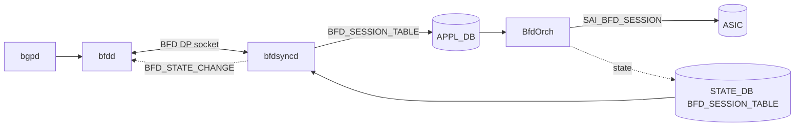

!!! danger "裏取りステータス: Discrepancy-found"
    HLD で導入予定の `bfdsyncd` プロセスは現行 master の `sonic-buildimage/dockers/docker-fpm-frr/` に未取り込み（grep ヒット 0）。`FEATURE.bgp.bfd_hw_offload` フラグも supervisord テンプレートに見当たらない。`sonic-swss/orchagent/bfdorch.cpp` L420-466 では `SAI_BFD_SESSION_ATTR_LOCAL_DISCRIMINATOR` / `REMOTE_DISCRIMINATOR` / `MIN_TX` / `MIN_RX` / `MULTIPLIER` の **設定 (set)** は実装済みだが、HLD が要求する `SAI_BFD_SESSION_ATTR_REMOTE_MIN_TX` / `REMOTE_MIN_RX` / `REMOTE_MULTIPLIER` の **取得 (get) → STATE_DB 反映** ロジックは未取り込み（grep ヒット 0）。本ページは HLD 仕様としての参考情報に留まる（verified at: 2026-05-09）。

# BGP セッション向け BFD ハードウェアオフロード（bfdsyncd 経路）

## 概要

FRR/bfdd の **BFD dataplane (DP) インターフェース** を経由して、BGP が要求した BFD セッションを SONiC の `BfdOrch` 経由でハードウェアオフロードする仕組み。SW BFD と比較して高速な障害検出と多数セッション収容を狙う[^1]。

新規コンポーネント `bfdsyncd` が bgp コンテナ内で動作し、`bfdd` の DP socket と Redis (`APPL_DB` / `STATE_DB`) の両側を仲介する。



## 動作仕様

### bfdsyncd の責務

`bfdsyncd` は次の 3 種類の DP メッセージを処理する[^1]：

- `DP_ADD_SESSION`: bfdd からのセッション生成要求 → APPL_DB の `BFD_SESSION_TABLE` に書き込み、BfdOrch にトリガ。
- `DP_DELETE_SESSION`: 削除要求 → APPL_DB から削除。
- `BFD_STATE_CHANGE`: BfdOrch からの状態変化（STATE_DB 経由）を bfdd に返送。bfdd は BGP に通知し、Down で BGP を IDLE に戻す。

`ECHO_REQUEST` / `ECHO_REPLY` / `DP_REQUEST_SESSION_COUNTERS` / `BFD_SESSION_COUNTERS` は **未サポート**[^1]。

### Local Discriminator のマッピング

`bfdd` と `BfdOrch` は独立に local discriminator を採番する。`bfdd` は乱数（≥ `0x10000`）、`BfdOrch` は 1 から連番。`bfdsyncd` は両者のキー対応表を保持し、状態通知時に正しい bfdd 側 ID へ翻訳する[^1]。

### `show bfd peers` のためのリモート情報

FRR の `show bfd peers` は remote discriminator / multiplier / RX/TX 間隔を表示する。これらは bfdd 側にしか無いが、HW offload では SAI 側に取りに行く必要がある。HLD は次の SAI 属性が将来追加されることを期待している（現状 SDK サポート任意）[^1]：

- `SAI_BFD_SESSION_ATTR_REMOTE_DISCRIMINATOR`
- `SAI_BFD_SESSION_ATTR_REMOTE_MULTIPLIER`
- `SAI_BFD_SESSION_ATTR_REMOTE_MIN_RX`
- `SAI_BFD_SESSION_ATTR_REMOTE_MIN_TX`

未対応 SDK でも BfdOrch がクラッシュしないこと、未取得時は `bfdsyncd` が `0` を bfdd に返すことが要件として明記されている。

### IPv6 link-local 対応

BGP unnumbered 経由の BFD では link-local アドレスを使うが、link-local はルーティング不能なので `bfdorch` は **inject-down モード（L2 直書き）** で BFD パケットを送る必要がある。これには送信元 MAC（`/sys/class/net/<ifname>/address`）と宛先 MAC（neighbor table から取得）が必要だが、`bfddp_session` 構造体には MAC を載せるフィールドが無い。**MAC 取得方法は HLD のスコープ外** で、実装側で工夫する必要があると明記されている[^1]。

<!-- evidence:
source: sonic-net/SONiC/doc/bfd/BFD HW Offload for BGP session HLD.md#L419-L439 (sha: 49bab5b5ff0e924f1ea52b3d9db0dfa4191a7c06)
excerpt: |
  When bgp use link local address to peer with remote system, it needs to specify interface index (and interface name) when create the bfd session. 
  ...
  How to get source mac address and destination mac address for IPv6 link local address is outside of the scope of this HLD, the implementation need to find a way to get these information.
reasoning: link-local シナリオでの inject-down モード要件と、MAC 取得が HLD スコープ外であることの根拠。
-->

### デフォルト値とスケール

| Attribute | Value |
|-----------|-------|
| Default Tx interval | 300 ms |
| Default Rx interval | 300 ms |
| Default detect multiplier | 3 |
| Total HW BFD sessions（他機能と共有） | 4000 |

## 設定

### 関連する CONFIG_DB

| Table | Key | フィールド | 説明 |
|-------|-----|-----------|------|
| `FEATURE` | `bgp` | `bfd_hw_offload` | `"true"` で `bfdsyncd` と `bfdd --dplaneaddr` を起動する supervisord テンプレートが選ばれる |

`BFD_SESSION_TABLE` (APPL_DB) と `BFD_SESSION_TABLE` (STATE_DB) は本機能用に bfdsyncd / BfdOrch が使うが、ユーザは直接編集しない。

### 関連する CLI

新規 SONiC CLI は **無い**。既存の `show bfd summary` および FRR の `vtysh -c 'show bfd peer'` で確認する[^1]。

### 関連する YANG

HLD に YANG 追加の記述なし。

### 設定例

```bash
# Feature 有効化
sonic-db-cli CONFIG_DB HSET 'FEATURE|bgp' bfd_hw_offload true
systemctl restart bgp

# FRR 側で BGP neighbor に bfd を有効化
vtysh -c "
configure terminal
router bgp 65001
 neighbor 10.200.200.201 remote-as external
 neighbor 10.200.200.201 bfd
"

# 確認
show bfd summary
```

## 制限事項

- `show bfd peers counters` は HW カウンタ取得不可のため 0 が返る[^1]。
- ECHO モードは未サポート。
- Warm restart は本フェーズで非対応（`1.4 Warm Restart requirements` で明記）[^1]。
- bfdd と BfdOrch の二重採番のため、bfdsyncd の翻訳テーブルが壊れると状態通知がミスマッチする可能性がある。
- IPv6 link-local 用の MAC 取得実装が HLD スコープ外。

## 干渉する機能

- **BfdOrch (sonic-swss)**: 既存の BfdOrch（`sonic-swss/orchagent/bfdorch.cpp`）をそのまま使う。HW offload 全般の HLD は別途 `BFD HW Offload HLD.md` を参照。
- **BGP unnumbered / IPv6 link-local**: 上記の inject-down モード対応が必要。
- **frr/bfdd の SW BFD**: `FEATURE.bgp.bfd_hw_offload` を未設定にすると bfdd が単独で起動して SW BFD として動く。両モード共存は HLD では想定外。
- **Control plane BFD**: 全 BFD を HW にするか SW にするかは bfdd 起動時のフラグで決まる（部分オフロードは想定されていない）[^1]。

## トラブルシューティング

- BFD が UP にならない場合：`docker exec bgp ps -ef` で `bfdsyncd` と `bfdd --dplaneaddr` の両方が起動しているかを確認する。
- セッションは UP だが `show bfd peer` の remote 値がすべて 0 → SDK が remote 系 SAI 属性を未対応の可能性。BfdOrch のログに get_attribute エラーが出ていないか確認。
- IPv6 link-local 経由で BGP/BFD が上がらない → 実装が neighbor table から宛先 MAC を取れているかを `ip -6 neigh` で確認する。

## 引用元

[^1]: `sonic-net/SONiC` `doc/bfd/BFD HW Offload for BGP session HLD.md` @ `49bab5b5ff0e924f1ea52b3d9db0dfa4191a7c06`
