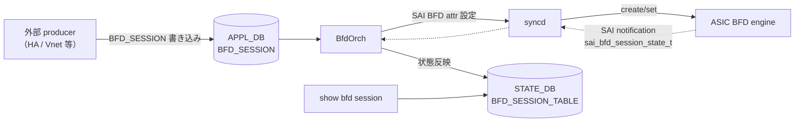
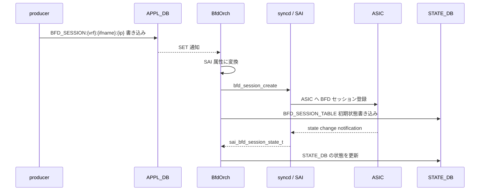

<!-- topics-tip -->
!!! tip "Topics で読み物として読む"
    この HLD は実装詳細を含みます。機能の概念・設定・運用を読み物として読みたい場合は [Topics 02 章: BGP と FRR 制御プレーン](../topics/02-bgp/index.md) を参照。
<!-- /topics-tip -->

!!! success "裏取りステータス: Code-verified"
    現行 master の `sonic-swss/orchagent/bfdorch.cpp`（BfdOrch 本体、`SAI_BFD_SESSION_TYPE_*` / `SAI_BFD_SESSION_STATE_*` 利用）、`sonic-swss-common/common/schema.h:120` の `APP_BFD_SESSION_TABLE_NAME = "BFD_SESSION_TABLE"`、line 491 の STATE_DB 同名テーブル、`sonic-utilities/show/main.py:2669` 系の `show bfd` 実装を確認済み（verified at: 2026-05-09）。 Phase 2 以降の CONFIG_DB スキーマや warm reboot 連携は本ページ範囲外として queue に残置。

# BFD ハードウェアオフロード（BfdOrch / BFD_SESSION）

## 概要

[BFD](../reference/glossary.md#term-bfd)（Bidirectional Forwarding Detection）はリンク・ピア間の高速障害検出プロトコルである。[SONiC](../reference/glossary.md#term-sonic) では従来 [FRR](../reference/glossary.md#term-frr)（`bfdd`）でソフトウェア BFD を実装するが、本機能は **BFD セッションを [ASIC](../reference/glossary.md#term-asic) 側にオフロードして CPU を介在させずに検知する** 経路を導入する[^1]。

設計の主眼は以下のとおり。

- ASIC 側で BFD パケットの送受信・状態遷移を完結させ、最大 4000 セッションまでスケールする
- セッションは `APPL_DB.BFD_SESSION` 経由で外部コンポーネント（例: 上位コントローラ、[orchagent](../reference/glossary.md#term-orchagent)）が直接書き込む。Phase 1 では `CONFIG_DB` 経由および専用 `config` CLI は実装しない[^1]
- 状態は [SAI](../reference/glossary.md#term-sai) 通知を `BfdOrch` が受け取り `STATE_DB` に反映、`show bfd session` で参照する

本 [HLD](../reference/glossary.md#term-hld) は 2021 年時点の Phase 1 設計であり、Control plane BFD（FRR `bfdd`）との共存は同 HLD のスコープ外である[^1]。

## 動作仕様

### コンポーネント構成



要点:

- `APPL_DB` の `BFD_SESSION` テーブルがオフロード対象セッションの入口。Phase 1 では BFD manager（誰が `APPL_DB` に書くか）の決定はスコープ外で「外部 producer が書く」想定[^1]
- `BfdOrch` は `APPL_DB` を購読し、SAI BFD API でセッションを登録する
- セッション状態は SAI 通知チャネル経由で `BfdOrch` に届き、`STATE_DB` に書き込まれる

### APPL_DB スキーマ

セッションキーは [VRF](../reference/glossary.md#term-vrf)・インタフェース・宛先 IP の 3 つで一意化する[^1]。

```text
BFD_SESSION_TABLE:{vrf}:{ifname}:{ipaddr}
    tx_interval   : interval ms (OPTIONAL)
    rx_interval   : interval ms (OPTIONAL)
    multiplier    : detect multiplier (OPTIONAL)
    shutdown      : false
    multihop      : false
    local_addr    : ipv4 / ipv6
    type          : active / passive / ...
```

| キー位置 | 必須 | 値が無い場合 |
|---------|------|------------|
| `vrf` | ✅ | `default` を指定 |
| `ifname` | ✅ | multihop 等で意味がない場合は `default` |
| `ipaddr` | ✅ | 省略不可。IPv4 / IPv6 |

省略可フィールドのデフォルト値:

| Attribute | Default |
|-----------|--------|
| `tx_interval` | 1 sec |
| `rx_interval` | 1 sec |
| `multiplier` | 3 |
| `multihop` | false |
| `local_addr` | Loopback0 |

### CONFIG_DB

Phase 1 では **`CONFIG_DB` スキーマは未定義**。BFD manager の設計と合わせて将来追加する旨が明記されている[^1]。`CONFIG_DB` 経由で BFD セッションを直接設定したいユースケース（運用者が BFD 単体を切ってみる等）は Phase 1 では非対応である。

### SAI 属性のマッピング

`BfdOrch` が SAI に渡す主な属性は次のとおり[^1]。

| SAI Attribute | 値 |
|---------------|---|
| `SAI_BFD_SESSION_ATTR_TYPE` | `SAI_BFD_SESSION_TYPE_ASYNC_ACTIVE` |
| `SAI_BFD_SESSION_ATTR_OFFLOAD_TYPE` | `SAI_BFD_SESSION_OFFLOAD_TYPE_FULL` |
| `SAI_BFD_SESSION_ATTR_BFD_ENCAPSULATION_TYPE` | `SAI_BFD_ENCAPSULATION_TYPE_NONE` |
| `SAI_BFD_SESSION_ATTR_SRC_IP_ADDRESS` | Loopback0 の IPv4 / v6 |
| `SAI_BFD_SESSION_ATTR_DST_IP_ADDRESS` | リモート IP |
| `SAI_BFD_SESSION_ATTR_MULTIHOP` | true |

multihop セッションでは ASIC 側で `SAI_BFD_SESSION_ATTR_VIRTUAL_ROUTER`（未指定なら `SAI_SWITCH_ATTR_DEFAULT_VIRTUAL_ROUTER_ID`）に紐づく underlay ルーティングテーブルで宛先解決する。underlay の [ECMP](../reference/glossary.md#term-ecmp) パス解決も HW 任せで、ASIC 詳細は HLD のスコープ外と明記される[^1]。

### 状態遷移とライフサイクル



<!-- evidence:
source: sonic-net/SONiC/doc/bfd/BFD HW Offload HLD.md#L110-L140 (sha: 49bab5b5ff0e924f1ea52b3d9db0dfa4191a7c06)
excerpt: |
  A new module, BfdOrch shall be introduced to handle BFD session ...
  BfdOrch shall offload the session initiation/sustenance to hardware via SAI APIs and gets the notifications of session state from SAI.
  The session state shall be updated in STATE_DB and to any other observer orchestration agents.
reasoning: BfdOrch が APPL_DB → SAI → STATE_DB を貫く責務であることの根拠。
-->

<!-- evidence-rendered:start -->
??? note "📋 検証エビデンス: sonic-net/SONiC/doc/bfd/BFD HW Offload HLD.md#L110-L140 (sha: 49bab5b5ff0e924f1ea52b3d9db0dfa4191a7c06)"

    **出典**:

    `sonic-net/SONiC/doc/bfd/BFD HW Offload HLD.md#L110-L140 (sha: 49bab5b5ff0e924f1ea52b3d9db0dfa4191a7c06)`

    **抜粋**:

    ```text
    A new module, BfdOrch shall be introduced to handle BFD session ...
    BfdOrch shall offload the session initiation/sustenance to hardware via SAI APIs and gets the notifications of session state from SAI.
    The session state shall be updated in STATE_DB and to any other observer orchestration agents.
    ```

    **判断根拠**: BfdOrch が APPL_DB → SAI → STATE_DB を貫く責務であることの根拠。

<!-- evidence-rendered:end -->

### Control plane BFD との共存

HLD は HW オフロードと FRR `bfdd` の **共存自体は否定しない** が、同一宛先 IP について両方のセッションを張ることは想定外と明記する[^1]。BFD trap を入れてコントロールプレーン BFD を有効化すると BFD パケットが CPU に上がるため、HW セッション側が独立で動くと一部パケットが silently drop され得る点に注意とある。

## 設定

### 関連する CONFIG_DB

Phase 1 ではユーザ向け [CONFIG_DB](../reference/glossary.md#term-config_db) スキーマは未定義。ただし `APPL_DB.BFD_SESSION` を直接書く producer（HA・vnet・peer monitor など）が必要。

### 関連する CLI

| Command | 用途 |
|---------|------|
| `show bfd session <session name>` | オフロードされた BFD セッションと状態を表示 |

`config bfd ...` 系の CLI は本 HLD では明示的に **将来拡張** とされ、Phase 1 のスコープ外[^1]。

### 関連する YANG

HLD で [YANG](../reference/glossary.md#term-yang) モジュールへの言及は無い（`CONFIG_DB` スキーマが未定義のため）。

### スケール上限

| 項目 | 値 |
|------|---|
| HW オフロード BFD セッション数 | 4000（Phase 1）[^1] |

### 設定例

`APPL_DB` 直接書き込みの例（Phase 1 想定の peer monitor 等から）:

```text
HSET "BFD_SESSION_TABLE:default:default:10.0.0.5" \
    multihop true \
    local_addr 10.1.0.32 \
    type active
```

APPL_DB のキー名は `sonic-swss-common/common/schema.h:120` の `APP_BFD_SESSION_TABLE_NAME = "BFD_SESSION_TABLE"` の通り `BFD_SESSION_TABLE` が正式。HLD では `BFD_SESSION` と略記されている箇所がある点に注意。

## 制限事項

- Phase 1 は HW オフロード専用。`CONFIG_DB` 直接編集および専用 `config` CLI は **Phase 1 範囲外**[^1]
- Warm restart に関しては「特別な処理は不要」とされている[^1]。ただし HW オフロードセッションが warm reboot 中に保持されるかは ASIC 実装依存
- 同一宛先 IP に control plane BFD（FRR）と HW オフロードを同時に張らないこと
- HW 実装が underlay ECMP 解決を持っていることが前提。HW 側でこれが未実装の場合 multihop が成立しない
- **`SAI_BFD_SESSION_ATTR_PORT` 未設定の問題** ([sonic-swss#3051](https://github.com/sonic-net/sonic-swss/issues/3051)): `SAI_BFD_SESSION_ATTR_HW_LOOKUP_VALID=False`（HW ルックアップを無効化）でセッションを作成する場合、SAI は `SAI_BFD_SESSION_ATTR_PORT` を必須属性として要求する。現行の `BfdOrch` はこの属性を設定前に照会せずにプログラミングするため、非デフォルトポート構成で BFD セッション作成が失敗することがある。この場合は [syncd](../reference/glossary.md#term-syncd) ログに SAI エラーが記録される。

## 干渉する機能

- **FRR `bfdd`（Control plane BFD）**: 同一宛先で並走させない。BFD trap を入れる場合は HW セッションとの責務分担に注意
- **VRF / virtual router**: multihop セッションは `SAI_BFD_SESSION_ATTR_VIRTUAL_ROUTER` に従って underlay 解決される
- **Loopback0**: デフォルトの `local_addr` ソース。Loopback0 IPv4/v6 が無いと既定では BFD セッションが組めない
- **将来の BFD manager**: HW 容量を見て control plane / HW を振り分ける役割が想定されているが、本 HLD では未実装

## トラブルシューティング

- セッションが Up にならない場合、まず `show bfd session` で `STATE_DB.BFD_SESSION_TABLE` 上の状態を確認。`Init` で止まっているならピア側の状態を疑う
- `APPL_DB` に SET したのにセッションが現れない場合、`BfdOrch` ログ・[syncd](../reference/glossary.md#term-syncd) ログに SAI エラーが出ていないか確認（SAI BFD 未対応 ASIC では create が失敗）
- HW オフロード対応 SAI 属性は ASIC ベンダー依存。`SAI_BFD_SESSION_OFFLOAD_TYPE_FULL` を解釈できない実装では full offload にならない可能性あり

### コマンド例

BFD セッションと HW オフロード状態を確認する。

```bash
# BFD
show bfd summary
show bfd peer all
redis-cli -n 4 keys 'BFD_SESSION|*'
docker exec bgp vtysh -c 'show bfd peers' | head
```

## 引用元

[^1]: `sonic-net/SONiC` `doc/bfd/BFD HW Offload HLD.md` @ `49bab5b5ff0e924f1ea52b3d9db0dfa4191a7c06`

<!-- concerns hint:
- BfdOrch が現行 master の sonic-swss に存在するか
- APPL_DB のテーブル名（BFD_SESSION vs BFD_SESSION_TABLE）の最終形
- SAI_BFD_SESSION_* 属性が community SAI ヘッダで利用可能か
- show bfd session の sonic-utilities 取り込み
- 4000 セッションのスケール検証
- 2021 年 HLD と現行実装の乖離（Phase 2 以降の CONFIG_DB / CLI 追加状況）
-->

<!-- topics-back-ref -->
## 関連 Topics

- [Topics: Dual-ToR と Mux 制御](../topics/05-dual-tor/index.md)

<!-- /topics-back-ref -->

<!-- glossary-links-injected: ec18b66e3507 -->
