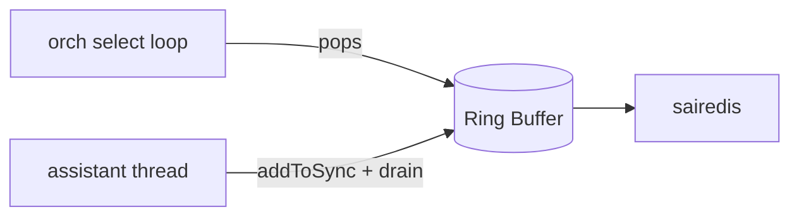
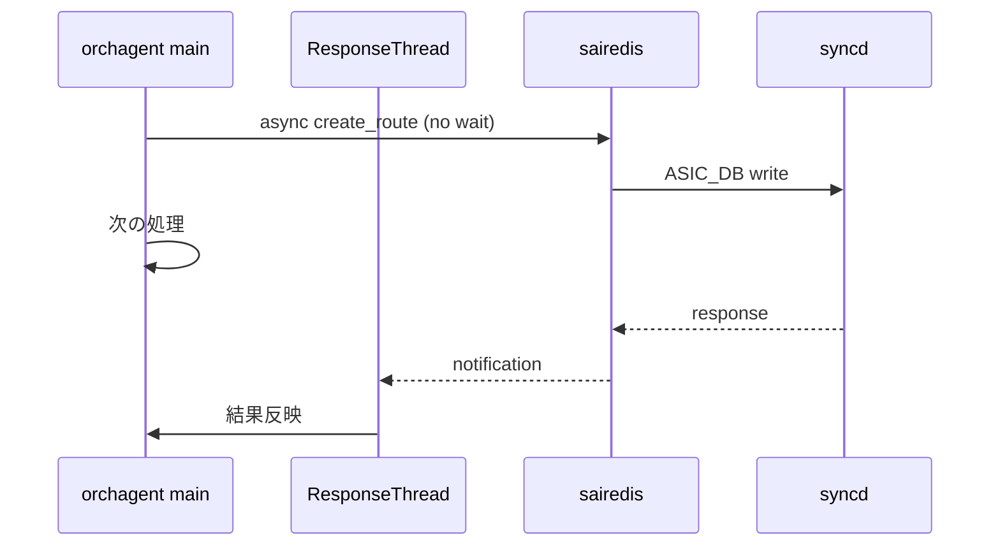

<!-- topics-tip -->
!!! tip "Topics で読み物として読む"
    この HLD は実装詳細を含む。機能の概念・設定・運用を読み物として読みたい場合は [Topics 02 章: BGP と FRR 制御プレーン](../topics/02-bgp/index.md) を参照。
<!-- /topics-tip -->

!!! success "裏取りステータス: code-verified"
    Verifier 2026-05-09: `sonic-swss/fpmsyncd/fpmsyncd.h:6` `#define ROUTE_SYNC_PPL_SIZE 50000`、`fpmsyncd.cpp:25` `FLUSH_TIMEOUT 500`（500ms）、`SMALL_TRAFFIC 500`、`pipeline.flush()` 経路を確認。`sonic-swss/orchagent/orch.cpp:19-` で `RingBuffer` クラス（`Orch::gRingBuffer` / `Executor::gRingBuffer` の static、`pauseThread` / `notify` / `IsIdle` / `IsFull` / `push`）を確認。`sonic-swss-common/common/performancetimer.h` で `PerformanceTimer` クラスを確認。

# BGP Loading Optimization（fpmsyncd flush / orchagent ring buffer / async sairedis）

## 概要

2M routes 級の [BGP](../reference/glossary.md#term-bgp) loading を end-to-end で 50% 高速化することを狙った最適化 [HLD](../reference/glossary.md#term-hld)（2023-2024）[^1]。次の 3 ステップを最適化する。

1. **[fpmsyncd](../reference/glossary.md#term-fpmsyncd)**: redis pipeline の flush 頻度・サイズ・PUBLISH 命令を見直す
2. **[orchagent](../reference/glossary.md#term-orchagent)**: 単スレッド（pops / addToSync / drain）→ アシスタントスレッドと ring buffer による pipelining
3. **sairedis**: 同期 API → 非同期 API 経路と orchagent 側の `ResponseThread`

[ASIC](../reference/glossary.md#term-asic) / [SAI](../reference/glossary.md#term-sai) 自体の最適化はスコープ外。

## 動作仕様

### Step 1: fpmsyncd の pipeline 改修

| 項目 | 旧 | 新 |
|------|----|----|
| Lua スクリプト末尾の `PUBLISH` | エントリごと（O(n)）| パイプライン末尾 1 回のみ（O(1)）。`ROUTE_TABLE_KEY_SET` で modified key を保持しているため subscriber は気付ける |
| pipeline size | 128 | **50,000** |
| flush 契機 | event ごと proactive flush | event-trigger を skip 可。skip した場合は 500ms タイマで強制 flush |

ただし「500 件未満のバッチは即時 flush」とし、小規模変動の遅延は起きないよう調整する[^1]。

### Step 2: orchagent の並行化



- `pops`（redis 読み）と `addToSync` + `drain`（処理＋ASIC 書き）を 2 スレッドに分ける
- スレッド間通信は **ring buffer**（singleton）に lambda function 列を入れる方式。lock を持たず、enqueue 順序で時間順序を保証
- lambda は「データ + そのデータに対する処理」をまとめてキャプチャするため、消費スレッドはそのまま invoke すれば良い[^1]

### Step 3: sairedis の async 化

`sairedis` の同期 API は、[ASIC_DB](../reference/glossary.md#term-asic_db) 書き込み後 [syncd](../reference/glossary.md#term-syncd) 応答を待つため orchagent 側の processing が止まる。新たに **`ResponseThread`** を orchagent に追加し、async 経路で発行 → 応答だけ別スレッドで受ける構成[^1]。



### Warm Restart シナリオ

warm restart 中は ring buffer / async 経路のセマンティクスが特に問題になりやすい。HLD は warm restart 中の order と response 待ちの整合性確保について別節を立てている[^1]。

### 計測

`PerformanceTimer` を導入し、各ステップの所要を syslog に吐く。これを集計して 2M routes での before/after を比較する[^1]。

<!-- evidence:
source: sonic-net/SONiC/doc/bgp_loading_optimization/bgp-loading-optimization-hld.md#L156-L182 (sha: 49bab5b5ff0e924f1ea52b3d9db0dfa4191a7c06)
excerpt: |
  We can attach a lua script which only contains `PUBLISH` command at the end of the pipeline once it flushes `n` entries
  ... we increase pipeline size from the default 125 to 50k
  ... we activate a 500-millisecond timer after a skip to make sure that these commands are eventually flushed.
reasoning: pipeline size 50k と 500ms timer、PUBLISH 1 回化の根拠。
-->

<!-- evidence-rendered:start -->
??? note "📋 検証エビデンス: sonic-net/SONiC/doc/bgp_loading_optimization/bgp-loading-optimization-hld.md#L156-L182 (sha: 49bab5b5ff0e924f1ea52b3d9db0dfa4191a7c06)"

    **出典**:

    `sonic-net/SONiC/doc/bgp_loading_optimization/bgp-loading-optimization-hld.md#L156-L182 (sha: 49bab5b5ff0e924f1ea52b3d9db0dfa4191a7c06)`

    **抜粋**:

    ```text
    We can attach a lua script which only contains `PUBLISH` command at the end of the pipeline once it flushes `n` entries
    ... we increase pipeline size from the default 125 to 50k
    ... we activate a 500-millisecond timer after a skip to make sure that these commands are eventually flushed.
    ```

    **判断根拠**: pipeline size 50k と 500ms timer、PUBLISH 1 回化の根拠。

<!-- evidence-rendered:end -->

## 設定

HLD で新規 [CONFIG_DB](../reference/glossary.md#term-config_db) / CLI の言及は無い（性能側のチューニングのみ）。pipeline サイズ等は build 時定数で組み込まれる想定。

## 制限事項

- 2M routes 級の最適化を主眼。少規模では効果が出にくい・むしろ 500ms 遅延 timer の影響あり
- async sairedis 経路は warm restart の整合性 review が必要[^1]
- ring buffer サイズ決定は実装側でチューニング

## 干渉する機能

- **`fpmsyncd` NextHop Group 拡張**: 同じ pipeline 経路を共有。NHG 経路でも PUBLISH 削減は有効
- **warm reboot**: `ResponseThread` と warm restart の order 保証は HLD 内で別述
- **[ACL](../reference/glossary.md#term-acl) / [VLAN](../reference/glossary.md#term-vlan) / [FDB](../reference/glossary.md#term-fdb) orch**: ring buffer は orch 共通基盤に乗るため広範囲に影響

## トラブルシューティング

- 大量 route 投入後に subscriber が古いデータを見る → pipeline 末尾の PUBLISH 1回化で modified key set が正しく回っているか確認
- 500ms 体感ラグ → 500 未満バッチでは即時 flush のはずなので、skip 判定ロジック側の bug を疑う

### コマンド例

BGP route 大量投入時の pipeline / publish の振る舞いを確認する。

```bash
# fpmsyncd の subscriber 滞留
docker exec bgp ps -ef | grep fpmsyncd
redis-cli -n 0 monitor | grep -E 'ROUTE_TABLE|PUBLISH' | head
show ip route summary
```

## 引用元

[^1]: `sonic-net/SONiC` `doc/bgp_loading_optimization/bgp-loading-optimization-hld.md` @ `49bab5b5ff0e924f1ea52b3d9db0dfa4191a7c06`

<!-- concerns hint:
- fpmsyncd の pipeline size 50k / 500ms timer / PUBLISH 一回化の現行 master 取り込み確認
- orchagent の ring buffer / assistant thread 実装存在確認
- sairedis async API の有効化フローと ResponseThread 実装確認
- PerformanceTimer の現行 sonic-swss-common 取り込み確認
- warm restart 経路での async / ring buffer の order 保証実装確認
- 2M routes ベンチの実測値 vs HLD 主張 50% 高速化の検証
-->

<!-- glossary-links-injected: c006405759d8 -->
