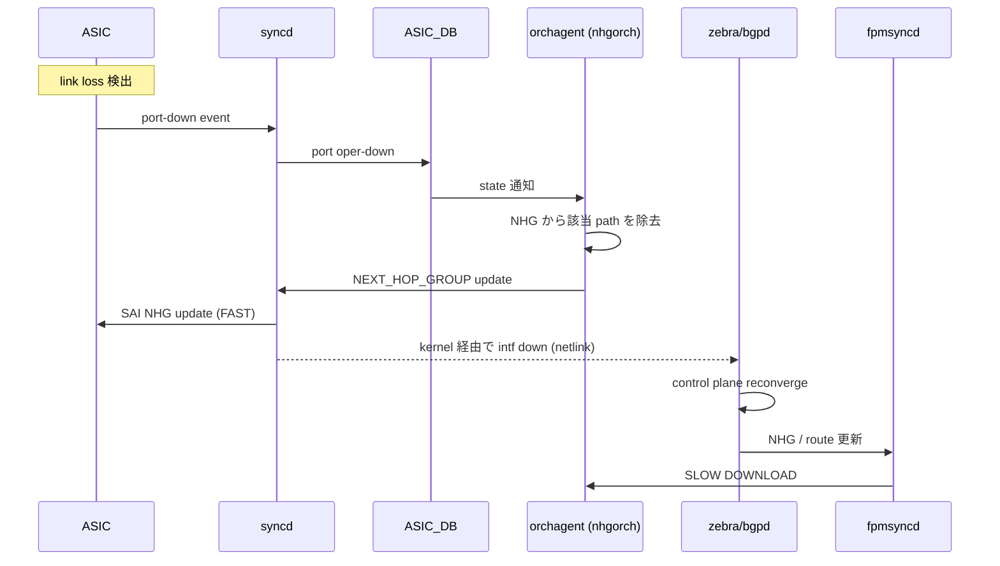

!!! warning "裏取りステータス: HLD-only"
    HLD は v1.0 (2024-01) と新しいが、SONiC 側の `nhgorch` の hierarchical NHG 取り込み、`fpmsyncd` の `FAST DOWNLOAD` / `SLOW DOWNLOAD` 区別、SAI `NEXT_HOP_GROUP` の hierarchical update 動作は未裏取り。

# BGP PIC（Prefix Independent Convergence / NHG 階層）

## 概要

ネットワーク障害時、影響を受けた **N 個の prefix を 1 件ずつ再プログラム** していると BGP overlay の数百万 route 規模で巨大なパケットロスが発生する。**Prefix Independent Convergence (PIC)** は障害復帰のコストを **prefix 数 N に依存させず** 一定時間で完了させる仕組みで、ECMP / primary-backup multipath を多段の **level of indirection (NHG)** で共有することで実現する[^1]。IETF `draft-ietf-rtgwg-bgp-pic` を SONiC で実装するアーキテクチャ。本ページは PIC Core / PIC Edge / PIC Local の 3 形態と SONiC での call flow を整理する。

## 動作仕様

### 3 形態

| 形態 | トリガ | 検出 | 補助 |
|------|--------|------|------|
| **PIC Core** | underlay (IGP) 内部の故障 | local interface down / BFD | NHG 更新だけで全 prefix 影響 |
| **PIC Edge** | overlay (BGP nexthop) の喪失 | nexthop tracking via IGP/BGP | 別 PE への切替を NHG レベルで |
| **PIC Local (FRR)** | local 接続 link の故障 | local interface down / BFD | egress 側 backup path に切替、ingress 通知までの繋ぎ |

### 階層 NHG（Concept）

```mermaid
flowchart LR
  PFX[(prefix r1, r2, ..., rn)] --> NHGS[NHG-Service<br/>= remote nexthop list<br/>(PE1, PE2)]
  NHGS --> NHGU[NHG-Underlay<br/>per remote PE]
  NHGU --> IFA[Intf-A]
  NHGU --> IFB[Intf-B]
```

- **Prefix → service NHG（remote PE loopbacks）→ underlay NHG（physical intf list）** の 2 段で多重化
- N 個の prefix を共有する level of indirection を更新するだけで全 prefix の経路が切替わる
- SONiC では NHG が **`nexthop group` object**

NHG は ECMP hardware resource を消費するため、**single-path のみの prefix では NHG を作らない**（resource 節約）[^1]。

### Requirements

- 階層 forwarding chain は複数 route で **共有**（per-prefix にしない）
- HW は階層 NHG を **事前に program** する
- Local 故障時は LL software / HW が **NHG を pruning して 1 update に圧縮**、上位ソフトに通知
- Remote 故障時は control plane が **まず NHG だけ更新**、後で reachability を full update
- 全 transition は **hitless（zero packet loss）**: single↔multi、NHG↔NHG、direct↔NHG の遷移すべて

### FAST DOWNLOAD / SLOW DOWNLOAD

> BGP PIC works with the concept of **FAST DOWNLOAD** and **SLOW DOWNLOAD** updates.[^1]

| Phase | やる事 |
|-------|--------|
| **FAST DOWNLOAD** | NHG 1 オブジェクトの HW 更新（パス削除）。検出から ms オーダー |
| **SLOW DOWNLOAD** | control plane (zebra/bgpd) の本来の収束結果を反映。route 個別更新 |

FAST が先、SLOW が後。FAST で被害を最小化し、SLOW で正規化する。

### SONiC Core Local Failure call flow



[^1] FAST 経路は **0-5 ステップで HW 1 update を完了**、6 以降が SLOW（kernel netlink → zebra → bgpd → fpmsyncd → ASIC_DB の通常経路）。

### 検出契機まとめ

- **PIC Core**: local intf down / BFD
- **PIC Edge**: nexthop tracking via IGP withdraw / BGP update
- **PIC Local (FRR)**: local intf down / BFD

### NHG ライフサイクルの注意

- N 要素 NHG が 1 要素に減る場合、**NHG を消して直接 NH ID を使う**形にも遷移する。これも hitless で行う必要がある[^1]
- 逆に single path から multipath への昇格時に新 NHG を作って差し替える際も hitless

<!-- evidence:
source: sonic-net/SONiC/doc/pic/bgp_pic_arch_doc.md#L236-L262 (sha: 49bab5b5ff0e924f1ea52b3d9db0dfa4191a7c06)
excerpt: |
  BGP PIC works with the concept of FAST DOWNLOAD and SLOW DOWNLOAD updates.
  ... 0. LOSS detection done by the ASIC; a notification is sent to syncd
  ... 5. single NHG object update done in hardware via SDK + Kernel update
reasoning: FAST/SLOW DOWNLOAD 二段収束の根拠と call flow ステップの根拠。
-->

## CLI / CONFIG_DB / YANG

本 HLD は **アーキテクチャ文書**であり個別 CLI / CONFIG_DB / YANG の定義はしていない[^1]。具体的な FRR / SONiC 設定は zebra の `nexthop-group` 設定や BGP `bestpath` 系で表現される（HLD では未明記）。

## 制限事項

- ECMP HW resource は限られるため NHG 利用は **multipath が成立するときに限定**
- per-prefix の per-route table 更新は SLOW DOWNLOAD 側に残るので「N に依存しない」のは FAST 部のみ
- nexthop tracking が機能しない過渡期には PIC Edge が動かない可能性
- FRR (PIC Local) と PIC Edge は **別の収束タイミング**で動くため、両者が干渉しない設計が必要

## 干渉する機能

- **FRR zebra / bgpd**: NHG (`nexthop-group`) の生成と FPM 連携
- **fpmsyncd / orchagent (nhgorch)**: APPL_DB → ASIC_DB の NHG 経路
- **BFD**: 高速検出
- **EVPN / MPLS / SRv6**: overlay service の付加。本 HLD は protocol independent
- **`sonic-weighted-ecmp` / `local-ars-hld`**: NHG を共有する隣接機能

## 引用元

[^1]: `sonic-net/SONiC` `doc/pic/bgp_pic_arch_doc.md` @ `49bab5b5ff0e924f1ea52b3d9db0dfa4191a7c06`

参考: IETF `draft-ietf-rtgwg-bgp-pic`

<!-- concerns hint:
- nhgorch の hierarchical NHG (service / underlay) サポート状況の sonic-swss 取り込み確認
- fpmsyncd の FAST/SLOW DOWNLOAD 区別実装確認
- SAI NEXT_HOP_GROUP の hierarchical / hitless update 動作の vendor SAI 確認
- FRR zebra の nexthop-group 機能と FPM への伝搬経路確認
- single ↔ NHG hitless transition のテスト存在確認
-->
