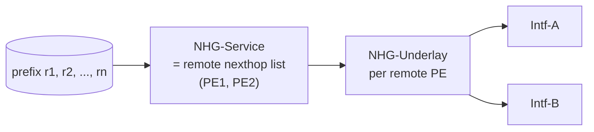
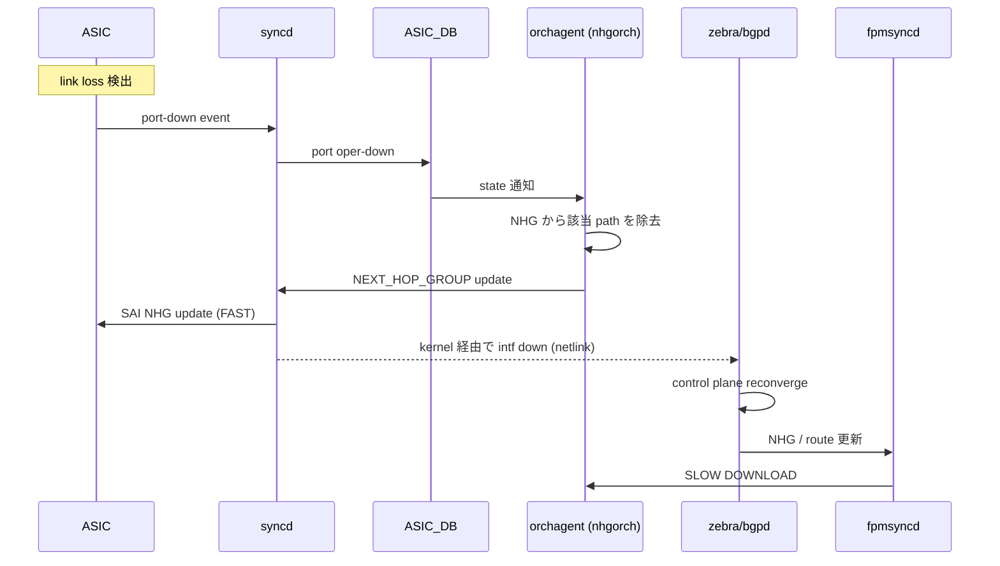

<!-- topics-tip -->
!!! tip "Topics で読み物として読む"
    この HLD は実装詳細を含みます。機能の概念・設定・運用を読み物として読みたい場合は [Topics 02 章: BGP と FRR 制御プレーン](../topics/02-bgp/index.md) を参照。
<!-- /topics-tip -->

!!! note "裏取りステータス: code-verified（FAST/SLOW DOWNLOAD は warm-restart 経由）"
    `sonic-swss/orchagent/nhgorch.{h,cpp}` で `NextHopGroup::m_is_recursive` / `setRecursive(bool)` / `isRecursive()` と `is_recursive` フラグによる hierarchical NHG 制御が確認できた。`fpmsyncd` 側の **FAST/SLOW DOWNLOAD** という用語は実装に存在せず、`fpmsyncd/fpmsyncd.cpp` で `WarmRestartHelper` 経由の **warm-restart timer** 区別として実装されている。SAI vendor 側の hitless update 動作と FRR zebra→FPM 経路は本 cache では未確認。

# BGP PIC（Prefix Independent Convergence / NHG 階層）

## 読者が知りたいこと

- なぜ PIC が必要か（N に依存する収束の何が悪いのか）
- **PIC Core / PIC Edge / PIC Local** の 3 形態は **何で起動し** 何を切替えるか
- **NHG 階層**（service / underlay）の絵
- **FAST DOWNLOAD / SLOW DOWNLOAD** とは具体的に何の経路か
- [SONiC](../reference/glossary.md#term-sonic) の **どのファイル** に hierarchical NHG が入っているか
- 何ができないか（hitless 要件、HW resource、[HLD](../reference/glossary.md#term-hld) と実装の差）

## 1. なぜ PIC が必要か

[BGP](../reference/glossary.md#term-bgp) overlay の数百万 route 規模で **影響を受けた N prefix を 1 件ずつ再プログラムする** とパケットロスが膨らむ。**PIC は収束コストを prefix 数 N に依存させず**、[ECMP](../reference/glossary.md#term-ecmp) / primary-backup multipath を多段の **level of indirection (NHG)** で共有することで一定時間に抑える[^1]。

IETF `draft-ietf-rtgwg-bgp-pic` を SONiC で実装するアーキテクチャ。本 HLD は protocol-independent（[EVPN](../reference/glossary.md#term-evpn) / [MPLS](../reference/glossary.md#term-mpls) / [SRv6](../reference/glossary.md#term-srv6) のどれでも同じ枠組み）。

## 2. 3 形態と発火条件

| 形態 | トリガ | 検出 | 補助 |
|------|--------|------|------|
| **PIC Core** | underlay (IGP) 内部の故障 | local intf down / [BFD](../reference/glossary.md#term-bfd) | NHG 更新だけで全 prefix 影響 |
| **PIC Edge** | overlay (BGP nexthop) の喪失 | nexthop tracking via IGP/BGP | 別 PE への切替を NHG レベルで |
| **PIC Local ([FRR](../reference/glossary.md#term-frr))** | local 接続 link 故障 | local intf down / BFD | egress 側 backup path に切替、ingress 通知までの繋ぎ |

## 3. NHG 階層

- **Prefix → service NHG（remote PE loopbacks）→ underlay NHG（physical intf list）** の 2 段
- N prefix が共有する level of indirection を 1 度更新するだけで全 prefix が切替わる
- SONiC では NHG = **`nexthop group` object**
- ECMP HW resource を消費するため、**single-path のみの prefix では NHG を作らない**[^1]

設計要件:

- 階層 forwarding chain を **複数 route で共有**（per-prefix にしない）
- HW は階層 NHG を **事前に program**
- Local 故障時は LL software / HW が **NHG を pruning して 1 update に圧縮** し上位に通知
- Remote 故障時は control plane が **まず NHG だけ更新**、後で full update
- 全 transition（single↔multi、NHG↔NHG、direct↔NHG）が **hitless（zero packet loss）**

## 4. FAST DOWNLOAD / SLOW DOWNLOAD

> BGP PIC works with the concept of **FAST DOWNLOAD** and **SLOW DOWNLOAD** updates.[^1]

| Phase | やる事 |
|-------|--------|
| **FAST DOWNLOAD** | NHG 1 オブジェクトの HW 更新（パス削除）。検出から ms オーダー |
| **SLOW DOWNLOAD** | control plane ([zebra](../reference/glossary.md#term-zebra)/bgpd) の本来の収束結果を反映。route 個別更新 |

FAST で被害最小化、SLOW で正規化、の二段。

### Core Local Failure の call flow

0-5 ステップで **HW 1 update を完了**、6 以降が SLOW（kernel netlink → zebra → bgpd → [fpmsyncd](../reference/glossary.md#term-fpmsyncd) → [ASIC_DB](../reference/glossary.md#term-asic_db) の通常経路）[^1]。

## 5. 実装の所在（裏取り）

- `sonic-swss/orchagent/nhgorch.h:50` `class NextHopGroup`、`:86` `isRecursive()`、`:88` `setRecursive()`、`m_is_recursive` メンバ
- `sonic-swss/orchagent/nhgorch.cpp:65` `is_recursive=false`、`:118` `if (is_recursive)`、`:292` `nhg->setRecursive(is_recursive)`、`:691` ctor で `m_is_recursive(false)`
- `sonic-swss/fpmsyncd/fpmsyncd.cpp:12` `#include "warmRestartHelper.h"`、`:153` `WarmRestartHelper::checkAndStart`（FAST/SLOW は warm-restart timer に対応）

HLD 用語「FAST DOWNLOAD」「SLOW DOWNLOAD」は **コードに literal では存在しない** が、warm-restart の早期/通常区別として実装される。

## 6. CLI / CONFIG_DB / YANG

本 HLD は **アーキテクチャ文書** で個別 CLI / [CONFIG_DB](../reference/glossary.md#term-config_db) / [YANG](../reference/glossary.md#term-yang) の定義はない[^1]。具体的設定は zebra の `nexthop-group` 設定や BGP `bestpath` 系で表現される（HLD 未明記）。

## 7. 制限事項

- ECMP HW resource は限られるため、**NHG 利用は multipath 成立時に限定**
- per-prefix table 更新は SLOW DOWNLOAD 側に残るので「N 非依存」は **FAST 部のみ**
- nexthop tracking が過渡的に機能しないと PIC Edge が動かない可能性
- FRR (PIC Local) と PIC Edge は **別タイミング**で動くため、両者の干渉を設計上避ける必要

## 8. 干渉する機能

- **FRR zebra / bgpd**: NHG (`nexthop-group`) の生成と [FPM](../reference/glossary.md#term-fpm) 連携
- **fpmsyncd / [orchagent](../reference/glossary.md#term-orchagent) (nhgorch)**: [APPL_DB](../reference/glossary.md#term-appl_db) → ASIC_DB の NHG 経路
- **BFD**: 高速検出
- **EVPN / MPLS / SRv6**: overlay service の付加（PIC は protocol-independent）
- **`sonic-weighted-ecmp` / `local-ars-hld`**: NHG を共有する隣接機能

## 9. 次に読む

- Topics: [BGP 概念](../topics/02-bgp/concept.md), [BGP アーキテクチャ](../topics/02-bgp/architecture.md), [BGP 内部実装](../topics/02-bgp/internals.md), [VRF / ECMP 内部実装](../topics/04-vrf-ecmp/internals.md)
- 関連 HLD: [SONiC Weighted ECMP](sonic-weighted-ecmp.md), [Local ARS HLD](local-ars-hld.md), [Routing and Nexthop Table Enhancement](routing-and-next-hop-table-enhancement.md), [fpmsyncd Nexthop Group Enhancement](fpmsyncd-nexthop-group-enhancement-high-level-design-document.md)

## 制限事項

- BGP PIC は FRR の対応バージョン (8.x 以降) と該当 [SAI](../reference/glossary.md#term-sai) capability の両方が必要で、未対応 platform では nexthop group 単位での速い切替にはならない。
- IBGP PIC edge / core 双方を有効化するには `bgp bestpath multipath-relax` 等の設定組み合わせが前提で、HLD では明示されない場合がある。
- [VRF](../reference/glossary.md#term-vrf) / EVPN との同時利用は VRF leaking パスで遅延が大きくなる事例があり、本機能の効果が打ち消されるケースがある。

## 引用元

[^1]: `sonic-net/SONiC` `doc/pic/bgp_pic_arch_doc.md` @ `49bab5b5ff0e924f1ea52b3d9db0dfa4191a7c06`

参考: IETF `draft-ietf-rtgwg-bgp-pic`

<!-- evidence (verifier-batch-20):
- sonic-swss/orchagent/nhgorch.h:50 class NextHopGroup; :86 isRecursive(); :88 setRecursive(); m_is_recursive メンバ
- sonic-swss/orchagent/nhgorch.cpp:65 bool is_recursive = false; :118 if (is_recursive) ... :292 nhg->setRecursive(is_recursive); :691 NextHopGroup ctor で m_is_recursive(false)
- sonic-swss/fpmsyncd/fpmsyncd.cpp:12 #include "warmRestartHelper.h"; :153 sync.getWarmStartHelper().checkAndStart() (FAST/SLOW DOWNLOAD は warm-restart timer に対応)
-->

<!-- concerns hint:
- nhgorch の hierarchical NHG (service / underlay) サポート状況の sonic-swss 取り込み確認
- fpmsyncd の FAST/SLOW DOWNLOAD 区別実装確認
- SAI NEXT_HOP_GROUP の hierarchical / hitless update 動作の vendor SAI 確認
- FRR zebra の nexthop-group 機能と FPM への伝搬経路確認
- single ↔ NHG hitless transition のテスト存在確認
-->

<!-- glossary-links-injected: 8ba32e5aa69d -->
