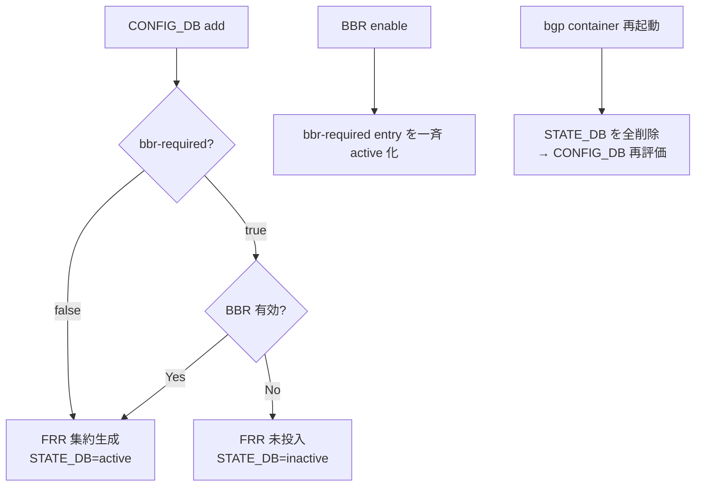

<!-- topics-tip -->
!!! tip "Topics で読み物として読む"
    この HLD は実装詳細を含む。機能の概念・設定・運用を読み物として読みたい場合は [Topics 02 章: BGP と FRR 制御プレーン](../topics/02-bgp/index.md) を参照。
<!-- /topics-tip -->

!!! success "裏取りステータス: code-verified"
    `sonic-buildimage/src/sonic-bgpcfgd/bgpcfgd/managers_aggregate_address.py` `AggregateAddressMgr` が `BGP_BBR` と STATE_DB `BGP_AGGREGATE_ADDRESS` を扱う実装、`sonic-yang-models/yang-models/sonic-bgp-aggregate-address.yang`、CLI `sonic-utilities/{config,show}/bgp_cli.py` を確認（verified at: 2026-05-09）。

# BBR 連動の BGP ルート集約

## なぜ必要か

[SONiC](../reference/glossary.md#term-sonic) は従来 [CONFIG_DB](../reference/glossary.md#term-config_db) / CLI で集約広告（`aggregate-address`）を設定できず、[FRR](../reference/glossary.md#term-frr) を直接編集する必要があった。さらに **BBR (Bounce Back Routing) が無効** な状態で集約だけ入れると、contributing route 不到達によるパケットドロップが起こる。本機能は CONFIG_DB に `BGP_AGGREGATE_ADDRESS` を新設し、**BBR 状態に応じて集約広告を条件付きで生成** する[^1]。状態は [STATE_DB](../reference/glossary.md#term-state_db) に `active` / `inactive` で反映される。

## CONFIG_DB スキーマ

新規 [YANG](../reference/glossary.md#term-yang) `sonic-bgp-aggregate-address` (rev 2024-07-17) [^1]:

| フィールド | 型 | 既定 | 説明 |
|-----------|----|----|------|
| `aggregate-address` | ip-prefix | — | 集約プレフィックス (key) |
| `bbr-required` | bool | false | true 時は BBR 有効時のみ広告 |
| `summary-only` | bool | false | contributing route を抑止 |
| `as-set` | bool | false | AS_SET を AS_PATH に付加 |
| `aggregate-address-prefix-list` | string | "" | 集約アドレス側 prefix-list 名 |
| `contributing-address-prefix-list` | string | "" | contributing 側 prefix-list 名 |

`bgpcfgd` は両キーを subscribe し、prefix-list 連携も担当する（contributing 側は **集約長以上** をマッチするフィルタ付きで append）。

## 動作



## CLI / 設定例

```bash
config bgp aggregate-address add 192.168.0.0/24 --summary-only --as-set
config bgp aggregate-address add fc00:1::/64 --bbr-required \
  --aggregate-address-prefix-list AGG_ROUTE_V6 \
  --contributing-address-prefix-list CONTRIBUTING_ROUTE_V6

show ip bgp aggregate-address
# Flags: A - As Set, B - BBR Required, S - Summary Only
# Prefix          State     Flags  Aggregate-PL    Contributing-PL
# 192.168.0.0/24  Active    S      AGG_ROUTES_V4   AGG_CONTRIB_V4
# 10.0.0.0/24     Inactive  A,B,S
```

## 制限事項

- CLOS で同一レイヤ非同期展開はトラフィック偏重を招く（**全機展開 or trafic 非感応シナリオ専用**）[^1]
- 再起動時に STATE_DB を全クリアしてから CONFIG_DB を再評価するため、瞬間的に集約が消える可能性[^1]

## 干渉する機能

- **`BGP_BBR`**: `bbr-required=true` 群は BBR enable/disable に追従
- **prefix-list**: 既存 prefix-list を共有する場合、他用途との重複追加に注意
- **FRR ネイティブ `aggregate-address`**: 手動で書いた集約とは管理が分離される

## トラブルシューティング

```bash
show ip bgp aggregate-address                          # Inactive なら BBR 状態を確認
redis-cli -n 6 HGETALL 'BGP_AGGREGATE_ADDRESS|192.168.0.0/24'
redis-cli -n 4 HGETALL 'BGP_BBR|all'                   # BBR enable/disable
docker exec bgp vtysh -c 'show running-config' | grep aggregate
```

## 関連 Topics

- [02-bgp/advanced](../topics/02-bgp/advanced.md): [BGP](../reference/glossary.md#term-bgp) advanced / BBR / 集約広告
- [02-bgp/internals](../topics/02-bgp/internals.md): [bgpcfgd](../reference/glossary.md#term-bgpcfgd) と FRR の接続

## 引用元

[^1]: `sonic-net/SONiC` `doc/BGP/BGP-route-aggregation-with-bbr-awareness.md` @ `49bab5b5ff0e924f1ea52b3d9db0dfa4191a7c06`

<!-- glossary-links-injected: 8ba32e5aa69d -->
