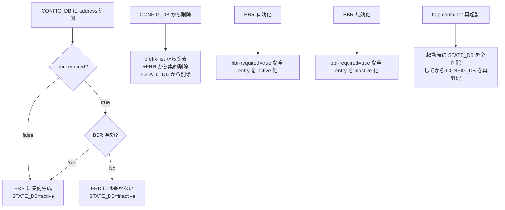

!!! success "裏取りステータス: Code-verified"
    `sonic-buildimage/src/sonic-bgpcfgd/bgpcfgd/managers_aggregate_address.py` L23 `AggregateAddressMgr` が L41 で `BGP_BBR` を、L43 で STATE_DB `BGP_AGGREGATE_ADDRESS` を扱い、L73-81 で BBR 状態に応じた集約広告制御を実装。`main.py` L106 で `AggregateAddressMgr` が登録済み。CLI は `sonic-utilities/config/bgp_cli.py` / `show/bgp_cli.py` に取り込まれており、YANG は `sonic-yang-models/yang-models/sonic-bgp-aggregate-address.yang` に存在（verified at: 2026-05-09）。

# BBR 連動の BGP ルート集約（BGP_AGGREGATE_ADDRESS）

## 概要

BGP の集約広告（aggregate-address）は経路数を圧縮する基本機能だが、SONiC は従来 CONFIG_DB / CLI から集約アドレスを設定する手段を持たず、FRR 設定を直接書き換える必要があった[^1]。さらに BBR（Bounce Back Routing）が無効な状態で集約だけを入れると、**contributing route の到達不能性に起因するパケットドロップ** が発生しうる。

本機能は CONFIG_DB に `BGP_AGGREGATE_ADDRESS` テーブルを新設し、**BBR の有効状態に応じて集約広告を条件付きで生成** する仕組みを導入する。各エントリの状態は STATE_DB に `active` / `inactive` で公開される[^1]。

## 動作仕様

### CONFIG_DB スキーマと YANG

新規 YANG モジュール `sonic-bgp-aggregate-address`（`revision 2024-07-17`）が次のリストを定義する[^1]:

| フィールド | 型 | 既定 | 説明 |
|-----------|----|----|------|
| `aggregate-address` | ip-prefix | — | 広告する集約プレフィックス（key） |
| `bbr-required` | bool | false | true 時は BBR 有効時のみ集約広告を生成 |
| `summary-only` | bool | false | true 時は contributing route を抑止し集約のみ広告 |
| `as-set` | bool | false | AS_SET を AS_PATH に付加して広告 |
| `aggregate-address-prefix-list` | string | "" | 集約アドレスを追加する prefix-list 名 |
| `contributing-address-prefix-list` | string | "" | contributing 用 prefix-list 名（prefix-length フィルタ付き）|

```json
"BGP_AGGREGATE_ADDRESS": {
  "192.168.0.0/24": { "bbr-required": "true", "summary-only": "false",
                      "aggregate-address-prefix-list": "AGG_ROUTES_V4",
                      "contributing-address-prefix-list": "AGG_CONTRIBUTING_ROUTES_V4" },
  "fc00::/63":      { "bbr-required": "true", "summary-only": "true", "as-set": "true" }
}
```

### bgpcfgd の挙動

`bgpcfgd` は `BGP_AGGREGATE_ADDRESS` と `BGP_BBR` の両キーを購読し、次のイベントに応答する[^1]:



### prefix-list 連携

各エントリは 2 種の prefix-list に集約アドレスを **登録** できる[^1]:

- `aggregate-address-prefix-list`: 集約アドレスをそのまま append。
- `contributing-address-prefix-list`: 集約アドレスを **prefix-length フィルタ付き** で append（集約 prefix-length 以上の長さのプレフィックスにマッチ）。

`summary-only=true` 時は FRR 側で contributing route が広告抑止される。

### STATE_DB

```json
"BGP_AGGREGATE_ADDRESS": {
  "192.168.0.0/24": { "state": "inactive",
                      "aggregate-address-prefix-list": "AGG_ROUTES_V4",
                      "contributing-address-prefix-list": "AGG_CONTRIBUTING_ROUTES_V4" }
}
```

`active` は実際に FRR / bgpd に集約広告が入っている状態、`inactive` は CONFIG_DB に登録はあるが BBR 条件未充足で広告していない状態を示す[^1]。

<!-- evidence:
source: sonic-net/SONiC/doc/BGP/BGP-route-aggregation-with-bbr-awareness.md#L237-L260 (sha: 49bab5b5ff0e924f1ea52b3d9db0dfa4191a7c06)
excerpt: |
  The process bgpcfgd in bgp container will subscribe the keys BGP_AGGREGATE_ADDRESS and BGP_BBR in config DB.
  ... 1. Add address in config DB: if BRR requirement is satisfied, generate aggregated address in the bgp container ...
  ... 5. The bgp container restarted or start up: The bgp container will remove all the addresses in state DB before processing any address in config DB.
reasoning: 各イベントのフロー（active/inactive 遷移、再起動時のクリア）の根拠。
-->

## 設定

### 関連する CONFIG_DB

| Table | 説明 |
|-------|------|
| `BGP_AGGREGATE_ADDRESS` | 本機能の本体。プレフィックスごとの集約パラメータ |
| `BGP_BBR` | 既存。BBR feature の有効/無効 |

### 関連する CLI

| CLI | 用途 |
|-----|------|
| `show ip bgp aggregate-address` | IPv4 の集約状態（A=As Set / B=BBR Required / S=Summary Only フラグ）|
| `show ipv6 bgp aggregate-address` | IPv6 同上 |
| `config bgp aggregate-address add <prefix> [--bbr-required] [--summary-only] [--as-set] [--aggregate-address-prefix-list X] [--contributing-address-prefix-list Y]` | 追加 |
| `config bgp aggregate-address remove <prefix>` | 削除 |

show 出力例[^1]:

```
Flags: A - As Set, B - BBR Required, S - Summary Only

Prefix           State      Option Flags  Aggregate Address Prefix List  Contributing Address Prefix List
192.168.0.0/24   Active     S             AGG_ROUTES_V4                  AGG_CONTRIBUTING_ROUTES_V4
10.0.0.0/24      Inactive   A,B,S
```

### 設定例

```bash
config bgp aggregate-address add 192.168.0.0/24 --summary-only --as-set
config bgp aggregate-address add fc00:1::/64 --bbr-required \
  --aggregate-address-prefix-list AGG_ROUTE_V6 \
  --contributing-address-prefix-list CONTRIBUTING_ROUTE_V6
```

## 制限事項

- **CLOS で同一レイヤ非同期に展開すると trafic 偏重**: 同一レイヤの一部デバイスにだけ集約を入れると、トラフィックは詳細経路を持つ側に偏る。HLD は「全デバイス同時展開、または traffic 非感応シナリオでのみ使用」を明記している[^1]。
- **再起動時に STATE_DB を全クリア**: `bgp` コンテナ再起動時、まず STATE_DB の全 `BGP_AGGREGATE_ADDRESS` を消してから CONFIG_DB を再評価する。短時間ながら集約広告が消える可能性がある[^1]。

## 干渉する機能

- **BBR (`BGP_BBR`)**: `bbr-required=true` のエントリは BBR enable/disable に追従して active/inactive を切り替える。BBR を OFF→ON にすると対応する集約が一斉に有効化される。
- **prefix-list**: 既存の prefix-list を共有して使うため、prefix-list 編集との競合に注意（同名 prefix-list を別用途で使っていると entry の重複追加が起こり得る）。
- **FRR の `aggregate-address` コマンド**: 本機能は FRR 側のネイティブ `aggregate-address` を内部で叩く想定。手動で FRR に書いた集約とは管理が分離される。

## トラブルシューティング

- 集約が広告されない: `show ip bgp aggregate-address` で `Inactive` なら `bbr-required` と `BGP_BBR` の状態を確認。
- 削除しても集約が残る: STATE_DB のエントリと FRR `running-config` を比較。bgpcfgd ログで remove イベント処理を確認。
- prefix-list に意図しない entry: `aggregate-address-prefix-list` / `contributing-address-prefix-list` を共有している他用途を確認。

## 引用元

[^1]: `sonic-net/SONiC` `doc/BGP/BGP-route-aggregation-with-bbr-awareness.md` @ `49bab5b5ff0e924f1ea52b3d9db0dfa4191a7c06`
