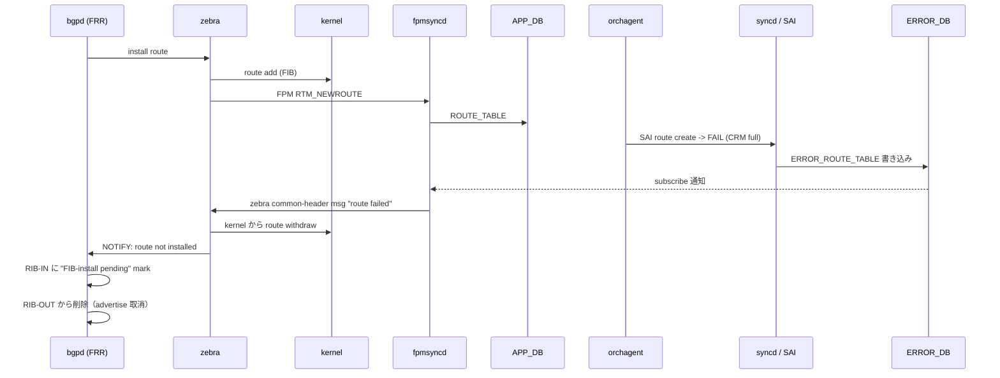

<!-- topics-tip -->
!!! tip "Topics で読み物として読む"
    この HLD は実装詳細を含みます。機能の概念・設定・運用を読み物として読みたい場合は [Topics 02 章: BGP と FRR 制御プレーン](../topics/02-bgp/index.md) を参照。
<!-- /topics-tip -->

!!! danger "裏取りステータス: Discrepancy-found（HLD 提案は現行 master に取り込まれていない）"
    `ERROR_ROUTE_TABLE` / `BGP_ERROR_CFG_TABLE` / `config bgp error-handling` CLI を `sonic-swss` / `sonic-utilities` / `sonic-buildimage` / `sonic-frr` / `sonic-buildimage/src/sonic-yang-models/` 全体に対して grep ヒット **0 件**（verified 2026-05-09）。本 HLD で提案された `ERROR_ROUTE_TABLE` 経由の FIB-install pending 機構は採用されず、後発の **[BGP Suppress FIB Pending](./bgp-suppress-announcements-of-routes-not-installed-in-hw.md)**（`dplane_fpm_nl` + `bgp suppress-fib-pending` コマンド）に置き換えられている。`sonic-buildimage/dockers/docker-fpm-frr/frr/bgpd/bgpd.main.conf.j2` L107 で `bgp suppress-fib-pending` のデフォルト有効化を確認。本 HLD は歴史的設計提案として残し、実装裏取りは BGP Suppress FIB Pending ページで継続。

# BGP Route Install Error Handling（ERROR_ROUTE_TABLE / FIB-install pending）

## 概要

[ASIC](../reference/glossary.md#term-asic) への route install が（[CRM](../reference/glossary.md#term-crm) 制限などで）失敗した場合に、その情報を `ERROR_DB.ERROR_ROUTE_TABLE` 経由で [fpmsyncd](../reference/glossary.md#term-fpmsyncd) → [zebra](../reference/glossary.md#term-zebra) → bgpd まで伝搬し、**bgpd 側で当該 prefix を "FIB-install pending" と marking して peer への advertise を抑止する** 仕組み[^1]。

要点:

- [ECMP](../reference/glossary.md#term-ecmp) の場合、NHG 内の一部 NH の install 失敗も route 全体の失敗として扱う
- [BGP](../reference/glossary.md#term-bgp) のリトライ機構は本 [HLD](../reference/glossary.md#term-hld) のスコープ外（user が `clear` 系コマンドで手動 retry 必要）[^1]
- warm reboot / GR 対応は別物としてスコープ外
- グローバル ON/OFF は `BGP_ERROR_CFG_TABLE:config.enable=true/false`。default disabled。enabled→disabled の切替は **BGP container 再起動推奨**

## 動作仕様

### コンポーネント間フロー



### 各レイヤの責務

| Layer | 責務 |
|-------|------|
| `syncd` / `orchagent` | [SAI](../reference/glossary.md#term-sai) 失敗を `ERROR_ROUTE_TABLE` に書き出す（既存 error handling framework 経由）[^1] |
| `fpmsyncd` | `BGP_ERROR_CFG_TABLE.enable=true` のとき `ERROR_ROUTE_TABLE` を subscribe。失敗を zebra socket 経由で送る（既存 [FPM](../reference/glossary.md#term-fpm) TCP socket を再利用） |
| `zebra` | 失敗 route を kernel から withdraw、RIB に "Not installed in hardware" フラグ。次善 NH を fpmsyncd に流さない |
| `bgpd` | "pending FIB install" を default 状態とし、success 通知でクリア。failure 通知では advertise しない / RIB-OUT から削除 |

### CONFIG_DB

```text
BGP_ERROR_CFG_TABLE|config:
  enable = "true" | "false"   # default false
```

### 表示

`show bgp ipv4 unicast` の status code に `#`（FIB-install pending）が増える。`show ip route` でも `#`（Not installed in hardware）が出る[^1]。

```text
Status codes: ... # FIB install pending.
*># 21.21.21.21/32   4.1.1.2   ...
```

### ECMP の扱い

`fpmsyncd` は ECMP route を NH list 込みで受け取る。NHG 単位でも install 失敗は「route 全体の失敗」とする[^1]。NH 1 件だけ失敗したような部分失敗は表現しない。

<!-- evidence:
source: sonic-net/SONiC/doc/bgp_error_handling/BGP_Route_Error_Handling_Arlo.md#L93-L96 (sha: 49bab5b5ff0e924f1ea52b3d9db0dfa4191a7c06)
excerpt: |
  A new class is added in fpmsyncd to subscribe to ERROR_ROUTE_TABLE present inside the ERROR_DB.
  Subscription to this table is sufficient to handle the errors in route installation.
  Currently, fpmsyncd has a TCP socket with Zebra listening on FPM_DEFAULT_PORT. ... We will reuse the same socket
  to send information back to Zebra.
reasoning: ERROR_ROUTE_TABLE 経由 + 既存 FPM socket 双方向の根拠。
-->

<!-- evidence-rendered:start -->
??? note "📋 検証エビデンス: sonic-net/SONiC/doc/bgp_error_handling/BGP_Route_Error_Handling_Arlo.md#L93-L96 (sha: 49bab5b5ff0e924f1ea52b3d9db0dfa4191a7c06)"

    **出典**:

    `sonic-net/SONiC/doc/bgp_error_handling/BGP_Route_Error_Handling_Arlo.md#L93-L96 (sha: 49bab5b5ff0e924f1ea52b3d9db0dfa4191a7c06)`

    **抜粋**:

    ```text
    A new class is added in fpmsyncd to subscribe to ERROR_ROUTE_TABLE present inside the ERROR_DB.
    Subscription to this table is sufficient to handle the errors in route installation.
    Currently, fpmsyncd has a TCP socket with Zebra listening on FPM_DEFAULT_PORT. ... We will reuse the same socket
    to send information back to Zebra.
    ```

    **判断根拠**: ERROR_ROUTE_TABLE 経由 + 既存 FPM socket 双方向の根拠。

<!-- evidence-rendered:end -->

## 設定

### CLI

```bash
config bgp error-handling enable
config bgp error-handling disable
```

`enabled→disabled` 切替時は HLD 上 **BGP docker 再起動が推奨**[^1]。disabled の間に投入された route には機能が効かないため、enable 後は session reset が現実的。

## 制限事項

- 失敗 route の **自動リトライは未実装**（user 操作で手動 retry）[^1]
- warm reboot / GR for BGP はスコープ外
- 部分 NH 失敗の表現はない（route 単位）
- enable/disable 切替時の挙動はやや不安定。container 再起動を推奨
- **EntityBulker の SAI_STATUS_ITEM_NOT_FOUND** ([sonic-swss#3270](https://github.com/sonic-net/sonic-swss/issues/3270)): `EntityBulker.flush` がルート削除処理時に既に存在しないエントリを SAI に渡し `SAI_STATUS_ITEM_NOT_FOUND` で失敗するケースがある。syslog に `flush_removing_entries: EntityBulker.flush remove entries failed, number of entries to remove: 1, status: SAI_STATUS_ITEM_NOT_FOUND` が記録される。ECMP ネクストホップグループの更新中に発生しやすく、orchagent は警告を出した上で処理を継続するが、状態の一時的な不整合が生じることがある。

## 干渉する機能

- **[BGP Suppress FIB Pending](./bgp-suppress-announcements-of-routes-not-installed-in-hw.md)**: 同じ目的で後発の dplane_fpm_nl + RTM_F_OFFLOAD 経路がある。両機能の共存・置き換え関係は要確認
- **CRM**: ASIC リソース不足を警告するメカニズム。本機能と組み合わせ、CRM threshold 越え前から advertise 抑止できる
- **[orchagent](../reference/glossary.md#term-orchagent) error framework**: `ERROR_ROUTE_TABLE` 自体は SAI failure 一般の枠組みの一部

## トラブルシューティング

- `show ip route` に `#` が増えない → `BGP_ERROR_CFG_TABLE.enable=true` 確認、fpmsyncd のログで subscribe 完了確認
- enable した直後の既存 route には適用されない → BGP session を `clear bgp *` で reset

<!-- diff-admonition -->
!!! diff "HLD と実装の差分"
    2026-05-09 時点の現行 master を裏取り。**本 HLD は採用されず、後発の BGP Suppress FIB Pending に置き換えられている**。

    ### 1. `ERROR_DB` / `ERROR_ROUTE_TABLE` は未実装

    - **HLD 記述**: 新規 [Redis](../reference/glossary.md#term-redis) DB `ERROR_DB` と `ERROR_ROUTE_TABLE` を導入し、orchagent → fpmsyncd → zebra → bgpd の経路で FIB-install 失敗を伝搬する。
    - **実装位置**: `sonic-swss-common/common/schema.h`、`sonic-swss/orchagent/`、`sonic-buildimage/src/sonic-yang-models/`、`sonic-frr/` のいずれにも `ERROR_ROUTE_TABLE` / `ERROR_DB`（独立 Redis DB id）の定義は **存在しない**（grep ヒット 0）。
    - **差分の中身**: HLD で計画された subscriber クラス（fpmsyncd 側 `ErrorListener` 等）も実装されていない。FPM socket の双方向化（zebra への送信路）も入っていない。
    - **読者への影響**: 「HLD のとおりに `ERROR_ROUTE_TABLE` を watch して BGP advertise を抑止する」設計を期待すると動かない。現行は orchagent の `SWSS_LOG_ERROR` で失敗ログが出るのみで、BGP 側は失敗を構造化された形で受け取らない。
    - **回避策**: route install 失敗による誤広告を防ぐには次節の **BGP Suppress FIB Pending** を使う。

    ### 2. `BGP_ERROR_CFG_TABLE` / `config bgp error-handling` CLI も未実装

    - **HLD 記述**: CLI `config bgp error-handling enable/disable` で `BGP_ERROR_CFG_TABLE` を ON/OFF する。
    - **実装位置**: `sonic-utilities/config/main.py` に `bgp error-handling` サブコマンドは存在せず、`sonic-yang-models` にも `sonic-bgp-error-cfg.yang` 相当は無い。
    - **差分の中身**: CLI / yang / [CONFIG_DB](../reference/glossary.md#term-config_db) スキーマ全てが提案レベルで止まっている。
    - **読者への影響**: 設定する手段が無いため、本 HLD の「条件分岐」自体が現行 master では発生しない。
    - **回避策**: 本機能は **設定しない**。必要な機能は次項に置き換わっている。

    ### 3. 後発機能 BGP Suppress FIB Pending が代替

    - **実装位置**: `sonic-buildimage/dockers/docker-fpm-frr/frr/bgpd/bgpd.main.conf.j2:107`
      ```text
      bgp suppress-fib-pending
      ```
      デフォルトで `bgpd` の起動 config に挿入される。[FRR](../reference/glossary.md#term-frr) 側は `dplane_fpm_nl` と zebra の RTM_F_OFFLOAD/RTM_F_TRAP フラグを利用し、ASIC への install 完了通知を受けるまで BGP advertise を保留する。
    - **差分の中身**: HLD は「ERROR_DB 経由で失敗を能動通知」だが、実装は「ASIC 取り込み成功の確認を待ってから広告する」**inverse** のアプローチ。失敗時の挙動は「ずっと pending のまま広告しない」となる。
    - **読者への影響**: 結果として運用観点では本 HLD の意図と同じ「未 install な route は広告しない」が満たされる。一方で「失敗の明示的なカウント／lookup table」は提供されない（pending のままという受動的な状態）。
    - **回避策**:
      - 実運用では BGP Suppress FIB Pending を有効のままにする（デフォルト有効）。
      - 「どの prefix が pending か」を知りたいときは `vtysh -c "show ip route <prefix>"` の `T>` / `>` flag（installed/offloaded）を確認するか、`show bgp ipv4 unicast` の status code を見る。
      - 詳細は [routing/bgp-suppress-announcements-of-routes-not-installed-in-hw.md](./bgp-suppress-announcements-of-routes-not-installed-in-hw.md) を参照。

    ### 結論

    **本 HLD（2019）は採用されなかった**。設計意図は後発の BGP Suppress FIB Pending（FRR `bgp suppress-fib-pending` + RTM_F_OFFLOAD）に引き継がれており、ERROR_DB 経由の仕組みは実装されていない。本ページは設計史としての参考。

    #### 関連 GitHub Issue / PR

    - [GitHub Issue / PR の関連リンクは未確認] — `ERROR_ROUTE_TABLE` / FIB-install pending の HLD 取り込みは fpmsyncd / orchagent の個別 PR に分散しており、HLD と直接紐づくトラッキング Issue / PR は確認できず。
<!-- /diff-admonition -->

### コマンド例

BGP route install error の有効状態と ERROR_DB を確認する (現行 master では未実装、Suppress FIB Pending に置換)。

```bash
show runningconfig bgp | grep -iE 'error|suppress'
redis-cli -n 0 keys 'ERROR_ROUTE_TABLE*'
docker exec bgp vtysh -c 'show bgp summary' | head
```

## 引用元

[^1]: `sonic-net/SONiC` `doc/bgp_error_handling/BGP_Route_Error_Handling_Arlo.md` @ `49bab5b5ff0e924f1ea52b3d9db0dfa4191a7c06`

<!-- concerns hint:
- ERROR_ROUTE_TABLE / ERROR_DB スキーマの現行 master 取り込み確認
- fpmsyncd 側 ERROR_ROUTE_TABLE subscriber と Zebra への送信ロジック実装確認
- BGP_ERROR_CFG_TABLE の sonic-yang-models 取り込み確認
- config bgp error-handling CLI の sonic-utilities 取り込み確認
- 後発 BGP Suppress FIB Pending（dplane_fpm_nl 経路）との置き換え関係 / 共存確認
- 2019 年 HLD のため現行実装乖離リスク（priority=high）
-->

<!-- next-action -->
## このページを読んだ後の次アクション

!!! tip "読み手向け"
    - **本機能を実運用で使う場合**: 本 HLD は採用見送り。後継機能 (下記リンク) を参照
    - **upstream 動向を追う場合**: 関連 issue / PR を [sonic-net/SONiC](https://github.com/sonic-net/SONiC) で検索（HLD タイトル / CONFIG_DB テーブル名 / Orch クラス名で grep するのが速い）
    - **代替手段 / 関連 reference**: 本ページの frontmatter `related` が空のため、[Reference 索引](../reference/index.md) から関連テーブル / CLI / YANG を辿る

!!! note "本ドキュメントの追跡"
    - monitor: `deprecated` / last_verified: `2026-05-09`
    - 次回再裏取りトリガ: biannual。一覧は [discrepancy-index](../reference/verification/discrepancy-index.md) を参照（運用詳細は repo の `meta/discrepancy-operations.md`）

<!-- /next-action -->

<!-- glossary-links-injected: c006405759d8 -->
