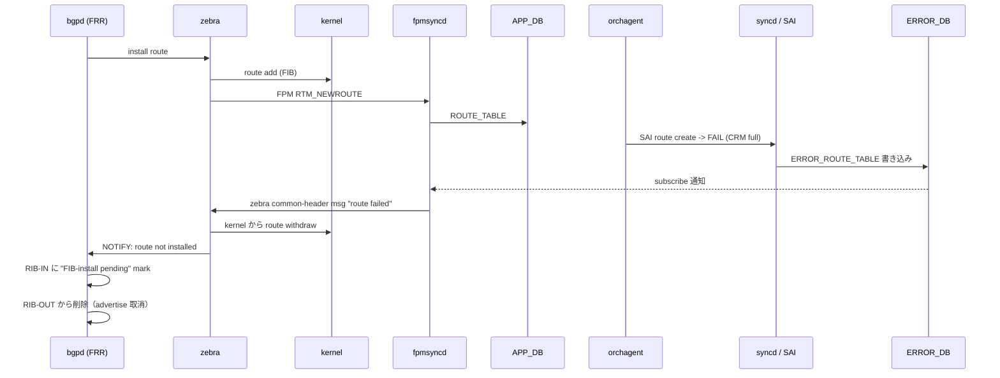

!!! warning "裏取りステータス: HLD-only / 古い HLD"
    本 HLD は 2019 年（Rev 0.1）の初期提案。同様の目的を持つ後発 HLD（[BGP Suppress FIB Pending](./bgp-suppress-announcements-of-routes-not-installed-in-hw.md)）が dplane_fpm_nl ベースで標準化されているため、本 HLD の `ERROR_ROUTE_TABLE` 経路が現行 master に残っているかは要確認。`priority=high`。

# BGP Route Install Error Handling（ERROR_ROUTE_TABLE / FIB-install pending）

## 概要

ASIC への route install が（CRM 制限などで）失敗した場合に、その情報を `ERROR_DB.ERROR_ROUTE_TABLE` 経由で fpmsyncd → zebra → bgpd まで伝搬し、**bgpd 側で当該 prefix を "FIB-install pending" と marking して peer への advertise を抑止する** 仕組み[^1]。

要点:

- ECMP の場合、NHG 内の一部 NH の install 失敗も route 全体の失敗として扱う
- BGP のリトライ機構は本 HLD のスコープ外（user が `clear` 系コマンドで手動 retry 必要）[^1]
- warm reboot / GR 対応は別物としてスコープ外
- グローバル ON/OFF は `BGP_ERROR_CFG_TABLE:config.enable=true/false`。default disabled。enabled→disabled の切替は **BGP container 再起動推奨**

## 動作仕様

### コンポーネント間フロー



### 各レイヤの責務

| Layer | 責務 |
|-------|------|
| `syncd` / `orchagent` | SAI 失敗を `ERROR_ROUTE_TABLE` に書き出す（既存 error handling framework 経由）[^1] |
| `fpmsyncd` | `BGP_ERROR_CFG_TABLE.enable=true` のとき `ERROR_ROUTE_TABLE` を subscribe。失敗を zebra socket 経由で送る（既存 FPM TCP socket を再利用） |
| `zebra` | 失敗 route を kernel から withdraw、RIB に "Not installed in hardware" フラグ。次善 NH を fpmsyncd に流さない |
| `bgpd` | "pending FIB install" を default 状態とし、success 通知でクリア。failure 通知では advertise しない / RIB-OUT から削除 |

### CONFIG_DB

```
BGP_ERROR_CFG_TABLE|config:
  enable = "true" | "false"   # default false
```

### 表示

`show bgp ipv4 unicast` の status code に `#`（FIB-install pending）が増える。`show ip route` でも `#`（Not installed in hardware）が出る[^1]。

```
Status codes: ... # FIB install pending.
*># 21.21.21.21/32   4.1.1.2   ...
```

### ECMP の扱い

`fpmsyncd` は ECMP route を NH list 込みで受け取る。NHG 単位でも install 失敗は「route 全体の失敗」とする[^1]。NH 1 件だけ失敗したような部分失敗は表現しない。

<!-- evidence:
source: sonic-net/SONiC/doc/bgp_error_handling/BGP_Route_Error_Handling_Arlo.md#L93-L96 (sha: 49bab5b5ff0e924f1ea52b3d9db0dfa4191a7c06)
excerpt: |
  A new class is added in fpmsyncd to subscribe to ERROR_ROUTE_TABLE present inside the ERROR_DB.
  Subscription to this table is sufficient to handle the errors in route installation.
  Currently, fpmsyncd has a TCP socket with Zebra listening on FPM_DEFAULT_PORT. ... We will reuse the same socket
  to send information back to Zebra.
reasoning: ERROR_ROUTE_TABLE 経由 + 既存 FPM socket 双方向の根拠。
-->

## 設定

### CLI

```
config bgp error-handling enable
config bgp error-handling disable
```

`enabled→disabled` 切替時は HLD 上 **BGP docker 再起動が推奨**[^1]。disabled の間に投入された route には機能が効かないため、enable 後は session reset が現実的。

## 制限事項

- 失敗 route の **自動リトライは未実装**（user 操作で手動 retry）[^1]
- warm reboot / GR for BGP はスコープ外
- 部分 NH 失敗の表現はない（route 単位）
- enable/disable 切替時の挙動はやや不安定。container 再起動を推奨

## 干渉する機能

- **[BGP Suppress FIB Pending](./bgp-suppress-announcements-of-routes-not-installed-in-hw.md)**: 同じ目的で後発の dplane_fpm_nl + RTM_F_OFFLOAD 経路がある。両機能の共存・置き換え関係は要確認
- **CRM**: ASIC リソース不足を警告するメカニズム。本機能と組み合わせ、CRM threshold 越え前から advertise 抑止できる
- **orchagent error framework**: `ERROR_ROUTE_TABLE` 自体は SAI failure 一般の枠組みの一部

## トラブルシューティング

- `show ip route` に `#` が増えない → `BGP_ERROR_CFG_TABLE.enable=true` 確認、fpmsyncd のログで subscribe 完了確認
- enable した直後の既存 route には適用されない → BGP session を `clear bgp *` で reset

## 引用元

[^1]: `sonic-net/SONiC` `doc/bgp_error_handling/BGP_Route_Error_Handling_Arlo.md` @ `49bab5b5ff0e924f1ea52b3d9db0dfa4191a7c06`

<!-- concerns hint:
- ERROR_ROUTE_TABLE / ERROR_DB スキーマの現行 master 取り込み確認
- fpmsyncd 側 ERROR_ROUTE_TABLE subscriber と Zebra への送信ロジック実装確認
- BGP_ERROR_CFG_TABLE の sonic-yang-models 取り込み確認
- config bgp error-handling CLI の sonic-utilities 取り込み確認
- 後発 BGP Suppress FIB Pending（dplane_fpm_nl 経路）との置き換え関係 / 共存確認
- 2019 年 HLD のため現行実装乖離リスク（priority=high）
-->
