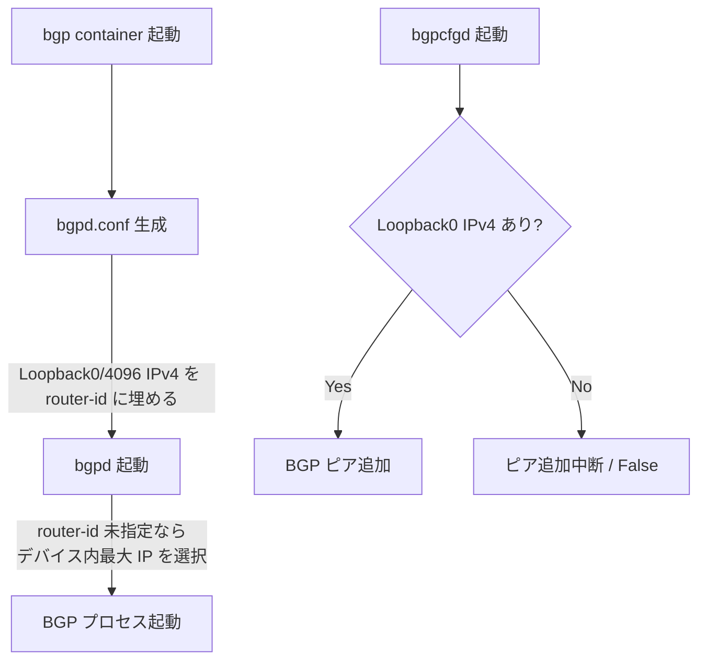
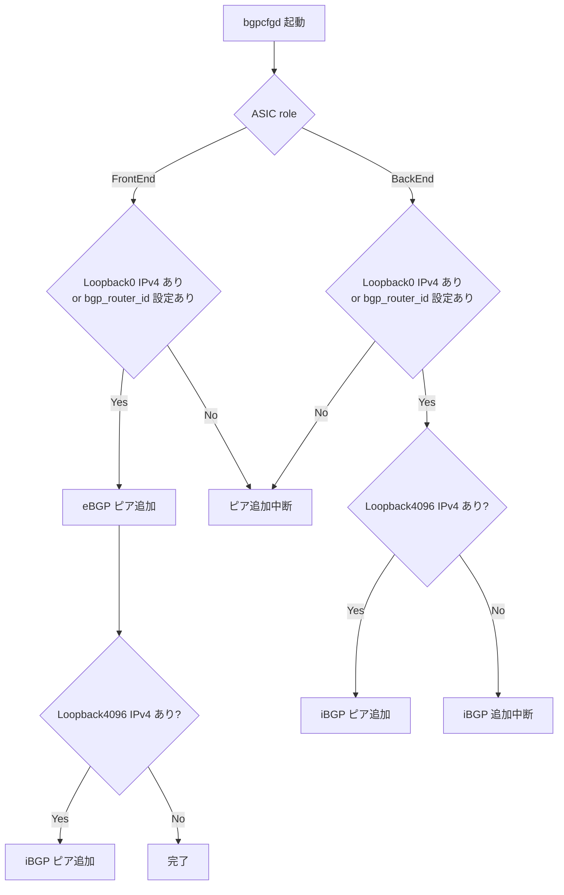
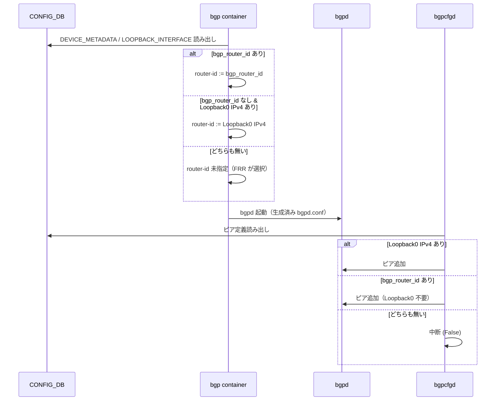

<!-- topics-tip -->
!!! tip "Topics で読み物として読む"
    この HLD は実装詳細を含みます。機能の概念・設定・運用を読み物として読みたい場合は [Topics 02 章: BGP と FRR 制御プレーン](../topics/02-bgp/index.md) を参照。
<!-- /topics-tip -->

!!! success "裏取りステータス: Code-verified"
    `sonic-buildimage/src/sonic-bgpcfgd/bgpcfgd/managers_bgp.py` L185-189 で「`Loopback*` の IPv4 が無く、かつ `DEVICE_METADATA.localhost.bgp_router_id` も設定されていない場合のみ peer 追加を中断」する分岐を確認。`sonic-buildimage/dockers/docker-fpm-frr/frr/bgpd/bgpd.main.conf.j2` L142-149 で `'bgp_router_id' in DEVICE_METADATA['localhost']` のとき `bgp router-id <addr>` をテンプレート出力することを確認 (verified at: 2026-05-09)。

# BGP router-id を明示的に設定する（DEVICE_METADATA.bgp_router_id）

## 概要

[SONiC](../reference/glossary.md#term-sonic) の [BGP](../reference/glossary.md#term-bgp) は長らく **Loopback インタフェースの IPv4 アドレスを暗黙的に router-id として使う** 設計になっていた。具体的には単一 [ASIC](../reference/glossary.md#term-asic) では `Loopback0`、マルチ ASIC では `Loopback4096` の IPv4 アドレスをそのまま使用する。さらに `bgpcfgd` 側にも「`Loopback0` の IPv4 が存在しなければ BGP ピアを追加しない」という強い依存があり、Loopback アドレスを使わない構成や、BGP router-id とインタフェースアドレスを分離したい運用では制約となっていた[^1]。

本機能は `CONFIG_DB.DEVICE_METADATA|localhost` に `bgp_router_id` フィールドを追加し、**ユーザが任意の IPv4 を BGP router-id として明示指定できる** ようにする。同時に、`bgp_router_id` が設定されている場合に限り、単一 ASIC 系の BGP ピア追加から `Loopback0` IPv4 への強い依存を切り離す。`bgp_router_id` を設定しない場合、振る舞いは従来と完全に同一である。

## 動作仕様

### 既存挙動（変更前）



要点は次のとおり。

- bgpd 設定生成時に Loopback0/4096 の IPv4 をそのまま router-id として埋め込む。なければ未指定のまま起動。
- 未指定で起動した bgpd は「デバイス内で最大の IP アドレス」を選ぶが、ネットワーク内で一意でないと BGP が動かないリスクがある[^1]。
- `bgpcfgd` は Loopback0 の IPv4 が無いとピア追加自体を打ち切る。マルチ ASIC では eBGP ピア追加に同じ条件が入る。

### 新挙動（`bgp_router_id` 設定時）

新ロジックは router-id 決定とピア追加の 2 箇所で分岐する。

#### router-id 決定ロジック

| 状況 | Loopback0/4096 IPv4 あり | Loopback0/4096 IPv4 なし |
|------|--------------------------|--------------------------|
| `bgp_router_id` 設定あり | `bgp_router_id` を採用 | `bgp_router_id` を採用 |
| `bgp_router_id` 設定なし | Loopback0/4096 IPv4 を採用 | router-id 未指定（[FRR](../reference/glossary.md#term-frr) デフォルト動作。[zebra](../reference/glossary.md#term-zebra) 未起動時は 0.0.0.0）|

つまり **`bgp_router_id` が定義されていれば常にそれを最優先で採用** し、Loopback アドレスは無関係になる。

<!-- evidence:
source: sonic-net/SONiC/doc/BGP/BGP-router-id.md#L70-L84 (sha: 49bab5b5ff0e924f1ea52b3d9db0dfa4191a7c06)
excerpt: |
  Add a field bgp_router_id in CONFIG_DB["DEVICE_METADATA"]["localhost"]...
  If CONFIG_DB["DEVICE_METADATA"]["localhost"]["bgp_router_id"] configured, always use it as BGP router id.
  ... When bgp_router_id doesn't be configured, the behavior is totally same as previously.
reasoning: 「bgp_router_id があれば常にそれを使う」「未設定時は従来動作維持」という設計の根拠。
-->

<!-- evidence-rendered:start -->
??? note "📋 検証エビデンス: sonic-net/SONiC/doc/BGP/BGP-router-id.md#L70-L84 (sha: 49bab5b5ff0e924f1ea52b3d9db0dfa4191a7c06)"

    **出典**:

    `sonic-net/SONiC/doc/BGP/BGP-router-id.md#L70-L84 (sha: 49bab5b5ff0e924f1ea52b3d9db0dfa4191a7c06)`

    **抜粋**:

    ```text
    Add a field bgp_router_id in CONFIG_DB["DEVICE_METADATA"]["localhost"]...
    If CONFIG_DB["DEVICE_METADATA"]["localhost"]["bgp_router_id"] configured, always use it as BGP router id.
    ... When bgp_router_id doesn't be configured, the behavior is totally same as previously.
    ```

    **判断根拠**: 「bgp_router_id があれば常にそれを使う」「未設定時は従来動作維持」という設計の根拠。

<!-- evidence-rendered:end -->

#### BGP ピア追加ロジック（単一 ASIC）

| 状況 | Loopback0 IPv4 あり | Loopback0 IPv4 なし |
|------|---------------------|---------------------|
| `bgp_router_id` 設定あり | ピア追加 | ピア追加 |
| `bgp_router_id` 設定なし | ピア追加 | 追加しない（従来挙動） |

`bgp_router_id` が設定されている限り、単一 ASIC では Loopback0 IPv4 が無くても BGP ピアを追加する。`bgp_router_id` が無い場合の挙動は従来どおり Loopback0 必須。

#### BGP ピア追加ロジック（マルチ ASIC）

マルチ ASIC では各 ASIC ごとに `bgp[x]` コンテナと config_db が独立に存在し、ASIC は FrontEnd / BackEnd の役割を持つ。新ロジックは次のように振る舞う[^1]。



注意点として、**iBGP ピア追加は依然として `Loopback4096` IPv4 を必須** とする。[HLD](../reference/glossary.md#term-hld) は内部ピアの追加ロジックは今回の変更対象外と明記している[^1]。

### 動作シーケンス（単一 ASIC、新ロジック）



## 設定

### 関連する CONFIG_DB

| Table | Key | フィールド | 説明 |
|-------|-----|-----------|------|
| `DEVICE_METADATA` | `localhost` | `bgp_router_id` | BGP router-id として使う IPv4 アドレス。未設定時は従来動作 |

ABNF スキーマ抜粋[^1]:

```abnf
key             = DEVICE_METADATA|localhost
bgp_router_id   = inet:ipv4-address
```

マルチ ASIC では各 ASIC の `config_db` に同じキーで書き込む必要がある。

### 関連する CLI

HLD には専用の `config` / `show` CLI 追加は記載されていない。`config_db.json` 直接編集または既存の汎用 [CONFIG_DB](../reference/glossary.md#term-config_db) 操作経路（`sonic-cfggen` / [gNMI](../reference/glossary.md#term-gnmi) 等）から設定する想定。

### 関連する YANG

`sonic-device_metadata` モジュールに `bgp_router_id` リーフ（`inet:ipv4-address` 型）が追加される[^1]。

```yang
module sonic-device_metadata {
    container sonic-device_metadata {
        container DEVICE_METADATA {
            container localhost {
                leaf bgp_router_id {
                    type inet:ipv4-address;
                }
            }
        }
    }
}
```

### 設定例

```json
{
    "DEVICE_METADATA": {
        "localhost": {
            "bgp_router_id": "10.1.0.32"
        }
    }
}
```

## 干渉する機能

- **Loopback0 / Loopback4096**: 引き続き iBGP ピア追加（マルチ ASIC）の必須条件として `Loopback4096` IPv4 が要求される。`bgp_router_id` を設定しても iBGP の依存は解消されない。
- **FRR の router-id 自動選択**: `bgp_router_id` も Loopback も無い場合、FRR は最大 IP アドレスを router-id に選ぶ。zebra 未起動時は `0.0.0.0` が選ばれる旨が HLD に明記されている[^1]。ネットワーク全体で一意でないと BGP セッションが確立できない。
- **[bgpcfgd](../reference/glossary.md#term-bgpcfgd)**: ピア追加判定が `bgp_router_id` の有無を見るように拡張される。

## トラブルシューティング

- BGP セッションが上がらないとき、まず `vtysh -c "show bgp summary"` で実際に使われている router-id を確認する。`bgp_router_id` 設定値と一致しているはずである。
- ピアが一切登録されない場合、`bgpcfgd` のログを確認する。`Loopback0` IPv4 不在で `bgp_router_id` 未設定だと「neighbors adding を中断」する経路に入る。
- マルチ ASIC で iBGP のみ上がらない場合、対応 ASIC の `Loopback4096` IPv4 設定を確認する。`bgp_router_id` では iBGP 依存は解消されない。

### コマンド例

明示設定された router-id が BGP セッションに反映されているか確認する。

```bash
sonic-cfggen -d -v 'DEVICE_METADATA["localhost"]["bgp_router_id"]'
docker exec bgp vtysh -c 'show bgp summary' | head
docker logs bgp 2>&1 | grep -i 'router-id' | tail
```

## 制限事項

- router-id を自動選出から明示設定に切り替える際、FRR が稼働中だと一度 BGP セッションが reset される。メンテナンス時間に実施する。
- multi-vrf / multi-asic 環境では [VRF](../reference/glossary.md#term-vrf) / namespace ごとに router-id を分離設定する必要があり、共通 ID 使用は実装上推奨されない。
- 設定変更後に `config_db.json` を保存し忘れるとリブート時に自動選出に戻る。`config save -y` の運用を明示する。

## 引用元

[^1]: `sonic-net/SONiC` `doc/BGP/BGP-router-id.md` @ `49bab5b5ff0e924f1ea52b3d9db0dfa4191a7c06`

<!-- glossary-links-injected: ec18b66e3507 -->
