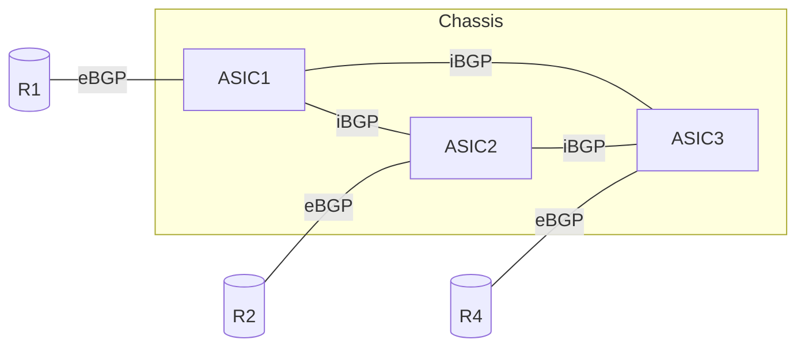
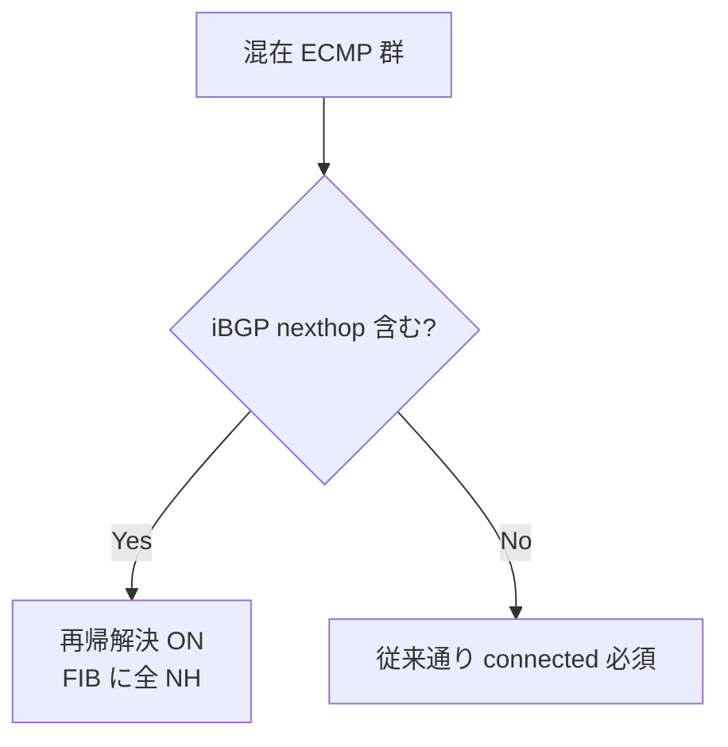

!!! success "裏取りステータス: Code-verified"
    `docker-fpm-frr/frr/bgpd/templates/voq_chassis/{instance,policies,peer-group}.conf.j2` の voq_chassis テンプレート、`instance.conf.j2:5` で `bgp bestpath peer-type multipath-relax`、`bgpd.main.conf.j2:61,63,141,159,170,176,198` で `voq_chassis` 変数分岐、`sonic-config-engine/minigraph.py:2277` で `BGP_VOQ_CHASSIS_NEIGHBOR` テーブル生成を確認 (verified at: 2026-05-09)。

# VoQ シャーシでの BGP 構成

## 読み手が知りたいこと

- なぜ VoQ シャーシは普通の BGP 設定では駄目で、ASIC 間で **ECMP 集合が同一** である必要があるのか
- そのために必要な 4 つの設定は何か（特に `bgp bestpath peer-type multipath-relax` の役割）
- どの CONFIG_DB テーブルと minigraph 要素で「VoQ 内部 iBGP ピア」を表現するか
- `bgp shutdown all` 等の運用 CLI は内部ピアを扱うのか

## なぜ ASIC 間 ECMP 整合性が要るか

VoQ（Virtual Output Queue）シャーシは複数 ASIC を 1 論理ルータに束ねる。転送決定は **入口 ASIC で 1 回だけ** 行われ、その後はファブリック経由で出口へ運ばれる。そのためある宛先の **ECMP nexthop 集合が ASIC ごとに異なる** と、入口 ASIC ごとにロードバランスがブレる[^1]。

本 HLD はそれを防ぐ 3 つの仕組みを定義する[^1]:

1. ASIC 間で **iBGP フルメッシュ** を張り、`addpath-tx-all-paths` で全 eBGP 学習経路を交換
2. 新規 FRR コマンド `bgp bestpath peer-type multipath-relax` で eBGP/iBGP 混在 ECMP を許す
3. `BGP_VOQ_CHASSIS_NEIGHBOR` テーブルと `bgpcfgd` の `voq_chassis` テンプレートで生成



全 ASIC は **同一 AS**。1 セッションで IPv4/IPv6 両ファミリを運ぶが IPv6 ユニキャストは別途 activate が要る[^1]。iBGP nexthop の再帰解決は VOQ HLD の inband recycle port / グローバル neighbor テーブルが前提[^1]。

## ECMP 整合性のための 4 設定

[^1]

| 設定 | 目的 | FRR コマンド |
|------|------|-------------|
| `addpath-tx-all-paths` | 全 eBGP 学習経路を iBGP に流す | `neighbor <peer> addpath-tx-all-paths` |
| 混在 ECMP 許可 | eBGP/iBGP 混在で ECMP 群を作る | `bgp bestpath peer-type multipath-relax`（新規）|
| 再帰解決の選択的 ON | 混在 ECMP の iBGP nexthop を FIB に書く | 上記の副作用として自動 |
| `maximum-paths ibgp` を eBGP と一致 | ASIC 間で ECMP サイズを揃える | `maximum-paths ibgp <n>` |

### なぜ multipath-relax が要るか

通常 BGP best-path（RFC 4271 §9.1.2.2 d）では eBGP が iBGP より優先される。R1/R4 から eBGP、R2 から iBGP（他 ASIC 経由）で同等コスト学習した場合、デフォルトでは ASIC1=`{R1,R4}`、ASIC2=`{R2}`、ASIC3=`{R1,R2,R4}` と ECMP 集合が割れる[^1]。

`bgp bestpath peer-type multipath-relax` は **最良経路の選択順序自体は変えず**（eBGP が依然 best）、**ECMP 群への組み込み** で peer type 差を無視する。これにより全 ASIC で `{R1,R2,R4}` が一致する。

### 再帰解決の取り扱い

混在 ECMP 群が RIB に乗ると、BGP は通常「best path が eBGP なら RIB nexthop の再帰解決を許さない」を取り、iBGP 学習 nexthop が FIB から落ちて整合性が崩れる[^1]。グローバルの `bgp disable-ebgp-connected-route-check` は副作用が大きい。代わりに HLD は **`multipath-relax` 設定時に限り、iBGP nexthop が ECMP に含まれる場合だけ RIB→FIB の再帰解決を再有効化** する FRR 改修を提案[^1]。



eBGP ピア自身が再帰解決を要する nexthop を送ってきた場合は **invalid 扱いで ECMP に入らない**（RIB→FIB の再帰解決は最初の validity 判定には影響しない）[^1]。

## CONFIG_DB / minigraph 拡張

`BGP_VOQ_CHASSIS_NEIGHBOR` を新設。スキーマは `BGP_NEIGHBOR` と同一で、**bgpcfgd で別テンプレート（`voq_chassis`）を引くためのフラグ** の役割[^1]。`voq_chassis` テンプレートは上記 4 設定を集約した peer-group を定義する。

minigraph→CONFIG_DB 変換は `BGPSession` 要素の `<VoQChassisInternal>true</VoQChassisInternal>` を読み、該当ピアを `BGP_VOQ_CHASSIS_NEIGHBOR` に振り分ける[^1]:

```xml
<BGPSession>
  <StartRouter>OCPSCH0104001MS</StartRouter>
  <StartPeer>10.10.1.18</StartPeer>
  <EndRouter>OCPSCH01040EELF</EndRouter>
  <EndPeer>10.10.1.17</EndPeer>
  <VoQChassisInternal>true</VoQChassisInternal>
</BGPSession>
```

## CLI（internal/external の扱い）

VoQ シャーシでは `BGP_VOQ_CHASSIS_NEIGHBOR` のピアを **internal** として分類[^1]:

| CLI | 既存挙動 | VoQ での挙動 |
|-----|---------|-----------|
| `bgp shutdown all` | external eBGP のみ shut | 同左（internal 除外）|
| `bgp startup all` | external eBGP のみ起動 | 同左 |
| `show ip(v6) bgp summary` | display=frontend で internal 非表示 | 同左 |
| `bgp remove neighbor` | 内外指定可 | 実装内部で `BGP_VOQ_CHASSIS_NEIGHBOR` も参照 |

`-d all` で internal を含めるオプションが追加される[^1]。

## 設定

### 関連する CONFIG_DB

| Table | 説明 |
|-------|------|
| `BGP_VOQ_CHASSIS_NEIGHBOR` | VoQ 内 iBGP ピア（スキーマは `BGP_NEIGHBOR` と同一）|
| `BGP_NEIGHBOR` | 外部 eBGP ピア（変更なし）|

### FRR 設定生成例

```
neighbor 10.10.1.17 remote-as <chassis-as>
neighbor 10.10.1.17 peer-group VOQ_CHASSIS_PG
!
address-family ipv4 unicast
 neighbor VOQ_CHASSIS_PG addpath-tx-all-paths
 maximum-paths 64
 maximum-paths ibgp 64
 bgp bestpath peer-type multipath-relax
exit-address-family
```

## 制限事項

- **新規 FRR コマンド** `bgp bestpath peer-type multipath-relax` の SONiC 同梱 FRR への取り込み状況は要追跡
- **AS_PATH prepending 禁止**: ASIC 間 iBGP では eBGP 学習を AS_PATH 不変で渡す必要あり[^1]
- **ルートモニタ**: 既存 iBGP route monitor は全 ASIC とピアリングする必要がある（1 ASIC だけだと他 ASIC の経路が見えない）[^1]
- **過剰経路の subset**: 等コスト経路数が `maximum-paths` を超えると ASIC ごとに異なる subset を選びうる。HLD はこれを許容[^1]

## 干渉する機能

- **`maximum-paths` の対称設定**: eBGP 側と `maximum-paths ibgp` を **必ず同値**[^1]
- **VOQ HLD の inband recycle port**: iBGP nexthop の再帰解決のためグローバル neighbor テーブル由来ホストルートに依存[^1]
- **`bgp disable-ebgp-connected-route-check`**: グローバル設定としては使わない方針[^1]

## トラブルシューティング

- ASIC 間で ECMP が割れる → 各 ASIC で `show bgp ipv4 unicast <prefix>` を比較。`addpath-tx-all-paths` と `maximum-paths ibgp` を確認
- iBGP nexthop が FIB に出ない → `show ip route <prefix>` の `inactive` を確認。`bgp bestpath peer-type multipath-relax` 設定の有無
- 内部ピアが `BGP_NEIGHBOR` に入る → `<VoQChassisInternal>` 要素と `sonic-config-engine` バージョン

## 関連 Topic

- [12 Multi-ASIC / VoQ / architecture](../topics/12-multi-asic-voq/architecture.md)
- [12 Multi-ASIC / VoQ / internals](../topics/12-multi-asic-voq/internals.md)
- [02 BGP / advanced](../topics/02-bgp/advanced.md)

## 引用元

[^1]: `sonic-net/SONiC` `doc/voq/bgp_voq_chassis.md` @ `49bab5b5ff0e924f1ea52b3d9db0dfa4191a7c06`

<!-- topics-back-ref -->
## 関連 Topics

- [Topics: Multi-ASIC / VOQ Chassis](../topics/12-multi-asic-voq/index.md)

<!-- /topics-back-ref -->
