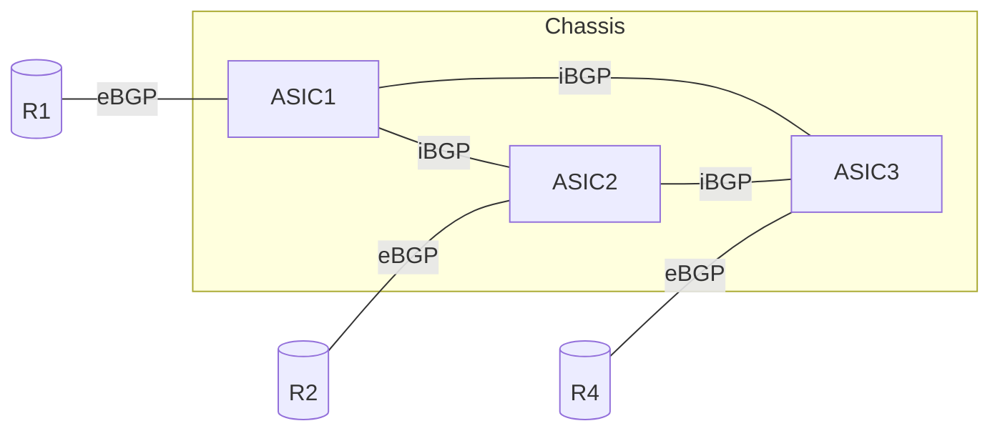
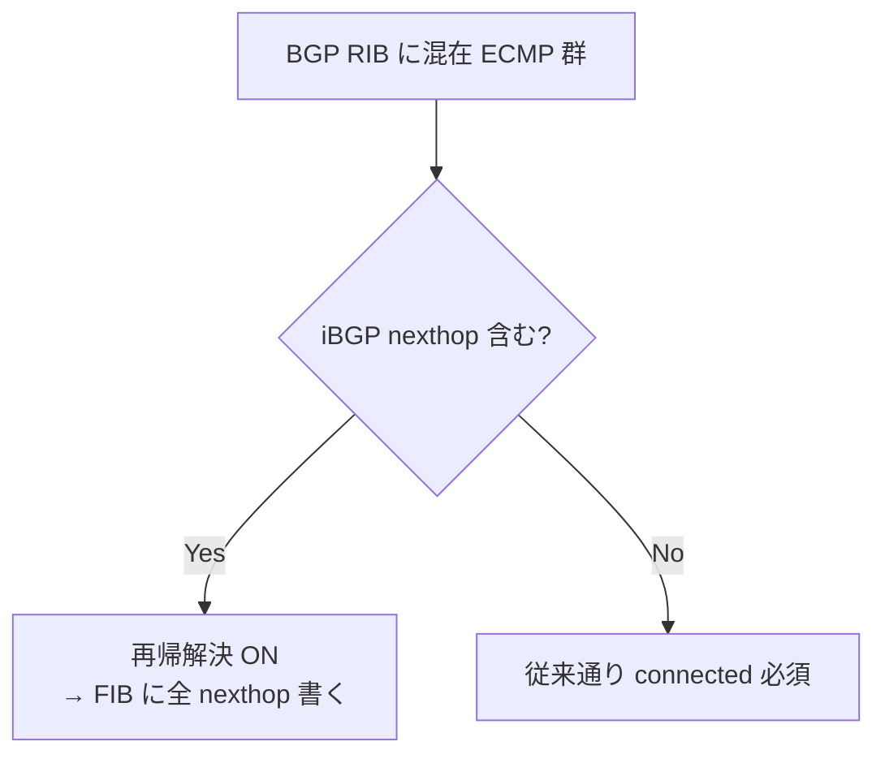

!!! success "裏取りステータス: Code-verified"
    現行 master で実装済みを確認。`sonic-buildimage/dockers/docker-fpm-frr/frr/bgpd/templates/voq_chassis/{instance,policies,peer-group}.conf.j2` の voq_chassis テンプレート、`instance.conf.j2:5` で `bgp bestpath peer-type multipath-relax`、`bgpd.main.conf.j2:61,63,141,159,170,176,198` で `voq_chassis` 変数による分岐、`sonic-buildimage/src/sonic-config-engine/minigraph.py:2277` で `BGP_VOQ_CHASSIS_NEIGHBOR` テーブル生成を確認（verified at: 2026-05-09）。

# VoQ シャーシでの BGP 構成（iBGP フルメッシュ + addpath / multipath-relax）

## 概要

VoQ（Virtual Output Queue）シャーシは複数 ASIC インスタンスから構成される単一論理ルータである。トラフィックは入口 ASIC で **一度だけ** 転送決定が行われ、その後はファブリック経由で出口 ASIC に運ばれる。したがって、ある宛先に対する ECMP ネクストホップ集合が **どの ASIC インスタンスでも同一でなければ**、入口 ASIC ごとにロードバランス挙動がブレてしまう[^1]。

本 HLD は VoQ シャーシ内で「同じプレフィックスに対して同じ ECMP 集合が選ばれる」ことを保証する BGP 構成を定義する。具体的には次の 3 点である[^1]:

1. ASIC インスタンス間で **iBGP フルメッシュ** を張り、`addpath-tx-all-paths` で eBGP 学習経路を全て交換する
2. FRR に新規追加する `bgp bestpath peer-type multipath-relax` で eBGP/iBGP 混在の ECMP 群を許す
3. CONFIG_DB に `BGP_VOQ_CHASSIS_NEIGHBOR` テーブルを新設し、`bgpcfgd` の `voq_chassis` テンプレートで FRR コンフィグを生成する

## 動作仕様

### iBGP フルメッシュとアドレスファミリ

全 ASIC インスタンスは **同一 AS** に所属する。各インスタンスは外部の eBGP ピアから経路を学習し、それを iBGP メッシュ経由で他インスタンスに広告する。1 セッションで IPv4/IPv6 両ファミリを運ぶが、IPv6 ユニキャストは別途 activate する必要がある[^1]。



iBGP の再帰ネクストホップ解決は VoQ シャーシのグローバル neighbor テーブル由来のホストルートに依存する。詳細は VOQ HLD（`doc/voq/voq_hld.md`）の Inband recycle port 節を参照[^1]。

### ECMP 整合性のための 4 つの設定

各 ASIC インスタンスで **同じ ECMP 集合** が形成されるよう、HLD は次の挙動を要求する[^1]:

| 設定 | 目的 | FRR コマンド |
|------|------|-------------|
| `addpath-tx-all-paths` | eBGP 学習経路を全て iBGP に流す | `neighbor <peer> addpath-tx-all-paths` |
| 混在 ECMP 許可 | eBGP/iBGP path で同一 ECMP 群を作る | `bgp bestpath peer-type multipath-relax`（**新規追加**） |
| 再帰解決の選択的有効化 | 混在 ECMP 群の iBGP nexthop を FIB に書く | 上記の副作用として自動有効化 |
| `maximum-paths ibgp` を eBGP と一致 | ASIC 間で ECMP 群サイズを揃える | `maximum-paths ibgp <n>`（`maximum-paths <n>` と同じ値）|

#### なぜ multipath-relax が必要か

通常の BGP 最良経路アルゴリズム（RFC 4271 §9.1.2.2 d）では eBGP が iBGP より優先される。たとえば R1 と R4 から eBGP で、R2 から iBGP（他 ASIC 経由）で同等コスト経路を学習した場合、デフォルトでは ASIC1 は `{R1,R4}`、ASIC2 は `{R2}`、ASIC3 は `{R1,R2,R4}` となり ECMP 集合が一致しない[^1]。

新規導入される `bgp bestpath peer-type multipath-relax` は、最良経路の選択順序自体は変えず（eBGP が依然 best）、**ECMP 群への組み込み** で peer type 差を無視する。これにより全 ASIC で `{R1,R2,R4}` の同一集合が形成される。

### 再帰解決の取り扱い

混在 ECMP 群が RIB に乗ると、BGP は通常「best path が eBGP（かつ ebgp-multihop でない）なら、RIB の nexthop を FIB に書く時に再帰解決を許さない」というデフォルト挙動を取る。これだと iBGP 学習 nexthop は connected 経由でないため FIB から落とされ、VoQ 整合性が崩れる[^1]。

グローバルの `bgp disable-ebgp-connected-route-check` は副作用が大きいため使わない。代わりに HLD は **`bgp bestpath peer-type multipath-relax` 設定時に限り、iBGP nexthop が ECMP 群に含まれる場合だけ RIB→FIB の再帰解決を再有効化** する FRR 改修を提案している[^1]。



なお eBGP ピア自身が再帰解決を要する nexthop を送ってきた場合、その path は **invalid 扱いで ECMP 群に入らない**。RIB 段の再帰解決有効化は FIB 段の話であり、最初の nexthop validity 判定には影響しない[^1]。

<!-- evidence:
source: sonic-net/SONiC/doc/voq/bgp_voq_chassis.md#L98-L146 (sha: 49bab5b5ff0e924f1ea52b3d9db0dfa4191a7c06)
excerpt: |
  - Enable "additional-path send all" for each chassis iBGP peer.
  - Allow BGP to form ECMP groups with paths learned from both eBGP and iBGP peers.
  ... when "bgp bestpath peer-type multipath-relax" is configured, recursive resolution will be reenabled for nexthops in the RIB if an iBGP-learned nexthop is included in the group.
reasoning: 4 つの設定要件と再帰解決の選択的有効化ロジックの根拠。
-->

### CONFIG_DB スキーマ拡張

既存の BGP 系テーブルは `BGP_NEIGHBOR` / `BGP_MONITORS` / `BGP_PEER_RANGE` の 3 種。本 HLD は **`BGP_VOQ_CHASSIS_NEIGHBOR`** を追加する[^1]。スキーマは `BGP_NEIGHBOR` と同一だが、`bgpcfgd` 側で別テンプレート（`voq_chassis`）を引くためのフラグの役割を持つ。

`bgpcfgd` の `voq_chassis` テンプレートは新たな peer-group を定義し、上記 4 設定をその peer-group に集約する。`general` テンプレートに if-分岐を追加する案より自然であると HLD は説明している[^1]。

### Minigraph 拡張

minigraph→CONFIG_DB 変換スクリプト（`sonic-config-engine`）は `BGPSession` 要素に新規オプション `<VoQChassisInternal>true</VoQChassisInternal>` を読み、該当ピアを `BGP_VOQ_CHASSIS_NEIGHBOR` に振り分ける[^1]:

```xml
<BGPSession>
  <StartRouter>OCPSCH0104001MS</StartRouter>
  <StartPeer>10.10.1.18</StartPeer>
  <EndRouter>OCPSCH01040EELF</EndRouter>
  <EndPeer>10.10.1.17</EndPeer>
  <VoQChassisInternal>true</VoQChassisInternal>
</BGPSession>
```

### CLI

multi-asic 環境では既存 CLI が internal/external ピアを区別する。VoQ シャーシでは **`BGP_VOQ_CHASSIS_NEIGHBOR` のピアを internal として分類する**[^1]:

| CLI | 既存挙動 | VoQ シャーシでの挙動 |
|-----|---------|----------------------|
| `bgp shutdown all` | external eBGP のみ shut | 同左（VoQ internal は除外） |
| `bgp startup all`  | external eBGP のみ起動 | 同左 |
| `show ip(v6) bgp summary` | display=frontend で internal 非表示 | 同左 |
| `bgp remove neighbor` | 内外どちらも指定可 | 内部実装で `BGP_VOQ_CHASSIS_NEIGHBOR` も参照 |

これらコマンドに **`-d all` で internal を含める** オプションが追加される[^1]。

## 設定

### 関連する CONFIG_DB

| Table | 説明 |
|-------|------|
| `BGP_VOQ_CHASSIS_NEIGHBOR` | VoQ シャーシ内 iBGP メッシュのピア。スキーマは `BGP_NEIGHBOR` と同一 |
| `BGP_NEIGHBOR` | 既存の外部 eBGP ピア（変更なし） |

### 設定例（FRR コンフィグ生成結果）

```
neighbor 10.10.1.17 remote-as <chassis-as>
neighbor 10.10.1.17 peer-group VOQ_CHASSIS_PG
!
address-family ipv4 unicast
 neighbor VOQ_CHASSIS_PG addpath-tx-all-paths
 maximum-paths 64
 maximum-paths ibgp 64
 bgp bestpath peer-type multipath-relax
exit-address-family
```

## 制限事項

- **新規 FRR コマンド**: `bgp bestpath peer-type multipath-relax` は本 HLD で FRR 上流に提案される設定であり、SONiC 同梱 FRR への取り込み状況は要裏取り。
- **AS_PATH prepending 禁止**: ASIC 間 iBGP では eBGP 学習経路を **AS_PATH を変えずに** 渡す必要がある。prepending を入れると ECMP が形成されない[^1]。
- **ルートモニタの扱い**: 既存の iBGP route monitor を使う場合、各 ASIC インスタンスとそれぞれピアリングする必要がある。1 ASIC とだけピアすると他 ASIC の経路が見えない[^1]。
- **過剰経路の subset**: 学習した等コスト経路数が `maximum-paths` を超える場合、各 ASIC が異なる subset を選びうる。HLD はこれを許容している[^1]。

## 干渉する機能

- **`maximum-paths` の対称設定**: eBGP 側 `maximum-paths` と iBGP 側 `maximum-paths ibgp` を **必ず同一値** にすること。非対称だと混在 ECMP 群サイズが入口 ASIC で異なる結果になる[^1]。
- **VOQ HLD のホストルート**: iBGP 学習 nexthop の再帰解決はグローバル neighbor テーブル由来のホストルートに依存する。VOQ HLD 側の inband recycle port 構成が前提[^1]。
- **`bgp disable-ebgp-connected-route-check`**: グローバル設定としては使わない方針。本機能の per-route ロジックで代替する[^1]。

## トラブルシューティング

- ASIC 間で ECMP 集合が一致しない: 各 ASIC で `show bgp ipv4 unicast <prefix>` を比較。`addpath-tx-all-paths` が iBGP ピアで有効か、`maximum-paths ibgp` が一致しているか確認。
- iBGP nexthop が FIB に出ない: `show ip route <prefix>` で nexthop が `inactive` になっていないか。`bgp bestpath peer-type multipath-relax` 設定の有無を確認。
- minigraph→CONFIG_DB 変換で内部ピアが `BGP_NEIGHBOR` に入る: `<VoQChassisInternal>` 要素の有無、`sonic-config-engine` のバージョンを確認。

## 引用元

[^1]: `sonic-net/SONiC` `doc/voq/bgp_voq_chassis.md` @ `49bab5b5ff0e924f1ea52b3d9db0dfa4191a7c06`
