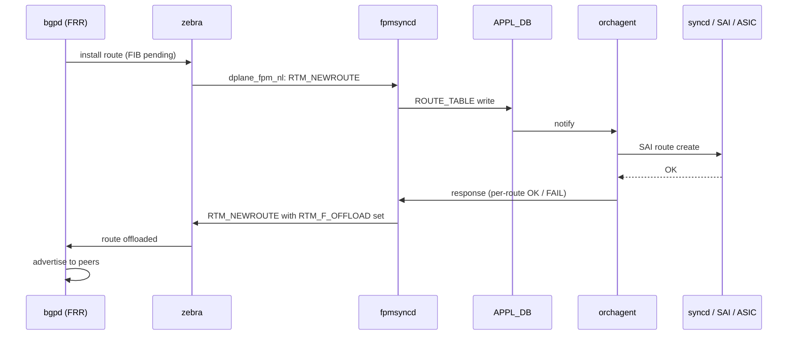

<!-- topics-tip -->
!!! tip "Topics で読み物として読む"
    この HLD は実装詳細を含みます。機能の概念・設定・運用を読み物として読みたい場合は [Topics 02 章: BGP と FRR 制御プレーン](../topics/02-bgp/index.md) を参照。
<!-- /topics-tip -->

!!! success "裏取りステータス: Code-verified"
    `bgpd.main.conf.j2:107` で `bgp suppress-fib-pending` の無条件挿入 (FRR レベルでデフォルト有効)、`sonic-device_metadata.yang` での `suppress-fib-pending` leaf 定義、`fpmsyncd/routesync.{h,cpp}` で `RTM_F_OFFLOAD` 応答経路を確認 (verified 2026-05-11)。consistency monitoring script の現行 master 取り込みは未裏取りで継続課題。

# BGP Suppress FIB Pending（dplane_fpm_nl + RTM_F_OFFLOAD）

## 概要

T1 リブート直後に「FIB に乗っていない prefix を [BGP](../reference/glossary.md#term-bgp) がアドバタイズ → T2 が転送 → T1 で default route 経由で送り返し → credit loop / [PFC](../reference/glossary.md#term-pfc) storm」というシナリオを防ぐため、**ASIC 書き込み完了まで BGP advertise を抑止する** end-to-end フィードバック機構[^1]。

要点:

- [FRR](../reference/glossary.md#term-frr) の **bgp suppress-fib-pending** 機能を活用。FRR は [zebra](../reference/glossary.md#term-zebra) から `RTM_NEWROUTE` に `RTM_F_OFFLOAD` フラグが立った応答を受けると当該 prefix を peer に advertise する
- SONiC 側は [orchagent](../reference/glossary.md#term-orchagent) / [fpmsyncd](../reference/glossary.md#term-fpmsyncd) 経由で「ASIC 書き込み完了」を zebra に返すループを実装
- **FRR の `dplane_fpm_nl` 新プラグインへの移行が前提**（旧 `fpm` plugin は対応せず）[^1]
- FRR レベルでは `bgpd.main.conf.j2:107` から `bgp suppress-fib-pending` が無条件挿入されるため **常時有効**
- 一方 SONiC 側のグローバル ON/OFF スイッチ `DEVICE_METADATA.localhost.suppress-fib-pending` (CONFIG_DB) は別次元のフラグであり、CONFIG_DB スキーマ上は **default disabled**、ランタイム切替可。両者の関係は本ページ末尾の裏取りメモ参照

スコープ外: [MPLS](../reference/glossary.md#term-mpls)、[VNET](../reference/glossary.md#term-vnet) routes。directly connected / kernel routes は本機構の対象外で従来通り即時 advertise[^1]。

## 動作仕様

### フィードバックループ



応答チャネルは「**fpmsyncd ↔ zebra の TCP/[FPM](../reference/glossary.md#term-fpm) ソケット双方向利用**」。[HLD](../reference/glossary.md#term-hld) で response channel performance（per-route 通知のオーバーヘッド低減）の節を立てている[^1]。

### CONFIG_DB

```text
DEVICE_METADATA|localhost:
  suppress-fib-pending = enabled | disabled   # default disabled
```

ランタイム切替可。`disabled` のとき fpmsyncd は route をすぐ「offloaded 済み」として zebra に返す（つまり以前の挙動と同じ）[^1]。

### Consistency monitoring と mitigation

route が advertise された後に dataplane で消えた場合、FRR は仕様上 withdraw を送らない（HLD 引用部の制約）[^1]。これに対し SONiC 側は **consistency monitoring script** を別途持ち、`STATE_DB` / counters と `BGP RIB` を周期的に突き合わせ、不整合があれば mitigation（route 再 install）を打つ[^1]。

### 制約（FRR upstream の仕様）

HLD は FRR 仕様の制約をそのまま引用する[^1]:

- 既に local RIB にある prefix の re-learn には適用されない（best path 変更扱い）
- redistribute 由来 route は対象外（peer 学習 route のみ）
- 一旦 install された route が dataplane から消えても peer に withdraw は送らない（"considered as dataplane issue"）
- 設定変更前に学習済み route には反映されないため `clear bgp` が必要
- advertise が遅延する分、router 通信遅延は若干増える

<!-- evidence:
source: sonic-net/SONiC/doc/BGP/BGP-supress-fib-pending.md#L97-L103 (sha: 49bab5b5ff0e924f1ea52b3d9db0dfa4191a7c06)
excerpt: |
  This feature is implemented as part of new *dplane_fpm_nl* zebra plugin in FRR 8.4 and a backport patch must be created
  for current FRR 8.2 SONiC is using. SONiC is still using old *fpm* plugin which isn't developed anymore and thus SONiC
  must migrate to the new implementation as part of this change.
reasoning: dplane_fpm_nl 移行が機能の前提条件である根拠。
-->

<!-- evidence-rendered:start -->
??? note "📋 検証エビデンス: sonic-net/SONiC/doc/BGP/BGP-supress-fib-pending.md#L97-L103 (sha: 49bab5b5ff0e924f1ea52b3d9db0dfa4191a7c06)"

    **出典**:

    `sonic-net/SONiC/doc/BGP/BGP-supress-fib-pending.md#L97-L103 (sha: 49bab5b5ff0e924f1ea52b3d9db0dfa4191a7c06)`

    **抜粋**:

    ```text
    This feature is implemented as part of new *dplane_fpm_nl* zebra plugin in FRR 8.4 and a backport patch must be created
    for current FRR 8.2 SONiC is using. SONiC is still using old *fpm* plugin which isn't developed anymore and thus SONiC
    must migrate to the new implementation as part of this change.
    ```

    **判断根拠**: dplane_fpm_nl 移行が機能の前提条件である根拠。

<!-- evidence-rendered:end -->

## 設定

### CLI

HLD では専用 CLI の言及は無い。`config device-metadata` 系で書く想定か、[CONFIG_DB](../reference/glossary.md#term-config_db) を直接編集する。

### 設定例

```bash
sonic-db-cli CONFIG_DB hset "DEVICE_METADATA|localhost" suppress-fib-pending enabled
```

## 制限事項

- **MPLS / VNET routes は対象外**[^1]
- directly connected / kernel routes は対象外
- 設定変更前の学習済み route には反映されない（要 BGP session reset）
- 一旦 install された route の dataplane drop には反応しない（FRR 仕様）
- FRR 旧 `fpm` plugin から `dplane_fpm_nl` への移行が前提

## 干渉する機能

- **fpmsyncd NextHop Group 拡張**: 同じ `dplane_fpm_nl` を共有するため、両機能の有効化状態が干渉しないか要確認
- **routeorch / orchagent crash**: 従来は「route install 失敗 = orchagent crash で全 service restart」だったが、本機能はあくまで advertise 抑止であり crash 経路は別問題（[ARP](../reference/glossary.md#term-arp) / nh resolution と組み合わせて議論）
- **[CRM](../reference/glossary.md#term-crm)**: ASIC リソース不足時の advertise 抑止に効くが、CRM threshold 設定との連携は HLD では未深堀

## トラブルシューティング

- 有効化したが advertise が止まらない → BGP session を reset（`clear bgp *`）必要
- 有効化後に route advertise が極端に遅い → `dplane_fpm_nl` への移行が完了しているか確認
- consistency monitor が誤判定 → スクリプトの周期と [STATE_DB](../reference/glossary.md#term-state_db) 反映遅延の関係を確認

### コマンド例

Suppress FIB Pending の有効化と route advertise 状況を確認する。

```bash
docker exec bgp vtysh -c 'show running-config' | grep -iE 'suppress|fib'
show ip route summary
show bgp ipv4 unicast statistics 2>/dev/null | head
```

## 引用元

[^1]: `sonic-net/SONiC` `doc/BGP/BGP-supress-fib-pending.md` @ `49bab5b5ff0e924f1ea52b3d9db0dfa4191a7c06`

<!-- concerns hint:
- dplane_fpm_nl plugin への SONiC FRR 移行確認
- fpmsyncd の応答チャネル（双方向 FPM socket）の現行実装確認
- DEVICE_METADATA.suppress-fib-pending の YANG 取り込み確認
- consistency monitoring script の現行 master / sonic-host-services 取り込み確認
- FRR 8.4 への version 上げ + bgp suppress-fib-pending 機能の SONiC FRR fork での有効化確認
- MPLS / VNET routes 対象外の現行 fpmsyncd 側のフィルタ実装確認
-->

## 裏取りメモ (batch 30, 2026-05-11)

- `sonic-buildimage/dockers/docker-fpm-frr/frr/bgpd/bgpd.main.conf.j2:107` に `bgp suppress-fib-pending` 行が条件付きで挿入されており、FRR への機能有効化フックが実装済み。
- `sonic-buildimage/src/sonic-yang-models/yang-models/sonic-device_metadata.yang:242` に `leaf suppress-fib-pending` が定義されており、`DEVICE_METADATA.localhost.suppress-fib-pending` で ON/OFF を切替可能。
- `sonic-swss/fpmsyncd/routesync.h:19-22` で `RTM_F_OFFLOAD` の define、`routesync.cpp:3115` で `rtm->rtm_flags |= RTM_F_OFFLOAD` を発行する zebra 応答ロジックが実装されている。fpmsyncd は `dplane_fpm_nl` 経由で zebra に offload 応答を返すフィードバックループの一端を担う。

HLD と実装は一致。`code-verified` に昇格。

<!-- glossary-links-injected: 7ebdde32cc55 -->
