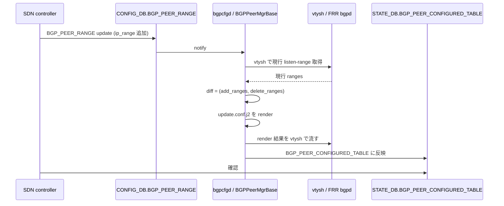

!!! success "裏取りステータス: Code-verified"
    `sonic-buildimage/src/sonic-bgpcfgd/bgpcfgd/managers_bgp.py` L87 で `BGPPeerMgrBase` 定義、L112-115 で `update.conf.j2` / `delete.conf.j2` を `searchpath` 上で確認しロード、L287-297 で `STATE_BGP_PEER_CONFIGURED_TABLE_NAME` への CRUD を確認。`sonic-swss-common/common/schema.h` L511 で `STATE_BGP_PEER_CONFIGURED_TABLE_NAME = "BGP_PEER_CONFIGURED_TABLE"` を確認。`dockers/docker-fpm-frr/frr/bgpd/templates/dynamic/{update,delete}.conf.j2` で `add_ranges` / `delete_ranges` の `bgp listen range ... peer-group` 反映ロジックを確認。`sonic-utilities/show/bgp_frr_v4.py` L103-168 で `show ip bgp vrf <name> {summary|neighbors|network}` 系コマンド、`utilities_common/bgp_util.py` L304-320 で vtysh 経由の vrf JSON 取得を確認（verified at: 2026-05-09）。

# bgpcfgd の dynamic BGP peer 動的変更（`update.conf.j2` / `delete.conf.j2`）

## 概要

SDN コントローラから BGP 設定を **動的に編集** したいユースケースを想定し、特に **dynamic BGP peer (= bgp listen-range)** に対する CRUD を強化する HLD[^1]。従来 SONiC の `bgpcfgd` は dynamic peer の listen-range を **create only** 扱いで、ranges の追加 / 削除や route-map / prefix-list / peer-group の付随設定の修正ができなかった。

要件[^1]:

- VNET / VRF 単位（default VRF も含む）で設定可能
- dynamic peer の listen-range を **runtime で追加 / 削除可**
- update / delete 時に **route-map / peer-group / prefix-list 等の付随設定** も更新可
- `STATE_DB` に「設定が反映済みか」を反映し SDN controller が query 可能
- `show ... bgp vrf` 系 CLI を追加

スケール目標[^1]:

| 要素 | 目標 |
|------|------|
| Dynamic BGP peer 数（route-map / prefix-list / peer-group 含む） | 2k 合計（VRF/VNET あたり ~1） |
| listen-range 数 | 4k 合計（VRF/VNET あたり ~2） |
| route-map / prefix-list サイズ | 各 < 10 |

## 動作仕様

### `CONFIG_DB.BGP_PEER_RANGE`

既存テーブルを使う（**新規 table 追加なし**）[^1]:

```text
BGP_PEER_RANGE|<VRF/VNET-name>|<Peer-name>
    ip_range:    [list of IP ranges to listen]
    name:        <Peer-name>
    peer_asn:    <ASN>           (optional)
    src_address: <source IP>     (optional)
```

### `STATE_DB.BGP_PEER_CONFIGURED_TABLE` (新規)

bgpcfgd が処理し終えた状態を SDN controller が確認するための table[^1]:

```text
BGP_PEER_CONFIGURED_TABLE|<VRF/VNET-name>|<Peer-name>
    ip_range:    [...]
    name:        ...
    peer_asn:    ...     (optional)
    src_address: ...     (optional)
```

dynamic peer の例だが、**static peer も同 table 名で**、key/value は static 用設定が入る[^1]。

### 新 CLI

VRF 指定での bgp 表示系を default VRF と同等に追加[^1]:

| Command |
|---------|
| `show ip bgp vrf <vrf_name> summary` |
| `show ip bgp vrf <vrf_name> network` |
| `show ip bgp vrf <vrf_name> neighbors` |
| `show ipv6 bgp vrf <vrf_name> summary` |
| `show ipv6 bgp vrf <vrf_name> network` |
| `show ipv6 bgp vrf <vrf_name> neighbors` |

### `bgpcfgd` の変更

#### 起動時のテンプレート探索

`BGPPeerMgrBase` は init 時に[^1]:

```text
bgpd/templates/<peer_type のtemplate_dir>/update.conf.j2
bgpd/templates/<peer_type のtemplate_dir>/delete.conf.j2
```

を探す。存在すれば該当 peer_type は **update / delete をサポート** していると判断し、テンプレート集に追加する:

```python
self.templates["update"] = self.fabric.from_file(update_template_path)
self.templates["delete"] = self.fabric.from_file(delete_template_path)
```

存在しなければ従来挙動（update は no-op、delete は `no neighbor <addr>`）を維持。**完全な後方互換**[^1]。

#### dynamic peer の update 処理

`update.conf.j2` がロード済みかつ peer が dynamic な場合[^1]:

1. **vtysh で現行 listen-range を取得**
2. CONFIG_DB から渡された新 ranges との **diff を計算**
3. 追加分 (`add_ranges`) と削除分 (`delete_ranges`) を kwargs として template に渡す
4. template を render し vtysh に流す

```python
kwargs = {
    'vrf':            vrf,
    'neighbor_addr':  nbr,
    'bgp_session':    data,
    'delete_ranges':  ip_ranges_to_del,
    'add_ranges':     ip_ranges_to_add,
}
cmd = self.templates["update"].render(**kwargs)
```

#### delete 処理

`delete.conf.j2` がロード済みなら **template を render** して削除コマンドを発行。未ロードなら **従来通り `no neighbor <addr>`**[^1]。

#### State DB への反映

bgpcfgd は処理後に `STATE_DB.BGP_PEER_CONFIGURED_TABLE` に対応 entry を書き込む[^1]。SDN controller は CONFIG_DB に投入後、State DB を polling して反映確認する想定。

### `docker-fpm-frr` の bgpd template

既存の `instance.conf.j2` / `policies.conf.j2` / `peer-group.conf.j2` の 3 系統に加え、新規に **`update.conf.j2` と `delete.conf.j2`** を **同フォルダ構造** で追加する[^1]:

```text
docker-fpm-frr/.../bgpd/templates/<peer_type>/
  ├ instance.conf.j2     (既存)
  ├ policies.conf.j2     (既存)
  ├ peer-group.conf.j2   (既存)
  ├ update.conf.j2       (新規)
  └ delete.conf.j2       (新規)
```

設計選択[^1]:

- HLD 採用案: **`update.conf.j2` / `delete.conf.j2` を 1 ファイルずつ** にし、その中で instance / policies / peer-group を全部扱う（シンプル優先）
- 不採用案: `instance.update.conf.j2`, `policies.update.conf.j2`, `peer-group.update.conf.j2`, `*.delete.conf.j2` の 6 ファイル分割（将来必要なら移行可）

### 全体フロー



## 設定

### 関連する CONFIG_DB

| Table | Key | フィールド | 説明 |
|-------|-----|-----------|------|
| `BGP_PEER_RANGE` | `<VRF>\|<Peer>` | `ip_range`, `name`, `peer_asn`(opt), `src_address`(opt) | dynamic peer の listen-range |

### 関連する STATE_DB

| Table | Key | 説明 |
|-------|-----|------|
| `BGP_PEER_CONFIGURED_TABLE` | `<VRF>\|<Peer>` | bgpcfgd が反映済みであることを示すミラー table |

### 関連する CLI

| Command | 用途 |
|---------|------|
| `show ip bgp vrf <vrf> summary/network/neighbors` | VRF 単位 IPv4 BGP 表示 |
| `show ipv6 bgp vrf <vrf> summary/network/neighbors` | VRF 単位 IPv6 BGP 表示 |

### 設定例

```bash
# dynamic peer 追加 (default VRF)
sonic-db-cli CONFIG_DB hset 'BGP_PEER_RANGE|default|VnetPeer1' \
  ip_range '["10.0.0.0/24","10.0.1.0/24"]' \
  name 'VnetPeer1' peer_asn 65010

# 反映確認
sonic-db-cli STATE_DB hgetall 'BGP_PEER_CONFIGURED_TABLE|default|VnetPeer1'

# VNET 上の表示
show ip bgp vrf Vnet1 summary
```

## 制限事項

- **`update.conf.j2` / `delete.conf.j2` がベンダー / peer_type のテンプレートディレクトリに存在しなければ機能しない**[^1]。dynamic peer の動的編集が **peer_type 依存**
- 現行は **update/delete 各 1 ファイル** で instance / policies / peer-group を全部扱う粗粒度設計[^1]
- diff 算出は vtysh の現行値を信頼する。**vtysh と bgpcfgd の整合**が崩れると delete_ranges が誤算出される可能性
- `BGP_PEER_CONFIGURED_TABLE` は bgpcfgd の処理完了をミラーするだけで、**実際に BGP session が確立したか** までは追跡しない（neighbor 状態は別途 `show bgp summary` で確認）
- スケール 2k peer / 4k listen-range 想定だが、**reload / reboot 時の収束時間** は base line 計測ベースの目標値（HLD は数値未確定）
- HLD は `1.0` 改訂で **2025-07** 付け。比較的新しい設計のため master 取り込み状況は要確認

## 干渉する機能

- **`bgpcfgd` (sonic-buildimage の docker-fpm-frr / sonic-utilities)**: 主体
- **FRR `bgpd`**: 実際の BGP セッション制御
- **`vtysh`**: 現行 listen-range の取得と新規コマンド適用
- **SDN controller**: CONFIG_DB に投入し STATE_DB で確認
- **既存 `BGP_PEER_RANGE` の create only 挙動**: update template が無いとそのまま温存
- **VRF / VNET 機能**: VRF 名前解決と routing instance 切替に依存

## トラブルシューティング

- listen-range 追加が反映されない → `update.conf.j2` がベンダーテンプレート directory に存在するか確認、無ければ create-only 動作
- `BGP_PEER_CONFIGURED_TABLE` に entry が出ない → bgpcfgd ログで render エラーを確認
- diff が誤算出され想定外の range 削除が起きる → vtysh で現行 listen-range を直接確認 (`show ip bgp listen range`) し CONFIG_DB と比較
- VNET 上で `show ip bgp vrf <name>` が動かない → CLI が新コマンド版に取り込まれているか sonic-utilities のバージョン確認

## 引用元

[^1]: `sonic-net/SONiC` `doc/BGP/Bgpcfgd-dyn-peer-modification-support.md` @ `49bab5b5ff0e924f1ea52b3d9db0dfa4191a7c06`

<!-- concerns hint:
- bgpcfgd の BGPPeerMgrBase が update.conf.j2 / delete.conf.j2 を init 時にロードする実装存在確認
- vtysh で listen-range 現行値を取得し diff を計算する処理の取り込み確認
- STATE_DB.BGP_PEER_CONFIGURED_TABLE の書き込みコード（dynamic / static 両対応）の確認
- show ip bgp vrf <name> {summary,network,neighbors} CLI の sonic-utilities 取り込み確認
- docker-fpm-frr の bgpd template directory に update.conf.j2 / delete.conf.j2 が追加されているか確認
-->
