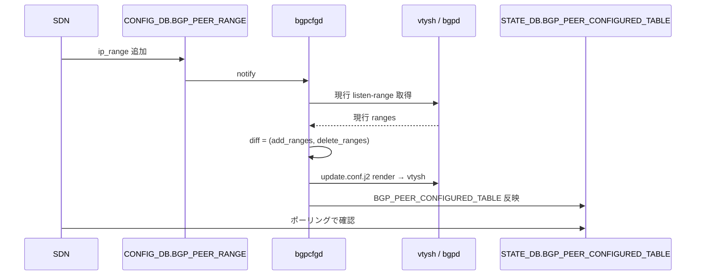

!!! success "裏取りステータス: Code-verified"
    `bgpcfgd/managers_bgp.py` L87 `BGPPeerMgrBase`、L112-115 で `update.conf.j2` / `delete.conf.j2` の searchpath ロード、L287-297 で `STATE_BGP_PEER_CONFIGURED_TABLE_NAME` への CRUD。`sonic-swss-common/common/schema.h` L511 で `STATE_BGP_PEER_CONFIGURED_TABLE_NAME = "BGP_PEER_CONFIGURED_TABLE"`。`docker-fpm-frr/frr/bgpd/templates/dynamic/{update,delete}.conf.j2` の `add_ranges` / `delete_ranges` ロジック。`sonic-utilities/show/bgp_frr_v4.py` L103-168 で `show ip bgp vrf` 系、`utilities_common/bgp_util.py` L304-320 で vtysh 経由の vrf JSON 取得を確認 (verified at: 2026-05-09)。

# bgpcfgd の dynamic BGP peer 動的変更

## 読み手が知りたいこと

- SDN コントローラから dynamic BGP peer（listen-range）を動的に追加・削除したい。今までの bgpcfgd で何が足りなかったか
- update / delete が `bgpcfgd` のどこで処理されるか、後方互換は保たれるか
- SDN 側はどこで「反映済み」を確認できるか
- 何が **peer_type 依存** なのか

## 何が問題だったか

従来 bgpcfgd は `BGP_PEER_RANGE` を **create only** で扱い、runtime での range 追加/削除や route-map / prefix-list / peer-group 等の付随設定変更を受け付けなかった[^1]。SDN コントローラから VNET / VRF 単位で dynamic peer を CRUD する要件に応えるため、本 HLD は **update / delete テンプレート** と **STATE_DB ミラー table** を追加する。

スケール目標[^1]:

| 要素 | 目標 |
|------|------|
| Dynamic BGP peer 数（route-map / prefix-list / peer-group 含む） | 2k 合計（VRF/VNET あたり ~1） |
| listen-range 数 | 4k 合計（VRF/VNET あたり ~2） |
| route-map / prefix-list サイズ | 各 < 10 |

## スキーマ（CONFIG_DB / STATE_DB）

既存 `CONFIG_DB.BGP_PEER_RANGE` をそのまま使い、**新規 table 追加なし**。反映確認用に `STATE_DB.BGP_PEER_CONFIGURED_TABLE` を追加する[^1]。

```text
CONFIG_DB.BGP_PEER_RANGE|<VRF/VNET>|<Peer>
    ip_range:    [list of IP ranges]
    name:        <Peer>
    peer_asn:    <ASN>           (optional)
    src_address: <source IP>     (optional)

STATE_DB.BGP_PEER_CONFIGURED_TABLE|<VRF/VNET>|<Peer>
    （CONFIG_DB と同じフィールドのミラー）
```

dynamic / static 両 peer で同じ table 名を使う。SDN は CONFIG_DB に投入 → STATE_DB をポーリングして反映確認する想定[^1]。

## bgpcfgd の挙動

### 起動時のテンプレート探索

`BGPPeerMgrBase` は init 時に peer_type ごとのテンプレート directory を探す[^1]。

```text
bgpd/templates/<peer_type_dir>/update.conf.j2
bgpd/templates/<peer_type_dir>/delete.conf.j2
```

両ファイルが存在すれば `self.templates["update"]` / `["delete"]` にロードし、その peer_type は update/delete をサポートと判定。**無ければ従来挙動**（update は no-op、delete は `no neighbor <addr>`）を維持し、完全な後方互換を保つ[^1]。

### update / delete フロー



render 時の kwargs[^1]:

```python
kwargs = {
    'vrf': vrf, 'neighbor_addr': nbr, 'bgp_session': data,
    'delete_ranges': ip_ranges_to_del,
    'add_ranges':    ip_ranges_to_add,
}
cmd = self.templates["update"].render(**kwargs)
```

delete も同様で、`delete.conf.j2` がロード済みなら render して発行、未ロードなら `no neighbor <addr>`[^1]。

### docker-fpm-frr のテンプレート構成

既存の 3 系統に並べる形で 2 ファイルを追加する[^1]。

```text
docker-fpm-frr/.../bgpd/templates/<peer_type>/
  ├ instance.conf.j2     (既存)
  ├ policies.conf.j2     (既存)
  ├ peer-group.conf.j2   (既存)
  ├ update.conf.j2       (新規)
  └ delete.conf.j2       (新規)
```

設計選択として、update/delete 各 1 ファイルで instance/policies/peer-group を全部扱うシンプル案を採用（6 ファイル分割案は将来必要なら移行可）[^1]。

## CLI（VRF 表示の追加）

VRF 指定の bgp 表示を default VRF と同等に揃える[^1]:

| Command |
|---------|
| `show ip bgp vrf <vrf> {summary,network,neighbors}` |
| `show ipv6 bgp vrf <vrf> {summary,network,neighbors}` |

## 設定

### 関連する CONFIG_DB / STATE_DB

| Table | Key | フィールド | 説明 |
|-------|-----|-----------|------|
| `BGP_PEER_RANGE` | `<VRF>\|<Peer>` | `ip_range`, `name`, `peer_asn`(opt), `src_address`(opt) | dynamic peer の listen-range |
| `BGP_PEER_CONFIGURED_TABLE` (STATE_DB) | `<VRF>\|<Peer>` | 同上 | bgpcfgd 反映済みミラー |

### 設定例

```bash
# dynamic peer 追加 (default VRF)
sonic-db-cli CONFIG_DB hset 'BGP_PEER_RANGE|default|VnetPeer1' \
  ip_range '["10.0.0.0/24","10.0.1.0/24"]' \
  name 'VnetPeer1' peer_asn 65010

# 反映確認
sonic-db-cli STATE_DB hgetall 'BGP_PEER_CONFIGURED_TABLE|default|VnetPeer1'

# VNET 上の表示
show ip bgp vrf Vnet1 summary
```

## 制限事項

- **`update.conf.j2` / `delete.conf.j2` が peer_type の template directory に無いと機能しない**[^1]。dynamic peer の動的編集が peer_type 依存
- update/delete 各 1 ファイルで instance/policies/peer-group を全部扱う粗粒度設計
- diff 算出は vtysh の現行値を信頼するため、**vtysh と bgpcfgd の整合**が崩れると delete_ranges が誤算出され得る
- `BGP_PEER_CONFIGURED_TABLE` は **bgpcfgd の処理完了** をミラーするだけで、BGP session 確立までは追跡しない
- HLD は 2025-07 Rev 1.0。master 取り込み状況は要追跡

## 干渉する機能

- **bgpcfgd / docker-fpm-frr**: 主体
- **FRR bgpd / vtysh**: 現行 listen-range の取得と適用先
- **SDN controller**: CONFIG_DB 投入と STATE_DB ポーリング
- **VRF / VNET**: 名前解決と routing instance 切替

## トラブルシューティング

- listen-range 追加が反映されない → ベンダ template dir に `update.conf.j2` があるか確認
- `BGP_PEER_CONFIGURED_TABLE` に entry が出ない → bgpcfgd ログで render エラーを確認
- diff が誤算出 → vtysh の `show ip bgp listen range` と CONFIG_DB を突き合わせ
- VNET 上で `show ip bgp vrf <name>` が動かない → sonic-utilities のバージョン確認

## 関連 Topic

- [02 BGP / internals](../topics/02-bgp/internals.md)
- [02 BGP / operations](../topics/02-bgp/operations.md)
- [04 VRF & ECMP / concept](../topics/04-vrf-ecmp/concept.md)

## 引用元

[^1]: `sonic-net/SONiC` `doc/BGP/Bgpcfgd-dyn-peer-modification-support.md` @ `49bab5b5ff0e924f1ea52b3d9db0dfa4191a7c06`
