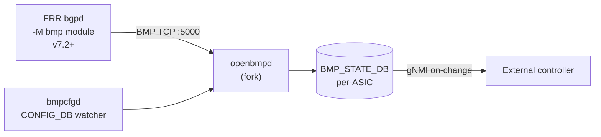

<!-- topics-tip -->
!!! tip "Topics で読み物として読む"
    この HLD は実装詳細を含みます。機能の概念・設定・運用を読み物として読みたい場合は [Topics 02 章: BGP と FRR 制御プレーン](../topics/02-bgp/index.md) を参照。
<!-- /topics-tip -->

!!! info "裏取りステータス: code-verified"
    `sonic-buildimage/dockers/docker-sonic-bmp/`（bmp container）、`sonic-buildimage/src/sonic-bmpcfgd/bmpcfgd/bmpcfgd.py`、`sonic-buildimage/src/sonic-bmp/`（openbmpd fork）、および `sonic-swss-common/common/schema.h` の `BMP_STATE_DB` 定義を master で確認済み。`docker-bmp-watchdog` も併存。

# BMP（BGP Monitoring Protocol / BMP_STATE_DB）

## 概要

SONiC の [Redis](../reference/glossary.md#term-redis) [ROUTE_TABLE](../reference/glossary.md#term-route_table) には neighbor / nexthop しかなく、[BGP](../reference/glossary.md#term-bgp) の deeper view（capabilities、graceful_restart、AS path、in/out RIB、prefix counts など）が見えづらい[^1]。本 [HLD](../reference/glossary.md#term-hld) は **OpenBMP を fork した `openbmpd`** を新 container（bmp）に同梱し、**[FRR](../reference/glossary.md#term-frr) bgpd → BMP（RFC 7854）→ openbmpd → Redis BMP_STATE_DB** の経路で BGP 情報を構造化保存する設計。BGP listener は **[gNMI](../reference/glossary.md#term-gnmi) streaming "on change" subscription** で取れるようになる。

## 動作仕様

### コンポーネント



- `bmp` container には **2 daemon**: `bmpcfgd`（[CONFIG_DB](../reference/glossary.md#term-config_db) を監視し table の enable/disable を openbmpd に伝える）と **`openbmpd`**（FRR から BMP セッションを accept し、関連 BGP table を Redis に書く）[^1]
- `bgpd` 側は v7.2 以降で **`-M bmp` モジュール**として bmp 機能を有効化

### FRR 側の有効化

`/etc/frr/bgpd.conf`:

```text
bmp mirror buffer-limit 4294967214
bmp targets sonic-bmp
  bmp stats interval 1000
  bmp monitor ipv4 unicast pre-policy
  bmp monitor ipv6 unicast pre-policy
  bmp connect 127.0.0.1 port 5000 min-retry 1000 max-retry 2000
```

`bgpd` 起動オプション: `/usr/lib/frr/bgpd -A 127.0.0.1 -M bmp`

### Redis: BMP_STATE_DB

専用 Redis instance を立て **既存 [STATE_DB](../reference/glossary.md#term-state_db) に I/O 負担をかけない**[^1]。multi-ASIC では ASIC index 単位に bmp container と DB が並ぶ。

主要テーブル:

| Table | Key | 内容 |
|-------|-----|------|
| `BGP_NEIGHBOR_TABLE` | `<peer_addr>` | `sent_cap`, `recv_cap`, `local_asn`, `peer_asn`, `local_ip`, `peer_addr`, `local_port`, `remote_port`, `peer_rd` 等。MPBGP / GR / Add Path / 4-octet ASN 等の capability 詳細を文字列で保持 |
| `BGP_RIB_IN_TABLE` | `<nlri>\|<peer>` | `origin`, `as_path`, `as_path_count`, `origin_as`, `next_hop`, `local_pref`, `community_list`, `ext_community_list`, `large_community_list`, `originator_id` |
| `BGP_RIB_OUT_TABLE` | `<nlri>\|<peer>` | rib-in と同形式 |

### CONFIG_DB

```text
BMP|table:
  bgp_rib_in_table   = true | false
  bgp_neighbor_table = true | false
  bgp_rib_out_table  = true | false

FEATURE|bmp:
  state = enabled | disabled   # BMP コンテナ起動制御（BMP|table のフィールドとは別）
```

CLI で table 単位の populate を on/off できる。

### TYPE_INIT_MSG 受信時の同期

`openbmpd` は FRR から **TYPE_INIT_MSG** を受けたとき、対応する Redis table を **クリアして resync** する流れがデフォルト[^1]。これは「FRR が初期化したらすべて再送する」契約に基づく。

### Delay-removal（flap 抑制）

BGP / BMP 接続がフラップして空 INIT が頻発すると table 全消去 → 再同期を繰り返し悪い。これを抑える内部アルゴリズム[^1]:

1. INIT を受けても**即削除しない**。エントリ key の prefix を `DEL-` に renaming + timestamp を残す
2. 一定時間（例: 3 分）以内に再 update が来れば prefix を戻して timer を消す
3. 期限超過したら最終削除

### Multi-ASIC

ASIC ごとに BGP container があるので、**ASIC 数だけ bmp container と Redis が並走** する[^1]。

### gNMI Streaming

BMP_STATE_DB の内容は gNMI の **on-change subscription** で監視される。state-based のため定期 poll 型より効率的。ただし sonic-gnmi 側に **heartbeat 機能の追加が別 PR で必要**[^1]（[SONiC PR #1563](https://github.com/sonic-net/SONiC/pull/1563)）。

<!-- evidence:
source: sonic-net/SONiC/doc/bmp/bmp.md#L82-L92 (sha: 49bab5b5ff0e924f1ea52b3d9db0dfa4191a7c06)
excerpt: |
  Add new bmp container, it has two daemons: bmpcfgd to monitor config db change and control corresponding table that openbmpd populates;
  openbmpd to accept connection from FRR and do bgp related table specific population.
reasoning: bmp container 構成と 2 daemon の役割の根拠。
-->

<!-- evidence-rendered:start -->
??? note "📋 検証エビデンス: sonic-net/SONiC/doc/bmp/bmp.md#L82-L92 (sha: 49bab5b5ff0e924f1ea52b3d9db0dfa4191a7c06)"

    **出典**:

    `sonic-net/SONiC/doc/bmp/bmp.md#L82-L92 (sha: 49bab5b5ff0e924f1ea52b3d9db0dfa4191a7c06)`

    **抜粋**:

    ```text
    Add new bmp container, it has two daemons: bmpcfgd to monitor config db change and control corresponding table that openbmpd populates;
    openbmpd to accept connection from FRR and do bgp related table specific population.
    ```

    **判断根拠**: bmp container 構成と 2 daemon の役割の根拠。

<!-- evidence-rendered:end -->

## CLI

`config bmp <table-name> <enable|disable>` 系で table 単位 on/off、`show bmp <table>` で表示する想定（HLD で詳細な引数定義はまだ）[^1]。

## Warm restart

特別な扱いは無し[^1]。FRR が再接続した際の TYPE_INIT_MSG → resync の通常経路で処理される。

## 制限事項

- v0.1 (2024-02) Initial。Phase 1 は **`BGP_NEIGHBOR_TABLE` を default on**、それ以外は資源評価次第（4G RAM の 7050qx 等）[^1]
- gNMI 側は heartbeat 機能の別追加が必要
- FRR 側で table 単位の送信抑制を CLI 連動できるのが理想だが、初版は `openbmpd` 側で受け流し抑制
- 大規模 RIB ではメモリ・I/O 影響大。multi-ASIC で bmp が ASIC 数倍走る点も負荷見積りに留意

## 干渉する機能

- **FRR bgpd**: `-M bmp` モジュールで pre-policy monitor / stats を出す
- **gNMI / sonic-gnmi**: streaming subscription の consumer
- **既存 BGP_NEIGHBOR / ROUTE_TABLE**: 別 Redis のため非干渉。consumer は別 path
- **PIC / FRR**: 監視対象（影響を与えない）

## 引用元

[^1]: `sonic-net/SONiC` `doc/bmp/bmp.md` @ `49bab5b5ff0e924f1ea52b3d9db0dfa4191a7c06`

<!-- concerns hint:
- bmp container と openbmpd / bmpcfgd の sonic-buildimage / sonic-bmp 取り込み確認
- BMP_STATE_DB の DB number 割当と multi-ASIC 構成の現行確認
- BGP_NEIGHBOR_TABLE / BGP_RIB_IN_TABLE / BGP_RIB_OUT_TABLE schema の sonic-yang-models / swss-common 反映確認
- FRR bgpd -M bmp モジュール有効化と /etc/frr/bgpd.conf テンプレート確認
- Delay-removal アルゴリズムの実装確認 (DEL- prefix と timestamp 管理)
- gNMI heartbeat (PR #1563) の取り込み状況確認
-->

<!-- glossary-links-injected: 4f41ac4825dc -->
