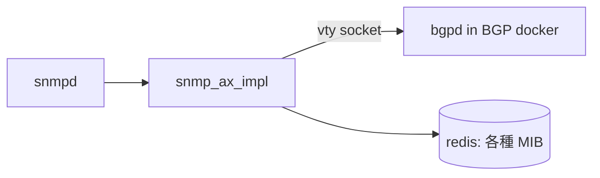
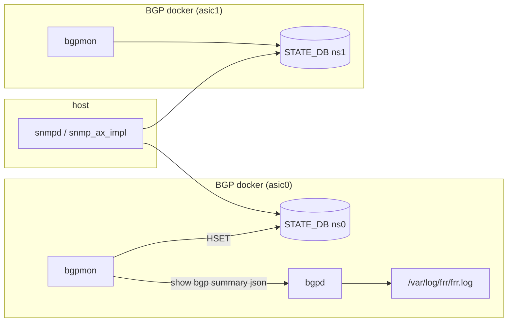
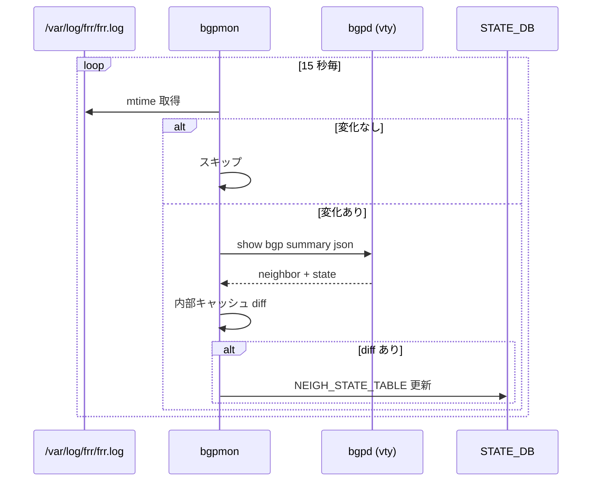

<!-- topics-tip -->
!!! tip "Topics で読み物として読む"
    この HLD は実装詳細を含む。機能の概念・設定・運用を読み物として読みたい場合は [Topics 02 章: BGP と FRR 制御プレーン](../topics/02-bgp/index.md) を参照。
<!-- /topics-tip -->

!!! success "裏取りステータス: code-verified"
    `bgpcfgd/bgpmon/bgpmon.py` L15-17 で 15 秒ポーリング + `/var/log/frr/frr.log` mtime 監視、L51/131-179/203 で `STATE_DB.NEIGH_STATE_TABLE|<peer_ip>` への `state` 書き込み。supervisord 登録は `docker-fpm-frr/frr/supervisord/supervisord.conf.j2` L198-199。読み手は `sonic-snmpagent/.../cisco/bgp4.py` L22/L30 で `Namespace.init_namespace_dbs()` + 全 namespace の `NEIGH_STATE_TABLE|*` を束ねる実装 (verified at: 2026-05-09)。

# CiscoBgp4MIB の STATE_DB 経由化

## 読み手が知りたいこと

- なぜマルチ [ASIC](../reference/glossary.md#term-asic) で従来の [SNMP](../reference/glossary.md#term-snmp)→vtyソケット 直結方式が破綻するのか
- 新方式（`bgpmon` + [STATE_DB](../reference/glossary.md#term-state_db)）はどこで動き、どう負荷を抑えているか
- スキーマ（`NEIGH_STATE_TABLE`）に何が入るのか
- 旧 Bgp4MIB（`1.3.6.1.2.1.15`）はマルチ ASIC で動くのか

## 旧方式が抱えた問題

CiscoBgp4MIB（OID `1.3.6.1.4.1.9.9.187`）は従来、`snmp_ax_impl` が **bgpd の vty ソケットに直結** し `show` をパースしていた[^1]。マルチ ASIC では [BGP](../reference/glossary.md#term-bgp) コンテナが ASIC ごとに別 network namespace で動くため、host 側エージェントから N 個のソケットを束ねる必要があり破綻する。



[HLD](../reference/glossary.md#term-hld) では「namespace の eth0 に bgpd TCP listen」「`/var/run/bgpd.vty` を host から参照」の 2 案を検討したが、いずれも N 本ソケット問題と listen アドレス変更が必要で見送り[^1]。

## 新方式（STATE_DB 経由）

**`bgpmon`** を各 BGP コンテナ（≒ ASIC ごとに 1 インスタンス）に置き、`STATE_DB.NEIGH_STATE_TABLE` に neighbor state を書く。`snmp_ax_impl` は STATE_DB を読むだけ。シングル ASIC とマルチ ASIC が共通化される[^1]。



同じ table は telemetry など他 subscriber も再利用できる汎用設計[^1]。

### bgpmon の負荷抑制



3 段最適化[^1]:

- 15 秒ポーリング
- `frr.log` の **mtime ガード**（動きが無いときは vty を叩かない）
- 内部キャッシュとの **差分検出**（不要書き込みを抑制）

定常状態では「BGP の動きがないので何もしない」になる。

### NEIGH_STATE_TABLE スキーマ

```text
NEIGH_STATE_TABLE {
    "<neigh_ip>" {
        "State" : "Idle | Idle (Admin) | Connect | Active | OpenSent | OpenConfirm | Established | Clearing"
    }
}
```

CiscoBgp4MIB が必要とする「neighbor IP + state」だけを切り出した最小スキーマ[^1]。他属性を要する subscriber が出たら別 PR で追加する想定。

### snmp_ax_impl 側

- シングル ASIC: 自身の STATE_DB の `NEIGH_STATE_TABLE` を読む
- マルチ ASIC: 全 namespace の STATE_DB から合算（既存 SNMP マルチ ASIC 対応の延長）

`bgpd` への TCP / Unix ソケット接続は廃止される（返す MIB 値は不変）[^1]。

## 設定 / CLI

新規 [CONFIG_DB](../reference/glossary.md#term-config_db) スキーマも CLI も**提案されていない**。`bgpmon` は BGP コンテナの supervisor で起動し、ユーザ設定は不要。検証は既存 `snmpwalk`:

```text
snmpwalk -v2c -c <community> 127.0.0.1 iso.3.6.1.4.1.9.9.187
```

## 制限事項

- **Bgp4MIB（OID `1.3.6.1.2.1.15`）はマルチ ASIC で未サポート**。snmpd の subagent 機構で実装されており複数 bgpd を束ねられない。HLD では `bgpmon` 拡張で対応する future work が記載[^1]
- 15 秒ポーリングのため neighbor 状態遷移の SNMP 反映に最大 15 秒の遅延
- `frr.log` の mtime に依存するため、ログを `syslog` 専用に切り替えると活動検知が誤って「変化なし」に倒れる可能性

## 干渉する機能

- **マルチ ASIC SNMP**: 既存の namespace redis 集約機構の延長
- **frr / bgpd ログ設定**: bgpmon が `frr.log` の mtime をトリガに使う
- **telemetry / [gNMI](../reference/glossary.md#term-gnmi)**: `NEIGH_STATE_TABLE` は SNMP 以外からも参照できる汎用 table

## トラブルシューティング

- `snmpwalk` で neighbor が返らない → `redis-cli -n 6` 等で当該 namespace の `STATE_DB.NEIGH_STATE_TABLE` を確認
- 値が `Idle` のまま → 各 BGP コンテナで `bgpmon` が走っているか `supervisorctl` / `ps`
- 値が古い → `frr.log` の mtime 更新を確認（flush されていないと bgpmon が vty を叩かない）

### コマンド例

CISCO-BGP4-MIB の OID と SNMP 応答を確認する。

```bash
snmpwalk -v2c -c public localhost 1.3.6.1.4.1.9.9.187 | head
docker exec snmp grep -i bgp4 /etc/snmp/snmpd.conf
```

## 関連 Topic

- [09 Telemetry / SNMP / architecture](../topics/09-telemetry-snmp/architecture.md)
- [09 Telemetry / SNMP / internals](../topics/09-telemetry-snmp/internals.md)
- [02 BGP / operations](../topics/02-bgp/operations.md)

## 引用元

[^1]: `sonic-net/SONiC` `doc/snmp/snmp_ciscobgp4mib.md` @ `49bab5b5ff0e924f1ea52b3d9db0dfa4191a7c06`

<!-- glossary-links-injected: c006405759d8 -->
