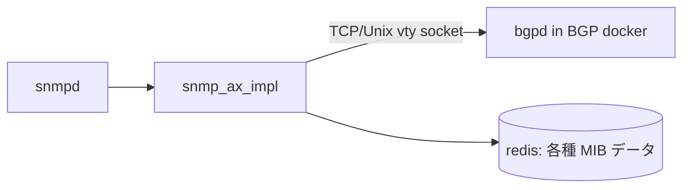
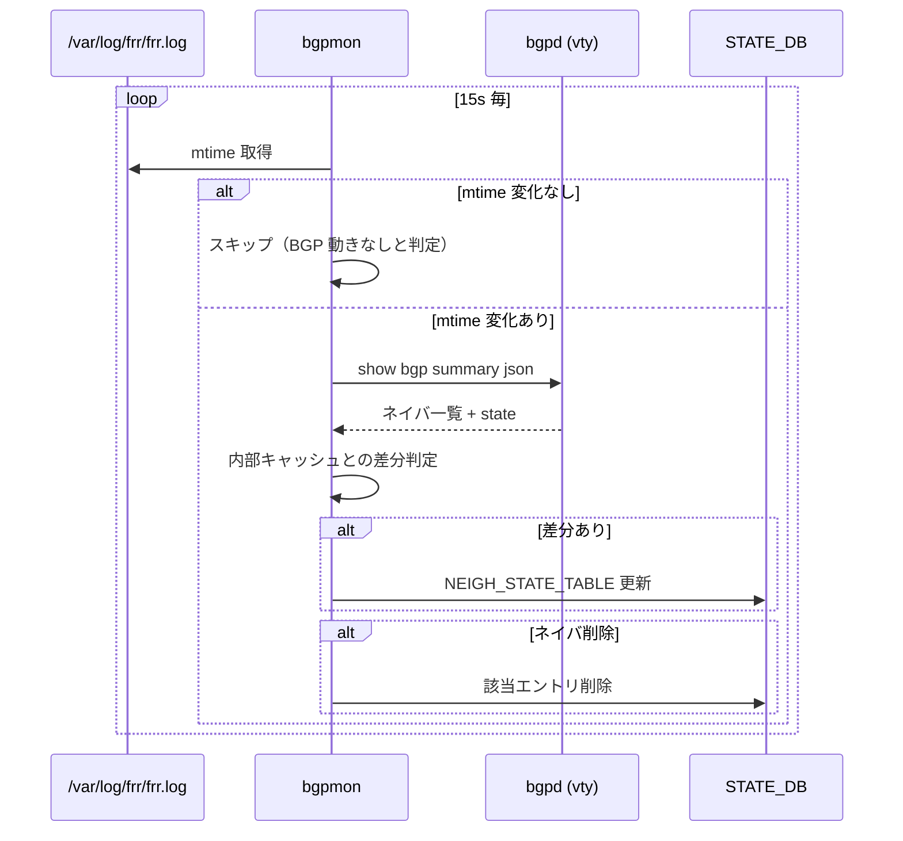

!!! warning "裏取りステータス: HLD-only"
    本ページは公式 HLD のみを根拠に書かれている。`bgpmon` 実装、`STATE_DB.NEIGH_STATE_TABLE` のスキーマ確定、`snmp_ax_impl` 側の取り込みは未確認。

# CiscoBgp4MIB の STATE_DB 経由化（bgpmon / NEIGH_STATE_TABLE）

## 概要

SONiC は SNMP の CiscoBgp4MIB（OID `1.3.6.1.4.1.9.9.187`）で BGP ネイバ情報を返す。従来実装では `snmp_ax_impl`（SNMP サブエージェント）が **bgpd の VTY ソケットに直接接続** して `show` 結果をパースしていた[^1]。マルチ ASIC 構成では BGP コンテナが ASIC ごとに別 network namespace で動くため、この方式は「サブエージェントが N 個のソケットを束ねる」必要があり破綻する。

本 HLD は、**`bgpmon` という新規デーモンを各 BGP コンテナに置き、`STATE_DB.NEIGH_STATE_TABLE` に BGP ネイバ状態を書く** 設計に切り替える。`snmp_ax_impl` は STATE_DB を読むだけになり、シングル ASIC・マルチ ASIC を共通化する[^1]。

## 動作仕様

### 旧設計（VTY ソケット直結）



シングル ASIC では `localhost:2605` 等の VTY ソケットで完結する。マルチ ASIC では BGP コンテナが namespace 内に居るため、host 上の `snmp_ax_impl` から **N 個の namespace に対し N 本のソケット** を張る必要がある。HLD では 2 つの素朴な拡張案が議論されている[^1]:

- 各 namespace の `eth0`（docker0 ブリッジ側）IP に bgpd が TCP listen する案
- 各 BGP コンテナの `/var/run/bgpd.vty` Unix socket を host から参照する案

どちらも N 本ソケット問題と「BGP docker 側の listen アドレス変更」が必要で見送りとなる。

### 新設計（STATE_DB 経由）

```mermaid
flowchart LR
    subgraph host
      SNMP[snmpd / snmp_ax_impl]
    end
    subgraph asic0[BGP docker (asic0)]
      BGPD0[bgpd] --> LOG0[/var/log/frr/frr.log]
      BGPMON0[bgpmon] -->|show bgp summary json| BGPD0
      BGPMON0 -->|HSET| STATE0[(STATE_DB ns0\nNEIGH_STATE_TABLE)]
    end
    subgraph asic1[BGP docker (asic1)]
      BGPD1[bgpd]
      BGPMON1[bgpmon] --> STATE1[(STATE_DB ns1\nNEIGH_STATE_TABLE)]
    end
    SNMP --> STATE0
    SNMP --> STATE1
```

要点:

- `bgpmon` は BGP コンテナ内（≒ ASIC ごとに 1 インスタンス）で動く
- `snmp_ax_impl` は STATE_DB を読むだけ。ソケット経路を完全に廃止
- 同じ仕組みは telemetry など他の subscriber も再利用できる[^1]

### bgpmon のポーリング設計

`bgpmon` は次の流れで動作する[^1]。



ポイント:

- 15 秒間隔のポーリングだが、`/var/log/frr/frr.log` の mtime を見て **動きが無いときは vty も叩かない**
- 内部キャッシュと比較し変化のあったエントリのみ STATE_DB に書く（不要書き込みを抑制）
- 設定からネイバが削除された場合、対応する STATE_DB エントリも掃除する

定常状態では「BGP の動きがないので何もしない」になる設計である[^1]。

<!-- evidence:
source: sonic-net/SONiC/doc/snmp/snmp_ciscobgp4mib.md#L35-L40 (sha: 49bab5b5ff0e924f1ea52b3d9db0dfa4191a7c06)
excerpt: |
  This is the new daemon that runs inside of each BGP docker.  It will periodically (every 15 seconds)
  check if there are any BGP activities by examining the modified timestamp of "/var/log/frr/frr.log"
  ...
  In order to prevent unnecessary update to the State DB, a copy of each neighbor state is also cached
  and used to check for delta changes from each newly pulled neighbor state.
reasoning: 15 秒ポーリング・差分検出・ログ mtime ガードという 3 段の最適化の根拠。
-->

### NEIGH_STATE_TABLE スキーマ

```
NEIGH_STATE_TABLE {
    "<neigh_ip>" {
        "State" : "Idle | Idle (Admin) | Connect | Active | OpenSent | OpenConfirm | Established | Clearing"
    }
}
```

CiscoBgp4MIB が必要とする情報は **「ネイバ IP」と「BGP state」だけ** という前提でスキーマが切られている[^1]。将来 SNMP 以外の subscriber が他の属性を必要とする場合、別 PR で項目追加する想定。

### snmp_ax_impl の挙動

新方式では `snmp_ax_impl` は次のように振る舞う:

- シングル ASIC: 自身の STATE_DB の `NEIGH_STATE_TABLE` を読む
- マルチ ASIC: 全 namespace の STATE_DB から `NEIGH_STATE_TABLE` を読み合算する。namespace 横断接続は既存の SNMP マルチ ASIC 対応の延長

`bgpd` への TCP / Unix ソケット接続は廃止される。シングル ASIC 構成の挙動も実体的に変わる（ただし返す MIB 値は変わらない）[^1]。

## 設定

### 関連する CONFIG_DB

HLD では新規 CONFIG_DB スキーマは提案されていない。`bgpmon` は BGP コンテナの起動 supervisor で立ち上げる前提で、ユーザ設定は不要。

### 関連する CLI

専用 CLI は HLD で提案されていない。検証は引き続き標準的な `snmpwalk` を使う:

```
snmpwalk -v2c -c <community> 127.0.0.1 iso.3.6.1.4.1.9.9.187
```

### 関連する YANG

該当する YANG モジュールは HLD では言及されていない。

## 制限事項

- **Bgp4MIB（OID `1.3.6.1.2.1.15`）はマルチ ASIC で未サポート**。SONiC の Bgp4MIB は snmpd の subagent 機構（`bgpd` を直接 subagent にする）で実装されており、マルチ ASIC では複数 bgpd を束ねられない[^1]。HLD では `bgpmon` を拡張して将来対応する旨が future work として書かれている
- 15 秒ポーリングのため、ネイバ状態変化が STATE_DB / SNMP に反映されるまで最大 15 秒の遅延が起き得る
- `frr.log` の mtime に依存するため、ログレベルを極端に下げる・ログを別系統に飛ばす運用に変更すると、活動検知が誤って「変化なし」と判定される可能性がある

## 干渉する機能

- **マルチ ASIC SNMP**: 既に `snmp_ax_impl` がマルチ namespace の redis を集約する仕組みを持つ。本機能はその延長線上で `STATE_DB` を集約する
- **frr / bgpd ログ設定**: bgpmon は `/var/log/frr/frr.log` の mtime をトリガに使うため、ログパスを変更する設定変更（`syslog` のみへ切替等）と相互作用する
- **telemetry / gNMI**: `NEIGH_STATE_TABLE` は SNMP 以外からも参照できる汎用テーブルとして設計されている

## トラブルシューティング

- `snmpwalk` で BGP ネイバが返らない場合、まず `redis-cli -n 6` 等で当該 namespace の `STATE_DB.NEIGH_STATE_TABLE` を確認
- 状態が `Idle` のまま動かない場合、`bgpmon` プロセスが各 BGP コンテナで動作しているか supervisor / `ps` で確認
- 値が古い場合、`frr.log` の mtime が更新されているかを確認。ログが flush されていないと bgpmon は `show bgp summary json` を呼ばない

## 引用元

[^1]: `sonic-net/SONiC` `doc/snmp/snmp_ciscobgp4mib.md` @ `49bab5b5ff0e924f1ea52b3d9db0dfa4191a7c06`

<!-- concerns hint:
- bgpmon が現行 master の sonic-buildimage / sonic-frr-mgmt-framework に存在するか
- STATE_DB.NEIGH_STATE_TABLE の最終スキーマ (キー名・State 値の文字列)
- snmp_ax_impl が NEIGH_STATE_TABLE を参照する形に書き換えられているか
- 15 秒ポーリングの最終値（コード上の実装値）
- マルチ ASIC で全 namespace の STATE_DB を束ねる経路
- Bgp4MIB のマルチ ASIC 対応（future work）の進捗
-->
