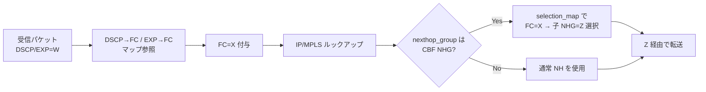

!!! warning "裏取りステータス: HLD-only / 古い HLD"
    HLD は 2021-08 (Rev 0.2) で 4 年以上前。本機能の orchagent / sairedis 取り込み、SAI Pull Request #1193 (`SAI_NEXT_HOP_GROUP_TYPE_CLASS_BASED`) のリリース反映、CLASS_BASED_NEXT_HOP_GROUP_TABLE スキーマの取り込み状況は要裏取り。

# クラスベース転送 (CBF) — DSCP/EXP→FC マップと CLASS_BASED_NEXT_HOP_GROUP

## 概要

Class Based Forwarding (CBF) は、同じ宛先に対して **Forwarding Class (FC)** ごとに異なるパスを取らせる traffic engineering である。FC は Traffic Class（QoS キュー）とは別概念で、入力時に DSCP / MPLS EXP から決まる「どのパスを通すか」のラベルとして使う[^1]。

典型的な使い方は「foreground トラフィックは最短路、background トラフィックは長尺路」のような分離転送。QoS キューでバックグラウンドを絞ると帯域がもらえなくなる問題を、CBF では別パスを使うことで回避する[^1]。

実装は OpenCompute SAI [PR #1193](https://github.com/opencomputeproject/SAI/pull/1193) に依存し、ネクストホップ群オブジェクトが **他のネクストホップ群を子メンバとして持てる** SAI モデルと、`selection_map` で FC 値→子メンバを引く新しい `SAI_NEXT_HOP_GROUP_TYPE_CLASS_BASED` を前提とする[^1]。

## 動作仕様

### パケット処理フロー



### マッチ／非マッチ時の挙動表

HLD は 5 ケースを明記している[^1]:

| FC マッチ? | route が CBF NHG 参照? | CBF が FC をマップ? | 結果 |
|-----------|------------------------|--------------------|------|
| No  | No  | —  | 通常 NH |
| No  | Yes | —  | **drop** |
| Yes | No  | —  | 通常 NH |
| Yes | Yes | Yes | マップされた子 NHG |
| Yes | Yes | No  | **drop** |

drop が選ばれる 2 ケースは「設計上カバーすべき FC が抜けている」ことを示すための明示的失敗。

### CONFIG_DB（マッピング側）

新規 2 テーブル[^1]:

```
DSCP_TO_FC_MAP_TABLE:<name>   dscp_value -> fc_value   ; SAI_QOS_MAP_TYPE_DSCP_TO_FORWARDING_CLASS
EXP_TO_FC_MAP_TABLE:<name>    exp_value  -> fc_value   ; SAI_QOS_MAP_TYPE_MPLS_EXP_TO_FORWARDING_CLASS
```

QoS orchestration agent が拡張され、これらを ASIC_DB の `qos_map` オブジェクト（`SAI_QOS_MAP_TYPE_DSCP_TO_FORWARDING_CLASS` / `MPLS_EXP_TO_FORWARDING_CLASS`）に変換する[^1]。

CLI は **意図的に追加しない**（HLD §3.6）[^1]。設定は config_db.json 直接編集または gNMI 等の汎用経路から行う。

### APP_DB（NHG 側）

`NEXT_HOP_GROUP_TABLE`（[Routing and Next Hop Table Enhancement](routing-and-next-hop-table-enhancement.md) で導入）を前提に、次の 2 テーブルが追加される[^1]:

```
FC_TO_NHG_INDEX_MAP_TABLE:<name>     fc_num -> nh_index    ; FC → 子グループのインデックス
CLASS_BASED_NEXT_HOP_GROUP_TABLE:<key>
   members       = NEXT_HOP_GROUP_TABLE.key,...   ; 子 NHG のリスト
   selection_map = FC_TO_NHG_INDEX_MAP_TABLE.key  ; 上のマップ名
```

`ROUTE_TABLE.nexthop_group` および `LABEL_ROUTE_TABLE.nexthop_group` は、**`NEXT_HOP_GROUP_TABLE` キーまたは `CLASS_BASED_NEXT_HOP_GROUP_TABLE` キーのいずれも** 取れるよう拡張される[^1]。両テーブル間でキーが衝突する場合は **非 CBF 側を優先** する旨が HLD で規定される[^1]。

### Orchestration agent

新たに次のエージェントが追加される[^1]:

- **共通 NHG エージェント**: `NEXT_HOP_GROUP_TABLE` / `CLASS_BASED_NEXT_HOP_GROUP_TABLE` の両方を扱い、`RouteOrch` が同一 API で参照できるようにする。
- **NHG map エージェント**: `FC_TO_NHG_INDEX_MAP_TABLE` を `SAI_OBJECT_TYPE_NEXT_HOP_GROUP_MAP` に変換。dataplane の最大 FC 数 / NHG map 数の capability を持ち、足りなければタスクをキューに残す。NHG map は CBF NHG から参照されている間は削除しない。

CBF NHG の生成挙動[^1]:

- メンバや selection_map が ASIC_DB に未到着なら process queue に残し、揃い次第 `SAI_NEXT_HOP_GROUP_TYPE_CLASS_BASED` で作成。
- 子 NHG が **「暫定 (temporary)」状態** だと SAI ID が後で変わる。CBF NHG は暫定子の一覧を持って **定期的に SAI ID 変化を監視** し、確定したら `SAI_NEXT_HOP_GROUP_MEMBER_ATTR_NEXT_HOP_ID` を更新。全子が確定したら監視を停止する。
- 更新時は `SAI_NEXT_HOP_GROUP_MEMBER_ATTR_INDEX` が CREATE_ONLY のため、**全メンバを remove → add で再構築** する単純戦略を取る。

### sairedis 拡張

`sai_map_t` のシリアライズ／デシリアライズ／検証が追加される。`sai_qos_map_params_t` に `fc` フィールドが追加され、libsairedis / libsaivs / VS インタフェースで NHG map API がサポートされる。VS は NHG map のデフォルト available を 512 に設定する[^1]。

<!-- evidence:
source: sonic-net/SONiC/doc/cbf/cbf_hld.md#L196-L218 (sha: 49bab5b5ff0e924f1ea52b3d9db0dfa4191a7c06)
excerpt: |
  A new orchestration agent will be written to handle the requests to both NEXT_HOP_GROUP_TABLE and CLASS_BASED_NEXT_HOP_GROUP_TABLE...
  ... For an updated entry in CLASS_BASED_NEXT_HOP_GROUP_TABLE, the orchestration agent will remove the group's previous members and add the updated ones.
reasoning: 共通 NHG エージェント、暫定子監視、全 remove→add の更新戦略の根拠。
-->

## 設定

### 関連する CONFIG_DB

| Table | 説明 |
|-------|------|
| `DSCP_TO_FC_MAP` | DSCP→FC マッピング群（名前付き）|
| `EXP_TO_FC_MAP` | MPLS EXP→FC マッピング群 |

### 関連する APP_DB

| Table | 説明 |
|-------|------|
| `FC_TO_NHG_INDEX_MAP_TABLE` | FC 値→子 NHG インデックス |
| `CLASS_BASED_NEXT_HOP_GROUP_TABLE` | CBF NHG 本体 (members + selection_map) |
| `ROUTE_TABLE.nexthop_group` | NHG または CBF NHG キーを参照可能 |
| `LABEL_ROUTE_TABLE.nexthop_group` | 同上（MPLS）|

### 関連する CLI

HLD は明示的に **CLI 追加なし**[^1]。config_db.json 直接編集または gNMI 経路で設定する想定。

### 設定例

```json
"DSCP_TO_FC_MAP": { "AZURE": { "3": "3", "6": "5", "7": "5" } }

"FC_TO_NHG_INDEX_MAP_TABLE:AZURE": { "0": "0", "1": "0" }

"CLASS_BASED_NEXT_HOP_GROUP_TABLE:CbfNhg1":
  { "members": "Nhg1,Nhg2,Nhg3,Nhg4", "selection_map": "AZURE" }
```

## 制限事項

- **fpmsyncd 非対応**: 標準 fpmsyncd はこの拡張を使うようには更新されない。利用には改造版 fpmsyncd か APP_DB 直接書き込みが必要[^1]。
- **キー名の衝突は CBF 側が負ける**: `NEXT_HOP_GROUP_TABLE` と `CLASS_BASED_NEXT_HOP_GROUP_TABLE` で同名キーがある場合、非 CBF 側が優先される。プログラミング側でキー名空間を分離する責任がある[^1]。
- **CLI 無し**: 監視・デバッグは redis 直接 / SAI dump に依存する。
- **依存 SAI PR #1193**: 採用 SAI バージョンが PR #1193 を含む必要がある。古い SAI ヘッダではビルドできない。

## 干渉する機能

- **`NEXT_HOP_GROUP_TABLE`（next hop group split）**: CBF は通常 NHG の上に積む形で動く。通常 NHG が暫定状態（temporary）の間は CBF 側で SAI ID を追跡する必要がある。
- **QoS / DSCP-to-TC**: DSCP→FC は DSCP→TC（既存 QoS マップ）とは **別の SAI map type** を使う。同一パケットで両方が独立に評価される。FC は転送選択、TC はキュー選択。
- **MPLS LABEL_ROUTE_TABLE**: ラベルルートも `nexthop_group` で CBF NHG を参照可能。EXP→FC マップが MPLS 経路で使われる経路。

## トラブルシューティング

- 一部 FC でドロップする: `FC_TO_NHG_INDEX_MAP_TABLE` がその FC をカバーしているか、CBF NHG の members に対応する子 NHG が存在するか確認。マップ不在 + CBF route ヒットは drop する仕様[^1]。
- CBF NHG が ASIC に作られない: 子 NHG または selection_map が未到着の可能性。orchagent ログで pending を確認。
- 暫定 NHG の SAI ID 不整合: CBF NHG の定期更新ロジックが回っているか、`saidump` で member の `NEXT_HOP_ID` を確認。

## 引用元

[^1]: `sonic-net/SONiC` `doc/cbf/cbf_hld.md` @ `49bab5b5ff0e924f1ea52b3d9db0dfa4191a7c06`
