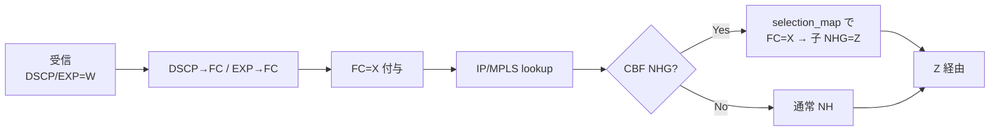

<!-- topics-tip -->
!!! tip "Topics で読み物として読む"
    この HLD は実装詳細を含む。機能の概念・設定・運用を読み物として読みたい場合は [Topics 04 章: VRF / ECMP / 経路選択](../topics/04-vrf-ecmp/index.md) を参照。
<!-- /topics-tip -->

!!! success "裏取りステータス: code-verified"
    `sonic-swss/orchagent/cbf/cbfnhgorch.h` `CbfNhgOrch : public NhgOrchCommon<CbfNhg>`、`sonic-swss-common/common/schema.h` `APP_CLASS_BASED_NEXT_HOP_GROUP_TABLE_NAME` / `APP_FC_TO_NHG_INDEX_MAP_TABLE_NAME`、`qosorch.cpp` で `DSCP_TO_FC_MAP_TABLE_NAME` / `EXP_TO_FC_MAP_TABLE_NAME` ハンドラ登録、`sonic-sairedis/vslib/SwitchStateBase.cpp` で `SAI_NEXT_HOP_GROUP_TYPE_CLASS_BASED` 確認（verified at: 2026-05-09）。

# クラスベース転送 (CBF)

## なぜ必要か

同じ宛先に対して **Forwarding Class (FC) ごとに異なるパス** を取らせる traffic engineering。FC は Traffic Class（[QoS](../reference/glossary.md#term-qos) キュー）とは別概念で、入力時に [DSCP](../reference/glossary.md#term-dscp) / [MPLS](../reference/glossary.md#term-mpls) EXP から決まる "どのパスを通すか" のラベル[^1]。

典型例は「foreground は最短路、background は長尺路」のように分離転送する設計。QoS キューでバックグラウンドを絞ると帯域が消えてしまう問題を、CBF は別パスで回避する。実装は OpenCompute [SAI #1193](https://github.com/opencomputeproject/SAI/pull/1193) の `SAI_NEXT_HOP_GROUP_TYPE_CLASS_BASED` と NHG 入れ子モデルを前提とする[^1]。

## 処理フロー



### マッチ判定表

| FC ヒット? | route が CBF NHG? | CBF が FC マップ済? | 結果 |
|-----------|-------------------|---------------------|------|
| No  | No  | —  | 通常 NH |
| No  | Yes | —  | **drop** |
| Yes | No  | —  | 通常 NH |
| Yes | Yes | Yes | マップ先の子 NHG |
| Yes | Yes | No  | **drop** |

drop の 2 ケースは「設計上カバーすべき FC の抜け」を明示的失敗で気付かせる仕様[^1]。

## スキーマ

```text
CONFIG_DB:
  DSCP_TO_FC_MAP_TABLE:<name>    dscp -> fc
  EXP_TO_FC_MAP_TABLE:<name>     exp  -> fc

APPL_DB:
  FC_TO_NHG_INDEX_MAP_TABLE:<name>          fc -> nh_index
  CLASS_BASED_NEXT_HOP_GROUP_TABLE:<key>
     members       = NEXT_HOP_GROUP_TABLE.key,...
     selection_map = FC_TO_NHG_INDEX_MAP_TABLE.key
  ROUTE_TABLE.nexthop_group       (通常 NHG または CBF NHG キー)
  LABEL_ROUTE_TABLE.nexthop_group
```

CLI は **意図的に追加されない**（[HLD](../reference/glossary.md#term-hld) §3.6）[^1]。`config_db.json` 直編集または [gNMI](../reference/glossary.md#term-gnmi) 経由で設定する。

## Orchestration

- **共通 NHG エージェント**: 通常 NHG / CBF NHG 双方を扱い、RouteOrch から同 API で参照可能
- **NHG map エージェント**: `FC_TO_NHG_INDEX_MAP_TABLE` → `SAI_OBJECT_TYPE_NEXT_HOP_GROUP_MAP`。capability 不足時は task をキュー残し
- 子 NHG が **暫定 (temporary)** 状態のとき [SAI](../reference/glossary.md#term-sai) ID が後で変わるので、CBF NHG 側で監視し確定したら `SAI_NEXT_HOP_GROUP_MEMBER_ATTR_NEXT_HOP_ID` を差し替え
- 更新時は `INDEX` が CREATE_ONLY のため **全メンバを remove → add で再構築**[^1]

## 設定例

```json
"DSCP_TO_FC_MAP": { "AZURE": { "3": "3", "6": "5", "7": "5" } }
"FC_TO_NHG_INDEX_MAP_TABLE:AZURE": { "0": "0", "1": "0" }
"CLASS_BASED_NEXT_HOP_GROUP_TABLE:CbfNhg1":
  { "members": "Nhg1,Nhg2,Nhg3,Nhg4", "selection_map": "AZURE" }
```

## 制限事項

- **[fpmsyncd](../reference/glossary.md#term-fpmsyncd) 非対応**: 標準版は使えず、改造 fpmsyncd または APP_DB 直書きが必要[^1]
- `NEXT_HOP_GROUP_TABLE` と `CLASS_BASED_NEXT_HOP_GROUP_TABLE` でキー衝突時は **非 CBF 側優先**[^1]
- **CLI 無し**: 監視・デバッグは redis / `saidump` 依存
- **依存 SAI #1193**: 古い SAI ヘッダではビルド不可

## 干渉する機能

- **`NEXT_HOP_GROUP_TABLE`**: CBF は通常 NHG の上に積む。子 NHG が暫定の間は SAI ID を追跡
- **DSCP→TC（既存 QoS）**: DSCP→FC は **別の SAI map type**。同パケットで独立に評価（FC=転送選択、TC=キュー選択）
- **MPLS `LABEL_ROUTE_TABLE`**: ラベル経路も CBF NHG 参照可。EXP→FC が活きる経路

## トラブルシューティング

```bash
redis-cli -n 4 HGETALL 'DSCP_TO_FC_MAP|AZURE'
redis-cli -n 0 HGETALL 'CLASS_BASED_NEXT_HOP_GROUP_TABLE:CbfNhg1'
redis-cli -n 1 KEYS 'ASIC_STATE:SAI_OBJECT_TYPE_NEXT_HOP_GROUP*'
```

特定 FC でドロップする場合は `FC_TO_NHG_INDEX_MAP_TABLE` のカバー範囲と子 NHG の存在を確認。

## 関連 Topics

- [04-vrf-ecmp/advanced](../topics/04-vrf-ecmp/advanced.md): [ECMP](../reference/glossary.md#term-ecmp) / NHG 全般
- [08-qos-buffer/concept](../topics/08-qos-buffer/concept.md): DSCP マップと FC / TC の違い
- [17-srv6-mpls/advanced](../topics/17-srv6-mpls/advanced.md): MPLS EXP との連携

## 引用元

[^1]: `sonic-net/SONiC` `doc/cbf/cbf_hld.md` @ `49bab5b5ff0e924f1ea52b3d9db0dfa4191a7c06`

<!-- glossary-links-injected: e1fd4940b990 -->
