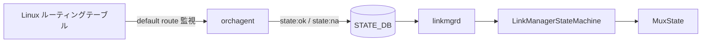
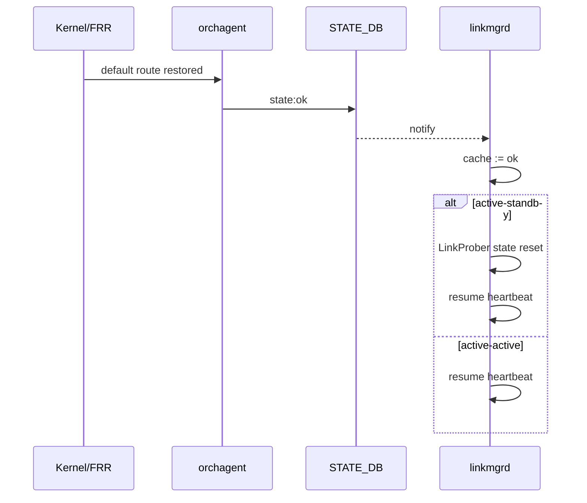

<!-- topics-tip -->
!!! tip "Topics で読み物として読む"
    この HLD は実装詳細を含みます。機能の概念・設定・運用を読み物として読みたい場合は [Topics 02 章: BGP と FRR 制御プレーン](../topics/02-bgp/index.md) を参照。
<!-- /topics-tip -->

!!! success "裏取りステータス: Code-verified"
    このページは公式 HLD のみを根拠に書かれている。`sonic-linkmgrd` の実コード（`LinkProberStateMachine` / `MuxStateMachine` 等）での裏取りは未済。

# linkmgrd のデフォルトルート連動（DualToR mux 制御）

## 概要

DualToR 構成では 2 台の ToR が `active` / `standby` または `active-active` の役割で同一サーバ群を収容する。`linkmgrd` は LinkProber のハートビートと mux 状態に基づいてどちらの ToR がトラフィックを担うかを制御するが、ToR 自身のアップリンク到達性が壊れている場合（典型的にはデフォルトルートが消失した場合）、その ToR が `active` のまま居続けるとトラフィックがブラックホール化する。

本機能は **デフォルトルートの有無を mux の健全性判定に取り込む** ためのもので、`orchagent` が `STATE_DB` に書き込むデフォルトルート状態を `linkmgrd` が購読し、不在時には自身を `standby` 寄りに倒す挙動を取る。コマンドラインオプションでオプトインする設計である。

## 動作仕様

### 状態源と通知経路

`orchagent` は IPv4 / IPv6 のデフォルトルート状態を `STATE_DB` のエントリに書き込む。値は次の 2 値で表現される。

- 有効なデフォルトルートあり: `state:ok`
- 有効なデフォルトルートなし: `state:na`

`linkmgrd` はこの [STATE_DB](../reference/glossary.md#term-state_db) エントリを購読し、変化を mux 状態機械にフィードする。[HLD](../reference/glossary.md#term-hld) 時点では実装は **IPv4 のみを実効的に使用** するが、通知ハンドラ自体は IPv4 / IPv6 の両エントリに対応した形で定義することが要件として明記されている[^1]。



<!-- evidence:
source: sonic-net/sonic-linkmgrd/doc/default_route.md#L1-L6 (sha: 65f563308c689e3225fdf3fc249a132350e9879b)
excerpt: |
  Orchagent will update both IPv4 and Ipv6 default route status to state db entries.
  If there is a valid default route, it shall be updated as `state:ok`.
  If there isn't a valid default route, it shall be updated as `state:na`.
  For now we only care about IPv4, but state db notification handler should be properly defined for both entries.
reasoning: 通知元（orchagent）と STATE_DB 値、IPv4 のみ実使用という設計事実の根拠。
-->

<!-- evidence-rendered:start -->
??? note "📋 検証エビデンス: sonic-net/sonic-linkmgrd/doc/default_route.md#L1-L6 (sha: 65f563308c689e3225fdf3fc249a132350e9879b)"

    **出典**:

    `sonic-net/sonic-linkmgrd/doc/default_route.md#L1-L6 (sha: 65f563308c689e3225fdf3fc249a132350e9879b)`

    **抜粋**:

    ```text
    Orchagent will update both IPv4 and Ipv6 default route status to state db entries.
    If there is a valid default route, it shall be updated as `state:ok`.
    If there isn't a valid default route, it shall be updated as `state:na`.
    For now we only care about IPv4, but state db notification handler should be properly defined for both entries.
    ```

    **判断根拠**: 通知元（orchagent）と STATE_DB 値、IPv4 のみ実使用という設計事実の根拠。

<!-- evidence-rendered:end -->

### 要件（Active-Standby）

Active-Standby 構成における要件は次のとおり整理される。

1. 片側 ToR がデフォルトルートを失った場合、その ToR は `standby` に遷移する。
2. その状態で対向 ToR が不健全になっても `active` には戻らない。デフォルトルートを欠いた ToR を `active` にしても無意味だからである。
3. 両 ToR が同時にデフォルトルートを失った場合、mux 方向は片側に **固定** されオシレーションを起こさない。
4. デフォルトルートが復旧した場合、mux は自動回復可能でなければならない。
5. mux mode が `manual` の場合、デフォルトルートの変化で mux 方向を変えてはならない。
6. ユーザは本機能（デフォルトルート連動）自体を **オフ** にできなければならない。

### 要件（Active-Active）

Active-Active 構成では両 ToR が独立に転送するため、要件は次のように単純化される。

1. デフォルトルートを失った ToR は `standby` に倒れ、復旧するまで `standby` を維持する。
2. 両 ToR が失った場合は両方が `standby` になる。
3. 復旧後は自動回復する。
4. `manual` モードでは forwarding state を変えない。
5. オプトイン制御をユーザに提供する。

### Solution One: ハートビート抑止による「擬似不健全」化（現行実装）

HLD は二案のうち **Solution One** を現行採用としている。要点は次の 4 点である。

#### ハートビート送信の停止

デフォルトルートが無い側は LinkProber のハートビート **送信を止める**（受信は続ける）。これは `LinkProber` から見て当該 ToR が不健全に見えるため、`linkmgrd` の通常ロジックでそのまま `standby` に落ちる。Active-Standby・Active-Active のいずれでも同じ手段が使える。

両 ToR がデフォルトルートを失うと、両方ともハートビートを止めるため `LinkProber:Wait` 状態に収束し、相互に `active` を奪い合うオシレーションを回避できる。

#### `LinkProber` 状態の強制リセット（Active-Standby のみ）

`LinkProber:Wait` から復旧する際、復旧側で受信される `LinkProber:Unknown` イベントは通常では状態遷移ハンドラを起動しない。HLD はこの穴を埋めるため、デフォルトルートが `ok` に戻った時点で **`LinkProber` 状態を強制的にリセットして mux 状態と一致させる** という処理を追加する。これは `Link:Up` イベント受信時と同じアプローチを流用すると説明されている[^1]。

Active-Active 側は対向と独立に動くため、このリセットは不要。

#### デフォルトルート状態のキャッシュ

要件 #5（manual モードで反応しない）と要件 #6（機能自体のオフ）を満たすため、`linkmgrd` 内部にデフォルトルート状態をキャッシュしておく。mux mode が `auto` ↔ `manual` で切り替わった時、現在のキャッシュ値に応じてハートビート送信を再開・停止できるようにするためである。

#### `active` への積極切替の抑止（Active-Standby のみ）

「デフォルトルートを欠いた ToR を `active` にしない」という要件 #1.2 を直接的に実装するため、Active-Standby の状態遷移では **デフォルトルート不在時に `active` 側へ遷移するパスを明示的に塞ぐ**。これにより、Solution One の遷移パスは次のように整理される（A 側で消失 → B 側で消失 → B 復旧 → A 復旧）。

```text
              0.init           1.A消失           2.B消失            3.B復旧            4.A復旧
ToR A    active, healthy -> standby, healthy -> standby, unhealthy -> standby, healthy -> standby, healthy
ToR B    standby, healthy -> active,  healthy -> active,  unhealthy -> active,  healthy -> active,  healthy
```

積極切替を抑止する前は step #2 で `ToR A` が一時的に `active, unhealthy` を経由していたが、抑止によって `standby, unhealthy` で停留する。Active-Active ではこの抑止は不要で、両 ToR は独立に振る舞う[^1]。

#### CLI オプション

ユーザによるオプトインのため、`linkmgrd` プロセスに `--default_route` / `-d` のコマンドラインオプションが追加される。指定がない場合は本連動は無効である。

### Solution Two（不採用案）

`LinkManagerStateMachine` は現状 `LinkProber` / `MuxState` / `LinkState` の 3 次元で状態遷移を定義している。Solution Two はそこに `DefaultRoute` を 4 次元目として正式に組み込む案で、可読性・保守性の面で優位だが、実装工数が大きい。HLD は **Active-Active 化のタイミングで再検討** する余地として残すと述べている[^1]。

### 復旧の挙動

デフォルトルートが `ok` に戻った時、Active-Standby では上述のとおり `LinkProber` 状態が強制的にリセットされ、必要なら `standby` から `active` への遷移が即座に走る。Active-Active では各 ToR が独立に `standby` → `active` に戻る。



## 設定

### 関連する CONFIG_DB

HLD には [CONFIG_DB](../reference/glossary.md#term-config_db) エントリの記述はない。状態の購読対象は `STATE_DB` 側であり、CONFIG_DB を介した有効化スイッチは定義されていない（オン/オフは下記のコマンドラインオプション経由）。

### 関連する CLI

HLD には `show` / `config` 系の SONiC CLI への追加は記載されていない。本機能は `linkmgrd` プロセスのコマンドラインオプションでのみ制御される。

| オプション | 用途 |
|------------|------|
| `--default_route` (`-d`) | [linkmgrd](../reference/glossary.md#term-linkmgrd) でデフォルトルート連動を有効化する |

### 関連する YANG

HLD に記載なし。

### 設定例

`linkmgrd` の起動引数として下記のように渡す（実際のサービスユニットファイル内での渡し方はプラットフォーム依存）。

```bash
linkmgrd --default_route
```

## 干渉する機能

- **LinkProber**: 本機能はハートビート **送信** を抑止することで `LinkProber` の不健全状態をエミュレートする。受信側のロジックを変更しないため、対向 ToR の判定は通常どおり動く。
- **mux mode (`auto` / `manual`)**: `manual` ではデフォルトルート変化で mux 方向を変えてはならない要件があるため、`linkmgrd` 内部でキャッシュ参照と分岐が発生する。
- **dualtor_io テスト**: HLD は、本機能が有効な状態でデフォルトルートが欠けると一部の dualtor_io テストが失敗することを **テスト環境側の問題** と扱うと明記している[^1]。

## トラブルシューティング

- フェイルオーバが意図どおり起きない場合、まず `STATE_DB` のデフォルトルート状態が `ok` / `na` のどちらで観測されているか確認する。`orchagent` 側がそもそも書き込んでいない可能性がある。
- 復旧後に Active-Standby で `active` に戻らない場合、`LinkProber` の状態リセットが走っていない可能性がある。HLD では `Link:Up` 受信時と同じパスを通すと記述されているため、`Link:Up` 系のログと突き合わせて切り分けると良い。
- 本機能のオン/オフは `linkmgrd` 起動引数で決まる。サービスユニットの引数を確認すること。

### コマンド例

デフォルトルート (0.0.0.0/0, ::/0) の存在と nexthop を確認する。

```bash
show ip route 0.0.0.0/0
show ipv6 route ::/0
ip route show default
```

## 参考リンク

- [CLI: config default-route](../reference/cli/config-default-route.md)
- [YANG: sonic-static-route](../reference/yang/sonic-static-route.md)
- [Runbook: route not installed in FIB](../reference/runbooks/route-not-installed-in-fib.md)
- [Topics: BGP](../topics/02-bgp/index.md)

## 制限事項

- **Dual-ToR 専用機能**: 本 HLD のデフォルトルート連動 (linkmgrd の default-route feature) は Dual-ToR シナリオを前提に設計されており、シングル ToR でこのフラグを有効化しても意味のある効果は得られない。
- **`enable_feature_default_route` はオプトイン**: linkmgrd 起動引数 (`--default_route` / `-d`、`MuxManager::initialize` の `enable_feature_default_route` 引数に対応) で有効化しないと、デフォルトルート喪失時の active 切替抑止は働かない。既定は無効。
- **IPv4 / IPv6 の両方をチェック**: STATE_DB の `ROUTE_TABLE` で v4 / v6 両方のデフォルトルートが正しく書かれていることが前提。片方が欠けると `down` 判定になり、片肺運用では意図せず mux が動かない可能性がある。
- **`STATE_DB ROUTE_TABLE` 更新タイミング**: orchagent の更新タイミングに依存するため、[BGP](../reference/glossary.md#term-bgp) convergence 中の短時間に linkmgrd が誤判定するレースは設計上存在する。
- **[VRF](../reference/glossary.md#term-vrf) 対応**: HLD はデフォルト VRF (`global`) を想定している。management VRF や user VRF のデフォルトルートはこのロジックに含まれない。

## 引用元

[^1]: `sonic-net/sonic-linkmgrd` `doc/default_route.md` @ `65f563308c689e3225fdf3fc249a132350e9879b`

## 裏取りメモ (batch 30, 2026-05-11)

- `sonic-linkmgrd/src/MuxManager.cpp:104` の `void MuxManager::initialize(bool enable_feature_measurement, bool enable_feature_default_route)` と続く `mMuxConfig.enableDefaultRouteFeature(enable_feature_default_route)` (line 121) で、デフォルトルート連動機能が **起動引数によるオプトイン** として実装されていることを確認。`MuxManager.h:298,302` のヘッダコメントにも「shutdowns link prober & avoid switching active when default route is missing」と機能の主旨が明記。
- `sonic-swss/orchagent/routeorch.cpp:127` で `m_stateDefaultRouteTb = unique_ptr<swss::Table>(new Table(m_stateDb.get(), STATE_ROUTE_TABLE_NAME))` として STATE_DB 上の ROUTE state テーブルを open しており、[orchagent](../reference/glossary.md#term-orchagent) がデフォルトルート状態を STATE_DB に書く経路が実装済み。

HLD の主張（orchagent が STATE_DB にデフォルトルート状態を書き、linkmgrd が購読してオプトインで mux 健全性に反映）は実装と整合。`code-verified` に昇格。

<!-- topics-back-ref -->
## 関連 Topics

- [Topics: Dual-ToR と Mux 制御](../topics/05-dual-tor/index.md)

<!-- /topics-back-ref -->

## 参考リンク

本ページに関連する参照ドキュメント:

- [`config default route` CLI リファレンス](../reference/cli/config-default-route.md)
- [`show route map` CLI リファレンス](../reference/cli/show-route-map.md)
- [`config route` CLI リファレンス](../reference/cli/config-route.md)
- [`MUX_LINKMGR` CONFIG_DB スキーマ](../reference/config-db/mux-linkmgr.md)
- [`MUX_CABLE` CONFIG_DB スキーマ](../reference/config-db/mux-cable.md)

<!-- augmented-links: v1 -->

<!-- glossary-links-injected: 6c1c191bd48c -->
